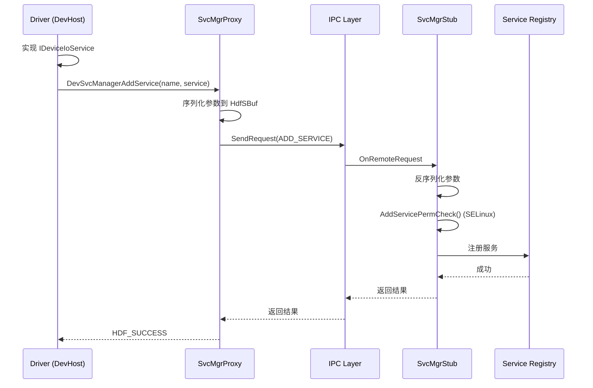
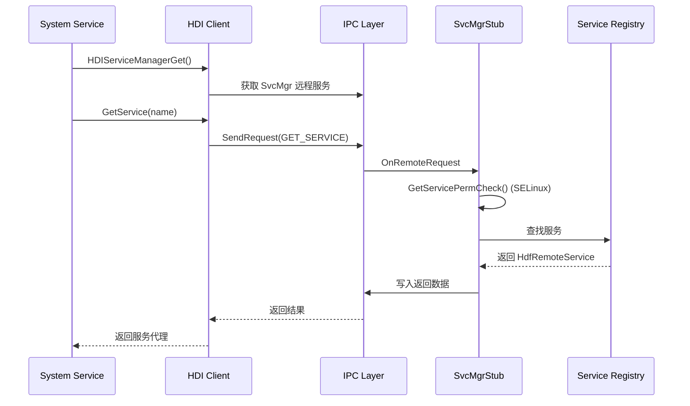
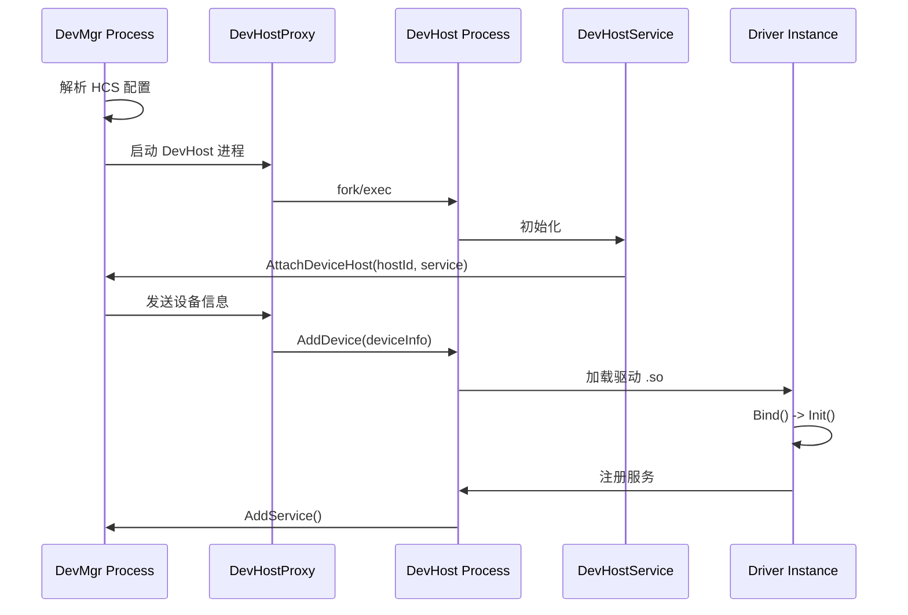

# HDF Core 架构说明

## 1. 整体架构

```
┌─────────────────────────────────────────────────────────────────────────────┐
│                           System Services Layer                              │
│    (Camera Service / Audio Service / Input Service / WLAN Service ...)       │
└─────────────────────────────────────────────────────────────────────────────┘
                                      │
                                      ▼ HDI Calls
┌─────────────────────────────────────────────────────────────────────────────┐
│                              HDI Layer (C/C++)                               │
│  ┌─────────────────────┐  ┌─────────────────────┐  ┌─────────────────────┐  │
│  │ IServiceManager     │  │ IDeviceManager      │  │ IDriverInterface    │  │
│  │ (服务管理)           │  │ (设备管理)           │  │ (驱动接口)           │  │
│  └─────────────────────┘  └─────────────────────┘  └─────────────────────┘  │
└─────────────────────────────────────────────────────────────────────────────┘
                                      │
                                      ▼ IPC (Binder)
┌─────────────────────────────────────────────────────────────────────────────┐
│                              UHDF Layer (User Space)                         │
│                                                                              │
│  ┌─────────────────────────────────────────────────────────────────────┐    │
│  │                         DevMgr Process                              │    │
│  │  ┌──────────────┐  ┌──────────────┐  ┌──────────────────────────┐  │    │
│  │  │DevMgrService │  │SvcMgr Stub   │  │DevHost Proxy             │  │    │
│  │  │- LoadDevice  │  │- AddService  │  │- AddDevice               │  │    │
│  │  │- UnloadDevice│  │- GetService  │  │- DelDevice               │  │    │
│  │  │- ListDevices │  │- ListService │  │                          │  │    │
│  │  └──────────────┘  └──────────────┘  └──────────────────────────┘  │    │
│  └─────────────────────────────────────────────────────────────────────┘    │
│                                      │                                       │
│                                      │ IPC                                   │
│                                      ▼                                       │
│  ┌─────────────────────────────────────────────────────────────────────┐    │
│  │                      DevHost Process(es)                            │    │
│  │  ┌──────────────┐  ┌──────────────┐  ┌──────────────────────────┐  │    │
│  │  │DevHostService│  │SvcMgr Proxy  │  │Device Service Stub       │  │    │
│  │  │- AddDevice   │  │              │  │(per driver service)      │  │    │
│  │  │- DelDevice   │  │              │  │                          │  │    │
│  │  └──────────────┘  └──────────────┘  └──────────────────────────┘  │    │
│  │                                                                      │    │
│  │  ┌──────────────────────────────────────────────────────────────┐   │    │
│  │  │                    Driver Instances                          │   │    │
│  │  │  ┌────────────┐  ┌────────────┐  ┌────────────┐             │   │    │
│  │  │  │HdfDriver   │  │HdfDriver   │  │HdfDriver   │             │   │    │
│  │  │  │Entry 1     │  │Entry 2     │  │Entry N     │             │   │    │
│  │  │  └────────────┘  └────────────┘  └────────────┘             │   │    │
│  │  └──────────────────────────────────────────────────────────────┘   │    │
│  └─────────────────────────────────────────────────────────────────────┘    │
└─────────────────────────────────────────────────────────────────────────────┘
                                      │
                                      ▼ System Calls / Hardware Access
┌─────────────────────────────────────────────────────────────────────────────┐
│                           KHDF Layer (Kernel Space)                          │
│  ┌─────────────────────────────────────────────────────────────────────┐    │
│  │                     Core Framework                                  │    │
│  │  ┌────────────┐ ┌────────────┐ ┌────────────┐ ┌────────────┐       │    │
│  │  │Device Mgr  │ │Host Mgr    │ │Service Mgr │ │Power Mgr   │       │    │
│  │  └────────────┘ └────────────┘ └────────────┘ └────────────┘       │    │
│  └─────────────────────────────────────────────────────────────────────┘    │
│  ┌─────────────────────────────────────────────────────────────────────┐    │
│  │                     Driver Models                                   │    │
│  │  ┌────────┐ ┌────────┐ ┌────────┐ ┌────────┐ ┌────────┐ ┌────────┐ │    │
│  │  │Audio   │ │Display │ │Input   │ │Network │ │Sensor  │ │USB     │ │    │
│  │  └────────┘ └────────┘ └────────┘ └────────┘ └────────┘ └────────┘ │    │
│  └─────────────────────────────────────────────────────────────────────┘    │
│  ┌─────────────────────────────────────────────────────────────────────┐    │
│  │                     Platform Support                                │    │
│  │  ┌────────┐ ┌────────┐ ┌────────┐ ┌────────┐ ┌────────┐ ┌────────┐ │    │
│  │  │GPIO    │ │I2C     │ │SPI     │ │UART    │ │PWM     │ │...     │ │    │
│  │  └────────┘ └────────┘ └────────┘ └────────┘ └────────┘ └────────┘ │    │
│  └─────────────────────────────────────────────────────────────────────┘    │
└─────────────────────────────────────────────────────────────────────────────┘
                                      │
                                      ▼
┌─────────────────────────────────────────────────────────────────────────────┐
│                              Hardware Layer                                  │
│                        (SoC / Peripheral Devices)                            │
└─────────────────────────────────────────────────────────────────────────────┘
```

## 2. 组件详细说明

### 2.1 DevMgr（设备管理器）

**定位**: 系统唯一进程，负责全局设备管理

**职责**:
- 设备加载/卸载
- DevHost 进程管理
- 服务注册中心

**关键代码**:
- `adapter/uhdf2/manager/src/devmgr_service_stub.c` - IPC 接口
- `framework/core/manager/src/devmgr_service.c` - 核心逻辑

**进程模型**:
```
DevMgr Process (hdf_devmgr)
├── DevMgrService (设备管理)
├── DevSvcManagerStub (服务管理 IPC 接口)
└── DevHostProxy (与 DevHost 通信)
```

### 2.2 DevHost（驱动主机）

**定位**: 驱动容器进程，每个 host 配置对应一个进程

**职责**:
- 运行驱动实例
- 管理服务生命周期
- 处理设备事件

**关键代码**:
- `adapter/uhdf2/host/devhost.c` - 进程入口
- `adapter/uhdf2/host/src/devhost_service_full.c` - 服务实现
- `framework/core/host/src/devhost_service.c` - 核心逻辑

**进程模型**:
```
DevHost Process
├── DevHostService (主机服务)
├── DevSvcManagerProxy (连接 DevMgr)
├── DeviceServiceStub(s) (驱动服务 IPC 接口)
└── Driver Instances (驱动实例)
```

### 2.3 Service Manager（服务管理器）

**定位**: 驱动服务注册与发现中心

**职责**:
- 服务注册（AddService）
- 服务发现（GetService）
- 服务状态监听

**关键代码**:
- `adapter/uhdf2/manager/src/devsvc_manager_stub.c` - Stub 实现
- `adapter/uhdf2/host/src/devsvc_manager_proxy.c` - Proxy 实现

**接口**:
```c
// 服务管理接口 (devsvc_manager_stub.h)
int32_t AddService(const char *name, struct HdfDeviceObject *service);
struct HdfDeviceObject *GetService(const char *name);
int32_t RemoveService(const char *name);
```

### 2.4 IPC 层

**定位**: 基于 OpenHarmony Binder 的 IPC 封装

**关键组件**:
- `HdfRemoteService` - 远程服务抽象
- `HdfSBuf` - 序列化缓冲区
- `HdfRemoteAdapter` - Binder 适配

**关键代码**:
- `adapter/uhdf2/ipc/src/hdf_remote_adapter.cpp` - C++ 适配层
- `interfaces/inner_api/ipc/hdf_remote_service.h` - C 接口定义

**调用流程**:
```
Client                     Server
  │                          │
  ├── HdfRemoteServiceCall ─>│
  │   (HdfSBuf 序列化)        │
  │                          ├──> IPC Thread
  │                          │      │
  │                          │      ▼
  │                          │   Dispatcher
  │                          │      │
  │                          │      ▼
  │                          │   Service Handler
  │                          │      │
  │<─ HdfSBuf 返回结果 ──────│<─────┘
```

### 2.5 HDI 层

**定位**: 硬件驱动接口，向系统服务提供标准化硬件访问

**两种接口形式**:

**C++ 接口**（系统服务使用）:
```cpp
// IServiceManager (iservmgr_hdi.h)
class IServiceManager : public HdiBase {
public:
    virtual int32_t GetService(const std::string& name, sptr<IRemoteObject>& service) = 0;
    virtual int32_t ListAllService(std::vector<ServiceInfo>& list) = 0;
    virtual int32_t RegisterServiceStatusListener(...) = 0;
};
```

**C 接口**（驱动和原生代码使用）:
```c
// HDIServiceManager (servmgr_hdi.h)
struct HDIServiceManager {
    int32_t (*GetService)(struct HDIServiceManager *self, const char *name, struct HdfRemoteService **service);
    int32_t (*ListAllService)(struct HDIServiceManager *self, struct HdfSBuf *reply);
    // ...
};
```

## 3. 数据流

### 3.1 服务注册流程



### 3.2 服务发现流程



### 3.3 设备加载流程



## 4. 线程模型

### 4.1 DevMgr 线程模型

```
DevMgr Process
├── Main Thread
│   └── 初始化、配置解析
├── IPC Thread Pool
│   └── 处理来自 DevHost 的 IPC 请求
└── Event Thread (optional)
    └── 处理 uevent、定时器等
```

### 4.2 DevHost 线程模型

```
DevHost Process
├── Main Thread
│   └── IPC 循环 (HdfRemoteServiceRun)
├── Driver Thread(s)
│   └── 驱动私有线程（如中断处理、工作队列）
└── Callback Thread
    └── 事件回调、状态通知
```

### 4.3 线程安全

**关键同步机制**:
- `OsalMutex` - 互斥锁（`adapter/uhdf2/osal/src/osal_mutex.c`）
- `OsalSpinlock` - 自旋锁（内核态）
- `OsalSem` - 信号量
- `pthread_rwlock_t` - 读写锁（用户态服务访问）

**关键代码**:
```c
// 服务访问加锁 (hdf_device_desc.h:111)
#ifdef __USER__
    pthread_rwlock_t mutex;  // 保证服务在 HDF 中有效
#endif

// Stub 操作加锁 (devsvc_manager_stub.c)
OsalMutexLock(&stub->devSvcStubMutex);
// ... 操作服务列表
OsalMutexUnlock(&stub->devSvcStubMutex);
```

## 5. 关键时序

### 5.1 系统启动时序

```
时间 ──────────────────────────────────────────────────────────────>

Init Process
    │
    ▼
启动 hdf_devmgr (DevMgr)
    │
    ├── 解析 /system/etc/hdfconfig/hdf.hcs
    │
    ├── 初始化 Service Manager
    │
    ├── 注册 System Ability (SA ID: 5100)
    │
    └── 启动 DevHost 进程(es)
            │
            ▼
        DevHost 1, DevHost 2, ...
            │
            ├── 加载驱动 .so
            │
            ├── 调用 Bind() / Init()
            │
            └── 注册服务到 DevMgr

系统服务启动
    │
    ▼
获取 HDIServiceManager
    │
    ▼
使用 GetService() 获取驱动服务
```

### 5.2 服务调用时序

```
Client (System Service)
    │
    ├──> HDIServiceManagerGet() ────────────────┐
    │                                           │
    ├──> GetService("hdf_camera")               │
    │       │                                   │
    │       ▼                                   │
    │   IPC Call ─────────────────────────────>│
    │       │                                   │
    │       ▼                                   ▼
    │   DevMgr Process                    Service Registry
    │       │                                   │
    │       ▼                                   │
    │   权限检查 (SELinux)                       │
    │       │                                   │
    │       ▼                                   │
    │   返回服务代理 <───────────────────────────┘
    │
    ▼
调用服务方法 (Dispatch)
    │
    ├──> IPC Call ────────────────────────────>
    │       │
    │       ▼
    │   DevHost Process
    │       │
    │       ▼
    │   路由到具体驱动
    │       │
    │       ▼
    │   执行驱动逻辑
    │       │
    │       ▼
    │   返回结果
```

## 6. 信任边界

### 6.1 安全域划分

```
┌─────────────────────────────────────────────────────────────┐
│  Domain: System Services                                     │
│  - 高权限进程                                                │
│  - 通过 HDI 访问硬件                                         │
└─────────────────────────────────────────────────────────────┘
                              │
                              ▼ HDI Interface
┌─────────────────────────────────────────────────────────────┐
│  Domain: HDF Framework                                       │
│  - DevMgr Process (系统唯一)                                 │
│  - DevHost Process(es) (每个 host 一个进程)                   │
│  - IPC 边界检查                                              │
│  - SELinux 权限控制                                          │
└─────────────────────────────────────────────────────────────┘
                              │
                              ▼ System Call / Hardware Access
┌─────────────────────────────────────────────────────────────┐
│  Domain: Kernel                                              │
│  - KHDF 内核模块                                             │
│  - 直接硬件访问                                              │
└─────────────────────────────────────────────────────────────┘
```

### 6.2 攻击面

| 攻击面 | 位置 | 防护措施 |
|--------|------|----------|
| IPC 接口 | DevMgr/DevHost | SELinux、权限检查 |
| HDI 接口 | 系统服务边界 | 接口校验、权限控制 |
| 配置解析 | HCS 文件 | 路径验证、格式校验 |
| 模块加载 | .so/.ko 文件 | 路径前缀检查、realpath |
| 硬件访问 | Platform API | 权限位图、Capability |

## 7. 相关文档

- [项目概览](./01_Overview.md)
- [目录结构](./02_Directory_Structure.md)
- [HDI 接口](./04_HDI_API.md)
- [安全风险](./07_Security.md)
