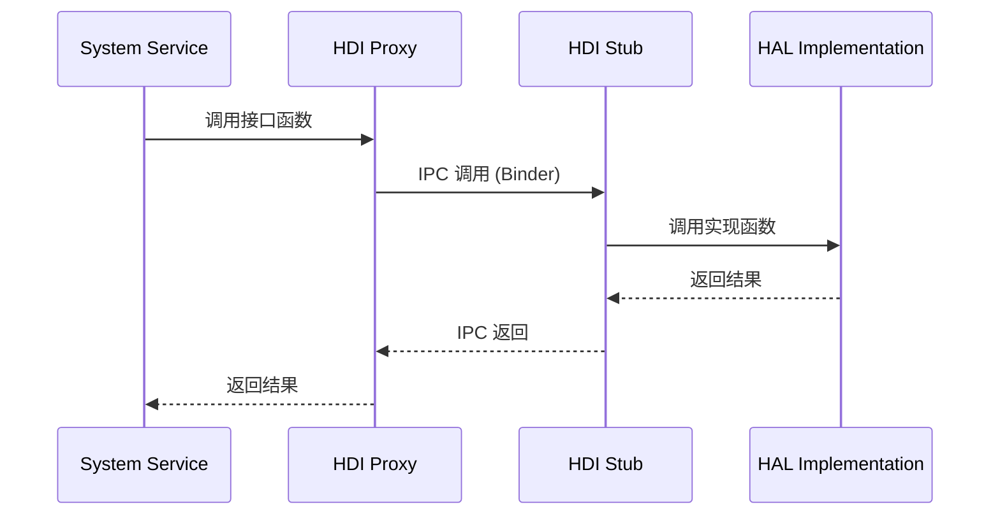
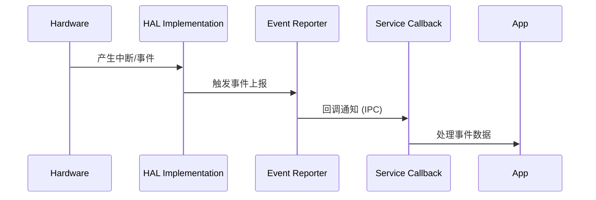

# 架构说明

本文档详细描述 OpenHarmony peripheral 驱动的系统架构、组件关系和数据流。

## 4.1 整体架构

### 4.1.1 架构分层图

```
┌─────────────────────────────────────────────────────────────────────────────┐
│                              应用层 (Applications)                            │
├─────────────────────────────────────────────────────────────────────────────┤
│                         系统服务层 (System Services)                         │
│  ┌─────────────┐ ┌─────────────┐ ┌─────────────┐ ┌─────────────────────┐   │
│  │AudioService │ │InputService │ │CameraService│ │   SensorService     │   │
│  └──────┬──────┘ └──────┬──────┘ └──────┬──────┘ └──────────┬──────────┘   │
├─────────┼────────────────┼────────────────┼───────────────────┼─────────────┤
│         │                │                │                   │             │
│         ▼                ▼                ▼                   ▼             │
├─────────────────────────────────────────────────────────────────────────────┤
│                         HDI 接口层 (本仓库)                                 │
│  ┌─────────────────────────────────────────────────────────────────────────┐ │
│  │                    interfaces/include/                                  │ │
│  │  audio_manager.h | input_manager.h | sensor_if.h | etc.               │ │
│  └─────────────────────────────────────────────────────────────────────────┘ │
├─────────────────────────────────────────────────────────────────────────────┤
│                         HDI 服务层 (本仓库)                                 │
│  ┌─────────────────────────────────────────────────────────────────────────┐ │
│  │                        hdi_service/                                     │ │
│  │  ├── device/        - 设备相关服务实现                                  │ │
│  │  ├── proxy/         - 客户端代理                                        │ │
│  │  └── stub/          - 服务端存根                                        │ │
│  └─────────────────────────────────────────────────────────────────────────┘ │
├─────────────────────────────────────────────────────────────────────────────┤
│                         HAL 层 (本仓库)                                     │
│  ┌─────────────────────────────────────────────────────────────────────────┐ │
│  │                          hal/                                           │ │
│  │  ├── src/           - HAL 具体实现                                      │ │
│  │  └── include/      - 内部头文件                                        │ │
│  └─────────────────────────────────────────────────────────────────────────┘ │
├─────────────────────────────────────────────────────────────────────────────┤
│                      drivers_framework (外部依赖)                           │
│  ┌─────────────────────────────────────────────────────────────────────────┐ │
│  │  - HDF (Hardware Driver Framework)                                      │ │
│  │  - IPC/SPI 通信机制 (Binder, MessageParcel)                             │ │
│  │  - 设备节点管理                                                          │ │
│  │  - 服务注册与发现                                                        │ │
│  └─────────────────────────────────────────────────────────────────────────┘ │
├─────────────────────────────────────────────────────────────────────────────┤
│                     drivers_adapter (外部依赖)                             │
│  ┌─────────────────────────────────────────────────────────────────────────┐ │
│  │  - HDI-Adapter: 接口适配层                                              │ │
│  │  - KHDF: 内核驱动桥接                                                    │ │
│  └─────────────────────────────────────────────────────────────────────────┘ │
├─────────────────────────────────────────────────────────────────────────────┤
│                      Linux Kernel Drivers                                   │
└─────────────────────────────────────────────────────────────────────────────┘
```

### 4.1.2 数据流向

**同步调用流程**:


**异步事件上报流程**:


---

## 4.2 核心组件

### 4.2.1 HDI 接口定义 (interfaces/)

**职责**: 定义系统服务调用的标准接口

**特点**:
- C 语言结构体函数指针模式
- 版本化管理（v1_0, 2.0）
- 输入输出参数清晰分离

**证据位置**:
- `audio/interfaces/include/audio_manager.h`
- `input/interfaces/include/input_manager.h`
- `sensor/interfaces/include/sensor_if.h`

**示例代码**:
```c
// audio_manager.h
struct AudioManager {
    int32_t (*GetAllAdapters)(struct AudioManager *manager,
                              struct AudioAdapterDescriptor **descs,
                              int32_t *size);
    int32_t (*LoadAdapter)(struct AudioManager *manager,
                           const struct AudioAdapterDescriptor *desc,
                           struct AudioAdapter **adapter);
    void (*UnloadAdapter)(struct AudioManager *manager,
                          struct AudioAdapter *adapter);
};
```

---

### 4.2.2 HDI 服务实现 (hdi_service/)

**职责**: 实现 HDI 接口，作为服务端处理 IPC 请求

**子组件**:

| 组件 | 说明 | 示例 |
|------|------|------|
| `device/` | 设备相关服务 | `display/hdi_service/device/` |
| `proxy/` | 客户端代理 | `display/hdi_service/device/src/proxy/` |
| `stub/` | 服务端存根 | `display/hdi_service/device/include/server/` |

**Stub 实现示例**:
```cpp
// display_device_stub.h
class DisplayDeviceStub : public IRemoteBroker {
    int32_t OnRemoteRequest(int cmdId, MessageParcel *data,
                           MessageParcel *reply) override;
};

// display_device_stub.cpp
int32_t DisplayDeviceStub::OnRemoteRequest(int cmdId, MessageParcel *data,
                                          MessageParcel *reply)
{
    switch (cmdId) {
        case DISPLAY_CMD_GET_LAYER_INFO:
            return GetLayerInfo(data, reply);
        case DISPLAY_CMD_SET_LAYER_ZORDER:
            return SetLayerZorder(data, reply);
        default:
            return HDF_ERR_NOT_SUPPORT;
    }
}
```

**证据位置**: `display/hdi_service/device/include/server/display_device_stub.h:38`

---

### 4.2.3 HAL 实现 (hal/)

**职责**: 封装硬件操作细节，提供统一抽象

**特点**:
- 平台无关代码
- 支持直通（Passthrough）和绑定（Binder）两种模式
- 错误处理与日志

**目录结构**:
```
hal/
├── include/           # 内部头文件
│   ├── *_common.h    # 公共类型
│   └── *_controller.h # 控制器定义
└── src/              # 具体实现
    ├── audio_*.c     # 音频实现
    ├── input_*.c     # 输入实现
    └── sensor_*.c    # 传感器实现
```

**HAL 实现示例**:
```c
// input_controller.c
int32_t SetPowerStatus(uint32_t devIndex, uint32_t status)
{
    struct InputDevice *dev = GetDeviceByIndex(devIndex);
    if (dev == NULL) {
        return INPUT_ERR_INVALID_PARAM;
    }
    
    int32_t ret = OsalWriteFile(dev->powerSysfs, &status, sizeof(status));
    if (ret < 0) {
        HDF_LOGE("Write power status failed");
        return INPUT_ERR_IO;
    }
    
    return INPUT_SUCCESS;
}
```

**证据位置**: `input/hal/src/input_controller.c`

---

## 4.3 线程模型

### 4.3.1 调用线程

- **同步调用**：在调用者线程执行
- **事件上报**：在独立工作线程执行

### 4.3.2 内部线程

**Input 模块线程模型**:
```
┌─────────────────────────────────────────┐
│           主线程 (调用者线程)             │
│  - OpenInputDevice                      │
│  - GetInputDeviceList                   │
│  - RegisterReportCallback               │
└───────────────┬─────────────────────────┘
                │ IPC 调用
┌───────────────▼─────────────────────────┐
│         HDF IPC 线程池                  │
│  - 请求分发                              │
│  - 跨进程通信                            │
└───────────────┬─────────────────────────┘
                │ 本地调用
┌───────────────▼─────────────────────────┐
│         HDI Stub 线程                   │
│  - 接口实现调用                         │
│  - 错误处理                             │
└───────────────┬─────────────────────────┘
                │
┌───────────────▼─────────────────────────┐
│         HAL 工作线程 (可选)              │
│  - 异步操作                              │
│  - 事件循环                              │
└─────────────────────────────────────────┘
```

---

## 4.4 错误传播机制

### 4.4.1 错误码定义

各模块独立定义错误码：

**Input 模块错误码**:
```c
#define INPUT_SUCCESS              0
#define INPUT_ERR_INVALID_PARAM    -1
#define INPUT_ERR_NULL_PTR         -2
#define INPUT_ERR_IO               -3
#define INPUT_ERR_DEVICE_NOT_FOUND -4
#define INPUT_ERR_DEVICE_BUSY      -5
```

**Sensor 模块错误码**:
```c
#define SENSOR_SUCCESS             0
#define SENSOR_ERR_INVALID_PARAM  -1
#define SENSOR_ERR_NOT_FOUND      -2
// ...
```

---

### 4.4.2 错误处理流程

```
┌──────────────┐
│  发生错误     │
└──────┬───────┘
       ▼
┌──────────────┐
│ HAL 层捕获   │───▶ 记录错误日志
└──────┬───────┘
       ▼
┌──────────────┐
│ 返回错误码   │───▶ 整数类型返回值
└──────┬───────┘
       ▼
┌──────────────┐
│ HDI Stub     │───▶ 错误码透传
└──────┬───────┘
       ▼
┌──────────────┐
│ IPC 返回     │───▶ 跨进程返回
└──────┬───────┘
       ▼
┌──────────────┐
│ 调用者处理   │───▶ 条件判断与恢复
└──────────────┘
```

---

## 4.5 资源生命周期

### 4.5.1 接口获取流程

```c
// 1. 获取接口实例
IInputInterface *inputInterface = nullptr;
int32_t ret = GetInputInterface(&inputInterface);

// 2. 使用完毕后释放（通常由框架管理）
// 无需手动释放，框架自动管理
```

### 4.5.2 设备打开/关闭

```c
// 打开设备
ret = inputInterface->iInputManager->OpenInputDevice(devIndex);

// 使用设备...
ret = inputInterface->iInputController->GetDeviceType(devIndex, &devType);

// 关闭设备
ret = inputInterface->iInputManager->CloseInputDevice(devIndex);
```

### 4.5.3 回调注册/注销

```c
// 注册回调
InputReportEventCb callback = {
    .ReportEventPkgCallback = ReportEventPkgCallback
};
ret = inputInterface->iInputReporter->RegisterReportCallback(devIndex, &callback);

// ... 等待事件 ...

// 注销回调
ret = inputInterface->iInputReporter->UnregisterReportCallback(devIndex);
```

**证据**: `input/README_zh.md:159-231`

---

## 4.6 稳定性标注

### 4.6.1 稳定性级别

| 级别 | 标识 | 说明 |
|------|------|------|
| **稳定 (Stable)** | 无特殊标记 | 正式发布，API 不兼容变更需 major version |
| **实验 (Experimental)** | `*_experimental.h` | 正在评估，可能变更 |
| **内部 (Internal)** | `internal/` 目录 | 仅供内部使用 |

### 4.6.2 证据来源

1. **目录位置**:
   - 稳定接口: `interfaces/include/`, `interfaces/2.0/`
   - 实验接口: `interfaces/v1_0-experimental/`（如有）

2. **头文件注释**:
   - `@stable` 或 `@internal` 标注

3. **函数命名**:
   - `_v1` 后缀表示版本

---

## 4.7 跨模块依赖

### 4.7.1 依赖关系

| 模块 | 被依赖 | 依赖其他 |
|------|--------|----------|
| Audio | Multimedia, SAMGR | - |
| Input | WindowManager, UI | - |
| Sensor | AppFramework | - |
| Camera | Multimedia | Sensor (陀螺仪) |
| Display | Graphics | - |

### 4.7.2 避免循环依赖

- **禁止**: 模块 A → 模块 B → 模块 A
- **允许**: 跨模块回调（事件驱动）
- **建议**: 通过 HDF 消息总线通信

---

**下一节**: [GN 构建配置](05_GN_Build.md) - 了解构建配置细节
