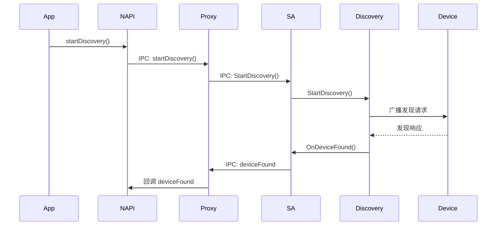
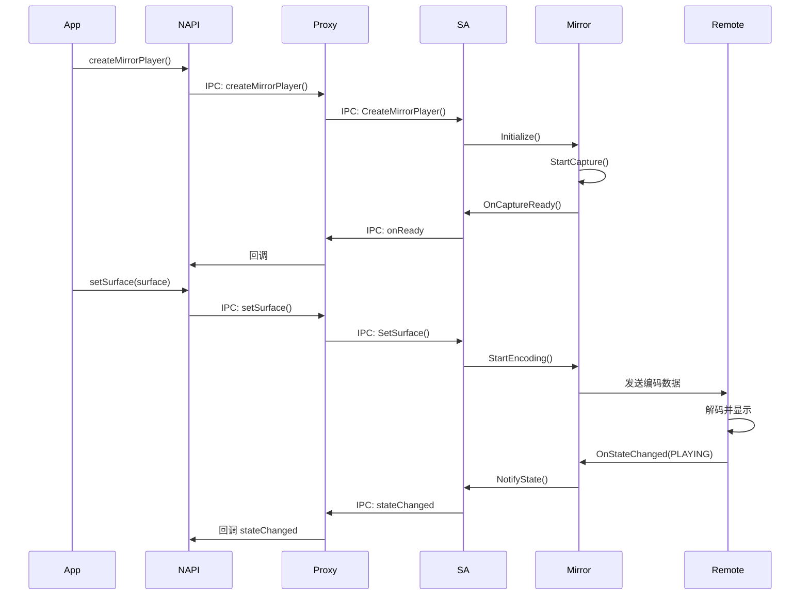
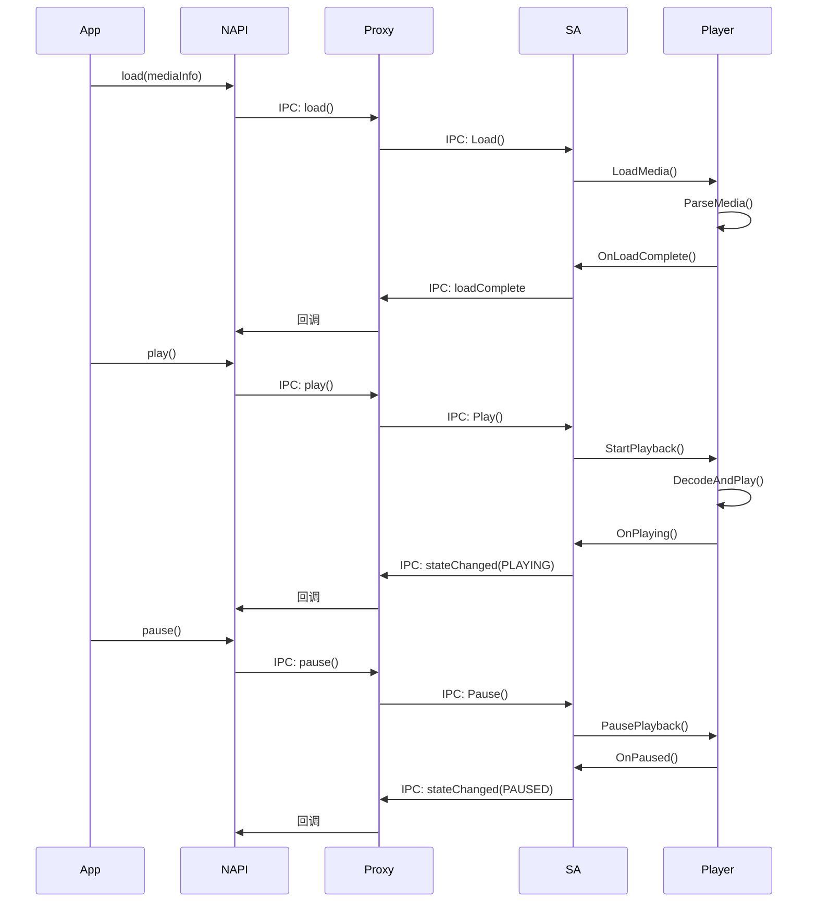

# 架构设计

> 文档版本: 1.0.0
> 最后更新: 2026-02-06

## 目的

本文档提供 CastEngine 框架的架构设计说明，包括组件关系、数据流、线程模型和关键时序。

## 架构概览

### 整体架构

```
┌─────────────────────────────────────────────────────────────┐
│                    应用层 (JavaScript/ArkTS)           │
└───────────────────────────┬──────────────────────────────┘
                        │
                        ▼
┌─────────────────────────────────────────────────────┐
│              N-API 层 (libcast.z.so)             │
│  • CastSessionManager                              │
│  • CastSession                                     │
│  • StreamPlayer                                     │
│  • MirrorPlayer                                     │
│  • 枚举和常量                                      │
└──────────────────────┬─────────────────────────────┘
                       │
                       ▼
┌─────────────────────────────────────────────────────┐
│         内部 API 层 (libcast_engine_client.z.so)    │
│  • ICastSession 接口                               │
│  • IStreamPlayer 接口                             │
│  • IMirrorPlayer 接口                             │
│  • 数据结构定义                                    │
└──────────────────────┬─────────────────────────────┘
                       │
                       ▼
┌─────────────────────────────────────────────────────┐
│     客户端 IPC 层 (Proxy 实现)               │
│  • CastSessionManagerServiceProxy                 │
│  • CastSessionImplProxy                             │
│  • StreamPlayerImplProxy                             │
│  • MirrorPlayerImplProxy                              │
└──────────────────────┬─────────────────────────────┘
                       │
              OpenHarmony IPC (Binder/SoftBus)
                       │
                       ▼
┌─────────────────────────────────────────────────────┐
│        服务端 IPC 层 (Stub 实现)                │
│  • CastSessionManagerServiceStub               │
│  • CastSessionImplStub                             │
│  • StreamPlayerImplStub                             │
│  • MirrorPlayerImplStub                              │
└──────────────────────┬─────────────────────────────┘
                       │
                       ▼
┌─────────────────────────────────────────────────────┐
│      CastEngine 服务层 (System Ability 5526)       │
│                                                       │
│  ┌────────────────────────────────────────────┐  │
│  │ SessionManager 会话管理              │  │
│  │ • 会话创建和销毁                       │  │
│  │ • 设备管理                             │  │
│  │ • 状态机                               │  │
│  └──────────────────────────────────────┘  │
│                                                       │
│  ┌────────────────────────────────────────────┐  │
│  │ DeviceManager 设备管理            │  │
│  │ • DiscoveryManager 发现管理器            │  │
│  │ • ConnectionManager 连接管理器     │  │
│  │ • CastDeviceDataManager 数据管理     │  │
│  └──────────────────────────────────────┘  │
│                                                       │
│  ┌────────────────────────────────────────────┐  │
│  │ SessionImpl 会话实现              │  │
│  │ • ChannelManager 通道管理            │  │
│  │ • MirrorPlayer 镜像播放器          │  │
│  │ • StreamPlayer 流播放器          │  │
│  │ • RTSP 协议实现                 │  │
│  └──────────────────────────────────────┘  │
│                                                       │
│  ┌────────────────────────────────────────────┐  │
│  │ Utils 工具类                    │  │
│  │ • Permission 权限检查             │  │
│  │ • EncryptDecrypt 加密解密          │  │
│  │ • StateMachine 状态机            │  │
│  │ • DFX 日志和监控               │  │
│  └──────────────────────────────────────┘  │
│                                                       │
└─────────────────────────────────────────────────────┘

                        │
                        ▼
┌─────────────────────────────────────────────────────┐
│              OpenHarmony 系统服务                   │
│  • Samgr (System Ability Manager)                 │
│  • SoftBus (分布式软总线)                          │
│  • HiLog (日志)                                     │
│  • Surface/Audio/Player 框架                      │
│  • AccessToken (权限管理)                           │
└─────────────────────────────────────────────────────┘
```

## 核心组件

### 1. CastSessionManagerService

**位置**: `service/src/cast_session_manager_service.cpp`
**职责**: System Ability 主服务，SA ID 5526

**主要功能**:
- 服务生命周期管理（OnStart/OnStop）
- IPC 接口注册和监听
- 权限验证
- 会话管理和路由
- 设备发现协调

**关键接口**:
- `ICastSessionManagerServiceStub` - IPC Stub
- `ICastSessionManagerListener` - 事件回调

### 2. DiscoveryManager

**位置**: `service/src/device_manager/src/discovery_manager.cpp`
**职责**: 设备发现和通知

**主要功能**:
- 启动/停止设备发现
- 处理发现的设备信息
- 通知客户端设备事件
- 设备列表维护

**依赖的系统服务**:
- WiFi SDK - WiFi 设备发现
- DeviceManager SDK - 设备管理
- Common Event Service - 广播接收
- Sharing Framework - 分享服务

### 3. CastSessionImpl

**位置**: `service/src/session/src/cast_session_impl.cpp`
**职责**: 单个投屏会话实现

**主要功能**:
- 会话状态管理
- 设备添加/移除
- MirrorPlayer/StreamPlayer 创建和管理
- 属性设置和查询
- 事件通知

**状态机**:
- CONNECTING → CONNECTED → PLAYING → DISCONNECTED
- 状态转换验证和事件触发

### 4. ChannelManager

**位置**: `service/src/session/src/channel/src/channel_manager.cpp`
**职责**: 数据传输通道管理

**通道类型**:
- SoftBus 通道 - 分布式设备通信
- TCP 通道 - 标准网络通信
- 通道抽象和包装层

### 5. MirrorPlayerImpl

**位置**: `service/src/session/src/mirror/src/mirror_player_impl.cpp`
**职责**: 镜像投屏实现

**主要功能**:
- 屏幕捕获（通过 AudioCapturer）
- 视频编码
- 数据传输
- 远程控制事件处理
- 屏幕截图

### 6. StreamPlayerImpl

**位置**: `service/src/session/src/stream/src/player/src/cast_stream_player.cpp`
**职责**: 流媒体播放实现

**主要功能**:
- 媒体加载和解析
- 播放控制（播放、暂停、停止）
- 播放列表管理
- 远程控制器处理
- 状态同步

---

## 数据流

### 设备发现流程

```
应用
    │
    ├── 1. 调用 CastSessionManager.startDiscovery()
    │
    ├── 2. N-API → Proxy IPC
    │
    ├── 3. DiscoveryManager.startDiscovery()
    │
    ├── 4. 调用 WiFi SDK / DeviceManager SDK
    │
    ├── 5. 广播发现请求
    │
    └── 6. 设备响应
         │
         ▼
    ┌─────────────────────┐
    │ DiscoveryManager    │
    │ 验证设备信息       │
    │                  │
    └──────────────────────┘
         │
         ▼
    ┌─────────────────────┐
    │ IPC 回调          │
    │ deviceFound()      │
    └──────────────────────┘
         │
         ▼
    ┌─────────────────────┐
    │ N-API 层          │
    │ 触发事件回调      │
    └──────────────────────┘
```

### 镜像投屏数据流

```
本机设备                              远程设备
┌──────────┐                              ┌──────────┐
│ 屏幕   │  [1] AudioCapturer        │ 播放器   │
└─────┬────┘         ↓                      └─────┬────┘
      │         ┌────────────┐                   │
      │         │ MirrorPlayerImpl   │                   │
      │         └─────┬──────┘                   │
      │               │ [2] 视频编码                   │
      │               ↓                            │
      │         ┌────────────┐                   │
      │         │ ChannelManager   │                   │
      │         └─────┬──────┘                   │
      │               │ [3] 网络传输                  │ [5] 网络接收
      │               ↓                            │       └─────┬──────┘
      │         ┌────────────┐                          │
      │         │ TCP/SoftBus  │                          │
      │         └──────────────┘                          │
      │                                                │
      └──────────────────────────────────────────────────────────┘
```

### 流媒体播放数据流

```
本机设备                              远程设备
┌──────────┐                              ┌──────────┐
│ 应用   │  [1] StreamPlayerImpl    │ 接收器   │
└─────┬────┘         ↓                      └─────┬────┘
      │         ┌────────────┐                   │
      │         │ ChannelManager   │                   │
      │         └─────┬──────┘                   │
      │               │ [2] 网络传输                  │ [3] 媒体数据流
      │               ↓                            │       └─────┬──────┘
      │         ┌────────────┐                          │
      │         │ TCP/SoftBus  │                          │
      │         └──────────────┘                          │
      │                                                │
      └──────────────────────────────────────────────────────────┘
```

---

## 线程模型

### 线程类型

| 线程类型 | 说明 | 位置 |
|---------|------|------|
| JavaScript 主线程 | N-API 回调执行 | Node.js/ArkTS 运行时 |
| N-API 工作线程 | 异步任务执行 | interfaces/kits/js/src/napi_async_work.cpp |
| IPC 线程 | Binder 通信 | OpenHarmony IPC 框架 |
| 服务主线程 | SA 生命周期管理 | service/src/cast_session_manager_service.cpp |
| 发现线程 | 设备发现 | service/src/device_manager/src/discovery_manager.cpp |
| 编码线程 | 视频编码 | service/src/session/src/mirror/ |
| 播放线程 | 媒体播放 | service/src/session/src/stream/player/ |

### 线程安全

**互斥锁使用**:
```cpp
// 权限 PID 白名单
std::mutex Permission::pidLock_;

// 会话管理器监听器
std::mutex NapiCastSessionManager::mutex_;

// 会话状态
std::mutex sessionStateLock_;
```

**原子操作**:
- 状态转换使用原子操作（如果适用）
- 引用计数使用原子操作
- 标志位使用原子操作

---

## 关键时序

### 时序 1: 设备发现和会话创建



### 时序 2: 镜像投屏启动



### 时序 3: 流媒体播放控制



---

## IPC 通信

### Binder/SoftBus 框架

CastEngine 使用 OpenHarmony 的 IPC 框架进行跨进程通信：

| IPC 类型 | 说明 | 使用场景 |
|---------|------|---------|
| Binder | 本地设备通信 | 客户端-服务端在同一设备 |
| SoftBus | 分布式设备通信 | 跨设备发现和连接 |

### IPC 接口定义

**SA 接口**: `ICastSessionManagerServiceStub`
**Proxy 接口**: `ICastSessionManagerServiceProxy`

**主要方法**:
- StartDiscovery() / StopDiscovery()
- SetDiscoverable()
- CreateCastSession()
- Release()
- RegisterListener() / UnregisterListener()

---

## 扩展点

### 添加新协议

1. 在 `service/src/session/src/` 下创建新协议目录
2. 实现 ProtocolManager 接口
3. 在 SessionImpl 中集成新协议管理器
4. 添加对应的 N-API 扩展

### 添加新设备类型

1. 在 `cast_engine_common.h` 中添加新设备类型枚举
2. 在 DiscoveryManager 中添加识别逻辑
3. 更新设备信息数据结构
4. 导出枚举到 N-API

---

## 相关文档

- [目录结构](01_Directory_Structure.md) - 详细的代码组织
- [N-API 文档](03_N-API.md) - 对外接口说明
- [内部 API](04_Internal_API.md) - 内部接口定义
- [GN Targets](05_GN_Targets.md) - 构建系统和模块

---

**返回**: [SUMMARY.md](SUMMARY.md)
