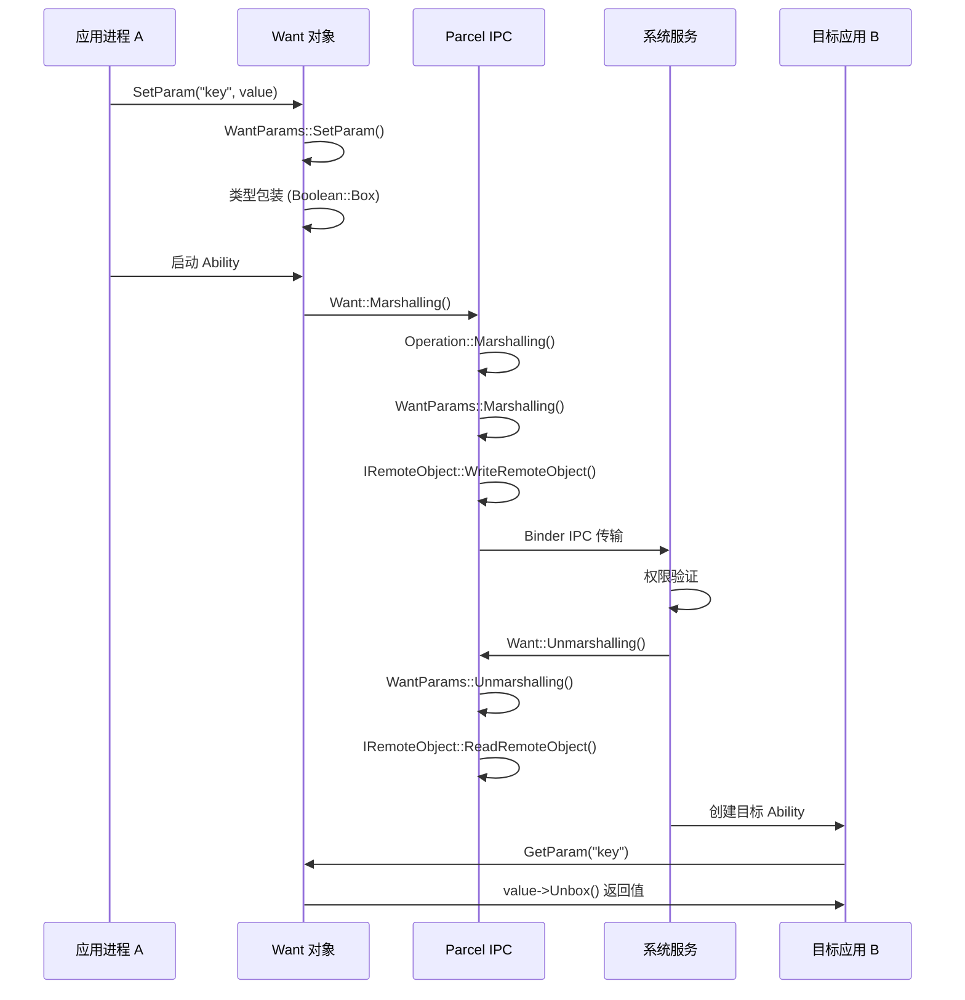
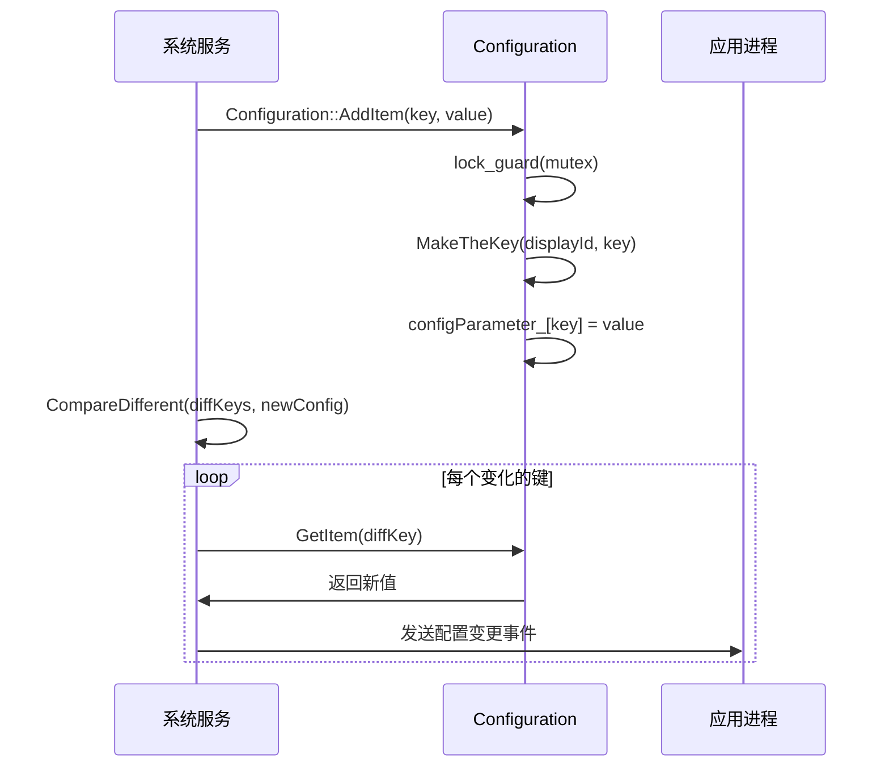
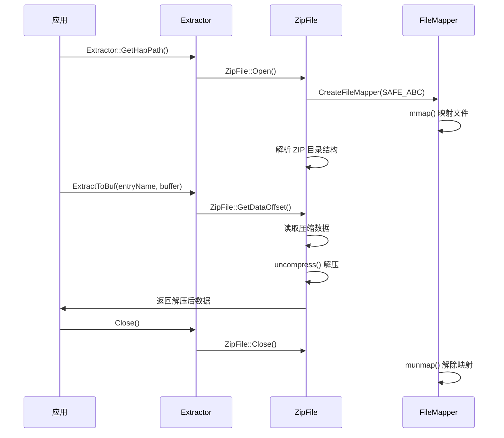

# 架构说明

## 目的

本文档详细说明 ability_base 组件的内部架构，包括组件关系、数据流、线程模型、关键时序和设计模式，帮助开发者深入理解组件设计和实现细节。

---

## 1. 架构总览

### 1.1 分层架构

ability_base 采用清晰的分层设计，从应用层到系统内部层逐步深入：

```
┌─────────────────────────────────────────────────────────────┐
│                   应用层                              │
│   (开发者使用 Want/Configuration API）                     │
└────────────────────┬────────────────────────────────────────┘
                     │
┌────────────────────▼────────────────────────────────────────┐
│              Native C++ Kit API 层                      │
│  Want/Configuration/Uri/SessionInfo/ViewData 公共接口       │
└────────────────────┬────────────────────────────────────────┘
                     │
┌────────────────────▼────────────────────────────────────────┐
│              Inner API 层（系统内部）                  │
│     Base 类型包装器（Boolean/Integer/String 等）         │
└────────────────────┬────────────────────────────────────────┘
                     │
┌────────────────────▼────────────────────────────────────────┐
│              IPC 层（Parcelable）                       │
│         序列化/反序列化用于跨进程传输                 │
└────────────────────┬────────────────────────────────────────┘
                     │
┌────────────────────▼────────────────────────────────────────┐
│              系统服务层（ability_runtime 等）           │
│              AbilityManager/权限验证等                    │
└─────────────────────────────────────────────────────────────┘
```

**证据位置**：
- 目录结构：`01_Directory_Structure.md` - inner_api vs kits/native 分层
- 接口导出：`bundle.json` - innerapi_tags 区分平台 SDK/SA SDK

### 1.2 核心类层次结构

```
Object (RefBase 基类)
├── IInterface (接口基类）
│   ├── IBoolean
│   ├── IByte
│   ├── IChar
│   ├── IShort
│   ├── IInteger
│   ├── ILong
│   ├── IFloat
│   ├── IDouble
│   ├── IString
│   ├── IArray
│   ├── IPacMap
│   ├── IUserObject
│   └── IRemoteObjectWrap

Parcelable (IPC 接口）
├── Want
│   ├── Operation
│   │   └── Uri
│   └── WantParams
├── Configuration
├── Uri
├── ElementName
├── SessionInfo
├── ViewData
├── PageNodeInfo
└── Rect
```

**证据位置**：
- Object 基类：`interfaces/inner_api/base/include/base_obj.h`
- Parcelable：所有 kits/native 类继承自 `public Parcelable`

---

## 2. 组件关系与依赖

### 2.1 核心模块关系图

```
                    ┌─────────────┐
                    │  Base       │  基础类型包装器
                    │  (libbase)  │
                    └──────┬──────┘
                           │
          ┌────────────────┼────────────────┐
          │                │                │
     ┌────▼─────┐     ┌──▼────┐    ┌────▼────┐
     │   zuri   │     │ Want  │    │ C-NDK   │
     │ (libzuri)│     │(libwant)│  │(ability)│
     └────┬─────┘     └───┬───┘    └────┬─────┘
          │              │              │
          │         ┌────▼─────┐       │
          │         │SessionInfo│       │
          │         │(libsession)│       │
          │         └────┬─────┘       │
          │              │              │
          └──────────────┼──────────────┘
                         │
                    ┌────▼────────┐
                    │ other modules│
                    │ (config/etc)│
                    └─────────────┘
```

**证据位置**：
- BUILD.gn 依赖关系：`BUILD.gn` - deps 字段

### 2.2 Want 内部组件关系

```
Want (主消息容器）
│
├── Operation (目标操作）
│   ├── std::string action          # 操作类型
│   ├── std::vector<std::string> entities  # 实体列表
│   ├── unsigned int flags          # 标志位
│   ├── Uri uri                   # URI 目标
│   ├── ElementName element        # 组件标识
│   └── std::vector<std::string> moduleName # 模块名
│
├── WantParams (参数存储）
│   └── std::map<std::string, sptr<IInterface>> params_
│
├── std::vector<std::string> entities_  # 实体列表
└── unsigned int flags_              # Want 级别标志
```

**证据位置**：
- Want 成员变量：`interfaces/kits/native/want/include/want.h:932-934`
- WantParams 定义：`interfaces/kits/native/want/include/want_params.h`

---

## 3. 数据流

### 3.1 Want 参数设置与获取流程

```
应用代码
    │
    ▼ Want.SetParam(key, value)
    │
    ├─→ WantParams::SetParam()
    │        │
    │        ├─→ 类型包装（如 Boolean::Box(value)）
    │        │
    │        └─→ params_[key] = sptr<IInterface>
    │
    ▼ Want 通过 Parcel IPC 传输
    │
    ├─→ WantParams::Marshalling()
    │        │
    │        ├─→ 遍历 params_ map
    │        │
    │        ├─→ 每个 value 调用 WriteToParcel()
    │        │
    │        └─→ 写入类型标记和序列化数据
    │
    ▼ 接收端
    │
    ├─→ WantParams::Unmarshalling()
    │        │
    │        ├─→ 读取类型标记
    │        │
    │        ├─→ 根据类型创建对应包装器
    │        │
    │        └─→ 调用 ReadFromParcel() 反序列化
    │
    ▼ Want.GetParam(key)
    │
    ├─→ WantParams::GetParam()
    │        │
    │        ├─→ params_[key].find()
    │        │
    │        └─→ value->Unbox() 获取原始值
    │
    ▼ 应用获取到参数值
```

**证据位置**：
- Want::SetParam：`interfaces/kits/native/want/include/want.h:460`
- WantParams::Marshalling：`interfaces/kits/native/want/src/want_params.cpp`

### 3.2 Configuration 访问流程

```
应用代码
    │
    ▼ Configuration.GetItem(key)
    │
    ├─→ std::lock_guard<std::recursive_mutex> lock(configParameterMutex_)
    │
    ├─→ MakeTheKey(key, id, param)  // 构建 "displayId#key"
    │
    ├─→ configParameter_.find(key)
    │
    └─→ return value 或 ""
    │
    ▼ 应用获取到配置值
```

**线程安全**：
- 使用 `std::recursive_mutex` 保护 `configParameter_` map
- 所有访问都通过 `lock_guard` 自动加锁

**证据位置**：
- Mutex 声明：`interfaces/kits/native/configuration/include/configuration.h:234`
- GetItem 实现：`interfaces/kits/native/configuration/src/configuration.cpp`

### 3.3 URI 解析流程

```
URI 字符串 "http://example.com:8080/path?query#frag"
    │
    ▼ Uri(uriString)
    │
    ├─→ ParseScheme()          → scheme_ = "http"
    │
    ├─→ ParseSsp()             → ssp_ = "//example.com:8080/path?query#frag"
    │
    ├─→ ParseAuthority()        → authority_ = "example.com:8080"
    ├─→ ParseHost()            → host_ = "example.com"
    ├─→ ParsePort()            → port_ = 8080
    ├─→ ParsePath()            → path_ = "/path"
    ├─→ ParseQuery()           → query_ = "query"
    └─→ ParseFragment()        → fragment_ = "frag"
    │
    ▼ Uri 对象创建完成
    │
    ▼ GetScheme()/GetHost()/GetPath() 等方法访问
```

**证据位置**：
- Uri 类定义：`interfaces/kits/native/uri/include/uri.h`
- 私有解析方法：`interfaces/kits/native/uri/include/uri.h:164-200`

---

## 4. 线程模型

### 4.1 Configuration 线程安全

**线程模型**：多线程安全，使用递归互斥锁

**实现**：
```cpp
// configuration.h:234
mutable std::recursive_mutex configParameterMutex_;
std::unordered_map<std::string, std::string> configParameter_;

// 所有公共方法都使用 lock_guard
bool Configuration::GetItem(const std::string &key) const {
    std::lock_guard<std::recursive_mutex> lock(configParameterMutex_);
    // ...
}
```

**证据位置**：
- Mutex 声明：`interfaces/kits/native/configuration/include/configuration.h:234`

### 4.2 WantParams 单线程模型

**线程模型**：假定单线程访问，无显式锁

**设计考虑**：
- WantParams 通常在单个 Ability 进程内使用
- 跨进程传输通过 Parcel 序列化完成
- 使用 RefBase 引用计数管理生命周期

**证据位置**：
- WantParams 类定义：`interfaces/kits/native/want/include/want_params.h`
- 无 Mutex 或 atomic 成员

### 4.3 Extractor 单例模式 + Mutex

**线程模型**：单例 + 互斥锁保护共享状态

**实现**：
```cpp
// extractor.h:121-122
static ExtractorUtil& GetInstance();
std::mutex mapMutex_;  // 保护 ExtractorUtil map
```

**证据位置**：
- ExtractorUtil 单例：`interfaces/kits/native/extractortool/include/extractor.h:114-123`

### 4.4 ZipFile 原子操作

**线程模型**：使用 atomic + mutex 保护状态

**实现**：
```cpp
// zip_file.h:313-315
std::mutex openMutex_;
std::mutex dirRootMutex_;
std::atomic_bool isOpen_ = false;
```

**证据位置**：
- ZipFile 状态保护：`interfaces/kits/native/extractortool/include/zip_file.h:313-315`

### 4.5 线程模型总结

| 组件 | 线程模型 | 同步机制 | 证据位置 |
|------|----------|----------|----------|
| Configuration | 多线程安全 | `std::recursive_mutex` | `configuration.h:234` |
| WantParams | 单线程 | 无（假定单线程） | - |
| ExtractorUtil | 单例 + 多线程 | `std::mutex` | `extractor.h:122` |
| ZipFile | 多线程安全 | `atomic + mutex` | `zip_file.h:313` |
| Extractor | 单实例 | `std::atomic_bool initial_` | `extractor.h:115` |

---

## 5. 关键时序

### 5.1 Want IPC 传输时序



**证据位置**：
- Want Marshalling：`interfaces/kits/native/want/src/want.cpp:794`
- WantParams Marshalling：`interfaces/kits/native/want/src/want_params.cpp`

### 5.2 Configuration 更新时序



**证据位置**：
- CompareDifferent：`interfaces/kits/native/configuration/include/configuration.h:86`
- Merge：`interfaces/kits/native/configuration/include/configuration.h:96`

### 5.3 Zip 提取时序



**证据位置**：
- Extractor 接口：`interfaces/kits/native/extractortool/include/extractor.h`
- ZipFile 类：`interfaces/kits/native/extractortool/include/zip_file.h`

---

## 6. 资源生命周期管理

### 6.1 RefBase 引用计数

**设计**：所有 Object 子类使用 RefBase 引用计数管理生命周期

**实现**：
```cpp
// base_obj.h
class Object : public virtual RefBase {
    void IncStrongRef(const void *id = nullptr) override;
    void DecStrongRef(const void *id = nullptr) override;
};

// 使用 sptr 智能指针
sptr<IInterface> value = new (std::nothrow) Boolean(true);
// 引用计数 = 1

sptr<IInterface> copy = value;
// 引用计数 = 2
```

**证据位置**：
- Object 基类：`interfaces/inner_api/base/include/base_obj.h`

### 6.2 Want 文件描述符管理

**特殊处理**：WantParams 中的文件描述符需要特殊管理

**方法**：
- `CloseAllFd()` - 关闭所有 FD
- `RemoveAllFd()` - 移除 FD 列表（不关闭）
- `DupAllFd()` - 复制所有 FD（用于 fork 后）

**实现**：
```cpp
// want_params.h
std::map<std::string, int> fds_;

void WantParams::CloseAllFd() {
    for (auto& [key, fd] : fds_) {
        if (fd >= 0) {
            close(fd);
        }
    }
    fds_.clear();
}
```

**证据位置**：
- WantParams FD 管理：`interfaces/kits/native/want/include/want_params.h`

### 6.3 RAII 模式

**应用**：FileMapper 和 ZipFile 使用 RAII 管理资源

**示例**：
```cpp
// zip_file.h
class ZipFile {
    ZipFile();
    ~ZipFile();  // 自动 Close()
    bool Open();
    void Close();
};
```

**证据位置**：
- ZipFile 析构函数：`interfaces/kits/native/extractortool/include/zip_file.h`

---

## 7. 设计模式

### 7.1 Builder 模式

**应用**：OperationBuilder 用于构建 Operation 对象

**实现**：
```cpp
// operation_builder.h
class OperationBuilder {
public:
    OperationBuilder& WithAction(const std::string& action);
    OperationBuilder& WithEntity(const std::string& entity);
    OperationBuilder& WithUri(const std::string& uri);
    Operation Build();
};
```

**证据位置**：
- OperationBuilder：`interfaces/kits/native/want/include/operation_builder.h`

### 7.2 Factory 模式

**应用**：Want 提供静态工厂方法

**方法**：
- `Want::MakeMainAbility(elementName)` - 创建主 Ability 的 Want
- `Want::ParseUri(uri)` - 从 URI 字符串创建 Want
- `Configuration::Unmarshalling(parcel)` - 从 Parcel 反序列化

**证据位置**：
- MakeMainAbility：`interfaces/kits/native/want/include/want.h:208`
- ParseUri：`interfaces/kits/native/want/include/want.h:216`

### 7.3 Wrapper 模式

**应用**：所有基础类型包装器

**实现**：
```cpp
// bool_wrapper.h
class Boolean final : public Object, public IBoolean {
public:
    static Boolean* Box(bool value);
    static bool UnBox(IBoolean* obj);
private:
    bool value_;
};
```

**证据位置**：
- Boolean 包装器：`interfaces/inner_api/base/include/bool_wrapper.h`

### 7.4 Interface Query 模式（COM 风格）

**应用**：IInterface 使用 IID（Interface ID）进行类型查询

**实现**：
```cpp
// base_interfaces.h
INTERFACE(IBoolean, 492ef6c0-e122-401d-80c4-bb65e2325766) {
    inline static IBoolean* Query(IInterface* object) {
        if (object == nullptr) return nullptr;
        return static_cast<IBoolean*>(object->Query(g_IID_IBoolean));
    }
    virtual ErrCode GetValue(bool& value) = 0;
};
```

**使用**：
```cpp
IInterface* obj = ...;
IBoolean* boolObj = IBoolean::Query(obj);
if (boolObj != nullptr) {
    bool value;
    boolObj->GetValue(value);
}
```

**证据位置**：
- INTERFACE 宏定义：`interfaces/inner_api/base/include/base_interfaces.h`

### 7.5 Singleton 模式

**应用**：ExtractorUtil 单例管理 ZIP 映射

**实现**：
```cpp
// extractor.h
class ExtractorUtil {
public:
    static ExtractorUtil& GetInstance();
private:
    ExtractorUtil() = default;
    ExtractorUtil(const ExtractorUtil&) = delete;
    ExtractorUtil& operator=(const ExtractorUtil&) = delete;
};
```

**证据位置**：
- ExtractorUtil 单例：`interfaces/kits/native/extractortool/include/extractor.h:114-123`

### 7.6 Template Method 模式

**应用**：Parcelable 定义序列化接口，子类实现

**接口**：
```cpp
// parcel.h (来自 IPC）
class Parcelable {
public:
    virtual bool Marshalling(Parcel& parcel) const = 0;
    virtual bool ReadFromParcel(Parcel& parcel) = 0;
};
```

**实现**：
```cpp
// want.cpp
bool Want::Marshalling(Parcel& parcel) const {
    // 模板方法：定义序列化流程
    WriteElement(parcel);
    WriteUri(parcel);
    WriteParameters(parcel);
    return true;
}
```

**证据位置**：
- Want Marshalling：`interfaces/kits/native/want/include/want.h:794`

---

## 8. 错误处理机制

### 8.1 类型验证

**WantParams 参数类型验证**：
```cpp
// want_params.cpp:758-778
bool WantParams::ReadFromParcelRemoteObject(Parcel &parcel, std::string &key)
{
    int32_t typeId = 0;
    if (!parcel.ReadInt32(typeId)) {
        return false;
    }
    if (typeId != VALUE_TYPE_REMOTE_OBJECT) {
        // 类型不匹配
        return false;
    }
    // ...
}
```

**证据位置**：
- 类型验证：`interfaces/kits/native/want/src/want_params.cpp`

### 8.2 字符串验证

**JSON 字符串验证**：
```cpp
// want_params_wrapper.cpp:102-126
bool WantParamWrapper::ValidateStr(const std::string& str)
{
    // 验证括号匹配
    // 验证引号配对
    // 防止恶意 JSON
}
```

**证据位置**：
- 字符串验证：`interfaces/kits/native/want/src/want_params_wrapper.cpp`

### 8.3 递归深度保护

**防止栈溢出**：
```cpp
// want_params.cpp:204
constexpr int MAX_RECURSION_DEPTH = 100;

bool WantParams::ReadFromParcel(Parcel &parcel)
{
    if (recursionDepth_ >= MAX_RECURSION_DEPTH) {
        return false;  // 防止栈溢出
    }
    recursionDepth_++;
    // ...
    recursionDepth_--;
}
```

**证据位置**：
- 递归保护：`interfaces/kits/native/want/src/want_params.cpp:204`

### 8.4 大小限制

**内存保护**：
```cpp
// want_params.cpp
constexpr int maxAllowedSize = 1024;           // 数组大小限制
constexpr size_t maxAllowedSize = 100 * 1024 * 1024;  // Buffer 大小限制（100MB）
```

**证据位置**：
- 大小限制：`interfaces/kits/native/want/src/want_params.cpp`

---

## 9. 接口稳定性

### 9.1 Stable 接口（内部 API）

**标记**：Inner API 在 `bundle.json` 中标记为 platformsdk/sasdk

**特征**：
- 长期稳定，向后兼容
- 系统内部组件使用
- 主要接口：`interfaces/inner_api/`

**证据位置**：
- Inner API 标记：`BUILD.gn` - `innerapi_tags = ["platformsdk", "sasdk"]`

### 9.2 Indirect 接口（间接导出）

**标记**：部分 Native Kit 标记为 platformsdk_indirect

**特征**：
- 间接通过其他组件导出
- 稳定性保证较低
- 可能随版本变化
- 主要接口：`view_data`、`session_info`、`extractortool`、`string_utils`

**证据位置**：
- Indirect 标记：`BUILD.gn` - `innerapi_tags = ["platformsdk_indirect"]`

### 9.3 NDK 接口（C API）

**标记**：C API 标记为 ndk

**特征**：
- C 语言接口，长期稳定
- 专门为 NDK 开发者设计
- 主要接口：`interfaces/kits/c/`

**证据位置**：
- NDK 标记：`BUILD.gn` - `innerapi_tags = ["ndk"]`

---

## 10. 性能考虑

### 10.1 引用计数开销

**影响**：所有包装器对象使用 RefBase 引用计数

**优化**：
- 使用 `sptr` 智能指针自动管理
- 避免不必要的拷贝
- 传递 `sptr&` 引用减少开销

**证据位置**：
- RefBase 定义：`interfaces/inner_api/base/include/base_obj.h`

### 10.2 序列化性能

**影响**：IPC 需要序列化/反序列化 Want 对象

**优化**：
- WantParams 使用 map 存储参数，快速查找
- 延迟解析：URI 首次访问时才解析
- 避免 JSON 转换（除非必要）

**证据位置**：
- WantParams map：`interfaces/kits/native/want/include/want_params.h`

### 10.3 内存分配

**优化**：
- 使用 `new (std::nothrow)` 安全分配
- 大对象使用 `sptr` 延迟析构
- Zip 文件使用 mmap 零拷贝访问

**证据位置**：
- 安全分配：`interfaces/kits/native/want/src/want.cpp` - 多处使用 `new (std::nothrow)`
- FileMapper mmap：`interfaces/kits/native/extractortool/src/file_mapper.cpp`

---

## 相关跳转

- 📁 **目录结构**：[01_Directory_Structure.md](01_Directory_Structure.md)
- 🔌 **Native API**：[03_Native_CPP_API.md](03_Native_CPP_API.md)
- 🔧 **C NDK API**：[04_C_NDK_API.md](04_C_NDK_API.md)
- ⚙️ **GN 构建**：[05_GN_Build.md](05_GN_Build.md)
- 🔒 **安全评审**：[06_Security_Review.md](06_Security_Review.md)

---

**返回导航**：[SUMMARY.md](SUMMARY.md)
