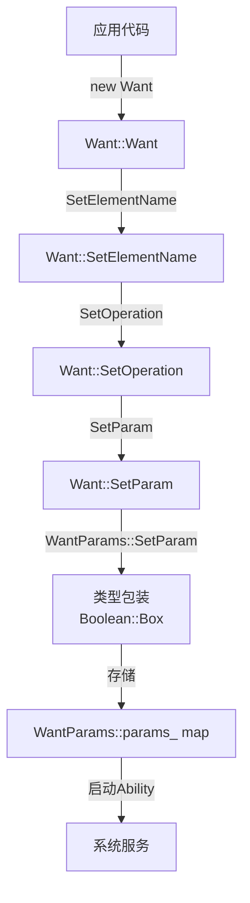
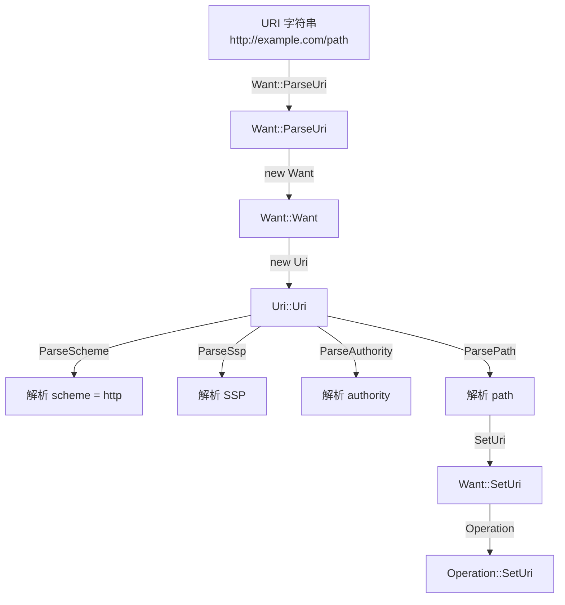
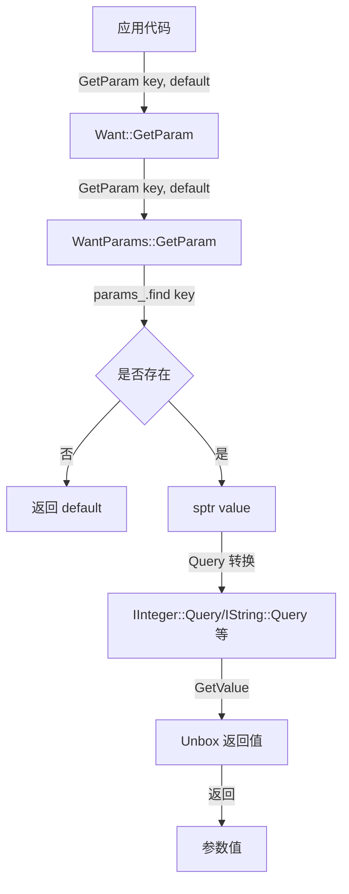
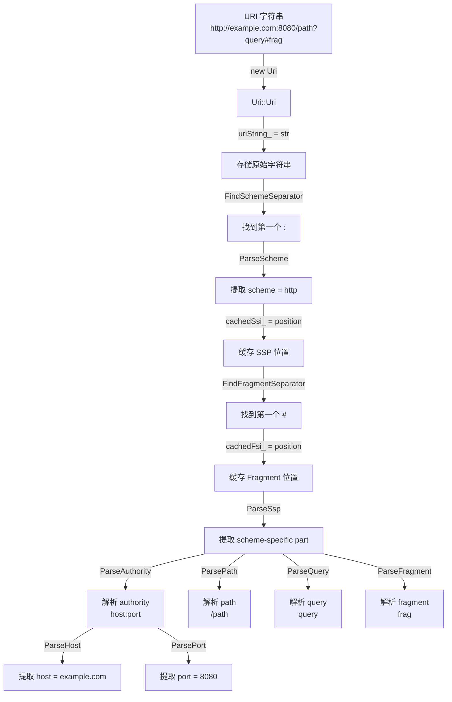
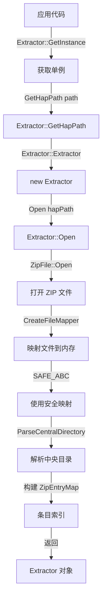
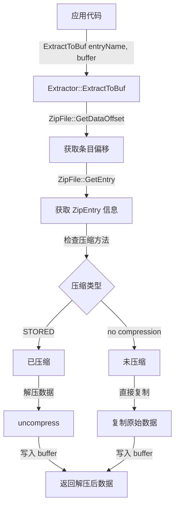
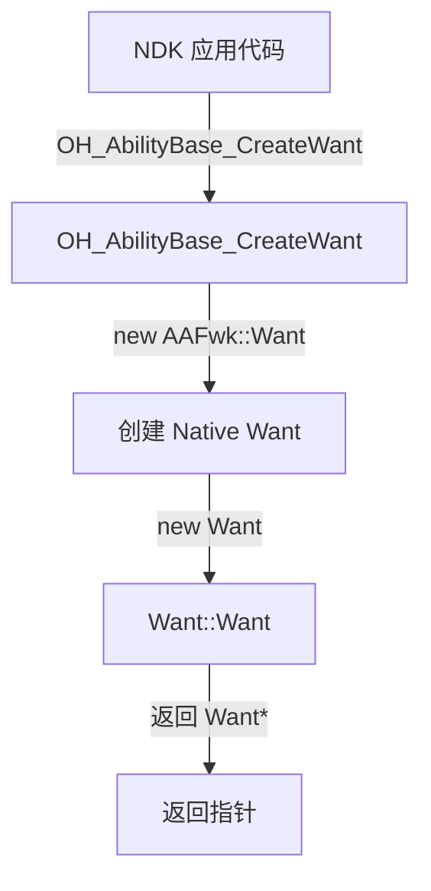
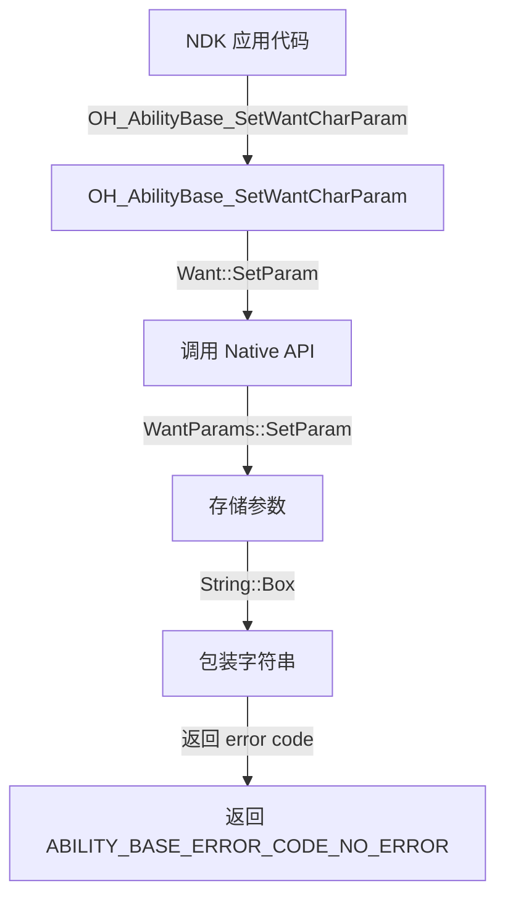

# 关键调用链

## 目的

本文档记录 ability_base 组件中的关键调用链，展示从入口到核心逻辑的执行路径，帮助开发者理解代码执行流程。

**注意**：本文档基于代码分析，实际执行路径可能因调用场景和运行时环境而异。

---

## 1. Want 创建与参数设置

### 1.1 显式启动 Want 创建



**证据位置**：
- Want 构造：`interfaces/kits/native/want/src/want.cpp`
- SetParam：`interfaces/kits/native/want/include/want.h:460`
- WantParams::SetParam：`interfaces/kits/native/want/include/want_params.h`

**代码路径**：
1. `Want::Want()` - 默认构造（`want.cpp:构造函数`）
2. `Want::SetElementName(bundleName, abilityName)` - 设置组件标识（`want.cpp:176`）
3. `Want::SetParam(key, value)` - 设置参数（`want.cpp:460`）
4. `WantParams::SetParam(key, value)` - 存储到 map（`want_params.cpp:SetParam`）
5. `Boolean::Box(value)` - 包装值（`bool_wrapper.cpp`）

### 1.2 URI 解析创建 Want



**证据位置**：
- ParseUri：`interfaces/kits/native/want/include/want.h:216`
- Uri 构造：`interfaces/kits/native/uri/src/uri.cpp`

**代码路径**：
1. `Want::ParseUri(uriString)` - 静态工厂方法（`want.cpp:216`）
2. `Want::Want()` - 构造 Want（`want.cpp:构造函数`）
3. `Uri::Uri(uriString)` - 构造并解析 URI（`uri.cpp:构造函数`）
4. `Uri::ParseScheme()` - 解析 scheme（`uri.cpp:解析方法`）
5. `Uri::ParseSsp()` - 解析 scheme-specific part（`uri.cpp:解析方法`）
6. `Want::SetUri(uri)` - 设置 URI（`want.cpp:243`）

---

## 2. Want IPC 序列化

### 2.1 Marshalling 序列化流程

```mermaid
graph TD
    A[Want 对象] -->|Marshalling| B[Want::Marshalling]
    B -->|WriteElement| C[WriteElementName]
    C -->|ElementName::Marshalling| D[写入 deviceId<br/>bundleName<br/>abilityName<br/>moduleName]
    B -->|WriteUri| E[Uri::Marshalling]
    E -->|写入 uriString_
    B -->|WriteParameters| F[WantParams::Marshalling]
    F -->|遍历 params_ map| G[每个 key-value]
    G -->|WriteInt32| H[写入类型 ID]
    G -->|写入序列化数据| I[IInterface::WriteToParcel]
    I -->|返回| J[Parcel 对象<br/>用于 Binder IPC]
```

**证据位置**：
- Want::Marshalling：`interfaces/kits/native/want/include/want.h:794`
- WantParams::Marshalling：`interfaces/kits/native/want/src/want_params.cpp:Marshalling`
- ElementName::Marshalling：`interfaces/kits/native/want/src/element_name.cpp`

**代码路径**：
1. `Want::Marshalling(parcel)` - 主序列化入口（`want.cpp:794`）
2. `Want::WriteElement(parcel)` - 写入 ElementName（`want.cpp:963`）
3. `ElementName::Marshalling(parcel)` - 序列化组件标识（`element_name.cpp`）
4. `Want::WriteUri(parcel)` - 写入 URI（`want.cpp:961`）
5. `Uri::Marshalling(parcel)` - 序列化 URI（`uri.cpp:55`）
6. `Want::WriteParameters(parcel)` - 写入参数（`want.cpp:964`）
7. `WantParams::Marshalling(parcel)` - 序列化参数 map（`want_params.cpp:Marshalling`）
8. `IInterface::WriteToParcel(parcel)` - 序列化接口值（`base_interfaces.h`）

### 2.2 Unmarshalling 反序列化流程

```mermaid
graph TD
    A[Parcel 对象<br/>Binder IPC] -->|Unmarshalling| B[Want::Unmarshalling]
    B -->|new Want| C[Want::Want]
    C -->|ReadElement| D[ReadElementName]
    D -->|ElementName::Unmarshalling| E[读取 deviceId<br/>bundleName<br/>abilityName<br/>moduleName]
    B -->|ReadUri| F[Uri::Unmarshalling]
    F -->|读取 uriString_
    F -->|new Uri| G[Uri::Uri]
    B -->|ReadParameters| H[WantParams::Unmarshalling]
    H -->|ReadInt32| I[读取参数数量]
    I -->|循环读取| J[每个参数]
    J -->|ReadInt32| K[读取类型 ID]
    K -->|创建对应包装器| L[new Boolean/new Integer 等]
    L -->|ReadFromParcel| M[反序列化值]
    M -->|存储| N[params_[key] = sptr<IInterface>]
    N -->|返回| O[完整 Want 对象]
```

**证据位置**：
- Want::Unmarshalling：`interfaces/kits/native/want/include/want.h:802`
- WantParams::Unmarshalling：`interfaces/kits/native/want/src/want_params.cpp:Unmarshalling`

**代码路径**：
1. `Want::Unmarshalling(parcel)` - 静态工厂方法（`want.cpp:802`）
2. `Want::Want()` - 构造 Want（`want.cpp:构造函数`）
3. `Want::ReadElement(parcel)` - 读取 ElementName（`want.cpp:965-967`）
4. `ElementName::Unmarshalling(parcel)` - 反序列化（`element_name.cpp`）
5. `Want::ReadUri(parcel)` - 读取 URI（`want.cpp:966`）
6. `Uri::Unmarshalling(parcel)` - 静态工厂（`uri.cpp:62`）
7. `Want::ReadParameters(parcel)` - 读取参数（`want.cpp:968`）
8. `WantParams::Unmarshalling(parcel)` - 反序列化参数（`want_params.cpp:Unmarshalling`）

---

## 3. WantParams 参数操作

### 3.1 设置参数

```mermaid
graph TD
    A[应用代码] -->|SetParam key, value| B[Want::SetParam]
    B -->|SetParam key, value| C[WantParams::SetParam]
    C -->|判断类型| D{类型推断}
    D -->|bool| E[Boolean::Box]
    D -->|int| F[Integer::Box]
    D -->|long| G[Long::Box]
    D -->|string| H[String::Box]
    D -->|RemoteObject| I[RemoteObjectWrap::Box]
    E -->|sptr<IInterface>| J[包装后对象]
    F -->|sptr<IInterface>| J
    G -->|sptr<IInterface>| J
    H -->|sptr<IInterface>| J
    I -->|sptr<IInterface>| J
    J -->|params_[key] = value| K[params_ map]
```

**证据位置**：
- Want::SetParam：`interfaces/kits/native/want/include/want.h:460`
- WantParams::SetParam：`interfaces/kits/native/want/include/want_params.h`

**代码路径**：
1. `Want::SetParam(key, value)` - 模板方法（`want.cpp:460, 468, 482, ...`）
2. `WantParams::SetParam(key, value)` - 存储方法（`want_params.cpp`）
3. `Boolean::Box(value)` - 包装 bool（`bool_wrapper.cpp`）
4. `Integer::Box(value)` - 包装 int（`int_wrapper.cpp`）
5. `String::Box(value)` - 包装 string（`string_wrapper.cpp`）
6. `RemoteObjectWrap::Box(remoteObject)` - 包装远程对象（`remote_object_wrapper.cpp`）

### 3.2 获取参数



**证据位置**：
- Want::GetParam：`interfaces/kits/native/want/include/want.h:427, 477, 543, ...`
- WantParams::GetParam：`interfaces/kits/native/want/include/want_params.h`

**代码路径**：
1. `Want::GetParam(key, defaultValue)` - 模板方法（`want.cpp:427, 477, 543, ...`）
2. `WantParams::GetParam(key, defaultValue)` - 获取方法（`want_params.cpp`）
3. `params_.find(key)` - map 查找（`want_params.cpp`）
4. `IInteger::Query(object)` - 类型查询（`base_interfaces.h:Query`）
5. `IInteger::GetValue(value)` - 获取值（`int_wrapper.cpp:GetValue`）

---

## 4. Configuration 配置操作

### 4.1 获取配置

```mermaid
graph TD
    A[应用代码] -->|GetItem key| B[Configuration::GetItem]
    B -->|lock_guard| C[加锁 configParameterMutex_]
    C -->|MakeTheKey| D[生成 "displayId#key"]
    D -->|configParameter_.find| E{是否存在}
    E -->|否| F[返回 ""]
    E -->|是| G[返回 value]
    G -->|解锁| H[mutex 自动释放]
```

**证据位置**：
- Configuration::GetItem：`interfaces/kits/native/configuration/include/configuration.h:149`
- Mutex：`interfaces/kits/native/configuration/include/configuration.h:234`

**代码路径**：
1. `Configuration::GetItem(key)` - 获取配置（`configuration.cpp:GetItem`）
2. `std::lock_guard<std::recursive_mutex> lock(configParameterMutex_)` - 加锁（`configuration.cpp`）
3. `MakeTheKey(getKey, defaultDisplayId_, param)` - 生成键（`configuration.cpp`）
4. `configParameter_.find(getKey)` - map 查找（`configuration.cpp`）
5. `return value` - 返回配置值（`configuration.cpp`）

### 4.2 设置配置

```mermaid
graph TD
    A[系统服务] -->|AddItem displayId, key, value| B[Configuration::AddItem]
    B -->|lock_guard| C[加锁 configParameterMutex_]
    C -->|MakeTheKey| D[生成 "displayId#key"]
    D -->|configParameter_[key] = value| E[存储配置]
    E -->|解锁| F[mutex 自动释放]
```

**证据位置**：
- Configuration::AddItem：`interfaces/kits/native/configuration/include/configuration.h:107`

**代码路径**：
1. `Configuration::AddItem(displayId, key, value)` - 设置配置（`configuration.cpp:AddItem`）
2. `std::lock_guard<std::recursive_mutex> lock(configParameterMutex_)` - 加锁（`configuration.cpp`）
3. `MakeTheKey(getKey, displayId, param)` - 生成键（`configuration.cpp`）
4. `configParameter_[getKey] = value` - 存储配置（`configuration.cpp`）

---

## 5. URI 解析流程

### 5.1 URI 解析详细流程



**证据位置**：
- Uri 构造：`interfaces/kits/native/uri/src/uri.cpp:26`
- 解析方法：`interfaces/kits/native/uri/include/uri.h:164-200`

**代码路径**：
1. `Uri::Uri(uriString)` - 构造并触发解析（`uri.cpp:26`）
2. `FindSchemeSeparator()` - 查找 scheme 分隔符（`uri.cpp:82`）
3. `ParseScheme()` - 解析 scheme（`uri.cpp:166`）
4. `FindFragmentSeparator()` - 查找 fragment 分隔符（`uri.cpp:89`）
5. `ParseSsp()` - 解析 scheme-specific part（`uri.cpp:167`）
6. `ParseAuthority()` - 解析 authority（`uri.cpp:168`）
7. `ParseHost()` - 解析 host（`uri.cpp:169`）
8. `ParsePort()` - 解析 port（`uri.cpp:170`）
9. `ParsePath()` - 解析 path（`uri.cpp:171`）
10. `ParseQuery()` - 解析 query（`uri.cpp:174`）
11. `ParseFragment()` - 解析 fragment（`uri.cpp:175`）

---

## 6. Extractor ZIP 解压流程

### 6.1 打开 ZIP 文件



**证据位置**：
- Extractor::GetInstance：`interfaces/kits/native/extractortool/include/extractor.h:114-123`
- ZipFile::Open：`interfaces/kits/native/extractortool/include/zip_file.h:Open`

**代码路径**：
1. `ExtractorUtil::GetInstance()` - 获取单例（`extractor.cpp:GetInstance`）
2. `Extractor::GetHapPath(path)` - 获取 HAP 路径（`extractor.cpp:GetHapPath`）
3. `Extractor::Extractor()` - 构造（`extractor.cpp:构造函数`）
4. `Extractor::Open()` - 打开 ZIP（`extractor.cpp:Open`）
5. `ZipFile::Open(filePath)` - 打开 ZIP 文件（`zip_file.cpp:Open`）
6. `FileMapper::CreateFileMapper(SAFE_ABC)` - 安全映射（`file_mapper.cpp`）
7. `ZipFile::ParseCentralDirectory()` - 解析目录（`zip_file.cpp`）

### 6.2 提取条目



**证据位置**：
- Extractor::ExtractToBuf：`interfaces/kits/native/extractortool/include/extractor.h:ExtractToBuf`
- ZipFile::GetDataOffset：`interfaces/kits/native/extractortool/src/zip_file.cpp`

**代码路径**：
1. `Extractor::ExtractToBuf(entryName, buffer)` - 提取条目（`extractor.cpp:ExtractToBuf`）
2. `ZipFile::GetDataOffset(entryName)` - 获取偏移（`zip_file.cpp:GetDataOffset`）
3. `ZipFile::GetEntry(entryName)` - 获取条目（`zip_file.cpp:GetEntry`）
4. 检查 `ZipEntry.method` - 压缩方法（`zip_file.cpp`）
5. `uncompress()` - 解压数据（`zip_file.cpp:uncompress`）
6. `memcpy()` - 复制数据（`zip_file.cpp`）

---

## 7. C NDK API 调用链

### 7.1 C API 创建 Want



**证据位置**：
- OH_AbilityBase_CreateWant：`interfaces/kits/c/cwant/src/want.cpp:CreateWant`
- Want 构造：`interfaces/kits/native/want/src/want.cpp`

**代码路径**：
1. `OH_AbilityBase_CreateWant(element)` - C API 入口（`cwant/src/want.cpp`）
2. `AAFwk::Want* want = new AAFwk::Want()` - 创建 Native Want（`cwant/src/want.cpp`）
3. `Want::Want()` - 调用 C++ 构造（`want.cpp:构造函数`）
4. `return want` - 返回指针（`cwant/src/want.cpp`）

### 7.2 C API 设置参数



**证据位置**：
- OH_AbilityBase_SetWantCharParam：`interfaces/kits/c/cwant/src/want.cpp:SetWantCharParam`
- Want::SetParam：`interfaces/kits/native/want/include/want.h:724`

**代码路径**：
1. `OH_AbilityBase_SetWantCharParam(want, key, value)` - C API 入口（`cwant/src/want.cpp`）
2. `want->SetParam(key, value)` - 调用 Native 方法（`cwant/src/want.cpp`）
3. `WantParams::SetParam(key, value)` - 存储参数（`want_params.cpp`）
4. `String::Box(value)` - 包装字符串（`string_wrapper.cpp`）
5. `return ABILITY_BASE_ERROR_CODE_NO_ERROR` - 返回成功（`cwant/src/want.cpp`）

---

## 8. 调用链总结

### 8.1 关键路径汇总

| 调用链 | 入口 | 核心逻辑 | 证据位置 |
|--------|------|----------|----------|
| **Want 创建** | `Want::Want()` | 构造默认 Want | `want.cpp:构造函数` |
| **Want IPC 序列化** | `Want::Marshalling()` | WriteElement/Uri/Parameters | `want.cpp:794` |
| **Want IPC 反序列化** | `Want::Unmarshalling()` | ReadElement/Uri/Parameters | `want.cpp:802` |
| **WantParams 设置** | `WantParams::SetParam()` | 类型包装 + map 存储 | `want_params.cpp:SetParam` |
| **WantParams 获取** | `WantParams::GetParam()` | map 查找 + Unbox | `want_params.cpp:GetParam` |
| **Configuration 获取** | `Configuration::GetItem()` | Mutex + map 查找 | `configuration.cpp:GetItem` |
| **Configuration 设置** | `Configuration::AddItem()` | Mutex + map 存储 | `configuration.cpp:AddItem` |
| **URI 解析** | `Uri::Uri()` | Scheme/Authority/Path 解析 | `uri.cpp:26` |
| **ZIP 打开** | `Extractor::Open()` | FileMapper + ZipFile::Open | `extractor.cpp:Open` |
| **ZIP 提取** | `Extractor::ExtractToBuf()` | GetDataOffset + 解压 | `extractor.cpp:ExtractToBuf` |
| **C API 创建 Want** | `OH_AbilityBase_CreateWant()` | new AAFwk::Want | `cwant/src/want.cpp:CreateWant` |

### 8.2 跨层调用

```
NDK C API (OH_AbilityBase_*)
    ↓
Native C++ API (Want::*, Configuration::* 等）
    ↓
Inner API (IInterface::*, Object::* 等）
    ↓
IPC Layer (Parcelable::Marshalling/Unmarshalling)
    ↓
System Services (ability_runtime 等)
```

---

## 相关跳转

- 🏗️ **架构设计**：[02_Architecture.md](02_Architecture.md)
- 🔌 **Native API**：[03_Native_CPP_API.md](03_Native_CPP_API.md)
- 🔧 **C NDK API**：[04_C_NDK_API.md](04_C_NDK_API.md)
- ⚙️ **GN 构建**：[05_GN_Build.md](05_GN_Build.md)

---

**返回导航**：[SUMMARY.md](SUMMARY.md)
