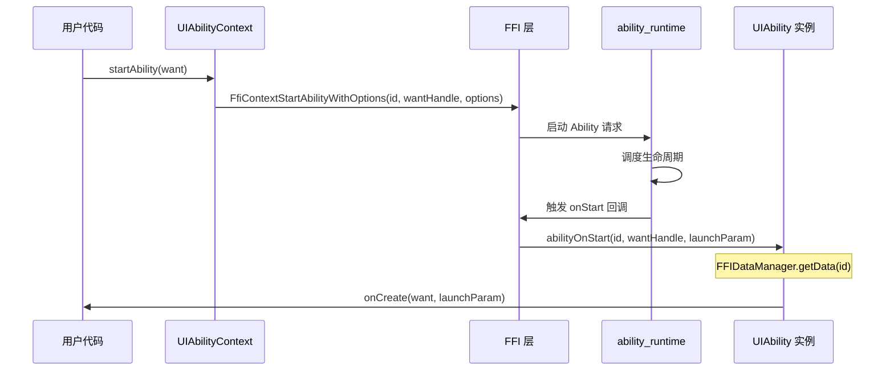
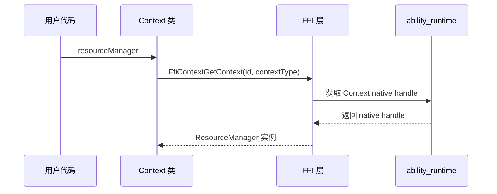
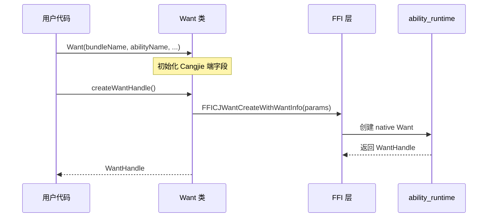
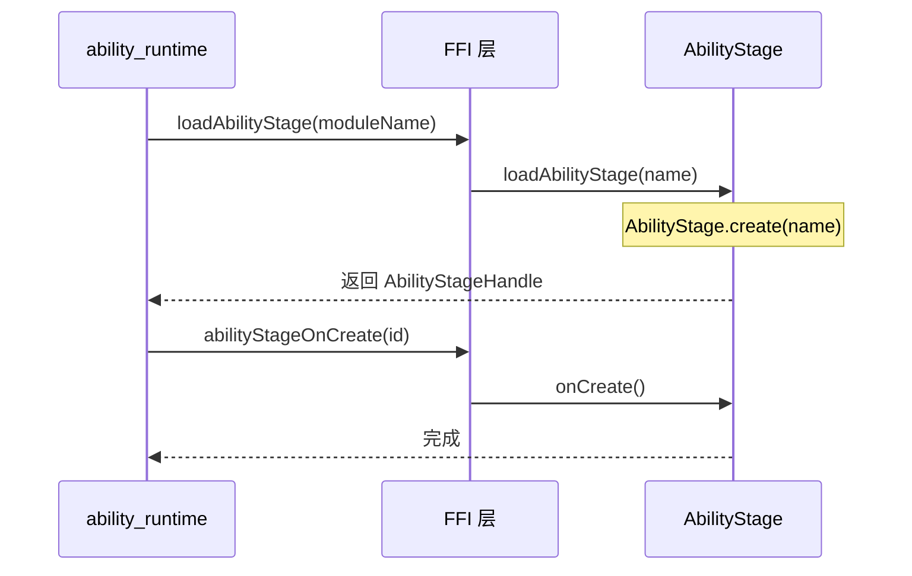
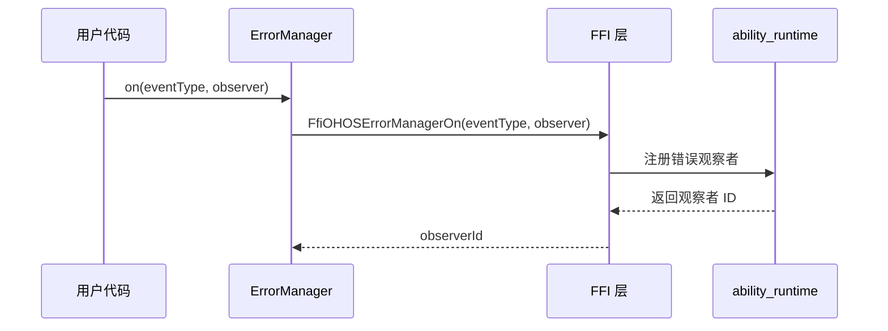
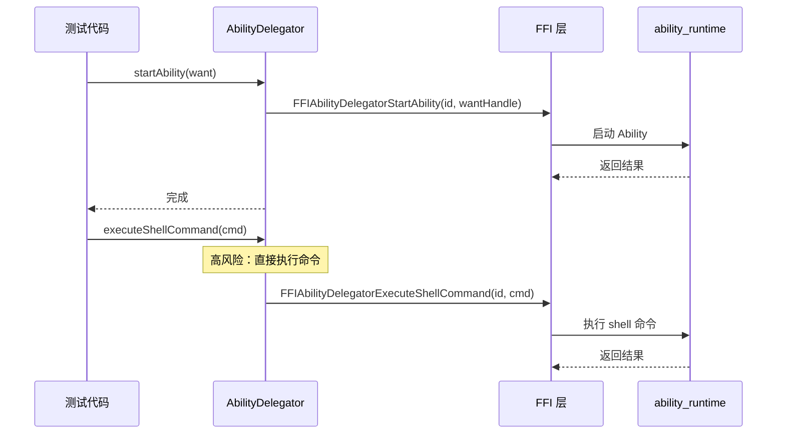
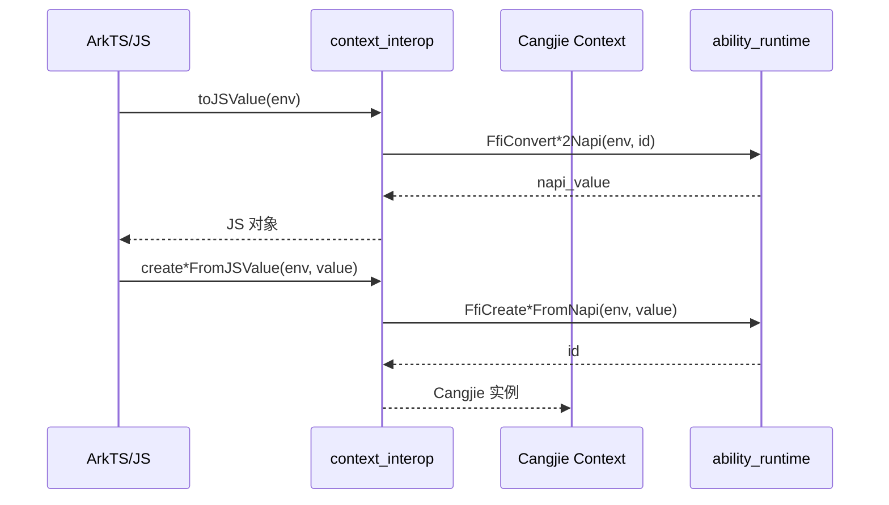

# 关键调用链

## 概述

本文档展示 ability_cangjie_wrapper 中关键操作的调用链图示。

---

## UIAbility 启动流程



**关键代码路径**：
1. `ui_ability_context.cj:72-81` - startAbility 实现
2. `ui_ability.cj:117-138` - abilityOnStart 回调
3. `ui_ability.cj:581` - onCreate 虚方法

---

## UIAbility 上下文获取



**关键代码路径**：
1. `context.cj:90-100` - resourceManager 属性实现
2. `ui_ability.cj:725` - abilityInit 调用

---

## Want 对象创建



**关键代码路径**：
1. `want.cj:264-293` - 构造函数
2. `want.cj:339-364` - createWantHandle 实现

---

## AbilityStage 生命周期



**关键代码路径**：
1. `ability_stage.cj:63-73` - loadAbilityStage 实现
2. `ability_stage.cj:81-86` - onCreate 回调

---

## 错误观测注册



**关键代码路径**：
1. `error_manager.cj:86-104` - on 方法实现

---

## 测试框架操作



**关键代码路径**：
1. `ability_delegator_registry.cj:421-427` - startAbility
2. `ability_delegator_registry.cj:441-449` - executeShellCommand（高风险）

---

## Context 类型转换（N-API 互操作）



**关键代码路径**：
1. `context_interop.cj:58-66` - toJSValue 实现
2. `context_interop.cj:81-140` - create*FromJSValue 实现

---

## 模块依赖调用链

```
┌─────────────────────────────────────────────────────────────────────────┐
│                         模块依赖调用链                                      │
├─────────────────────────────────────────────────────────────────────────┤
│                                                                          │
│  kit.AbilityKit                                                         │
│       │                                                                 │
│       ├──▶ ohos.app.ability.ui_ability                                  │
│       │       │                                                         │
│       │       ├──▶ ohos.app.ability (BaseContext)                       │
│       │       │         │                                               │
│       │       │         └──▶ ohos.ffi (cangjie_ark_interop)             │
│       │       │                                                           │
│       │       ├──▶ ohos.app.ability.want                                │
│       │       │         │                                                 │
│       │       │         ├──▶ ohos.bundle.bundle_manager                  │
│       │       │         └──▶ ohos.encoding.json                          │
│       │       │                                                           │
│       │       ├──▶ ohos.app.ability.ability_stage                       │
│       │       │         │                                                 │
│       │       │         └──▶ ability_runtime:appkit_native               │
│       │       │                                                           │
│       │       └──▶ ability_runtime:cj_*_ffi (外部 FFI)                  │
│       │                                                                 │
│       └──▶ ohos.app.ability.error_manager                               │
│                 │                                                       │
│                 └──▶ ability_runtime:cj_errormanager_ffi                │
│                                                                          │
└─────────────────────────────────────────────────────────────────────────┘
```
