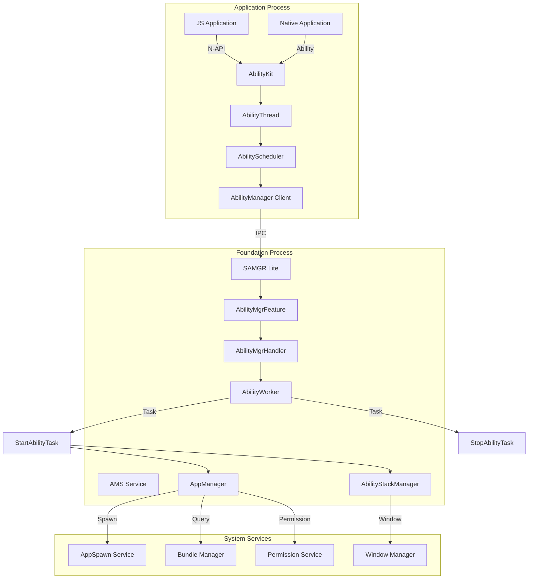
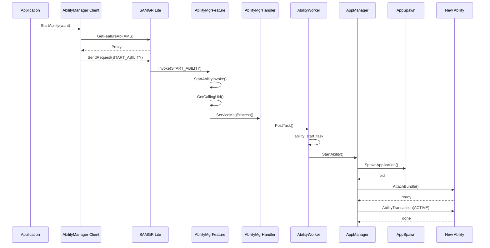
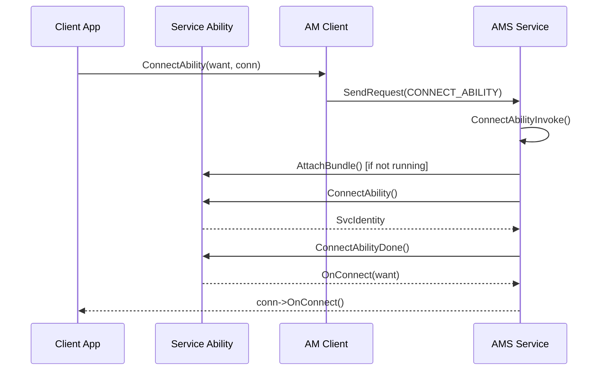
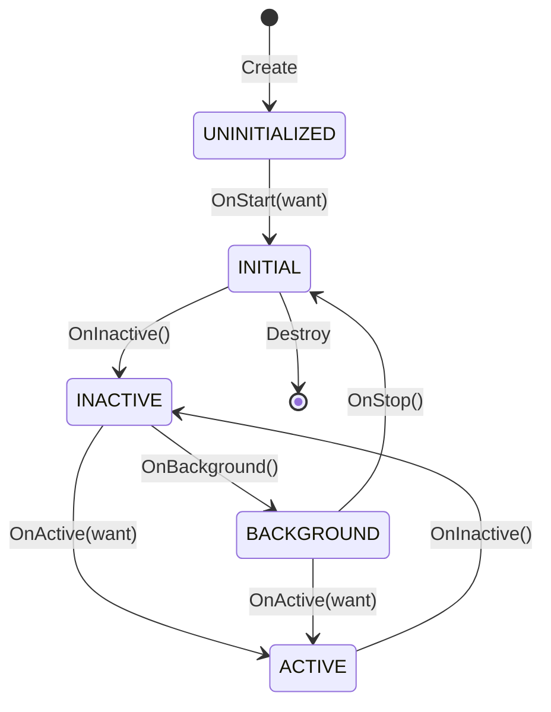
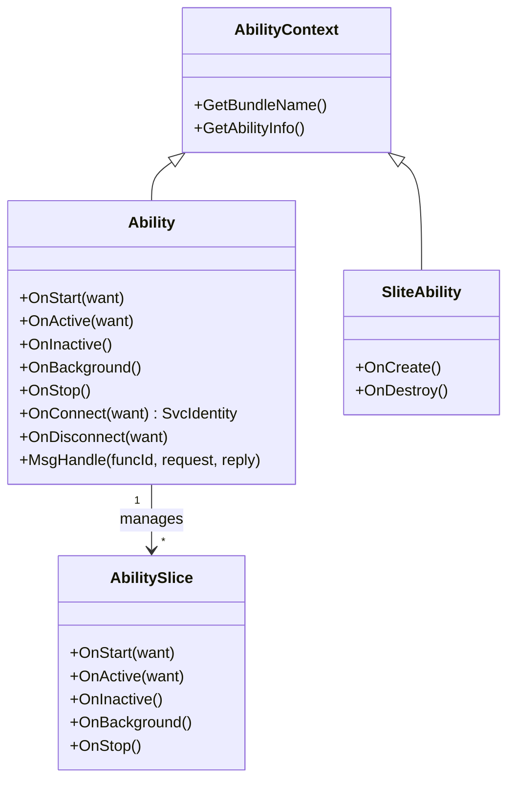
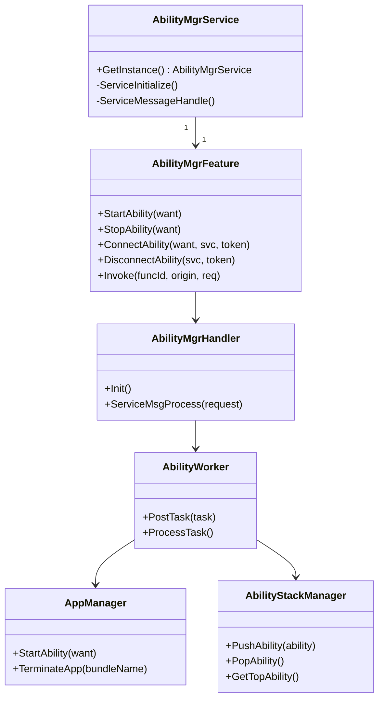

# 架构说明

## 目的

本文档描述 ability_lite 的架构设计，包括组件关系、数据流、线程模型和关键时序。

## 适用范围

- 系统架构师
- 需要理解内部实现的开发者

## 组件架构图



## 数据流图

### Ability 启动流程



### Service Ability 连接流程



## 线程模型

### Application Process 线程

```
┌─────────────────────────────────────────┐
│         Application Process             │
│                                         │
│  ┌─────────────────────────────────┐    │
│  │      AbilityThread (Main)       │    │
│  │  - Looper/Handler message loop  │    │
│  │  - IPC message handling         │    │
│  │  - Lifecycle callback dispatch  │    │
│  └─────────────────────────────────┘    │
│                                         │
│  ┌─────────────────────────────────┐    │
│  │    AbilityScheduler (Handler)   │    │
│  │  - Receives AMS commands        │    │
│  │  - Dispatches to Ability        │    │
│  └─────────────────────────────────┘    │
│                                         │
└─────────────────────────────────────────┘
```

### Foundation Process 线程

```
┌─────────────────────────────────────────┐
│        Foundation Process               │
│                                         │
│  ┌─────────────────────────────────┐    │
│  │   SAMGR Lite (Service Thread)   │    │
│  │  - Service registration         │    │
│  │  - Feature API routing          │    │
│  │  - IPC request dispatch         │    │
│  └─────────────────────────────────┘    │
│                                         │
│  ┌─────────────────────────────────┐    │
│  │   AMS Task (Single Thread)      │    │
│  │  TaskConfig:                    │    │
│  │  - LEVEL_HIGH                   │    │
│  │  - PRI_NORMAL                   │    │
│  │  - Stack: AMS_TASK_STACK_SIZE   │    │
│  │  - Queue: 20 messages           │    │
│  │  - SINGLE_TASK mode             │    │
│  └─────────────────────────────────┘    │
│                                         │
│  ┌─────────────────────────────────┐    │
│  │   AbilityWorker (Task Queue)    │    │
│  │  - Sequential task execution    │    │
│  │  - Lifecycle task scheduling    │    │
│  └─────────────────────────────────┘    │
│                                         │
└─────────────────────────────────────────┘
```

**AMS 任务配置** (`services/abilitymgr_lite/src/ability_mgr_service.cpp:82`):
```cpp
TaskConfig config = {
    LEVEL_HIGH,              // 高优先级
    PRI_NORMAL,              // 普通优先级
    AMS_TASK_STACK_SIZE,     // 可配置栈大小
    QUEUE_SIZE,              // 20 消息队列
    SINGLE_TASK              // 单线程模式
};
```

## 关键时序

### Page Ability 生命周期



**状态转换时序**:

```
时间 →

应用调用:
├─ StartAbility(want)
│   └─ AMS 处理
│       ├─ 创建 AppRecord (如需要)
│       ├─ 启动进程 (如需要)
│       ├─ AttachBundle
│       └─ 调度生命周期
│
Ability 回调:
├─ OnStart(want)        ← INITIAL 状态
├─ OnInactive()         ← INACTIVE 状态
├─ OnActive(want)       ← ACTIVE 状态 (前台)
├─ OnInactive()         ← INACTIVE 状态
├─ OnBackground()       ← BACKGROUND 状态
└─ OnStop()             ← INITIAL 状态
```

### Service Ability 生命周期

```
时间 →

连接阶段:
├─ ConnectAbility(want, conn)
│   └─ AMS 处理
│       ├─ 启动 Service (如需要)
│       ├─ Service->OnConnect(want)
│       └─ conn->OnConnect(SvcIdentity)
│
通信阶段:
├─ Client 通过 SvcIdentity 发送消息
├─ Service->MsgHandle(funcId, request, reply)
└─ Client 接收响应
│
断开阶段:
├─ DisconnectAbility(conn)
│   └─ AMS 处理
│       ├─ Service->OnDisconnect(want)
│       └─ conn->OnDisconnect()
```

## 核心类关系

### Ability 类层次



### AMS 服务类关系



## IPC 机制

### SAMGR Lite IPC

ability_lite 使用 SAMGR (System Ability Manager) Lite 框架进行 IPC：

```
┌─────────────┐      ┌─────────────┐      ┌─────────────┐
│   Client    │ ──▶  │   SAMGR     │ ──▶  │   Service   │
│             │      │             │      │             │
│ GetFeatureApi      │ Route to    │      │ Feature API │
│ SendRequest        │ Feature     │      │ Invoke()    │
└─────────────┘      └─────────────┘      └─────────────┘
```

**关键接口** (`interfaces/inner_api/abilitymgr_lite/ability_service_interface.h`):

```cpp
// 服务名和 Feature 名
const char AMS_SERVICE[] = "abilityms";
const char AMS_FEATURE[] = "AmsFeature";

// 命令枚举
enum AmsCommand {
    START_ABILITY = 0,
    TERMINATE_ABILITY,
    ATTACH_BUNDLE,
    CONNECT_ABILITY,
    DISCONNECT_ABILITY,
    STOP_ABILITY,
    // ...
};

// 服务接口
struct AmsInterface {
    INHERIT_SERVER_IPROXY;
    int32 (*StartAbility)(const Want *want);
    int32 (*TerminateAbility)(uint64_t token);
    int32 (*ConnectAbility)(const Want *want, SvcIdentity *svc, uint64_t token);
    int32 (*DisconnectAbility)(SvcIdentity *svc, uint64_t token);
    int32 (*StopAbility)(const Want *want);
};
```

### IPC 数据序列化

使用 `IpcIo` 进行数据序列化：

```cpp
// 发送请求
IpcIo io;
char ipcData[MAX_IO_SIZE];
IpcIoInit(&io, ipcData, MAX_IO_SIZE, 0);
WriteInt32(&io, command);
WriteString(&io, bundleName);
// ...
SendRequest(svc, command, &io, &reply, option, NULL);

// 接收请求
IpcIo *req = ...;
int32 command = ReadInt32(req);
const char *bundleName = ReadString(req);
```

## 信任边界

```
┌─────────────────────────────────────────────────────────┐
│  Trust Zone: System (Foundation Process)                │
│  - AMS Service                                          │
│  - SAMGR                                                │
│  - AppSpawn                                             │
│  高权限，可创建进程、管理权限                            │
└─────────────────────────────────────────────────────────┘
                           │ IPC (受控)
                           ▼
┌─────────────────────────────────────────────────────────┐
│  Trust Zone: Application                                │
│  - AbilityKit                                           │
│  - Application Code                                     │
│  沙箱环境，受限权限                                      │
└─────────────────────────────────────────────────────────┘
```

**边界检查点**:
1. `GetCallingUid()` - 验证调用者身份 (`ability_mgr_feature.cpp:149`)
2. `GetCallingPid()` - 验证进程身份 (`ability_mgr_feature.cpp:322`)
3. `LoadPermissions()` - 加载应用权限 (`app_record.cpp:60`)

## 相关链接

- [项目概览](00_Overview.md)
- [目录结构](01_Directory_Structure.md)
- [内部 API](05_Inner_API.md)
- [安全评估](08_Security_Assessment.md)
