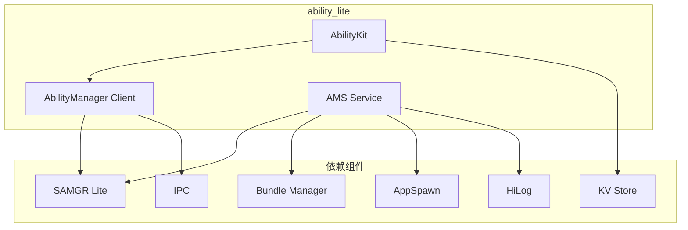

# 内部 API

## 目的

本文档描述 ability_lite 内部 API，供其他子系统（如分布式调度、包管理）调用。

## 适用范围

- 系统服务开发者
- 需要与 AMS 交互的子系统

## AMS 服务接口

### 服务标识

**头文件**: `interfaces/inner_api/abilitymgr_lite/ability_service_interface.h:33-36`

```cpp
const char AMS_SERVICE[] = "abilityms";
const char AMS_FEATURE[] = "AmsFeature";
const char AMS_SLITE_FEATURE[] = "AmsSliteFeature";
const char AMS_INNER_FEATURE[] = "AmsInnerFeature";
```

### 命令枚举

**代码位置**: `interfaces/inner_api/abilitymgr_lite/ability_service_interface.h:44-64`

```cpp
enum AmsCommand {
    START_ABILITY = 0,              // 启动 Ability
    TERMINATE_ABILITY,              // 终止 Ability
    ATTACH_BUNDLE,                  // 附加 Bundle
    CONNECT_ABILITY,                // 连接 Service Ability
    CONNECT_ABILITY_DONE,           // 连接完成
    DISCONNECT_ABILITY,             // 断开连接
    DISCONNECT_ABILITY_DONE,        // 断开完成
    ABILITY_TRANSACTION_DONE,       // 生命周期事务完成
    TERMINATE_SERVICE,              // 终止 Service
    START_ABILITY_WITH_CB,          // 带回调的启动
    INNER_BEGIN,                    // 内部命令起始
    TERMINATE_APP = INNER_BEGIN,    // 终止应用
    DUMP_ABILITY,                   // Dump 信息
    TERMINATE_APP_BY_BUNDLENAME,    // 按包名终止
    ADD_ABILITY_RECORD_OBSERVER,    // 添加记录观察者
    REMOVE_ABILITY_RECORD_OBSERVER, // 移除记录观察者
    TERMINATE_MISSION,              // 终止 Mission
    TERMINATE_ALL,                  // 终止所有
    COMMAND_END,
};
```

### 服务接口结构

**非 LiteOS-M 系统** (`interfaces/inner_api/abilitymgr_lite/ability_service_interface.h:70-83`):

```cpp
struct AmsInterface {
    INHERIT_SERVER_IPROXY;
    int32 (*StartAbility)(const Want *want);
    int32 (*TerminateAbility)(uint64_t token);
    int32 (*ConnectAbility)(const Want *want, SvcIdentity *svc, uint64_t token);
    int32 (*DisconnectAbility)(SvcIdentity *svc, uint64_t token);
    int32 (*StopAbility)(const Want *want);
};

struct AmsInnerInterface {
    INHERIT_SERVER_IPROXY;
    int32 (*StartKeepAliveApps)();
    int32 (*TerminateApp)(const char *bundleName);
};
```

**LiteOS-M 系统** (`interfaces/inner_api/abilitymgr_lite/ability_service_interface.h:85-94`):

```cpp
struct AmsSliteInterface {
    INHERIT_IUNKNOWN;
    int32_t (*StartAbility)(const Want *want);
    int32_t (*TerminateAbility)(uint64_t token);
    int32_t (*SchedulerLifecycleDone)(uint64_t token, int state);
    int32_t (*ForceStopBundle)(uint64_t token);
    ElementName *(*GetTopAbility)();
    void *(*GetMissionInfos)(uint32_t maxNum);
};
```

## 模块依赖关系

### 依赖图



### 依赖组件说明

| 组件 | 路径 | 用途 |
|------|------|------|
| SAMGR Lite | `//foundation/systemabilitymgr/samgr_lite` | 服务管理框架 |
| Bundle Manager | `//foundation/bundlemanager/bundle_framework_lite` | 包信息管理 |
| AppSpawn | `//base/startup/appspawn/lite` | 进程创建 |
| IPC | `//foundation/communication/ipc` | 进程间通信 |
| HiLog | `//base/hiviewdfx/hilog_lite` | 日志服务 |
| KV Store | `//foundation/distributeddatamgr/kv_store` | 键值存储 |

## 稳定性与可替换点

### 稳定接口

以下接口较为稳定，可用于跨模块调用：

| 接口 | 稳定性 | 说明 |
|------|--------|------|
| `StartAbility()` | 高 | 标准启动接口 |
| `StopAbility()` | 高 | 标准停止接口 |
| `AmsCommand` 枚举 | 高 | 命令码定义 |

### 不稳定接口

以下接口可能随版本变化：

| 接口 | 稳定性 | 说明 |
|------|--------|------|
| `AmsInnerInterface` | 低 | 内部接口，可能变更 |
| `AmsSliteInterface` | 中 | LiteOS-M 专用 |
| 内部 Feature API | 低 | 实现细节 |

### 可替换点

| 组件 | 可替换性 | 替换方式 |
|------|----------|----------|
| SAMGR Lite | 低 | 需重写服务注册机制 |
| Bundle Manager | 中 | 实现相同接口即可 |
| AppSpawn | 低 | 进程创建机制绑定 |
| IPC | 低 | 重写 IPC 层 |

## 内部头文件

### 服务管理头文件

**目录**: `services/abilitymgr_lite/include/`

| 头文件 | 用途 | 稳定性 |
|--------|------|--------|
| `ability_mgr_service.h` | AMS 服务类 | 中 |
| `ability_mgr_feature.h` | Feature 实现 | 低 |
| `ability_mgr_handler.h` | 消息处理器 | 低 |
| `ability_worker.h` | 任务工作器 | 低 |
| `app_manager.h` | 应用管理 | 中 |
| `ability_stack_manager.h` | 栈管理 | 中 |

### LiteOS-M 专用头文件

**目录**: `interfaces/inner_api/abilitymgr_lite/slite/`

| 头文件 | 用途 |
|--------|------|
| `ability_manager_inner.h` | 内部管理函数 |
| `ability_record_observer.h` | 记录观察者 |
| `bms_helper.h` | Bundle 管理辅助 |
| `slite_ability_loader.h` | Ability 加载器 |

## 使用示例

### 获取 AMS 接口

```cpp
#include "ability_service_interface.h"
#include "samgr_lite.h"

// 获取 AMS Feature API
SamgrLite *samgr = SAMGR_GetInstance();
IUnknown *iUnknown = samgr->GetFeatureApi(AMS_SERVICE, AMS_FEATURE);
if (iUnknown == nullptr) {
    return ERR_INVALID;
}

// 转换为 AmsInterface
AmsInterface *ams = nullptr;
int result = iUnknown->QueryInterface(iUnknown, DEFAULT_VERSION, (void **)&ams);
if (result != 0 || ams == nullptr) {
    return ERR_INVALID;
}

// 调用接口
Want want;
// ... 设置 want ...
ams->StartAbility(&want);
```

### 注册 Ability 记录观察者

```cpp
#include "interfaces/inner_api/abilitymgr_lite/slite/ability_record_observer.h"

class MyObserver : public AbilityRecordObserver {
public:
    void OnAbilityRecordChange(const AbilityRecordStateData *data) override {
        // 处理状态变更
    }
};

// 注册观察者
MyObserver observer;
RegisterAbilityRecordObserver(&observer);
```

## 模块接口调用路径

### StartAbility 完整路径

```
调用者
    │
    ▼
SAMGR::GetFeatureApi(AMS_SERVICE, AMS_FEATURE)
    │
    ▼
AmsInterface::StartAbility(want)
    │
    ▼
AbilityMgrFeature::StartAbility() [static wrapper]
    │
    ▼
AbilityMgrFeature::StartAbilityInvoke() [IPC handler]
    │
    ▼
AbilityMgrFeature::StartAbilityInner()
    ├── GetCallingUid() - 获取调用者 UID
    ├── 权限检查
    │
    ▼
AbilityMgrHandler::ServiceMsgProcess()
    │
    ▼
AbilityWorker::PostTask()
    │
    ▼
AbilityStartTask::Execute()
    ├── AppManager::StartAbility()
    ├── AppSpawnClient::SpawnApplication() [如果需要]
    └── AbilityRecord::ActiveAbility()
```

## 相关链接

- [对外 Native API](03_Native_API.md)
- [N-API / JS API](04_NAPI_JS_API.md)
- [架构说明](02_Architecture.md)
- [GN 构建目标](06_GN_Targets.md)
