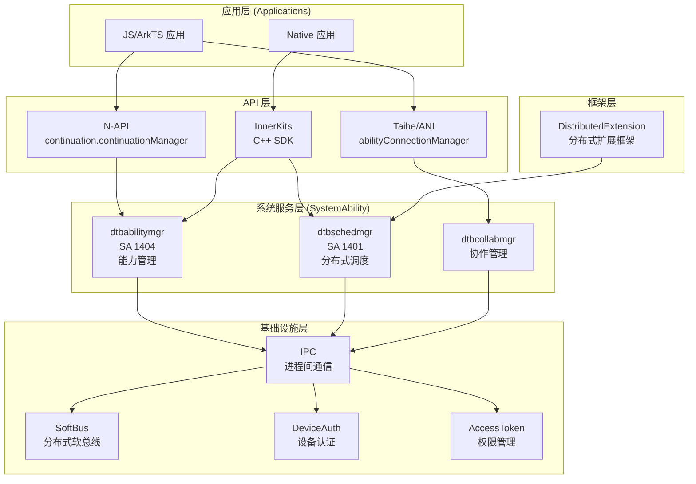
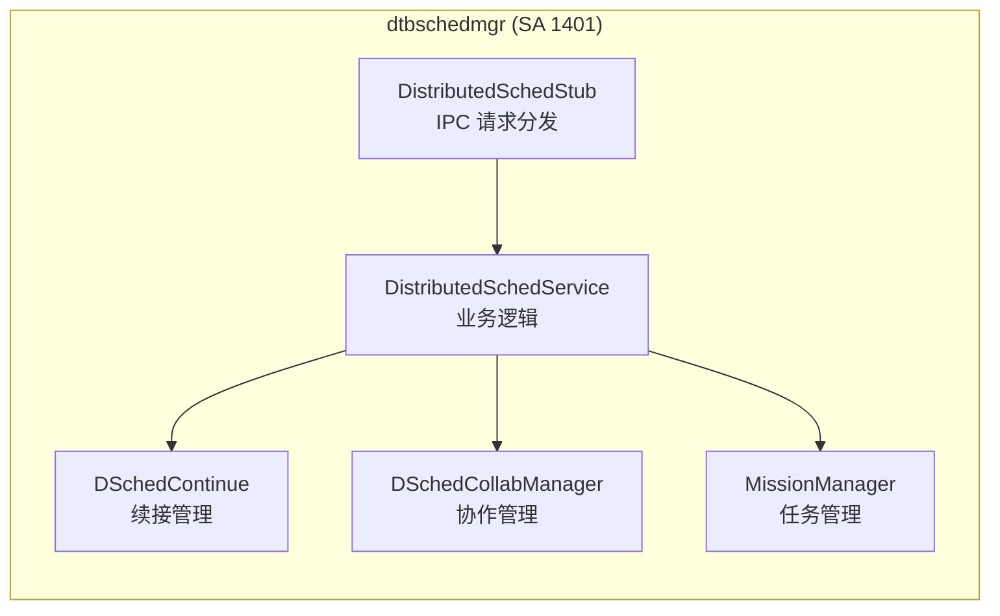

# 02_Architecture - 系统架构

## 架构图

### 总体架构



### 服务内部架构



---

## 数据流图

### 远程 Ability 启动流程

```
[调用端]                                [被调用端]
    │                                       │
    │  1. StartRemoteAbility()              │
    │ ─────────────────────────────────────>│
    │                                       │
    │     2. 权限检查 (VerifyAccessToken)   │
    │     3. 设备发现 (SoftBus)             │
    │     4. 序列化 Want/Operation          │
    │                                       │
    │  5. IPC 调用 (code=START_REMOTE_ABILITY)
    │     ─────────────────────────────────>│
    │                                       │
    │     6. 反序列化参数                   │
    │     7. 检查 Ability 有效性            │
    │     8. 启动本地 Ability               │
    │                                       │
    │  9. 返回结果                          │
    │ <─────────────────────────────────────│
    │                                       │
```

### Ability 续接流程

```
[源设备]                                [目标设备]
    │                                       │
    │  1. ContinueMission()                 │
    │ ─────────────────────────────────────>│
    │                                       │
    │     2. 保存源 Ability 状态            │
    │     3. 序列化 Mission 信息            │
    │     4. 通过 SoftBus 发送              │
    │                                       │
    │  5. 传输状态数据                      │
    │ ═════════════════════════════════════>│
    │                                       │
    │     6. 反序列化状态                   │
    │     7. 启动目标 Ability               │
    │     8. 恢复状态                       │
    │                                       │
    │  9. 续接完成通知                      │
    │ <─────────────────────────────────────│
    │                                       │
   10. 关闭源 Ability                      │
```

---

## 模块职责

### 1. dtbschedmgr (分布式调度服务)

**SystemAbility ID**: 1401  
**进程**: distributedsched  
**核心文件**: `services/dtbschedmgr/src/distributed_sched_service.cpp`

| 子模块 | 职责 | 关键文件 |
|-------|------|---------|
| **DistributedSchedService** | 主服务入口，处理 IPC 请求 | `distributed_sched_service.cpp:180` |
| **DSchedContinue** | Ability 续接逻辑 | `continue/dsched_continue.cpp` |
| **DSchedCollabManager** | 应用协作管理 | `dsched_collab_manager.cpp` |
| **MissionManager** | 分布式任务管理 | `mission/distributed_sched_mission_manager.cpp` |
| **SoftBusAdapter** | 软总线适配 | `softbus_adapter/softbus_adapter.cpp` |

### 2. dtbabilitymgr (能力管理服务)

**SystemAbility ID**: 1404  
**进程**: foundation  
**核心文件**: `services/dtbabilitymgr/src/distributed_ability_manager_service.cpp`

| 子模块 | 职责 | 关键文件 |
|-------|------|---------|
| **ContinuationManager** | 续接令牌管理 | `continuation_manager/` |
| **DeviceSelection** | 设备选择器 | `device_selection_notifier_*.cpp` |

### 3. dtbcollabmgr (协作管理服务)

**SystemAbility ID**: 无 (作为库被调用)  
**核心文件**: `services/dtbcollabmgr/src/ability_connection_manager/`

| 子模块 | 职责 | 关键文件 |
|-------|------|---------|
| **AbilityConnectionManager** | 连接会话管理 | `ability_connection_manager.cpp` |
| **ChannelManager** | 数据传输通道 | `channel_manager/channel_manager.cpp` |
| **AVStreamProvider** | 音视频流传输 | `av_trans_stream_provider/` |

---

## 线程模型

### dtbschedmgr 线程设计

```
主线程 (Main Thread)
    ├── IPC 消息处理 (OnRemoteRequest)
    ├── SystemAbility 生命周期
    └── 初始化/销毁

工作线程池 (Worker Threads)
    ├── 续接任务处理
    ├── 协作任务处理
    └── 异步回调执行

SoftBus 回调线程
    ├── OnDataRecv - 数据接收
    ├── OnConnect - 连接建立
    └── OnDisconnect - 连接断开

EventHandler 线程
    ├── 延时任务调度
    ├── 超时处理
    └── 状态机驱动
```

### 关键同步机制

| 机制 | 用途 | 位置 |
|-----|------|------|
| `std::mutex` | 保护共享数据 | 各 Manager 类 |
| `EventHandler` | 异步任务调度 | `dms_continue_send_manager.cpp:93` |
| `ffrt` | 任务队列 | 部分模块 |

---

## 关键时序

### 服务启动时序

```
1. Init 进程启动
   └── 读取 /system/etc/init/distributedsched.cfg
   
2. 启动 distributedsched 进程
   └── 加载 libdistributedschedsvr.z.so
   
3. SystemAbility 注册
   └── MakeAndRegisterAbility(DistributedSchedService)
   └── MakeAndRegisterAbility(DistributedAbilityManagerService)
   
4. 依赖服务检查
   └── 等待 SoftBus/BundleManager/AbilityRuntime 就绪
   
5. 注册 SoftBus 监听
   └── RegisterSoftbusEventListener
   
6. 服务就绪，等待请求
```

### 续接操作时序

```
1. 用户触发续接
   └── N-API: startContinuationDeviceManager()
   
2. 显示设备选择器
   └── DeviceSelectionNotifier
   
3. 用户选择目标设备
   └── UpdateConnectStatus(CONNECTED)
   
4. 保存源端状态
   └── ContinueMission() → Serialize Mission
   
5. 建立 SoftBus 通道
   └── DSchedTransportSoftbusAdapter::ConnectDevice()
   
6. 发送状态数据
   └── SendData() via SoftBus
   
7. 目标端恢复状态
   └── Deserialize → StartAbility()
   
8. 通知完成
   └── 回调 OnContinue()
   
9. 关闭源端 Ability (可选)
```

---

## 信任边界

```
┌─────────────────────────────────────────────────────────────┐
│                        内核态                                │
│  ┌──────────────────────────────────────────────────────┐   │
│  │           SystemAbility (dtbschedmgr)                │   │
│  │  ┌─────────────┐  ┌─────────────┐  ┌─────────────┐   │   │
│  │  │ IPC Handler │  │  Continue   │  │   Collab    │   │   │
│  │  │   (Stub)    │  │   Manager   │  │   Manager   │   │   │
│  │  └─────────────┘  └─────────────┘  └─────────────┘   │   │
│  └──────────────────────────────────────────────────────┘   │
│                          │                                   │
│  ────────────────────────┼──────────────────────────────     │
│  信任边界                │                                    │
│  ────────────────────────┼──────────────────────────────     │
│                          ▼                                   │
│  ┌──────────────────────────────────────────────────────┐   │
│  │              SoftBus (分布式软总线)                  │   │
│  │         设备认证 + 加密传输                          │   │
│  └──────────────────────────────────────────────────────┘   │
│                          │                                   │
│  ────────────────────────┼──────────────────────────────     │
│  网络边界                │                                    │
│  ────────────────────────┼──────────────────────────────     │
│                          ▼                                   │
│  ┌──────────────────────────────────────────────────────┐   │
│  │               远程设备                               │   │
│  └──────────────────────────────────────────────────────┘   │
└─────────────────────────────────────────────────────────────┘
```

---

## 相关链接

- 上一章: [01_Overview.md](01_Overview.md) - 项目概览
- 下一章: [03_CodeMap.md](03_CodeMap.md) - 代码地图
- 安全分析: [05_AttackSurface.md](05_AttackSurface.md) - 攻击面分析
