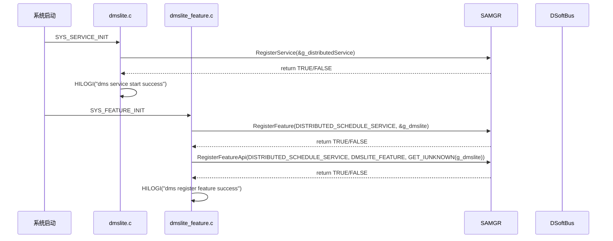
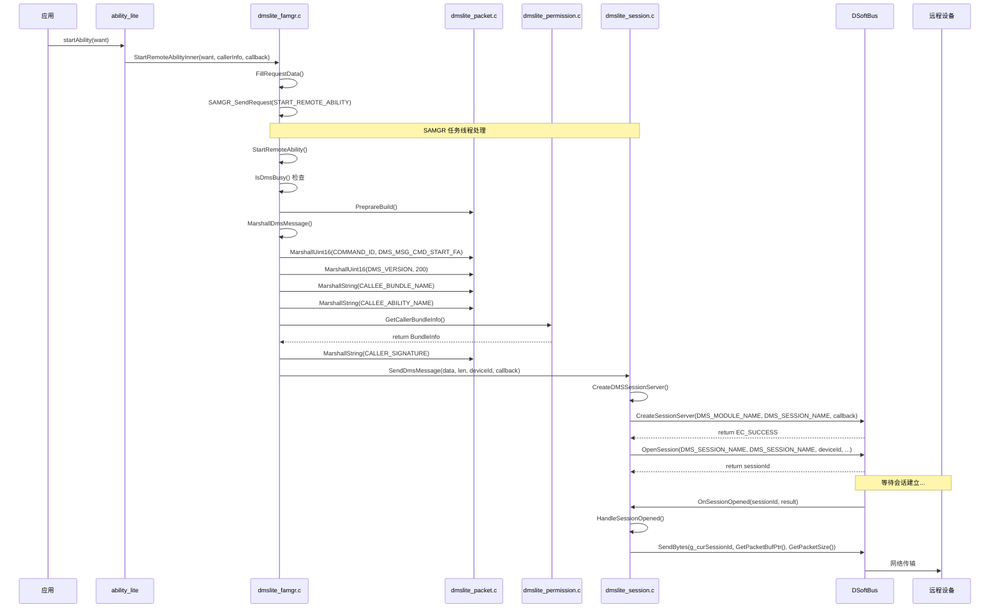
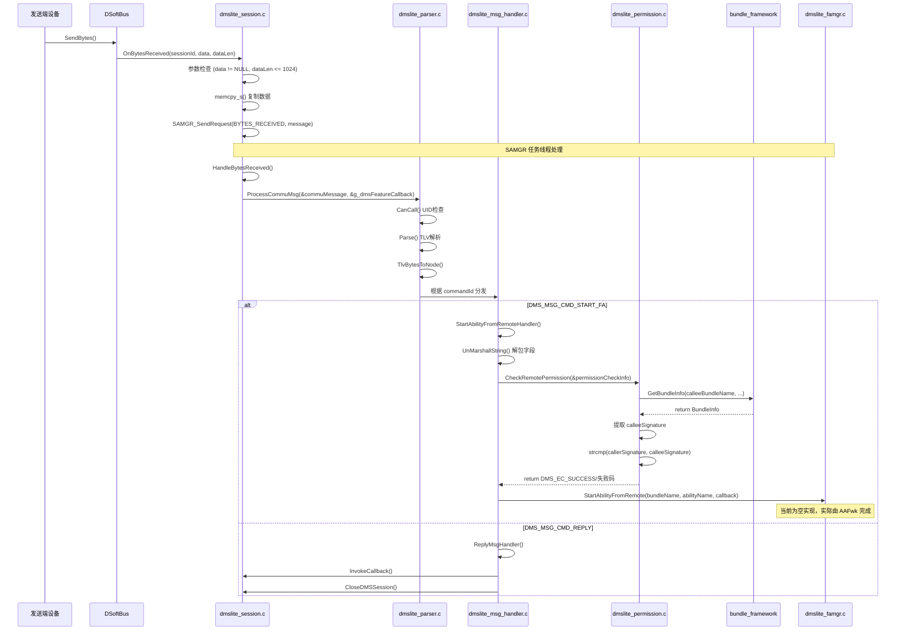
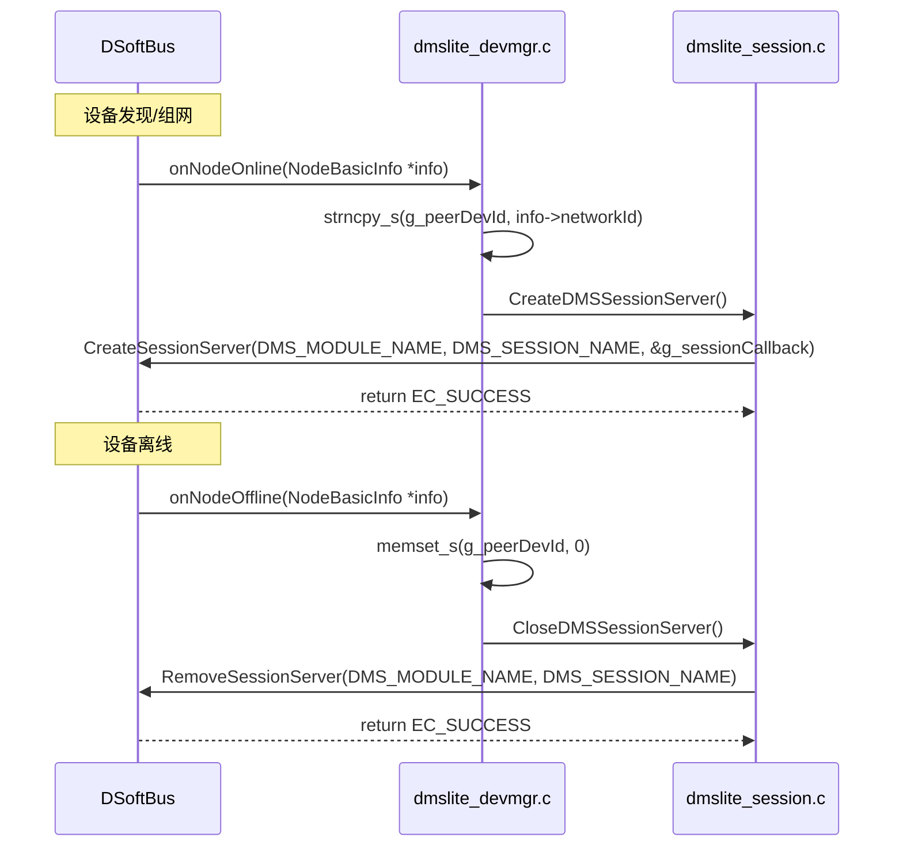

# 02_架构与数据流

> dmsfwk_lite 分布式调度模块的架构设计、组件关系、数据流向及线程模型详解。

## 1. 组件架构图

### 1.1 整体架构

```
┌─────────────────────────────────────────────────────────────────────────────┐
│                              应用层 (Application)                            │
│  ┌───────────────────────────────────────────────────────────────────────┐  │
│  │  JS/Java 应用                                                         │  │
│  │  want.setFlags(FLAG_ABILITYSLICE_MULTI_DEVICE)                        │  │
│  │  startAbility(want)                                                   │  │
│  └───────────────────────────────────────────────────────────────────────┘  │
└─────────────────────────────────────────────────────────────────────────────┘
                                      │
                                      ▼
┌─────────────────────────────────────────────────────────────────────────────┐
│                         Ability Framework (ability_lite)                     │
│  ┌───────────────────────────────────────────────────────────────────────┐  │
│  │  - 解析 Want 参数                                                     │  │
│  │  - 识别分布式标志                                                     │  │
│  │  - 调用 dmsfwk_lite 接口                                              │  │
│  └───────────────────────────────────────────────────────────────────────┘  │
└─────────────────────────────────────────────────────────────────────────────┘
                                      │
                                      ▼
┌─────────────────────────────────────────────────────────────────────────────┐
│                           dmsfwk_lite 组件                                   │
│                                                                              │
│  ┌─────────────────────────────────────────────────────────────────────┐   │
│  │                         SAMGR 集成层                                 │   │
│  │  ┌──────────────┐  ┌──────────────┐  ┌──────────────┐              │   │
│  │  │  Distributed │  │    DmsLite   │  │   DmsProxy   │              │   │
│  │  │   Service    │  │   Feature    │  │  (IUnknown)  │              │   │
│  │  │ (dmslite.c)  │  │(dmslite_     │  │(dmslite_     │              │   │
│  │  │              │  │ feature.c)   │  │ feature.c)   │              │   │
│  │  └──────┬───────┘  └──────┬───────┘  └──────────────┘              │   │
│  │         │                 │                                         │   │
│  │         │    Register     │                                         │   │
│  │         └────────────────►│                                         │   │
│  └───────────────────────────┼─────────────────────────────────────────┘   │
│                              │                                              │
│  ┌───────────────────────────▼─────────────────────────────────────────┐   │
│  │                        业务逻辑层                                    │   │
│  │                                                                      │   │
│  │  ┌─────────────┐    ┌─────────────┐    ┌─────────────┐             │   │
│  │  │  FA Manager │◄──►│   Session   │◄──►│  Permission │             │   │
│  │  │ (dmslite_   │    │ (dmslite_   │    │ (dmslite_   │             │   │
│  │  │  famgr.c)   │    │  session.c) │    │ permission.c)│            │   │
│  │  └──────┬──────┘    └──────┬──────┘    └─────────────┘             │   │
│  │         │                  │                                        │   │
│  │         │    Build Message │                                        │   │
│  │         └─────────────────►│                                        │   │
│  │                            │                                        │   │
│  │  ┌─────────────────────────▼─────────────────────────────────────┐  │   │
│  │  │                     消息处理层                                 │  │   │
│  │  │  ┌──────────┐  ┌──────────┐  ┌──────────┐  ┌──────────┐      │  │   │
│  │  │  │  Packet  │  │  Parser  │  │  Msg     │  │   TLV    │      │  │   │
│  │  │  │ (dmslite_│  │ (dmslite_│  │ Handler  │  │  Common  │      │  │   │
│  │  │  │ packet.c)│  │ parser.c)│  │(dmslite_ │  │(dmslite_ │      │  │   │
│  │  │  │          │  │          │  │msg_handler│ │tlv_common│      │  │   │
│  │  │  └──────────┘  └──────────┘  └──────────┘  └──────────┘      │  │   │
│  │  └─────────────────────────────────────────────────────────────┘  │   │
│  │                                                                    │   │
│  │  ┌─────────────────────────────────────────────────────────────┐  │   │
│  │  │                    设备管理层                                  │  │   │
│  │  │  ┌──────────────┐                                           │  │   │
│  │  │  │   DevMgr     │  监听设备上线/离线事件                      │  │   │
│  │  │  │(dmslite_     │                                           │  │   │
│  │  │  │ devmgr.c)    │                                           │  │   │
│  │  │  └──────────────┘                                           │  │   │
│  │  └─────────────────────────────────────────────────────────────┘  │   │
│  └────────────────────────────────────────────────────────────────────┘   │
│                                                                            │
│  ┌────────────────────────────────────────────────────────────────────┐   │
│  │                      工具/基础设施                                  │   │
│  │  ┌──────────────┐  ┌──────────────┐  ┌──────────────┐             │   │
│  │  │     Log      │  │    Utils     │  │   Common     │             │   │
│  │  │(dmslite_log.h)│  │(dmslite_     │  │(dmslite_     │             │   │
│  │  │              │  │ utils.h)     │  │ inner_common │             │   │
│  │  └──────────────┘  └──────────────┘  └──────────────┘             │   │
│  └────────────────────────────────────────────────────────────────────┘   │
└─────────────────────────────────────────────────────────────────────────────┘
                                      │
                                      ▼
┌─────────────────────────────────────────────────────────────────────────────┐
│                        Distributed SoftBus (dsoftbus)                        │
│  ┌───────────────────────────────────────────────────────────────────────┐  │
│  │  - 设备发现与组网                                                      │  │
│  │  - 会话管理（CreateSessionServer/OpenSession）                         │  │
│  │  - 数据传输（SendBytes/OnBytesReceived）                               │  │
│  └───────────────────────────────────────────────────────────────────────┘  │
└─────────────────────────────────────────────────────────────────────────────┘
                                      │
                                      ▼
┌─────────────────────────────────────────────────────────────────────────────┐
│                          依赖服务层                                           │
│  ┌──────────────┐  ┌──────────────┐  ┌──────────────┐  ┌──────────────┐    │
│  │  samgr_lite  │  │bundle_framework│  │ ability_lite │  │  hilog_lite  │    │
│  │  (SA 管理)    │  │   (BMS 包管理)  │  │ (Want/Element)│  │   (日志)      │    │
│  └──────────────┘  └──────────────┘  └──────────────┘  └──────────────┘    │
└─────────────────────────────────────────────────────────────────────────────┘
```

## 2. 数据流图

### 2.1 远程 FA 启动流程（发送端）

```
┌─────────────┐     ┌─────────────┐     ┌─────────────┐     ┌─────────────┐
│  App Layer  │────►│   AAFwk     │────►│ dmsfwk_lite │────►│   SoftBus   │
└─────────────┘     └─────────────┘     └──────┬──────┘     └─────────────┘
                                               │
                                               ▼
┌────────────────────────────────────────────────────────────────────────────┐
│                         dmsfwk_lite 内部数据流                              │
│                                                                              │
│  ┌──────────┐   ┌──────────┐   ┌──────────┐   ┌──────────┐   ┌──────────┐  │
│  │ DmsProxy │──►│FAManager │──►│  Packet  │──►│ Session  │──►│ SoftBus  │  │
│  │          │   │          │   │  (Build) │   │  (Send)  │   │  Client  │  │
│  └──────────┘   └──────────┘   └──────────┘   └──────────┘   └──────────┘  │
│                                     │                                        │
│                                     ▼                                        │
│                              ┌──────────┐                                   │
│                              │ Permission│                                  │
│                              │ (Get Sig) │                                  │
│                              └──────────┘                                   │
└────────────────────────────────────────────────────────────────────────────┘
```

### 2.2 远程 FA 启动流程（接收端）

```
┌─────────────┐     ┌─────────────┐     ┌─────────────┐     ┌─────────────┐
│   SoftBus   │────►│ dmsfwk_lite │────►│   Parser    │────►│ Msg Handler │
└─────────────┘     └──────┬──────┘     └──────┬──────┘     └──────┬──────┘
                           │                   │                   │
                           ▼                   ▼                   ▼
┌────────────────────────────────────────────────────────────────────────────┐
│                         dmsfwk_lite 内部处理                                │
│                                                                              │
│  ┌──────────┐   ┌──────────┐   ┌──────────┐   ┌──────────┐                  │
│  │ Session  │──►│  Parser  │──►│ Permission│──►│   BMS    │                  │
│  │Callback  │   │ (TLV)    │   │ (Check)  │   │(Get Info)│                  │
│  └──────────┘   └──────────┘   └──────────┘   └──────────┘                  │
│                                     │                                        │
│                                     ▼                                        │
│                              ┌──────────┐                                   │
│                              │   AAFwk  │                                   │
│                              │(Start FA)│                                   │
│                              └──────────┘                                   │
└────────────────────────────────────────────────────────────────────────────┘
```

## 3. 线程模型

### 3.1 任务配置

```c
// source/dmslite.c:71
static TaskConfig GetTaskConfig(Service *service)
{
    TaskConfig config = {
        LEVEL_HIGH,     // 优先级: 高
        PRI_NORMAL,     // 调度策略: 普通
        0x1000,         // 栈大小: 4KB
        20,             // 消息队列大小: 20
        SINGLE_TASK     // 任务类型: 单任务
    };
    return config;
}
```

### 3.2 线程交互图

```
┌─────────────────────────────────────────────────────────────────────────────┐
│                              进程空间                                         │
│                                                                              │
│  ┌─────────────────────────────────────────────────────────────────────┐    │
│  │                    SAMGR 任务线程 (dmslite)                          │    │
│  │                                                                      │    │
│  │  ┌──────────────┐  ┌──────────────┐  ┌──────────────┐              │    │
│  │  │ Message Queue│  │   Service    │  │   Feature    │              │    │
│  │  │   (size=20)  │  │   Handler    │  │   Handler    │              │    │
│  │  └──────┬───────┘  └──────────────┘  └──────┬───────┘              │    │
│  │         │                                    │                      │    │
│  │         └────────────────►┌──────────────────┘                      │    │
│  │                           │                                         │    │
│  │                           ▼                                         │    │
│  │                  ┌─────────────────┐                                │    │
│  │                  │  OnMessage()    │                                │    │
│  │                  │  (dmslite_      │                                │    │
│  │                  │   feature.c)    │                                │    │
│  │                  └────────┬────────┘                                │    │
│  │                           │                                         │    │
│  │              ┌────────────┼────────────┐                           │    │
│  │              ▼            ▼            ▼                           │    │
│  │  ┌──────────────┐ ┌──────────┐ ┌──────────────┐                  │    │
│  │  │START_REMOTE_ │ │SESSION_  │ │BYTES_        │                  │    │
│  │  │  ABILITY     │ │ OPEN/    │ │ RECEIVED     │                  │    │
│  │  │              │ │ CLOSE    │ │              │                  │    │
│  │  └──────────────┘ └──────────┘ └──────────────┘                  │    │
│  └─────────────────────────────────────────────────────────────────────┘    │
│                                                                              │
│  ┌─────────────────────────────────────────────────────────────────────┐    │
│  │                    SoftBus 回调线程                                  │    │
│  │                                                                      │    │
│  │  ┌──────────────────┐  ┌──────────────────┐  ┌──────────────────┐  │    │
│  │  │ OnBytesReceived  │  │ OnSessionOpened  │  │ OnSessionClosed  │  │    │
│  │  │      (收到数据)   │  │    (会话建立)     │  │    (会话关闭)     │  │    │
│  │  └────────┬─────────┘  └────────┬─────────┘  └────────┬─────────┘  │    │
│  │           │                     │                     │            │    │
│  │           └─────────────────────┼─────────────────────┘            │    │
│  │                                 │                                  │    │
│  │                                 ▼                                  │    │
│  │                    ┌─────────────────────┐                         │    │
│  │                    │   SAMGR_SendRequest │                         │    │
│  │                    │   (发送到任务队列)   │                         │    │
│  │                    └─────────────────────┘                         │    │
│  └─────────────────────────────────────────────────────────────────────┘    │
│                                                                              │
│  ┌─────────────────────────────────────────────────────────────────────┐    │
│  │                    设备状态监听线程                                  │    │
│  │                                                                      │    │
│  │  ┌──────────────────┐  ┌──────────────────┐                        │    │
│  │  │   onNodeOnline   │  │  onNodeOffline   │                        │    │
│  │  │     (设备上线)    │  │    (设备离线)     │                        │    │
│  │  └────────┬─────────┘  └────────┬─────────┘                        │    │
│  │           │                     │                                  │    │
│  │           └──────────┬──────────┘                                  │    │
│  │                      ▼                                             │    │
│  │         ┌─────────────────────────┐                                │    │
│  │         │ Create/CloseDMSSessionServer│                            │    │
│  │         └─────────────────────────┘                                │    │
│  └─────────────────────────────────────────────────────────────────────┘    │
└─────────────────────────────────────────────────────────────────────────────┘
```

### 3.3 线程安全说明

| 资源 | 访问控制 | 说明 |
|------|----------|------|
| `g_curSessionId` | SoftBus 回调线程 + SAMGR 任务线程 | 无显式锁，依赖单会话设计 |
| `g_curBusy` | 同上 | 忙标志，用于并发控制 |
| `g_buffer` (Packet) | SAMGR 任务线程 | 全局静态缓冲区，单线程使用 |
| `g_peerDevId` | 设备状态监听线程 | 设备 ID 缓存 |

**注意**: 当前实现依赖单会话设计（`IsDmsBusy()` 检查）来避免并发问题，未使用显式锁。

## 4. 关键时序图

### 4.1 服务初始化时序



### 4.2 远程 FA 启动时序（发送端）



### 4.3 远程 FA 启动时序（接收端）



### 4.4 设备状态变化时序



## 5. 关键调用链

### 5.1 发送端完整调用链

```
StartRemoteAbilityInner() [dmslite_famgr.c:45]
├── 参数检查 (want, element, callerInfo)
├── FillRequestData() [dmslite_famgr.c:171]
│   ├── DMS_ALLOC(Want)
│   ├── memset_s()
│   ├── SetElementBundleName()
│   ├── SetElementAbilityName()
│   ├── SetElementDeviceID()
│   ├── SetWantElement()
│   ├── DMS_ALLOC(data) 复制 want->data
│   └── FillCallerInfo()
│       ├── DMS_ALLOC(CallerInfo)
│       └── memcpy_s() bundleName
└── SAMGR_SendRequest(START_REMOTE_ABILITY) [dmslite_feature.c:81]
    └── OnMessage() [dmslite_feature.c:73]
        └── START_REMOTE_ABILITY 处理
            ├── 参数检查
            ├── StartRemoteAbility() [dmslite_famgr.c:85]
            │   ├── IsDmsBusy() [dmslite_session.c:251]
            │   │   ├── g_curBusy 检查
            │   │   └── IsTimeout() 超时检查
            │   ├── PreprareBuild() [dmslite_packet.c:51]
            │   │   └── memset_s(g_buffer)
            │   └── MarshallDmsMessage() [dmslite_famgr.c:112]
            │       ├── PACKET_MARSHALL_HELPER(Uint16, COMMAND_ID, DMS_MSG_CMD_START_FA)
            │       │   └── MarshallUint16() [dmslite_packet.c:74]
            │       ├── PACKET_MARSHALL_HELPER(Uint16, DMS_VERSION, 200)
            │       ├── PACKET_MARSHALL_HELPER(String, CALLEE_BUNDLE_NAME)
            │       │   └── MarshallString() [dmslite_packet.c:119]
            │       ├── PACKET_MARSHALL_HELPER(String, CALLEE_ABILITY_NAME)
            │       ├── GetCallerBundleInfo() [dmslite_permission.c:202]
            │       │   ├── GetBundleInfoFromFile() (uid <= 99)
            │       │   │   ├── open()
            │       │   │   ├── lseek()
            │       │   │   ├── DMS_ALLOC()
            │       │   │   └── read()
            │       │   └── GetBundleInfoFromBms()
            │       │       ├── GetBmsInterface() [dmslite_permission.c:45]
            │       │       │   ├── SAMGR_GetInstance()->GetFeatureApi(BMS_SERVICE, BMS_FEATURE)
            │       │       │   └── iUnknown->QueryInterface()
            │       │       ├── GetBundleNameForUid()
            │       │       └── GetBundleInfo()
            │       └── MarshallString(CALLER_SIGNATURE)
            └── SendDmsMessage() [dmslite_session.c:194]
                ├── 参数检查
                ├── CreateDMSSessionServer() [dmslite_session.c:184]
                │   └── CreateSessionServer() (SoftBus)
                ├── g_curBusy = true
                ├── time(&g_begin) 记录开始时间
                ├── OpenSession() (SoftBus)
                └── return EC_SUCCESS
```

### 5.2 接收端完整调用链

```
OnBytesReceived() [dmslite_session.c:72] (SoftBus 回调)
├── 参数检查 (data, dataLen <= 1024)
├── DMS_ALLOC(dataLen)
├── memcpy_s()
└── SAMGR_SendRequest(BYTES_RECEIVED, message)
    └── OnMessage() [dmslite_feature.c:73]
        └── BYTES_RECEIVED 处理
            └── HandleBytesReceived() [dmslite_session.c:104]
                └── ProcessCommuMsg() [dmslite_parser.c:256]
                    ├── CanCall() [dmslite_parser.c:243]
                    │   └── getuid() 检查 FOUNDATION_UID/SHELL_UID
                    ├── Parse() [dmslite_parser.c:229]
                    │   └── TlvBytesToNode() [dmslite_parser.c:165]
                    │       ├── MallocTlvNode()
                    │       ├── TlvFillNode() [dmslite_parser.c:80]
                    │       │   ├── 解析 Type
                    │       │   ├── TlvBytesToLength() 解析 Length
                    │       │   └── 设置 Value 指针
                    │       ├── CheckNodeSequence() 检查类型递增
                    │       └── MoveToNextTlvNode()
                    └── 根据 commandId 分发
                        ├── DMS_MSG_CMD_START_FA:
                        │   └── StartAbilityFromRemoteHandler() [dmslite_msg_handler.c:25]
                        │       ├── UnMarshallString(CALLEE_BUNDLE_NAME) [dmslite_tlv_common.c:133]
                        │       ├── UnMarshallString(CALLEE_ABILITY_NAME)
                        │       ├── UnMarshallString(CALLER_SIGNATURE)
                        │       ├── CheckRemotePermission() [dmslite_permission.c:63]
                        │       │   ├── GetBundleInfo() (BMS)
                        │       │   ├── 提取 calleeSignature
                        │       │   └── strcmp() 签名比对
                        │       └── StartAbilityFromRemote() [dmslite_famgr.c:39]
                        └── DMS_MSG_CMD_REPLY:
                            └── ReplyMsgHandler() [dmslite_msg_handler.c:43]
                                ├── UnMarshallInt32(REPLY_ERR_CODE)
                                ├── InvokeCallback()
                                └── CloseDMSSession()
```

## 6. 相关文档

- [00_Overview](00_Overview.md) - 项目概览
- [01_Directory_Structure](01_Directory_Structure.md) - 目录结构
- [04_Internal_API](04_Internal_API.md) - 内部接口详情
