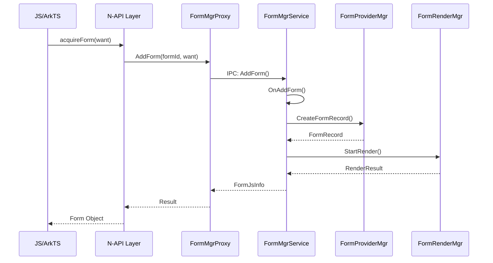
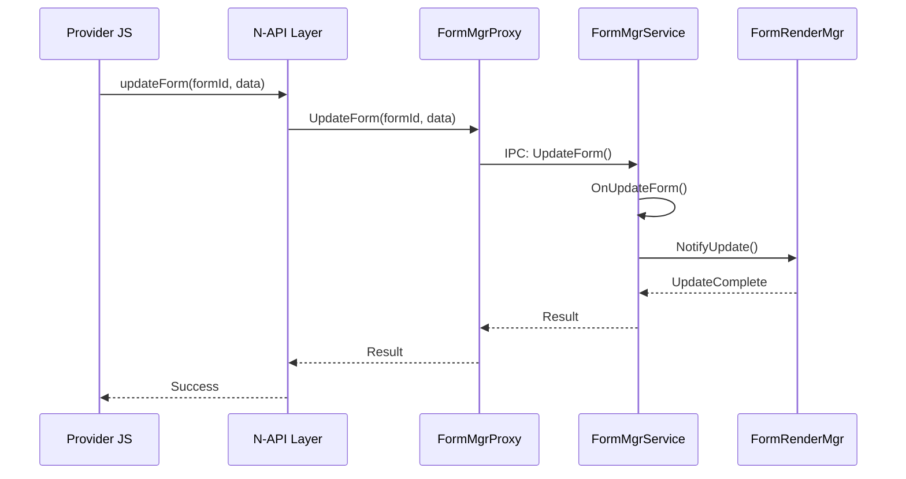

# 架构设计

> 本文档描述 Form Fwk 的整体架构设计，包括组件图、数据流、线程模型

## 整体架构图

```
┌─────────────────────────────────────────────────────────────────────────┐
│                          应用层 (Application)                            │
│  ┌─────────────────┐  ┌─────────────────┐  ┌─────────────────────────┐  │
│  │ FormProvider    │  │ FormHost        │  │ FormExtensionAbility    │  │
│  │ (卡片提供方)    │  │ (卡片使用方)    │  │ (Stage模型)            │  │
│  └────────┬────────┘  └────────┬────────┘  └───────────┬─────────────┘  │
└───────────┼──────────────────────┼──────────────────────┼───────────────┘
            │                      │                      │
            ▼                      ▼                      ▼
┌─────────────────────────────────────────────────────────────────────────┐
│                       N-API 层 (ArkTS/JS API)                           │
│  ┌─────────────┐ ┌─────────────┐ ┌─────────────┐ ┌─────────────────┐  │
│  │formProvider │ │formHost     │ │formInfo     │ │formAgent        │  │
│  │             │ │             │ │             │ │                 │  │
│  │- GetFormsInfo│ │- AcquireForm│ │- FormInfo   │ │- RequestPublish│  │
│  │- UpdateForm │ │- DeleteForm │ │- Filter     │ │- DeleteForm    │  │
│  └─────────────┘ └─────────────┘ └─────────────┘ └─────────────────┘  │
│  ┌─────────────┐ ┌─────────────┐ ┌─────────────────────────────────┐  │
│  │formExtension│ │formObserver │ │formBindingData                  │  │
│  │             │ │             │ │                                 │  │
│  │- Lifecycle  │ │- on/off     │ │- FormBindingData                │  │
│  └─────────────┘ └─────────────┘ └─────────────────────────────────┘  │
└─────────────────────────────────────────────────────────────────────────┘
                                    │
                                    ▼
┌─────────────────────────────────────────────────────────────────────────┐
│                    Inner API 层 (IPC 通信)                              │
│  ┌─────────────────────────────────────────────────────────────────┐    │
│  │                     IFormMgr (IPC 接口)                          │    │
│  │  - AddForm/DeleteForm/UpdateForm                               │    │
│  │  - RequestForm/ReleaseForm                                     │    │
│  │  - GetFormsInfo/AcquireFormState                              │    │
│  └─────────────────────────────────────────────────────────────────┘    │
│            ▲                        │                        ▲            │
│            │                        ▼                        │            │
│  ┌─────────────┐         ┌─────────────────┐         ┌─────────────┐    │
│  │ FormMgrProxy│         │ FormMgrService  │         │FormMgrStub │    │
│  │ (客户端代理) │         │ (服务实现)      │         │ (服务端存根)│    │
│  └─────────────┘         └────────┬────────┘         └─────────────┘    │
└───────────────────────────────────┼───────────────────────────────────────┘
                                    │
                    ┌───────────────┼───────────────┐
                    ▼               ▼               ▼
┌─────────────────────────┐ ┌───────────────┐ ┌─────────────────────────┐
│   AMS/BMS 适配层        │ │  数据管理层    │ │   FormRenderService     │
│  - FormAmsHelper       │ │  - FormDataMgr│ │   (卡片渲染服务)        │
│  - FormBmsHelper       │ │  - FormCache  │ │   - FormRenderMgr      │
│  - FormAppMgrHelper    │ │  - FormDB     │ │   - FormSandboxRender  │
└─────────────────────────┘ └───────────────┘ └─────────────────────────┘
                                    │
                                    ▼
┌─────────────────────────────────────────────────────────────────────────┐
│                    System Ability 层                                    │
│  ┌─────────────────────────────────────────────────────────────────┐    │
│  │              FormMgrService (SA: FORM_MGR_SERVICE_ID)           │    │
│  │   - 继承 SystemAbility, 实现 FormMgrStub                        │    │
│  │   - 管理卡片生命周期                                             │    │
│  │   - 调度卡片事件                                                │    │
│  └─────────────────────────────────────────────────────────────────┘    │
└─────────────────────────────────────────────────────────────────────────┘
```

## 核心组件职责

### 1. N-API 层组件

| 组件 | 路径 | 职责 |
|------|------|------|
| formProvider | `frameworks/js/napi/formProvider/` | 卡片提供方 JS 接口 |
| formHost | `frameworks/js/napi/formHost/` | 卡片使用方 JS 接口 |
| formAgent | `frameworks/js/napi/form_agent/` | 卡片操作代理 |
| formInfo | `frameworks/js/napi/form_info/` | 卡片信息查询 |
| formObserver | `frameworks/js/napi/form_observer/` | 卡片状态观察 |
| formBindingData | `frameworks/js/napi/form_binding_data/` | 卡片数据绑定 |
| formExtension | `frameworks/js/napi/form_extension_ability/` | Stage 模型扩展 |
| formUtil | `frameworks/js/napi/formUtil/` | N-API 工具函数 |

### 2. Inner API 层组件

| 组件 | 接口 | 职责 |
|------|------|------|
| IFormMgr | `ohos.appexecfwk.FormMgr` | 卡片管理主接口 |
| IFormProvider | `ohos.appexecfwk.FormProvider` | 卡片提供方接口 |
| IFormHost | `ohos.appexecfwk.FormHost` | 卡片使用方接口 |
| IFormSupply | `ohos.appexecfwk.FormSupply` | 供应回调接口 |
| IFormRender | `ohos.appexecfwk.FormRender` | 渲染服务接口 |

### 3. 服务层组件

| 组件 | 路径 | 职责 |
|------|------|------|
| FormMgrService | `services/src/form_mgr/` | 卡片管理核心服务 |
| FormHostMgr | `services/src/form_host/` | 卡片使用方管理 |
| FormProviderMgr | `services/src/form_provider/` | 卡片提供方管理 |
| FormRenderMgr | `services/src/form_render/` | 卡片渲染管理 |
| FormDataMgr | `services/src/data_center/` | 数据管理 |
| FormRefreshMgr | `services/src/form_refresh/` | 卡片刷新机制 |

## 数据流

### 典型调用链：添加卡片

```
1. JS 层: formHost.acquireForm(formId, want)
           │
           ▼
2. N-API 层: formHost N-API 模块
           │
           ▼
3. IPC 调用: FormMgrProxy.AddForm()
           │
           ▼
4. FMS 服务: FormMgrService.OnAddForm()
           │
           ├──▶ FormAmsHelper: 获取 Provider Token
           │
           ├──▶ FormProviderMgr: 创建 FormRecord
           │
           └──▶ FormRenderMgr: 启动渲染
```

### 卡片更新流程

```
1. Provider 调用: formProvider.updateForm(formId, data)
           │
           ▼
2. IPC 调用: FormMgrProxy.UpdateForm()
           │
           ▼
3. FMS: FormMgrService.OnUpdateForm()
           │
           ├──▶ FormDataMgr: 更新卡片数据
           │
           └──▶ FormRenderMgr: 触发渲染
```

## 线程模型

### 服务线程

| 线程池 | 职责 | 配置 |
|--------|------|------|
| FormMgrQueue | 卡片管理主任务调度 | `services/src/form_mgr/form_mgr_queue.cpp` |
| FormHostQueue | 卡片使用方任务调度 | `services/src/form_host/form_host_queue.cpp` |
| FormProviderQueue | 卡片提供方任务调度 | `services/src/form_provider/form_provider_queue.cpp` |
| FormRenderQueue | 卡片渲染任务调度 | `services/src/form_render/form_render_queue.cpp` |

### 任务执行

- 每个 Queue 使用独立的串行队列（SerialQueue）处理任务
- 保证同一类型的操作按顺序执行，避免竞态
- 跨队列操作通过消息传递实现

## IPC 通信

### 通信模式

```
┌──────────────┐     IPC      ┌──────────────┐
│   Client     │ ───────────▶ │   Server     │
│ (FormMgrProxy)              │(FormMgrStub) │
└──────────────┘              └──────────────┘
```

### 主要 IPC 接口

| 接口 | 方法 ID 范围 | 功能 |
|------|-------------|------|
| IFormMgr | 3001-3500 | 卡片增删改查 |
| IFormProvider | 3051-3062 | Provider 回调 |
| IFormHost | 3681-3693 | Host 操作 |
| IFormRender | 3101-3113 | 渲染回调 |
| IFormSupply | 3201-3214 | 供应回调 |

## 关键时序图

### 添加卡片时序



### 更新卡片时序



## 状态机

### 卡片生命周期状态

```
                    ┌─────────────┐
                    │   CREATED   │◄─────────────────────────┐
                    └──────┬──────┘                          │
                           │ AddForm                        │
                           ▼                                │
                    ┌─────────────┐      DeleteForm          │
                    │  INVISIBLE  │────────────────────────►│
                    └──────┬──────┘                          │
                           │ NotifyVisible                   │
                           ▼                                │
                    ┌─────────────┐      ReleaseForm         │
                    │   VISIBLE   │────────────────────────►│
                    └──────┬──────┘                          │
                           │ Release                        │
                           ▼                                │
                    ┌─────────────┐                          │
                    │  RELEASED   │─────────────────────────┘
                    └─────────────┘
```

### 卡片刷新状态

```
┌──────────────────────────────────────────────────────────────┐
│                      刷新检查链                                │
├──────────────────────────────────────────────────────────────┤
│  1. ActiveUserChecker  - 活跃用户检查                         │
│  2. CallingUserChecker - 调用用户检查                         │
│  3. CallingBundleCheck- 调用方 Bundle 检查                    │
│  4. UntrustAppChecker  - 非可信应用检查                       │
│  5. SystemAppChecker   - 系统应用检查                         │
│  6. SelfFormChecker    - 自有卡片检查                         │
│  7. MultiActiveUsers   - 多活跃用户检查                       │
└──────────────────────────────────────────────────────────────┘
                           │
                           ▼
              ┌───────────────────────────┐
              │   全部通过 → 执行刷新     │
              │   任一失败 → 跳过本次刷新  │
              └───────────────────────────┘
```
