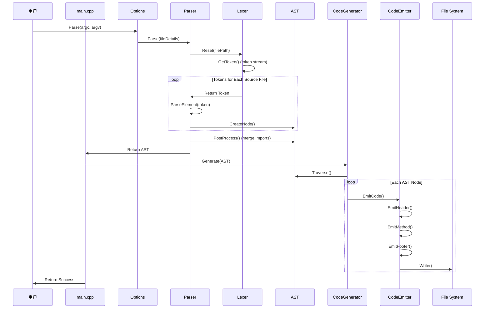
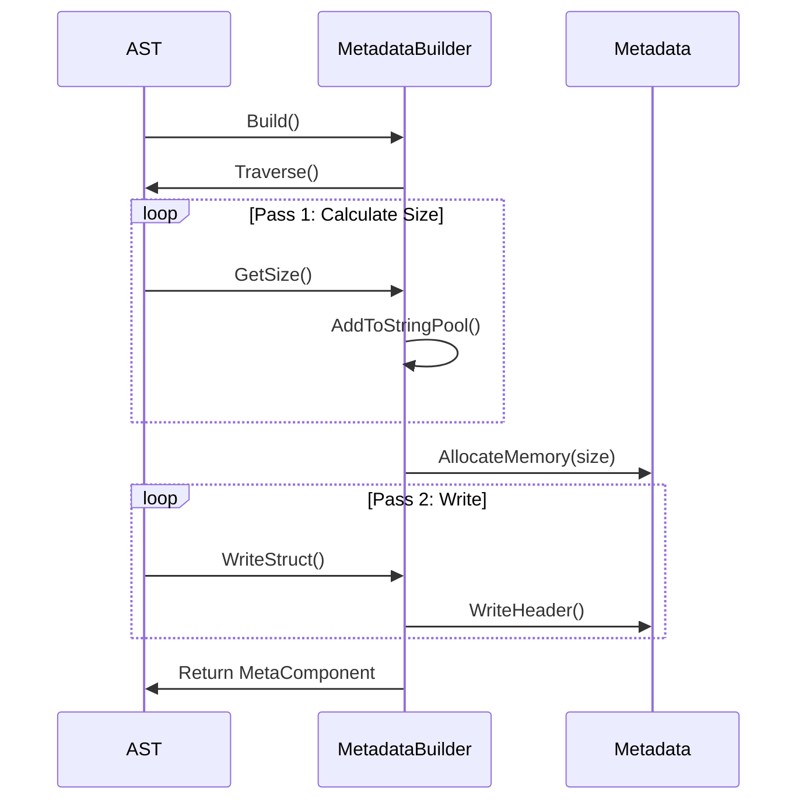
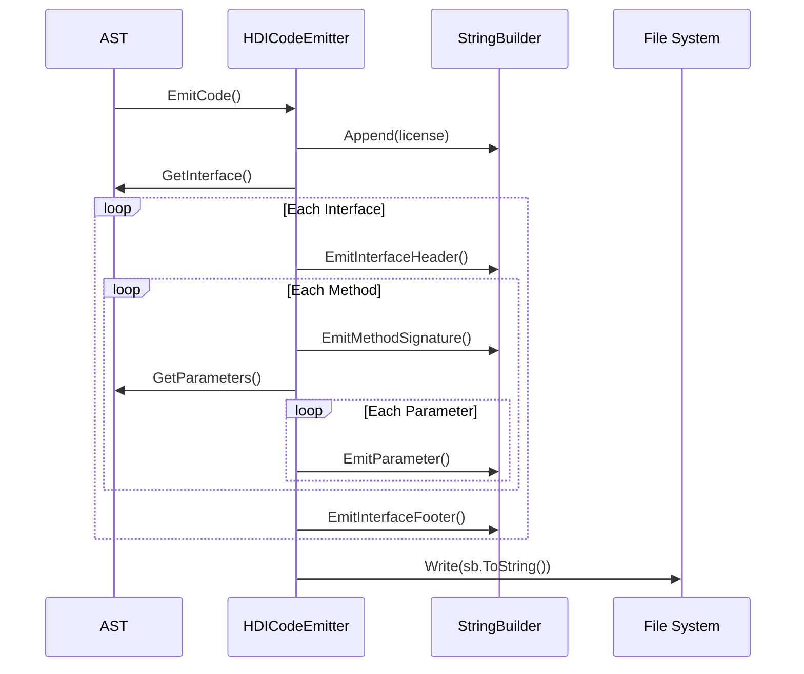

# OpenHarmony IDL Tool - 架构设计

**目的**：详细说明 IDL Tool 的架构设计、组件交互、数据流和关键时序。

---

## 适用范围

本文档适用于：
- 理解 IDL Tool 整体架构的设计者
- 需要扩展或优化代码生成的开发者
- 需要调试代码生成问题的工程师

---

## 架构概览

IDL Tool 采用**模块化、分层架构**设计：

```
┌─────────────────────────────────────────────────────────────┐
│                   命令行接口 (main.cpp)           │
└────────────────────┬────────────────────────────────┘
                     │
         ┌─────────┴─────────┐
         │                   │
    ┌───┴──┐          ┌───┴──┐
    │       │          │       │
  Options   Parser   CodeGenerator
    │       │          │
    │  ┌────┴───┐  │
    └──┴          │  │
  Lexer         AST  │
                  │  │
                  │  ┌───┴───────┐
                  │  │           │
             MetadataBuilder  CodeEmitter
                  │
            ┌─────┴────┐
            │           │
    MetaComponent   EmitCode()
            │
         Output Files
```

---

## AST 模块详解

### 设计模式：组合模式 + 继承层次

**证据**: `idl_tool_2/ast/ast_node.h`, `idl_tool_2/ast/ast_type.h`

**继承层次**:
```
ASTNode (abstract base)
├── ASTType (abstract type base)
│   ├── Basic Types
│   │   └── [37 种基本类型]
│   ├── Composite Types
│   │   ├── ASTArrayType
│   │   ├── ASTMapType
│   │   ├── ASTSetType
│   │   └── ASTPtrType
│   ├── User-Defined Types
│   │   ├── ASTInterfaceType
│   │   ├── ASTStructType
│   │   ├── ASTEnumType
│   │   └── ASTUnionType
│   └── Special Types
│       ├── ASTSequenceableType
│       ├── ASTRawDataType
│       └── ...
├── ASTMethod
├── ASTParameter
├── ASTNamespace
└── AST (root)
```

**关键设计决策**:
- 使用 `AutoPtr<T>` 智能指针管理内存（引用计数）
- 类型通过 `TypeKind` 枚举区分（37 种）
- 每个类型实现 `GetSignature()` 虚方法用于代码生成
- AST 使用 `StrAstMap` 存储所有类型定义

---

## Parser 模块详解

### 设计模式：递归下降解析器（Recursive Descent Parser）

**证据**: `idl_tool_2/parser/parser.h:63-346`

**解析流程**:
```
.idl Source File
    ↓
Preprocessor::Preprocess()
    ↓
FileDetail Vector (文件列表)
    ↓
Lexer::Reset() + GetToken()
    ↓
Token Stream (85+ token types)
    ↓
Parser::Parse()
    ↓
    ├─→ ParseLicense()
    ├─→ ParsePackage()
    ├─→ ParseImports()
    ├─→ ParseInterfaceToken()
    └─→ ParseTypeDecls()
           ↓
    ├─→ ParseInterface() → ASTInterfaceType
    ├─→ ParseEnumDeclaration() → ASTEnumType
    ├─→ ParseStructDeclaration() → ASTStructType
    └─→ ParseUnionDeclaration() → ASTUnionType
           ↓
    IntfTypeChecker::CheckIntegrity()
           ↓
    Complete AST
```

**关键解析函数**:
- `ParseInterface()` - 解析接口（包括方法列表）
- `ParseMethod()` - 解析方法（包括参数列表、返回类型）
- `ParseType()` - 解析类型声明（包括复杂类型）
- `ParseExpression()` - 解析表达式（用于枚举值）

**错误处理**:
- 使用 `Logger::E()` 记录错误
- 收集所有错误到 `errors_` 向量
- 解析失败时输出完整错误列表

---

## Codegen 模块详解

### 设计模式：策略模式 + 模板方法

**证据**: `idl_tool_2/codegen/code_generator.h:32-56`

**代码生成架构**:
```
CodegenBuilder (单例)
    │
    ┌─────────┼─────────┐
    │         │         │
HDI CodeGenerator   SA CodeGenerator
    │         │         │
    ┌────┴────┐  ┌────┴────┐
    │         │  │         │
HDI CodeEmitter SA CodeEmitter
    │         │  │
    ┌────┴────┐  ┌───┴────┐
    │         │  │        │
TypeEmitter InterfaceEmitter MethodEmitter
    │         │  │        │
    └────┬────┘  └────┬────┘
         │                │
    └────────┬─────────┘
             │
     StringBuilder
             ↓
     Output File
```

### HDI 后端架构

**证据**: `idl_tool_2/codegen/HDI/hdi_code_emitter.h`

**HDICodeEmitter 继承 CodeEmitter**:
```cpp
class HDICodeEmitter : public CodeEmitter {
protected:
    void EmitCode() override;  // 生成 HDI 代码
};
```

**发射器分类**:
| 发射器类型 | 职责 | 文件路径 |
|---------|------|---------|
| **接口发射器** | 生成接口定义（.h 头文件） | HDI/cpp/cpp_interface_code_emitter.h/cpp |
| **客户端代理发射器** | 生成 Proxy 类（客户端调用） | HDI/cpp/cpp_client_proxy_code_emitter.h/cpp |
| **服务桩发射器** | 生成 Stub 类（服务端实现） | HDI/cpp/cpp_service_stub_code_emitter.h/cpp |
| **自定义类型发射器** | 生成结构体、枚举、联合体 | HDI/cpp/cpp_custom_types_code_emitter.h/cpp |
| **服务驱动发射器** | 生成服务驱动实现 | HDI/cpp/cpp_service_driver_code_emitter.h/cpp |
| **类型发射器** | HDI 类型映射到目标类型 | HDI/type/*.h/cpp |

### SA 后端架构

**证据**: `idl_tool_2/codegen/SA/sa_code_emitter.h`

**SACodeEmitter 继承 CodeEmitter**:
```cpp
class SACodeEmitter : public CodeEmitter {
protected:
    void EmitCode() override;  // 生成 SA 代码
};
```

**发射器分类**:
| 发射器类型 | 职责 | 文件路径 |
|---------|------|---------|
| **C++ 客户端发射器** | 生成 C++ Proxy 类 | SA/cpp/sa_cpp_client_code_emitter.h/cpp |
| **C++ 接口发射器** | 生成 C++ 接口定义 | SA/cpp/sa_cpp_interface_code_emitter.h/cpp |
| **C++ 自定义类型发射器** | 生成 C++ 结构体、枚举 | SA/cpp/sa_cpp_custom_types_code_emitter.h/cpp |
| **C++ 桩发射器** | 生成 C++ Stub 类 | SA/cpp/sa_cpp_service_stub_code_emitter.h/cpp |
| **TypeScript 代理发射器** | 生成 TS Proxy 类 | SA/ts/sa_ts_client_proxy_code_emitter.h/cpp |
| **TypeScript 桩发射器** | 生成 TS Stub 类 | SA/ts/sa_ts_service_stub_code_emitter.h/cpp |
| **Rust 接口发射器** | 生成 Rust 接口定义 | SA/rust/sa_rust_interface_code_emitter.h/cpp |
| **SA 类型发射器** | SA 类型映射到目标类型 | SA/type/*.h/cpp |

**代码生成策略**:
- 使用 `StringBuilder` 高效构建字符串
- 使用模板方法（`EmitHeader()`, `EmitMethod()`, `EmitFooter()`）
- 根据 `GenMode` 选择不同的代码生成路径（LOW, PASSTHROUGH, IPC, KERNEL）
- 根据 `InterfaceType` 选择 HDI 或 SA 后端

---

## Metadata 模块详解

### 设计模式：建造者模式（Builder Pattern）

**证据**: `idl_tool_2/metadata/metadata_builder.h:24-43`

**元数据构建流程**:
```
AST (from Parser)
    ↓
MetadataBuilder::Build()
    ↓
Two-Pass Process:
    ├─→ Pass 1: CalculateMetadataSize()
    │      遍历 AST，计算总大小
    │      构建字符串池（去重）
    │      计算对齐偏移量
    └─→ Pass 2: WriteMetadata()
           分配连续内存块
           写入 MetaComponent 头（magic number 0x1DF02ED1）
           写入所有数组（命名空间、接口、类型等）
           写入字符串池
    ↓
MetadataSerializer::Serialize()
    ↓
Pointer → Offset Conversion
    ↓
Binary Metadata File
```

**元数据结构**:
```cpp
struct MetaComponent {
    uint32_t magic;           // 0x1DF02ED1
    MetaNamespace* namespaces;  // 命名空间数组
    MetaInterface* interfaces;    // 接口数组
    MetaType* types;          // 类型数组
    char* stringPool;        // 字符串池（所有字符串集中存储）
};
```

**关键类**:
- `MetadataBuilder` - AST → 元数据转换
- `MetadataSerializer` - 指针与偏移量转换（位置无关存储）
- `MetadataReader` - 元数据 → AST 转换（加载）
- `MetadataDumper` - 元数据格式化文本输出

**类型映射规则**:
| AST 类型 | Meta 类型 | 索引方式 |
|---------|----------|--------|
| `ASTNamespace` | `MetaNamespace` | 数组索引 |
| `ASTInterfaceType` | `MetaInterface` | 数组索引 |
| `ASTMethod` | `MetaMethod` | 接口内的方法数组索引 |
| `ASTParameter` | `MetaParameter` | 方法内的参数数组索引 |
| `ASTStructType` | `MetaType (STRUCT)` | 类型数组索引 |
| `ASTEnumType` | `MetaType (ENUM)` | 类型数组索引 |
| `ASTUnionType` | `MetaType (UNION)` | 类型数组索引 |

---

## 关键时序（Mermaid）

### 完整的 IDL 编译流程



### 元数据构建流程



### 代码生成调用流程（HDI C++）



---

## 线程模型

### 单线程执行

**证据**: `idl_tool_2/main.cpp:127-178`

IDL Tool 是**命令行工具**，采用**单线程**执行模型：
- 不使用多线程
- 不使用线程池
- 所有模块同步调用

**原因**：
- IDL 编译通常是快速操作（几毫秒到几秒）
- 文件 I/O 是主要瓶颈，多线程无法显著提升性能
- 简化设计，避免并发问题

---

## 数据流

### 输入数据流

```
命令行参数
    ↓
Options::Parse()
    ↓
配置对象（SystemLevel, GenMode, Language, InterfaceType）
    ↓
Parser::Parse()
    ↓
文件列表（FileDetail Vector）
    ↓
Lexer（token stream）
    ↓
AST 树结构
```

### 输出数据流

```
AST 树结构
    ↓
CodeGenerator::Generate()
    ↓
CodeEmitter::EmitCode()
    ↓
StringBuilder（内存中的字符串）
    ↓
文件系统（.h/.cpp/.java/.ts 文件）
```

---

## 关键设计决策

### 1. 引用计数管理

**证据**: `idl_tool_2/util/light_refcount_base.h`, `idl_tool_2/util/autoptr.h`

所有 AST 节点和代码生成器使用 `AutoPtr<T>` 智能指针：
- 自动引用计数
- 避免内存泄漏
- 零开销抽象（`AutoPtr` 实现为 `T*` 指针）

### 2. 字符串池优化

**证据**: `idl_tool_2/metadata/metadata_builder.cpp:Build()`

元数据使用字符串池优化：
- 所有字符串集中存储在一个连续内存区域
- 去重，减少内存占用
- 通过索引引用字符串

### 3. 两遍构建元数据

**证据**: `idl_tool_2/metadata/metadata_builder.h`

元数据构建使用两遍算法：
- 第一遍：计算总大小，构建字符串池
- 第二遍：实际写入数据

**优点**：
- 避免多次内存重分配
- 确保所有指针偏移量正确

### 4. 类型索引而非指针

**证据**: `idl_tool_2/metadata/meta_type.h`

元数据中使用类型索引而非直接指针：
- 所有类型存储在数组中，通过索引引用
- 支持复杂类型的嵌套（List<T>, Map<K,V> 通过 typeIndex）

### 5. 可扩展的后端架构

**证据**: `idl_tool_2/codegen/code_generator.h:38-53`

使用策略模式支持多种后端：
- `CodeGenerator` 虚基类定义 `DoGenerate()` 接口
- `CodegenBuilder` 维护 `GeneratorEntry` 映射
- 新增后端只需注册新的 `CodeGenerator` 实现

---

## 关键结论

1. **分层架构**：清晰的分层，每层职责单一
2. **模块化设计**：各模块高度内聚，低耦合
3. **设计模式应用**：策略模式（后端选择）、建造者模式（元数据）、模板方法（代码生成）
4. **性能优化**：字符串池、两遍构建、类型索引
5. **可扩展性**：易于添加新的后端或语言支持

---

## 相关文档

- [01_Directory_Structure.md](01_Directory_Structure.md) - 模块职责与依赖关系
- [04_Internal_API.md](04_Internal_API.md) - 各模块接口详解
- [05_GN_Targets.md](05_GN_Targets.md) - GN 构建系统
- [06_Build_Artifacts.md](06_Build_Artifacts.md) - 编译产物说明

---

**最后更新**: 2026-02-06
