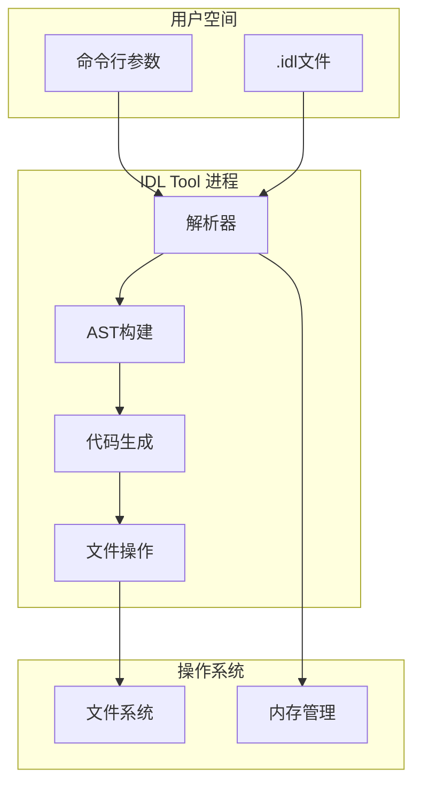

# 05 - 攻击面分析 (Attack Surface)

## 1. 项目特性分析

### 1.1 运行模式

**编译时工具** - IDL 工具是编译时代码生成器，具有以下特性：
- 不运行在目标设备上
- 运行在开发者/编译主机上
- 输入来自开发者编写的 .idl 文件
- 输出是生成的源代码文件

### 1.2 信任模型


**信任边界**：
- IDL 工具假设输入来自**可信开发者**
- 不防御恶意开发者（这是编译时工具的一般假设）
- 主要风险是**意外输入**导致的崩溃或错误代码生成

---

## 2. 外部输入清单

### 2.1 命令行参数

**输入源**: `idl_tool_2/util/options.cpp:64-296`

| 参数 | 类型 | 用途 | 风险 |
|------|------|------|------|
| `-c <file>` | 文件路径 | IDL文件路径 | 路径遍历 |
| `-d <dir>` | 目录路径 | 输出目录 | 路径遍历 |
| `-D <dir>` | 目录路径 | IDL文件目录 | 路径遍历 |
| `-r <pkg:path>` | 包映射 | 包根路径映射 | 路径注入 |
| `-o <file>` | 文件路径 | 输出文件(HDI) | 路径遍历 |
| `-s <file>` | 文件路径 | 元数据文件(SA) | 路径遍历 |
| `--package <name>` | 字符串 | 包名 | 注入风险 |
| `--log-tag <tag>` | 字符串 | 日志标签 | 注入风险 |

**代码证据**:
```cpp
// options.cpp:293 - -r 选项解析
rootPaths_[key] = value.substr(index + 1);  // 未验证路径格式

// file.cpp:48-60 - 文件创建
fd_ = fopen(path.c_str(), "w+");  // 直接使用用户提供的路径
```

### 2.2 IDL 文件内容

**输入源**: 用户提供的 `.idl` 文件

**输入类型**:

| 元素 | 示例 | 风险 |
|------|------|------|
| 包名 | `package OHOS.Service;` | 长度/格式验证 |
| 接口名 | `interface IMyInterface;` | 标识符验证 |
| 方法名 | `int Method();` | 标识符验证 |
| 参数名 | `[in] int param` | 标识符验证 |
| 字符串字面量 | `"string value"` | 长度/编码 |
| 数值表达式 | `VALUE = 0x1234` | 整数溢出 |
| 注释 | `// comment` | 嵌套/长度 |

**解析入口**:
```cpp
// parser.cpp:56-65
int32_t Parser::Parse(const StrFileDetailMap &fileDetails) {
    for (const auto &fileDetail : fileDetails) {
        if (!ParseOne(fileDetail.second)) {
            return -1;
        }
    }
    return 0;
}
```

### 2.3 环境输入

| 输入 | 来源 | 用途 | 风险 |
|------|------|------|------|
| 当前工作目录 | 进程环境 | 相对路径解析 | 路径混淆 |
| 文件系统 | OS | 文件读写 | TOCTOU |
| 系统环境变量 | OS | 可能的配置 | 间接影响 |

---

## 3. 敏感操作清单

### 3.1 文件系统操作

**高敏感操作**:

| 操作 | 文件 | 行号 | 风险 |
|------|------|------|------|
| 文件创建 | `util/file.cpp` | 48-60 | 任意文件创建 |
| 文件追加 | `util/file.cpp` | 51 | 任意文件修改 |
| 文件读取 | `util/file.cpp` | 81 | 任意文件读取 |
| 目录创建 | `util/file.cpp` | 218-255 | 目录结构创建 |
| 递归目录创建 | `util/file.cpp` | 245 | 0777权限 |

**代码证据**:
```cpp
// file.cpp:48-60 - 文件创建（写模式）
if (mode == FileMode::WRITE) {
    fd_ = fopen(path.c_str(), "w+");  // w+ 会截断文件
} else if (mode == FileMode::APPEND) {
    fd_ = fopen(path.c_str(), "a+");  // a+ 会创建或追加
}

// file.cpp:245 - 目录权限
int result = mkdir(dirPath.c_str(), 
    S_IRWXU | S_IRWXG | S_IRWXO);  // 0777 权限
```

### 3.2 内存操作

| 操作 | 文件 | 行号 | 风险 |
|------|------|------|------|
| malloc | `metadata/metadata_reader.cpp` | 56 | 未检查上限 |
| calloc | `metadata/metadata_builder.cpp` | 37 | 大内存分配 |
| calloc | `util/string_builder.cpp` | 148 | 缓冲区增长 |
| memcpy_s | `util/string_builder.cpp` | 57 | 边界检查 |
| strcpy_s | `util/string_pool.cpp` | 63 | 字符串复制 |

**代码证据**:
```cpp
// metadata_reader.cpp:56
void* data = malloc(header.size_);  // size_ 来自文件

// string_builder.cpp:148
char *newBuffer = reinterpret_cast<char *>(calloc(newSize, 1));
// newSize 可能溢出
```

### 3.3 字符串操作

| 操作 | 文件 | 行号 | 风险 |
|------|------|------|------|
| strlen | `util/string_builder.cpp` | 54 | 性能/计算开销 |
| sprintf | `util/string_builder.cpp` | 101 | 格式化字符串 |
| strdup | 生成代码 | - | 内存分配失败 |

### 3.4 代码生成操作

**生成的敏感代码**:

| 生成的函数 | 风险 |
|-----------|------|
| `strcpy_s` | 缓冲区溢出（如果大小计算错误）|
| `strdup` | 内存分配失败未检查 |
| `memcpy_s` | 源/目标大小不匹配 |

**代码证据**:
```cpp
// hdi_array_type_emitter.cpp:473
tempSb.AppendFormat("if (strcpy_s(%s[i], strlen(%s) + 1, %s) != EOK)",
    name.c_str(), element.c_str(), element.c_str());
// 如果 element 在 strlen 和 strcpy_s 之间被修改，可能溢出

// hdi_array_type_emitter.cpp:479
"%s[i] = strdup(%s);\n"  // 未检查返回值
```

---

## 4. 信任边界图

### 4.1 系统边界



### 4.2 数据流信任边界

| 边界 | 输入 | 验证措施 | 风险等级 |
|------|------|---------|---------|
| 命令行 → 选项解析 | 路径字符串 | 有限 | 中 |
| 选项 → 文件打开 | 文件路径 | CanonicalPath | 中 |
| 文件 → 词法分析 | 文件内容 | Token验证 | 低 |
| Token → 语法分析 | Token流 | 语法检查 | 低 |
| AST → 代码生成 | 树结构 | 类型检查 | 低 |
| 生成器 → 文件写入 | 代码字符串 | 无 | 中 |

---

## 5. 攻击向量分析

### 5.1 路径遍历攻击

**向量**: 通过 `-d` 或 `-c` 选项传递恶意路径

**示例**:
```bash
idl -gen-cpp -d "../../../etc/cron.d/" -c malicious.idl
```

**缓解措施**:
- `CanonicalPath` 函数处理路径规范化（`util/file.cpp:307-331`）
- 但未能完全防御符号链接攻击

**证据**:
```cpp
// file.cpp:307-331
std::string File::CanonicalPath(const std::string &path) {
    // 处理 .. 但不处理符号链接
    if (pathItem == "..") {
        if (!pathStack.empty()) {
            pathStack.pop_back();
        }
    }
}
```

### 5.2 资源耗尽攻击

**向量**: 构造极复杂的 IDL 文件消耗内存

**攻击方式**:
- 超深层嵌套的命名空间
- 大量接口定义
- 超大字符串字面量

**风险点**:
```cpp
// metadata_reader.cpp:56
void* data = malloc(header.size_);  // 最多 64KB

// string_builder.cpp - 无上限增长
void Grow(size_t needSize) {
    size_t newSize = capacity_ * 2;  // 指数增长
    // 无最大限制检查
}
```

### 5.3 TOCTOU 攻击

**向量**: 竞争条件利用

**风险点**:
```cpp
// file.cpp:392-408
bool File::CheckValid(const std::string &path) {
    if (access(path.c_str(), F_OK) == 0) {  // 检查1
        if (stat(path.c_str(), &buf) == 0) {  // 检查2
            // 文件可能在检查和打开之间被替换
        }
    }
}
```

### 5.4 生成的代码注入

**向量**: 通过 IDL 内容影响生成代码

**风险**: 如果 IDL 内容未正确转义，可能影响生成代码

**证据**:
```cpp
// 生成的代码直接使用 IDL 中的标识符
sb.AppendFormat("class %s : public IRemoteStub<%s>", 
    interfaceName.c_str(), interfaceName.c_str());
// 如果 interfaceName 包含特殊字符，可能破坏代码结构
```

---

## 6. 风险评估矩阵

| 攻击向量 | 可能性 | 影响 | 风险等级 | 优先级 |
|---------|--------|------|---------|--------|
| 路径遍历 | 中 | 中 | 中 | P2 |
| 资源耗尽 | 低 | 中 | 低 | P3 |
| TOCTOU | 低 | 中 | 低 | P3 |
| 代码注入 | 低 | 高 | 中 | P2 |
| 缓冲区溢出 | 低 | 高 | 中 | P2 |

**说明**:
- 由于这是**编译时工具**，攻击者需要控制编译环境
- 在正常的开发流程中，攻击者无法轻易利用这些漏洞
- 主要关注**防御编程**和**鲁棒性**

---

## 7. 攻击面摘要

### 7.1 输入点（4个）

1. **命令行参数** - 路径、选项
2. **IDL文件** - 接口定义内容
3. **文件系统** - 读取的源文件
4. **环境** - 工作目录、系统状态

### 7.2 敏感操作（4类）

1. **文件操作** - 创建、读取、写入
2. **内存分配** - malloc/calloc
3. **字符串操作** - 复制、拼接
4. **代码生成** - 输出代码字符串

### 7.3 信任边界（2个）

1. **进程边界** - 工具与操作系统
2. **生成边界** - 工具与生成代码

---

**上一步**: [04_Interface.md](04_Interface.md)
**下一步**: [06_SecurityReview.md](06_SecurityReview.md)
