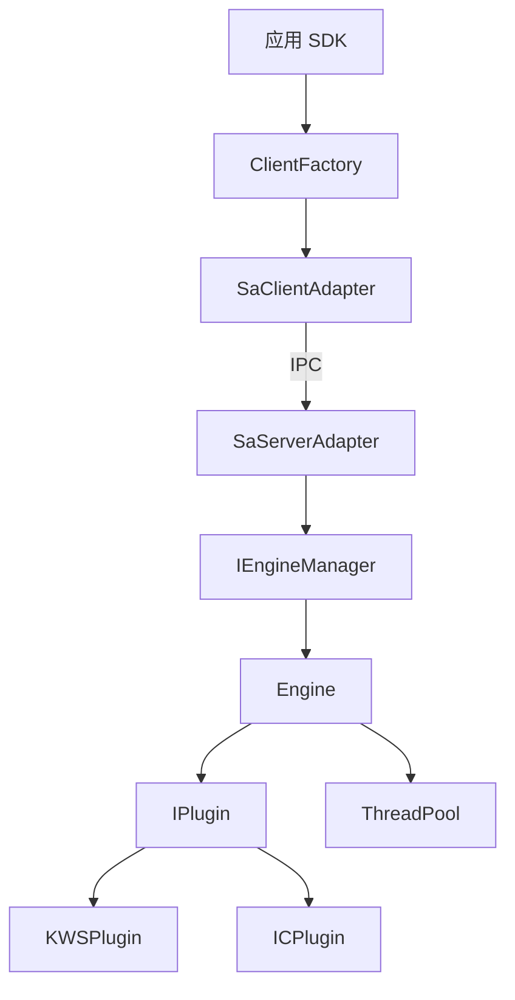
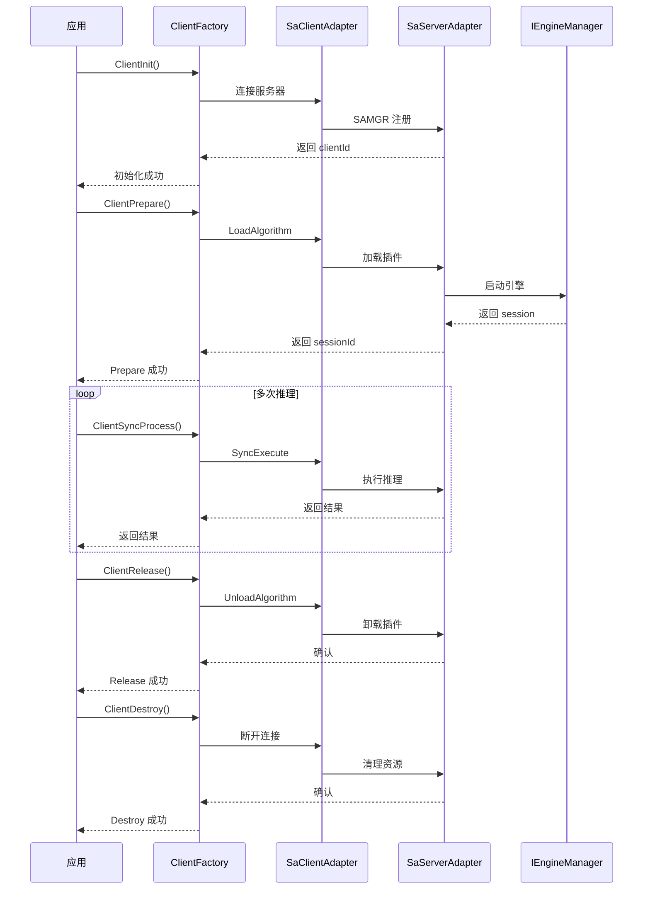
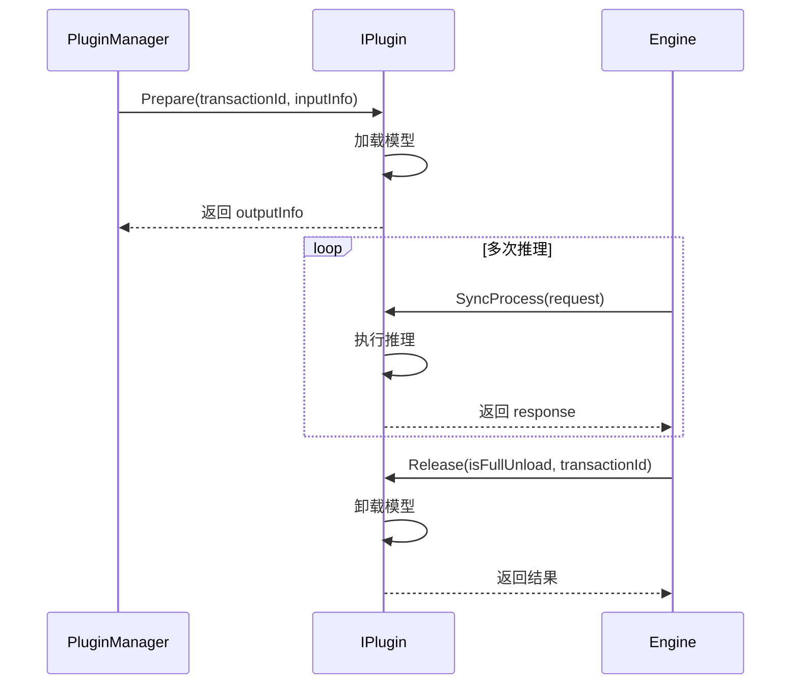

# AI Engine 架构设计

## 整体架构

AI Engine 采用 C/S（客户端-服务器）架构，分为四个层次：

```
┌─────────────────────────────────────────────────────────────────┐
│                        应用层 (Application)                     │
│              KWSSdk / IcSdk / CrSdk (算法 SDK 封装)             │
└─────────────────────────────────────────────────────────────────┘
                               │
                               ▼
┌─────────────────────────────────────────────────────────────────┐
│                      客户端层 (Client)                           │
│     ClientFactory → SaClientAdapter → SAMGR IPC → Server        │
│     ┌──────────────────────────────────────────────────────┐    │
│     │  ConnectMgrWorker (连接管理)                          │    │
│     │  AsyncHandler (异步回调处理)                          │    │
│     └──────────────────────────────────────────────────────┘    │
└─────────────────────────────────────────────────────────────────┘
                               │
                               │ IPC (Samgr)
                               ▼
┌─────────────────────────────────────────────────────────────────┐
│                      服务端层 (Server)                           │
│     SaServerAdapter → IEngineManager → Engine → IPlugin         │
│     ┌──────────────────────────────────────────────────────┐    │
│     │  EngineWorker (推理执行)                              │    │
│     │  ThreadPool (线程池)                                 │    │
│     │  Queue (任务队列)                                    │    │
│     └──────────────────────────────────────────────────────┘    │
└─────────────────────────────────────────────────────────────────┘
                               │
                               ▼
┌─────────────────────────────────────────────────────────────────┐
│                       插件层 (Plugin)                            │
│     KWSPlugin / ICPlugin / 自定义插件 (继承 IPlugin)              │
└─────────────────────────────────────────────────────────────────┘
```

**证据**：`services/client/client_executor/include/client_factory.h` 客户端架构，`services/server/server_executor/include/engine.h` 服务端架构

## 组件交互图



## 数据流

### 同步推理数据流

```
1. 应用调用 SyncExecute
2. ClientFactory 序列化请求
3. SaClientAdapter 通过 IPC 发送请求
4. SaServerAdapter 接收请求
5. IEngineManager 调度到 Engine
6. Engine 将任务加入 Queue
7. EngineWorker 从 Queue 取任务
8. 调用 IPlugin.SyncProcess
9. 返回推理结果
10. 响应沿调用链返回客户端
```

**证据**：`services/common/protocol/data_channel/include/i_request.h` 请求数据结构

### 异步推理数据流

```
1. 应用调用 AsyncExecute + 注册回调
2. ClientFactory 序列化请求 + 注册 AsyncHandler
3. SaClientAdapter 通过 IPC 发送请求
4. SaServerAdapter 接收请求
5. IEngineManager 调度到 Engine
6. Engine 将任务加入 Queue
7. EngineWorker 从 Queue 取任务
8. 调用 IPlugin.AsyncProcess
9. 插件通过 IPluginCallback 返回结果
10. SaAsyncHandler 接收异步结果
11. 通过 IPC 回调到客户端
12. AsyncHandler 分发到用户回调
```

**证据**：`services/server/plugin/i_plugin_callback.h` 异步回调接口

## 线程模型

### 客户端线程

| 线程 | 职责 | 生命周期 |
|------|------|----------|
| ConnectMgrWorker | 管理与服务器的连接，执行 Init/Destroy | ClientInit 时创建，ClientDestroy 时销毁 |
| AsyncHandler | 接收服务器异步回调，分发到用户回调 | 注册异步回调时启动 |

### 服务端线程

| 线程 | 职责 | 生命周期 |
|------|------|----------|
| EngineWorker | 执行插件的同步/异步推理任务 | 引擎启动时创建，引擎停止时销毁 |
| AsyncProcessWorker | 监听异步任务完成，发送回调到客户端 | 客户端注册异步处理器时启动 |
| ThreadPool 线程 | 通用任务执行 | 全局单例，应用生命周期 |

### 线程安全机制

| 机制 | 用途 | 证据 |
|------|------|------|
| 无锁 Queue | 引擎任务分发 | `services/common/platform/queuepool/queue.h` |
| RwLock | 客户端会话管理 | `services/common/platform/lock/include/rw_lock.h` |
| std::mutex | Session 管理、回调注册 | 各模块源码 |
| ISemaphore | 线程同步 | `services/common/platform/semaphore/include/i_semaphore.h` |

**证据**：`services/common/platform/threadpool/include/thread_pool.h` 线程池实现

## 关键时序图

### 客户端生命周期



**证据**：`README.md:195-322` SDK 调用序列示例

### 插件生命周期



**证据**：`services/server/plugin/i_plugin.h` 插件接口定义

## 依赖方向

```
应用层 (SDK)
    │
    ▼
客户端层 (ClientFactory → SaClientAdapter)
    │
    │ IPC (Samgr)
    ▼
服务端层 (SaServerAdapter → IEngineManager → Engine)
    │
    ▼
插件层 (IPlugin ← 具体插件实现)
```

**关键依赖原则**：
- 上层依赖下层，下层不依赖上层
- 插件层与框架解耦，只依赖 IPlugin 接口
- 平台模块 (platform) 为所有层提供基础能力

**证据**：`services/common/protocol/struct_definition/aie_info_define.h` 核心数据结构
