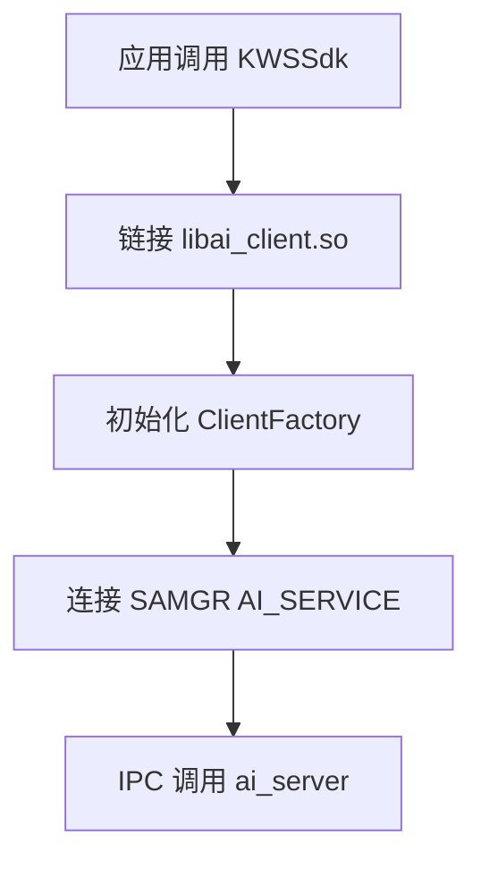

# AI Engine 编译产物

## 产物清单

### 可执行文件

| 产物 | 说明 | 输出路径 |
|------|------|----------|
| `ai_server` | AI 引擎服务端主程序 | `out/.../ai_server` |

**证据**：`services/server/BUILD.gn:16` target_type = "executable"

### 共享库

| 产物 | 说明 | 依赖 | 条件 |
|------|------|------|------|
| `libai_client.so` | 客户端 SDK 库 | samgr, ipc | always |
| `libasr_keyword_spotting.so` | ASR 关键词检测插件 | NNIE | board=hispark_taurus |
| `libcv_image_classification.so` | CV 图像分类插件 | NNIE | board=hispark_taurus |

**证据**：`services/client/BUILD.gn` 客户端库定义，`services/server/plugin/*/BUILD.gn` 插件定义

### 配置文件

| 产物 | 说明 | 生成方式 |
|------|------|----------|
| `ai_engine_plugin.ini` | 插件激活配置 | Python 脚本生成 |

**证据**：`services/server/plugin_manager/BUILD.gn:24-31` gen_etc_ini action

### 模型文件

| 产物 | 说明 | 用途 |
|------|------|------|
| `image_classification.wk` | 图像分类神经网络模型 | IC 插件推理 |
| `keyword_spotting.wk` | 关键词检测神经网络模型 | KWS 插件推理 |
| `kws_mean.txt` | KWS 音频均值特征 | KWS 插件 |
| `kws_std.txt` | KWS 音频标准差特征 | KWS 插件 |

---

## 安装路径

### 系统安装

```
/system/bin/ai_server                    # 服务端可执行文件
/system/lib/libai_client.so             # 客户端库
/system/lib/libasr_keyword_spotting.so  # ASR 插件 (条件编译)
/system/lib/libcv_image_classification.so # CV 插件 (条件编译)
/system/etc/ai_engine_plugin.ini        # 插件配置
```

### 模型路径

```
/data/local/ai/image_classification.wk   # IC 模型
/data/local/ai/keyword_spotting.wk      # KWS 模型
/data/local/ai/kws_mean.txt             # KWS 特征
/data/local/ai/kws_std.txt              # KWS 特征
```

---

## 运行时加载关系

### 服务端启动流程


### 客户端加载流程



---

## 动态库依赖

### libai_client.so 依赖

```bash
$ readelf -d libai_client.so | grep NEEDED
NEEDED  libhilog.so
NEEDED  libipc.so
NEEDED  libsamgr.so
NEEDED  libstdc++.so
NEEDED  libm.so
```

### libasr_keyword_spotting.so 依赖

```bash
$ readelf -d libasr_keyword_spotting.so | grep NEEDED
NEEDED  libnnie.so
NEEDED  libnnie_adapter.so
NEEDED  libhdi_media.so
NEEDED  libhilog.so
NEEDED  libstdc++.so
```

---

## 产物与代码映射

| 产物 | 源文件 | BUILD.gn |
|------|--------|----------|
| ai_server | services/server/*/*.cpp | services/server/BUILD.gn |
| libai_client.so | services/client/*/*.cpp | services/client/BUILD.gn |
| libasr_keyword_spotting.so | services/server/plugin/asr/keyword_spotting/*.cpp | services/server/plugin/asr/keyword_spotting/BUILD.gn |
| libcv_image_classification.so | services/server/plugin/cv/image_classification/*.cpp | services/server/plugin/cv/image_classification/BUILD.gn |

**证据**：`services/server/BUILD.gn` 产物定义，`services/client/BUILD.gn` 客户端库定义

---

## 调试信息

### Map 文件

```bash
# 服务端链接生成
-Wl,-Map=server.map
```

输出位置：`out/.../server.map`

### 符号表

```bash
# 查看导出符号
nm -D libai_client.so | grep " T "
```

### 符号解析

```bash
# 使用 addr2line 解析崩溃地址
addr2line -e ai_server 0x12345
```
