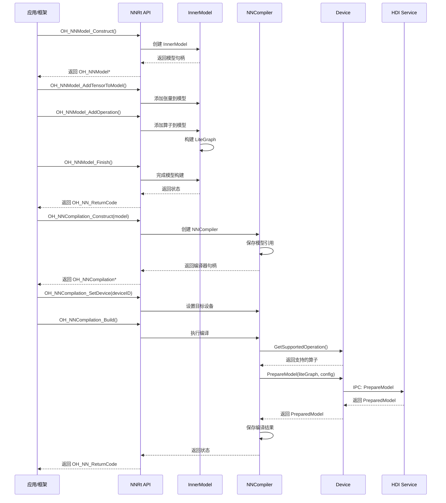
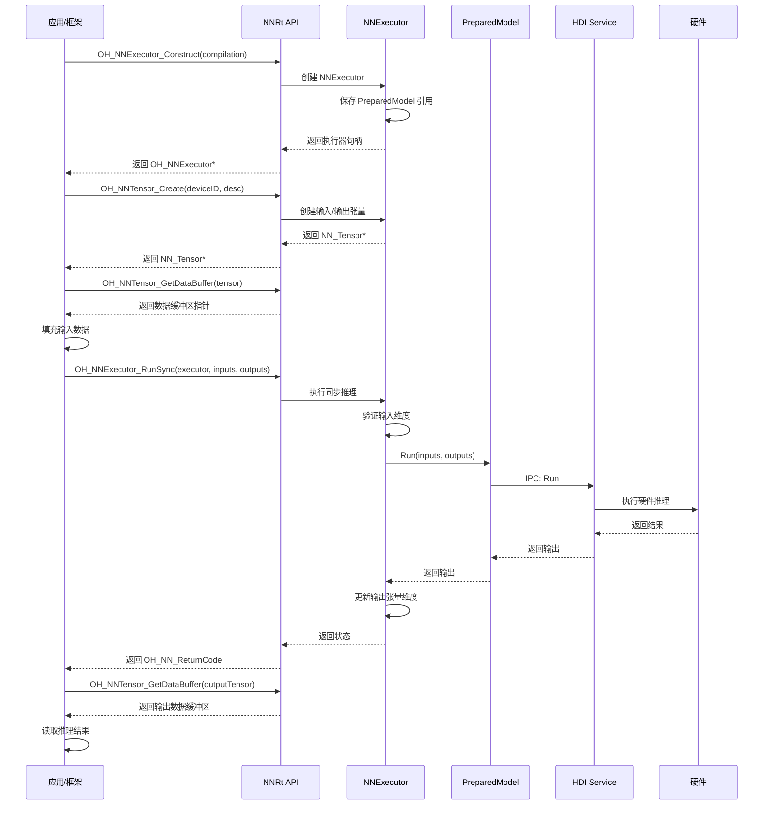

# 02. 架构说明

## 目的

本文档介绍 Neural Network Runtime 的系统架构、组件图、数据流、线程模型和关键时序。

## 适用范围

- 系统架构师
- 框架开发者
- 驱动开发者

## 系统架构

### 整体架构图

```
┌─────────────────────────────────────────────────────────────────────────────┐
│                              应用/推理框架层                                  │
│                    (MindSpore Lite / TensorFlow Lite)                       │
└─────────────────────────────────────────────────────────────────────────────┘
                                      │
                                      ▼
┌─────────────────────────────────────────────────────────────────────────────┐
│                         Neural Network Core (抽象层)                        │
│  ┌─────────────┐  ┌─────────────┐  ┌─────────────┐  ┌─────────────────┐    │
│  │   Backend   │  │   Compiler  │  │   Executor  │  │  BackendManager │    │
│  │  (抽象接口)  │  │  (抽象接口)  │  │  (抽象接口)  │  │   (单例管理器)   │    │
│  └─────────────┘  └─────────────┘  └─────────────┘  └─────────────────┘    │
│                                                                             │
│  路径: frameworks/native/neural_network_core/                              │
│  产物: libneural_network_core.so                                           │
└─────────────────────────────────────────────────────────────────────────────┘
                                      │
                                      ▼
┌─────────────────────────────────────────────────────────────────────────────┐
│                      Neural Network Runtime (实现层)                        │
│  ┌─────────────┐  ┌─────────────┐  ┌─────────────┐  ┌─────────────────┐    │
│  │  NNBackend  │  │  NNCompiler │  │  NNExecutor │  │   InnerModel    │    │
│  │  (后端实现)  │  │  (编译实现)  │  │  (执行实现)  │  │  (内部模型表示)  │    │
│  └─────────────┘  └─────────────┘  └─────────────┘  └─────────────────┘    │
│                                                                             │
│  ┌─────────────┐  ┌─────────────┐  ┌─────────────────────────────────────┐ │
│  │   Device    │  │PreparedModel│  │           NNTensor                  │ │
│  │ (设备抽象)   │  │ (预编译模型) │  │         (内部张量)                   │ │
│  └─────────────┘  └─────────────┘  └─────────────────────────────────────┘ │
│                                                                             │
│  ┌─────────────┐  ┌─────────────┐  ┌─────────────────────────────────────┐ │
│  │   OpsBuilder│  │ OpsRegistry │  │        MemoryManager                │ │
│  │ (算子构建器) │  │ (算子注册表) │  │        (内存管理器)                  │ │
│  └─────────────┘  └─────────────┘  └─────────────────────────────────────┘ │
│                                                                             │
│  路径: frameworks/native/neural_network_runtime/                           │
│  产物: libneural_network_runtime.so                                        │
└─────────────────────────────────────────────────────────────────────────────┘
                                      │
                                      ▼
┌─────────────────────────────────────────────────────────────────────────────┐
│                         HDI 设备适配层 (多版本)                              │
│  ┌─────────────────┐  ┌─────────────────┐  ┌─────────────────────────┐      │
│  │  HDIDeviceV1_0  │  │  HDIDeviceV2_0  │  │     HDIDeviceV2_1       │      │
│  │ HDIPreparedModel│  │ HDIPreparedModel│  │    HDIPreparedModel     │      │
│  │    (V1_0 适配)   │  │    (V2_0 适配)   │  │       (V2_1 适配)        │      │
│  └─────────────────┘  └─────────────────┘  └─────────────────────────┘      │
│                                                                             │
│  路径: frameworks/native/neural_network_runtime/hdi_device_v*.h            │
└─────────────────────────────────────────────────────────────────────────────┘
                                      │
                                      ▼ IPC (Binder)
┌─────────────────────────────────────────────────────────────────────────────┐
│                           芯片驱动层 (HDI Service)                           │
│  ┌─────────────────────────────────────────────────────────────────────┐   │
│  │                    NnrtDeviceService                                 │   │
│  │  - GetDeviceName/GetVendorName/GetDeviceType                        │   │
│  │  - PrepareModel/PrepareModelFromModelCache                          │   │
│  │  - AllocateBuffer/ReleaseBuffer                                     │   │
│  ├─────────────────────────────────────────────────────────────────────┤   │
│  │                   PreparedModelService                               │   │
│  │  - ExportModelCache                                                 │   │
│  │  - Run (模型推理)                                                    │   │
│  │  - GetInputDimRanges                                                │   │
│  └─────────────────────────────────────────────────────────────────────┘   │
│                                                                             │
│  路径: example/drivers/nnrt/v2_0/hdi_cpu_service/ (示例实现)                │
│  进程: nnrt_host                                                            │
└─────────────────────────────────────────────────────────────────────────────┘
                                      │
                                      ▼
┌─────────────────────────────────────────────────────────────────────────────┐
│                              硬件加速层                                      │
│                        (NPU / DSP / GPU / CPU)                              │
└─────────────────────────────────────────────────────────────────────────────┘
```

## 组件职责

### 1. Core 层组件

| 组件 | 职责 | 关键文件 |
|------|------|----------|
| **Backend** | 设备能力查询、创建 Compiler/Executor/Tensor | `backend.h/cpp` |
| **Compiler** | 模型编译接口、缓存管理、性能设置 | `compiler.h/cpp` |
| **Executor** | 模型执行接口、输入输出管理 | `executor.h/cpp` |
| **Tensor** | 张量数据操作接口 | `tensor.h/cpp` |
| **TensorDesc** | 张量描述符（形状、类型、格式） | `tensor_desc.h/cpp` |
| **BackendManager** | 后端注册、管理、查询 | `backend_manager.h/cpp` |

### 2. Runtime 层组件

| 组件 | 职责 | 关键文件 |
|------|------|----------|
| **NNBackend** | Backend 的具体实现，包装 Device | `nnbackend.h/cpp` |
| **NNCompiler** | Compiler 的具体实现，管理编译过程 | `nncompiler.h/cpp` |
| **NNExecutor** | Executor 的具体实现，执行推理 | `nnexecutor.h/cpp` |
| **InnerModel** | 内部模型表示，管理张量和算子 | `inner_model.h/cpp` |
| **NNTensor** | 内部张量实现 | `nn_tensor.h/cpp` |
| **Device** | 设备抽象基类 | `device.h` |
| **PreparedModel** | 预编译模型抽象 | `prepared_model.h` |
| **MemoryManager** | 内存管理单例 | `memory_manager.h/cpp` |
| **OpsRegistry** | 算子注册表单例 | `ops_registry.h/cpp` |

### 3. HDI 适配层组件

| 组件 | 职责 | 关键文件 |
|------|------|----------|
| **HDIDeviceV1_0/2_0/2_1** | 对接不同版本 HDI 设备接口 | `hdi_device_v*.h/cpp` |
| **HDIPreparedModelV1_0/2_0/2_1** | 对接不同版本 HDI 模型接口 | `hdi_prepared_model_v*.h/cpp` |

## 数据流

### 1. 模型编译数据流



### 2. 模型执行数据流



## 线程模型

### 当前线程模型

| 特性 | 状态 | 说明 |
|------|------|------|
| 同步执行 | ✅ 已实现 | `RunSync()` 阻塞当前线程 |
| 异步执行 | ⚠️ 预留接口 | `RunAsync()` 返回 `OH_NN_OPERATION_FORBIDDEN` |
| 回调机制 | ⚠️ 预留接口 | `SetOnRunDone()` / `SetOnServiceDied()` 未实现 |
| 线程安全 | ✅ 已实现 | 关键位置使用互斥锁保护 |

### 线程安全机制

```cpp
// 关键组件的互斥锁

class NNExecutor {
    std::mutex m_mutex;  // 保护执行器状态
    // ...
};

class BackendManager {
    std::mutex m_mtx;    // 保护后端注册表
    // ...
};

class MemoryManager {
    std::mutex m_mtx;    // 保护内存映射表
    // ...
};
```

### 自动卸载机制

NNExecutor 使用 `EventRunner` + `EventHandler` 实现模型的延迟自动卸载：

```cpp
// 1. 创建自动卸载线程
m_autoUnloadRunner = OHOS::AppExecFwk::EventRunner::Create(
    "nnexecutor_autounload" + std::to_string(m_executorid));
m_autoUnloadHandler = std::make_shared<OHOS::AppExecFwk::EventHandler>(
    m_autoUnloadRunner);

// 2. 启动延迟任务 (10分钟后自动卸载)
auto autoUnloadTask = [this]() { DeinitModel("DelayUnload"); };
m_autoUnloadHandler->PostTask(autoUnloadTask, taskName, AUTOUNLOAD_TIME);

// 3. 执行推理前取消自动卸载
m_autoUnloadHandler->RemoveTask(taskName);

// 4. 执行完成后重新启动自动卸载
m_autoUnloadHandler->PostTask(autoUnloadTask, taskName, AUTOUNLOAD_TIME);
```

## 内存管理

### 内存管理器 (MemoryManager)

```cpp
class MemoryManager {
    // key: buffer pointer, value: Memory struct (fd, data, length)
    std::unordered_map<const void*, Memory> m_memorys;
    std::mutex m_mtx;
    
    void* MapMemory(int fd, size_t length);      // 映射内存
    OH_NN_ReturnCode UnMapMemory(const void* buffer);  // 解除映射
};
```

### 设备内存分配

```cpp
class Device {
    // 分配普通缓冲区
    virtual void* AllocateBuffer(size_t length) = 0;
    
    // 分配张量缓冲区（指定张量描述符）
    virtual void* AllocateTensorBuffer(
        size_t length, std::shared_ptr<TensorDesc> tensor) = 0;
    
    // 释放缓冲区
    virtual OH_NN_ReturnCode ReleaseBuffer(const void* buffer) = 0;
    
    // 分配 fd 缓冲区（用于共享内存）
    virtual OH_NN_ReturnCode AllocateBuffer(size_t length, int& fd) = 0;
};
```

## 关键时序

### 1. 初始化时序

```
1. 应用启动
   └── 加载 libneural_network_runtime.so
       └── 调用 BackendRegistrar 构造函数
           └── 注册 NNBackend 到 BackendManager

2. 第一次调用 NNRt API
   └── BackendManager::GetInstance() 初始化单例
       └── 扫描并加载已注册的后端
```

### 2. 模型生命周期时序

```
1. 创建模型
   OH_NNModel_Construct()
   └── new InnerModel()

2. 构建模型
   OH_NNModel_AddTensorToModel() / AddOperation()
   └── 构建 LiteGraph

3. 完成模型
   OH_NNModel_Finish()
   └── 验证模型完整性

4. 编译模型
   OH_NNCompilation_Construct() / Build()
   └── 创建设备 PreparedModel

5. 执行模型
   OH_NNExecutor_Construct() / RunSync()
   └── 使用 PreparedModel 执行推理

6. 销毁资源
   OH_NNExecutor_Destroy()
   OH_NNCompilation_Destroy()
   OH_NNModel_Destroy()
   └── 释放所有资源
```

## 相关跳转

- [项目概览](01_Overview.md)
- [目录结构](03_Directory_Structure.md)
- [内部 API](05_Inner_API.md)
