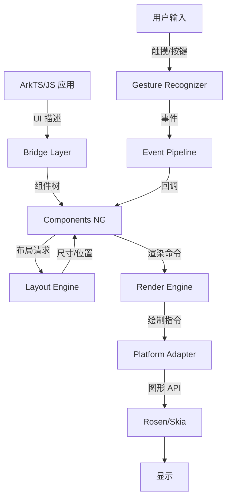

# Ace Engine 架构说明

> **文档版本**: v1.0  
> **更新时间**: 2026-02-06  
> **源码版本**: OpenHarmony ace_engine

---

## 📋 目录

1. [系统架构](#系统架构)
2. [数据流](#数据流)
3. [线程模型](#线程模型)
4. [组件生命周期](#组件生命周期)
5. [核心模块详解](#核心模块详解)

---

## 系统架构

### 1.1 四层架构概览

```
┌─────────────────────────────────────────────────────────┐
│  1. Application Layer (应用层)                          │
│     ArkTS/JS 声明式 UI 应用                             │
└─────────────────────────────────────────────────────────┘
                          ↓
┌─────────────────────────────────────────────────────────┐
│  2. Bridge Layer (桥接层)                                │
│     `frameworks/bridge/`                                 │
│     - 语言解析、状态管理、组件树构建                      │
└─────────────────────────────────────────────────────────┘
                          ↓
┌─────────────────────────────────────────────────────────┐
│  3. Component Framework (组件框架)                       │
│     `frameworks/core/components_ng/`                     │
│     - 组件逻辑、布局算法、渲染管线                        │
└─────────────────────────────────────────────────────────┘
                          ↓
┌─────────────────────────────────────────────────────────┐
│  4. Platform Adapter (平台适配层)                         │
│     `adapter/`                                          │
│     - 图形、输入、窗口抽象                                │
└─────────────────────────────────────────────────────────┘
                          ↓
┌─────────────────────────────────────────────────────────┐
│  5. OpenHarmony System Services                        │
│     - 窗口管理、输入事件、资源管理、权限控制               │
└─────────────────────────────────────────────────────────┘
```

### 1.2 各层职责

| 层级 | 目录 | 核心职责 | 证据 |
|------|------|----------|------|
| **应用层** | ArkTS/JS | UI 描述、状态定义 | - |
| **桥接层** | `frameworks/bridge/` | 语言解析、状态管理、组件树构建 | `README.md:29-30` |
| **组件框架** | `frameworks/core/components_ng/` | 组件逻辑、布局算法、渲染管线 | `README.md:33` |
| **平台适配** | `adapter/ohos/` | 平台抽象（窗口、输入、渲染） | `README.md:37` |

---

## 数据流

### 2.1 完整数据流图



### 2.2 数据流说明

| 阶段 | 输入 | 处理 | 输出 |
|------|------|------|------|
| **解析** | ArkTS/JS 代码 | 前端解析器 | 组件描述 AST |
| **构建** | 组件描述 | 组件工厂 | FrameNode 树 |
| **布局** | FrameNode 树 | 布局算法 | 尺寸/位置信息 |
| **渲染** | 布局信息 | 渲染命令生成 | DrawCommandList |
| **绘制** | DrawCommandList | 图形引擎 | 屏幕像素 |

---

## 线程模型

### 3.1 主线程 (UI Thread)

**职责**: 所有 UI 相关操作必须在主线程执行

| 操作 | 线程 | 证据 |
|------|------|------|
| 组件树修改 | UI Thread | `frameworks/core/components_ng/` |
| 布局计算 | UI Thread | `frameworks/core/components_ng/layout/` |
| 渲染命令生成 | UI Thread | `frameworks/core/components_ng/render/` |
| 事件处理 | UI Thread | `frameworks/core/components_ng/gestures/` |

### 3.2 渲染线程 (Render Thread)

**职责**: 独立于主线程的渲染操作

| 操作 | 线程 | 证据 |
|------|------|------|
| 图形绘制 | Render Thread | `adapter/ohos/` (Rosen 集成) |
| 动画计算 | Render Thread | `frameworks/core/components_ng/animation/` |
| 纹理上传 | Render Thread | `render/` |

### 3.3 平台线程 (Platform Thread)

**职责**: 平台相关的 I/O 和系统调用

| 操作 | 线程 | 证据 |
|------|------|------|
| 文件 I/O | Platform Thread | `adapter/ohos/file/` |
| 网络请求 | Platform Thread | - |
| 系统服务调用 | Platform Thread | `adapter/ohos/communication/` |

---

## 组件生命周期

### 4.1 生命周期阶段

```
┌─────────────────────────────────────────────────────────┐
│  组件生命周期 (Component Lifecycle)                       │
│                                                          │
│  1. Create (创建)                                        │
│     - 分配 FrameNode                                     │
│     - 初始化 Pattern                                    │
│     - 绑定属性                                           │
│                                                          │
│  2. Attach (挂载)                                        │
│     - 添加到父节点                                       │
│     - 建立树关系                                         │
│                                                          │
│  3. Modify (修改)                                        │
│     - 属性变更                                           │
│     - OnModifyDone() 触发                               │
│                                                          │
│  4. Layout (布局)                                         │
│     - Measure (测量)                                     │
│     - Layout (布局)                                      │
│                                                          │
│  5. Render (渲染)                                        │
│     - Paint (绘制)                                       │
│     - Draw (显示)                                        │
│                                                          │
│  6. Detach (卸载)                                        │
│     - 从树中移除                                         │
│     - 释放资源                                           │
└─────────────────────────────────────────────────────────┘
```

### 4.2 关键生命周期方法

| 方法 | 触发时机 | 职责 | 证据 |
|------|----------|------|------|
| `OnModifyDone()` | 属性修改后 | 响应属性变更 | `frameworks/core/components_ng/pattern/` |
| `OnDirtyLayoutWrapperSwap()` | 布局刷新时 | 布局更新处理 | `frameworks/core/components_ng/layout/` |
| `OnAttachToMainTree()` | 挂载到树 | 树挂载初始化 | `components_ng/base/` |
| `OnDetachFromMainTree()` | 从树卸载 | 资源清理 | `components_ng/base/` |

### 4.3 Pattern-Model 架构

Components NG 遵循 Pattern-Model 分离：

```
┌─────────────────────────────────────────────────────────┐
│  Pattern-Model 架构                                       │
│                                                          │
│  Pattern (*_pattern.h/cpp)                               │
│  ├── 业务逻辑                                            │
│  ├── 生命周期管理                                        │
│  └── 事件处理                                            │
│                                                          │
│  Model (*_model.h/cpp)                                  │
│  ├── 数据模型接口                                        │
│  └── 属性访问                                            │
│                                                          │
│  Layout Property (*_layout_property.h/cpp)               │
│  ├── 布局相关属性                                        │
│  └── 尺寸/位置参数                                       │
│                                                          │
│  Paint Property (*_paint_property.h/cpp)                │
│  ├── 渲染相关属性                                        │
│  └── 样式/效果参数                                       │
│                                                          │
│  EventHub (*_event_hub.h/cpp)                            │
│  ├── 事件注册                                            │
│  └── 回调分发                                            │
└─────────────────────────────────────────────────────────┘
```

> **证据来源**: `CLAUDE.md` - "Component Creation Flow (NG Architecture)"

---

## 核心模块详解

### 5.1 FrameNode (`components_ng/base/`)

**职责**: 组件节点的基类

| 属性/方法 | 描述 |
|-----------|------|
| `frame_node.h:65-65735` | FrameNode 类定义 |
| `frame_node.cpp` | FrameNode 实现 |

**继承关系**:
```
UINode (基类)
    └── FrameNode (组合 Pattern + Element + RenderNode)
```

### 5.2 Pattern (`components_ng/pattern/`)

**职责**: 组件的业务逻辑

| 目录 | 组件数 | 证据 |
|------|--------|------|
| `components_ng/pattern/` | 121 个组件 | `ls frameworks/core/components_ng/pattern/` |

**示例组件**:
- Text, Button, Image, Input
- Column, Row, Flex, Grid
- List, Scroll, Stack
- Navigation, Dialog, Menu

### 5.3 RenderNode (`components_ng/render/`)

**职责**: 渲染命令生成

| 目录 | 模块数 | 证据 |
|------|--------|------|
| `components_ng/render/` | 56 个渲染模块 | `ls frameworks/core/components_ng/render/` |

### 5.4 Gesture (`components_ng/gestures/`)

**职责**: 手势识别

| 目录 | 组件数 | 证据 |
|------|--------|------|
| `components_ng/gestures/` | 22 个手势模块 | `ls frameworks/core/components_ng/gestures/` |

**支持的手势**:
- Tap, LongPress, Pan, Pinch, Swipe
- Rotation, Custom gestures

### 5.5 Property System (`components_ng/property/`)

**职责**: 属性修饰器

| 目录 | 模块数 | 证据 |
|------|--------|------|
| `components_ng/property/` | 44 个属性模块 | `ls frameworks/core/components_ng/property/` |

**修饰器模式**:
```typescript
Text()
  .width(100)
  .height(50)
  .fontSize(16)
```

---

## 🔗 相关文档

- 项目概览: [00_Overview](00_Overview.md)
- N-API 接口: [02_NAPI](02_NAPI.md)
- 构建系统: [03_Build](03_Build.md)
