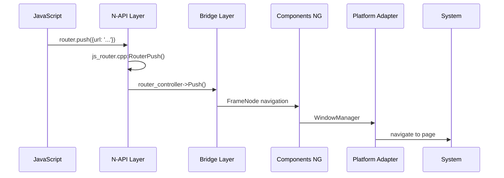

# Ace Engine N-API 接口

> **文档版本**: v1.0  
> **更新时间**: 2026-02-06  
> **源码版本**: OpenHarmony ace_engine

---

## 📋 目录

1. [N-API 模块概览](#n-api-模块概览)
2. [核心 N-API 模块](#核心-n-api-模块)
3. [高级 UI 组件模块](#高级-ui-组件模块)
4. [组件扩展模块](#组件扩展模块)
5. [接口调用链](#接口调用链)
6. [注册模式](#注册模式)

---

## N-API 模块概览

### 1.1 模块分类

Ace Engine 的 N-API 接口分为四大类：

| 分类 | 数量 | 位置 | 用途 |
|------|------|------|------|
| **核心模块** | ~30+ | `interfaces/napi/kits/` | 基础功能（路由、动画、设备） |
| **高级组件** | ~30+ | `advanced_ui_component/*/interfaces/` | 高级 UI 组件 |
| **组件扩展** | ~5 | `component_ext/*/` | 扩展组件 |
| **内部接口** | 多 | `interfaces/inner_api/` | 内部 API |

### 1.2 模块总数统计

| 搜索模式 | 匹配文件数 |
|---------|-----------|
| `napi_module_register` | ~75+ |
| `napi_define_properties` | ~47+ |
| `napi_create_function` | ~16+ |
| `napi_set_named_property` | ~47+ |

> **证据来源**: `interfaces/napi/kits/` 和 `advanced_ui_component/` 目录扫描

---

## 核心 N-API 模块

### 2.1 基础功能模块

| JS 模块名 | 命名空间 | 文件路径 | 主要功能 |
|-----------|----------|----------|----------|
| **router** | `router` | `interfaces/napi/kits/router/js_router.cpp` | 页面路由 |
| **animator** | `animator` | `interfaces/napi/kits/animator/js_animator.cpp` | 动画控制 |
| **prompt** | `prompt` | `interfaces/napi/kits/prompt/js_prompt.cpp` | 弹窗提示 |
| **font** | `font` | `interfaces/napi/kits/font/js_font.cpp` | 字体管理 |
| **device** | `device` | `interfaces/napi/kits/device/js_device.cpp` | 设备信息 |
| **mediaquery** | `mediaquery` | `interfaces/napi/kits/mediaquery/js_media_query.cpp` | 媒体查询 |
| **inspector** | `inspector` | `interfaces/napi/kits/inspector/js_inspector.cpp` | 组件检查 |
| **overlay** | `overlay` | `interfaces/napi/kits/overlay/js_overlay.cpp` | 浮层管理 |
| **uiObserver** | `uiObserver` | `interfaces/napi/kits/observer/js_ui_observer.cpp` | UI 事件观察 |

### 2.2 控制器模块

| JS 模块名 | 命名空间 | 文件路径 | 主要功能 |
|-----------|----------|----------|----------|
| **dragController** | `arkui.dragController` | `interfaces/napi/kits/drag_controller/js_drag_controller.cpp` | 拖拽控制 |
| **focusController** | `focusController` | `interfaces/napi/kits/focus_controller/js_focus_controller.cpp` | 焦点控制 |
| **promptAction** | `promptAction` | `interfaces/napi/kits/promptaction/js_prompt_action.cpp` | 提示动作 |
| **displaySync** | `displaySync` | `interfaces/napi/kits/display_sync/js_display_sync.cpp` | 显示同步 |

### 2.3 工具模块

| JS 模块名 | 命名空间 | 文件路径 | 主要功能 |
|-----------|----------|----------|----------|
| **componentUtils** | `arkui.componentUtils` | `interfaces/napi/kits/componentutils/js_component_utils.cpp` | 组件工具 |
| **componentSnapshot** | `componentSnapshot` | `interfaces/napi/kits/component_snapshot/js_component_snapshot.cpp` | 截图工具 |
| **colorSampler** | `colorSampler` | `interfaces/napi/kits/color_sampler/js_color_sampler.cpp` | 颜色采样 |
| **configuration** | `configuration` | `interfaces/napi/kits/configuration/js_configuration.cpp` | 配置信息 |
| **containerUtils** | `containerUtils` | `interfaces/napi/kits/container_utils/js_container_utils.cpp` | 容器工具 |
| **measure** | `measure` | `interfaces/napi/kits/measure/js_measure.cpp` | 测量工具 |
| **grid** | `grid` | `interfaces/napi/kits/grid/js_grid.cpp` | 网格布局 |

### 2.4 插件模块

| JS 模块名 | 命名空间 | 文件路径 | 主要功能 |
|-----------|----------|----------|----------|
| **pluginComponent** | `pluginComponent` | `interfaces/napi/kits/plugincomponent/js_plugin_component.cpp` | 插件组件 |
| **uiMaterial** | `uiMaterial` | `interfaces/napi/kits/ui_material/ui_material_napi.cpp` | UI 材质 |
| **textMenuController** | `textMenuController` | `interfaces/napi/kits/text_menu_controller/js_text_menu_controller.cpp` | 文本菜单 |
| **atomicServiceBar** | `atomicServiceBar` | `interfaces/napi/kits/atomic_service_bar/js_atomic_service_bar.cpp` | 原子服务栏 |

### 2.5 测试模块

| JS 模块名 | 命名空间 | 文件路径 | 主要功能 |
|-----------|----------|----------|----------|
| **componentTest** | `componentTest` | `interfaces/napi/kits/component_test/js_component_test.cpp` | 组件测试 |
| **componentTestComponent** | `componentTestComponent` | `interfaces/napi/kits/component_test/js_component_test_component.cpp` | 测试组件 |
| **componentTestMatcher** | `componentTestMatcher` | `interfaces/napi/kits/component_test/js_component_test_matcher.cpp` | 测试匹配器 |
| **componentTestTester** | `componentTestTester` | `interfaces/napi/kits/component_test/js_component_test_tester.cpp` | 测试执行器 |

---

## 高级 UI 组件模块

### 3.1 交互组件

| JS 模块名 | 命名空间 | 文件路径 |
|-----------|----------|----------|
| **Chip** | `arkui.advanced.Chip` | `advanced_ui_component/chip/interfaces/chip.cpp` |
| **ChipGroup** | `arkui.advanced.ChipGroup` | `advanced_ui_component/chipgroup/interfaces/chipgroup.cpp` |
| **Counter** | `arkui.advanced.Counter` | `advanced_ui_component/counter/interfaces/counter.cpp` |
| **Filter** | `arkui.advanced.Filter` | `advanced_ui_component/filter/interfaces/filter.cpp` |
| **ProgressButton** | `arkui.advanced.ProgressButton` | `advanced_ui_component/progressbutton/interfaces/progressbutton.cpp` |
| **ProgressButtonV2** | `arkui.advanced.ProgressButtonV2` | `advanced_ui_component/progressbuttonv2/interfaces/progressbuttonv2.cpp` |
| **SwipeRefresher** | `arkui.advanced.SwipeRefresher` | `advanced_ui_component/swiperefresher/interfaces/swiperefresher.cpp` |

### 3.2 导航组件

| JS 模块名 | 命名空间 | 文件路径 |
|-----------|----------|----------|
| **Dialog** | `arkui.advanced.Dialog` | `advanced_ui_component/dialog/interfaces/dialog.cpp` |
| **DialogV2** | `arkui.advanced.DialogV2` | `advanced_ui_component/dialogv2/interfaces/dialogv2.cpp` |
| **Popup** | `arkui.advanced.Popup` | `advanced_ui_component/popup/interfaces/popup.cpp` |
| **ToolBar** | `arkui.advanced.ToolBar` | `advanced_ui_component/toolbar/interfaces/toolbar.cpp` |
| **ToolBarV2** | `arkui.advanced.ToolBarV2` | `advanced_ui_component/toolbarv2/interfaces/toolbarv2.cpp` |
| **MultiNavigation** | `arkui.advanced.MultiNavigation` | `advanced_ui_component/multinavigation/interfaces/multinavigation.cpp` |
| **SplitLayout** | `arkui.advanced.SplitLayout` | `advanced_ui_component/splitlayout/interfaces/splitlayout.cpp` |

### 3.3 标题栏组件

| JS 模块名 | 命名空间 | 文件路径 |
|-----------|----------|----------|
| **SubHeader** | `arkui.advanced.SubHeader` | `advanced_ui_component/subheader/interfaces/subheader.cpp` |
| **SubHeaderV2** | `arkui.advanced.SubHeaderV2` | `advanced_ui_component/subheaderv2/interfaces/subheaderv2.cpp` |
| **EditableTitleBar** | `arkui.advanced.EditableTitleBar` | `advanced_ui_component/editabletitlebar/interfaces/editabletitlebar.cpp` |
| **SelectTitleBar** | `arkui.advanced.SelectTitleBar` | `advanced_ui_component/selecttitlebar/interfaces/selecttitlebar.cpp` |
| **ComposeTitleBar** | `arkui.advanced.ComposeTitleBar` | `advanced_ui_component/composetitlebar/interfaces/composetitlebar.cpp` |
| **TabTitleBar** | `arkui.advanced.TabTitleBar` | `advanced_ui_component/tabtitlebar/interfaces/tabtitlebar.cpp` |
| **ExceptionPrompt** | `arkui.advanced.ExceptionPrompt` | `advanced_ui_component/exceptionprompt/interfaces/exceptionprompt.cpp` |

### 3.4 选择器组件

| JS 模块名 | 命名空间 | 文件路径 |
|-----------|----------|----------|
| **SegmentButton** | `arkui.advanced.SegmentButton` | `advanced_ui_component/segmentbutton/interfaces/segmentbutton.cpp` |
| **SegmentButtonV2** | `arkui.advanced.SegmentButtonV2` | `advanced_ui_component/segmentbuttonv2/interfaces/segmentbuttonv2.cpp` |
| **TreeView** | `arkui.advanced.TreeView` | `advanced_ui_component/treeview/interfaces/treeview.cpp` |
| **SelectionMenu** | `arkui.advanced.SelectionMenu` | `advanced_ui_component/selectionmenu/interfaces/selectionmenu.cpp` |
| **FormMenu** | `arkui.advanced.FormMenu` | `advanced_ui_component/formmenu/interfaces/formmenu.cpp` |

### 3.5 特殊组件

| JS 模块名 | 命名空间 | 文件路径 |
|-----------|----------|----------|
| **ArcButton** | `arkui.advanced.ArcButton` | `advanced_ui_component/arcbutton/interfaces/arcbutton.cpp` |
| **ArcSlider** | `arkui.advanced.ArcSlider` | `advanced_ui_component/arcslider/interfaces/arcslider.cpp` |
| **FoldSplitContainer** | `arkui.advanced.FoldSplitContainer` | `advanced_ui_component/foldsplitcontainer/interfaces/foldsplitcontainer.cpp` |
| **ComposeListItem** | `arkui.advanced.ComposeListItem` | `advanced_ui_component/composelistitem/interfaces/composelistitem.cpp` |
| **GridObjectSortComponent** | `arkui.advanced.GridObjectSortComponent` | `advanced_ui_component/gridobjectsortcomponent/interfaces/gridobjectsortcomponent.cpp` |
| **FullScreenLaunchComponent** | `arkui.advanced.FullScreenLaunchComponent` | `advanced_ui_component/fullscreenlaunchcomponent/interfaces/fullscreenlaunchcomponent.cpp` |
| **DownloadFileButton** | `arkui.advanced.DownloadFileButton` | `advanced_ui_component/downloadfilebutton/interfaces/downloadfilebutton.cpp` |

---

## 组件扩展模块

### 4.1 Arc 系列组件

| JS 模块名 | 命名空间 | 文件路径 |
|-----------|----------|----------|
| **ArcSwiper** | `arkui.ArcSwiper` | `component_ext/arc_swiper/arc_swiper_napi.cpp` |
| **ArcList** | `arkui.ArcList` | `component_ext/arc_list/arc_list_napi.cpp` |
| **ArcScrollBar** | `arkui.ArcScrollBar` | `component_ext/arc_scroll_bar/arc_scroll_bar_napi.cpp` |
| **ArcAlphabetIndexer** | `arkui.ArcAlphabetIndexer` | `component_ext/arc_alphabet_indexer/arc_alphabet_indexer_napi.cpp` |

### 4.2 媒体组件

| JS 模块名 | 命名空间 | 文件路径 |
|-----------|----------|----------|
| **MovingPhoto** | `multimedia.movingphotoview` | `component_ext/movingphoto/movingphoto_napi.cpp` |

---

## 接口调用链

### 5.1 典型 N-API 调用链

```
JS 调用
    ↓
napi_create_function (创建 JS 可调用函数)
    ↓
DECLARE_NAPI_FUNCTION 宏展开
    ↓
C++ 实现函数 (如 JS_XXX)
    ↓
桥接层调用 (frameworks/bridge/)
    ↓
组件层处理 (frameworks/core/components_ng/)
    ↓
平台适配 (adapter/ohos/)
    ↓
系统服务
```

### 5.2 router 模块调用链示例



---

## 注册模式

### 6.1 标准模块注册模式

所有 N-API 模块遵循标准的三步注册模式：

```cpp
// 1. 定义导出属性数组
static napi_value ModuleExport(napi_env env, napi_value exports)
{
    napi_property_descriptor moduleDesc[] = {
        DECLARE_NAPI_FUNCTION("functionName", JSFunctionName),
        DECLARE_NAPI_PROPERTY("PropertyName", propertyValue),
    };
    NAPI_CALL(env, napi_define_properties(
        env, exports,
        sizeof(moduleDesc) / sizeof(moduleDesc[0]),
        moduleDesc
    ));
    return exports;
}

// 2. 定义 napi_module 结构体
static napi_module moduleName = {
    .nm_version = 1,
    .nm_flags = 0,
    .nm_filename = nullptr,
    .nm_register_func = ModuleExport,
    .nm_modname = "module.name",
    .nm_priv = ((void*)0),
    .reserved = { 0 },
};

// 3. 注册模块
extern "C" __attribute__((constructor)) void ModuleRegister()
{
    napi_module_register(&moduleName);
}
```

### 6.2 宏定义

| 宏 | 用途 | 证据 |
|------|------|------|
| `DECLARE_NAPI_FUNCTION` | 声明函数属性 | `interfaces/napi/kits/` |
| `DECLARE_NAPI_PROPERTY` | 声明值属性 | `interfaces/napi/kits/` |
| `NAPI_CALL` | 检查并返回 N-API 错误 | `interfaces/napi/` |

### 6.3 关键 N-API 函数

| 函数 | 用途 |
|------|------|
| `napi_module_register` | 注册 N-API 模块 |
| `napi_define_properties` | 定义导出属性 |
| `napi_create_function` | 创建 JS 可调用函数 |
| `napi_set_named_property` | 设置命名属性 |
| `napi_get_value_string_utf8` | 获取字符串参数 |
| `napi_get_boolean` | 获取布尔参数 |
| `napi_create_object` | 创建 JS 对象 |
| `napi_create_array` | 创建 JS 数组 |

---

## 🔗 相关文档

- 项目概览: [00_Overview](00_Overview.md)
- 架构说明: [01_Architecture](01_Architecture.md)
- 构建系统: [03_Build](03_Build.md)
- 安全评审: [04_Security](04_Security.md)
