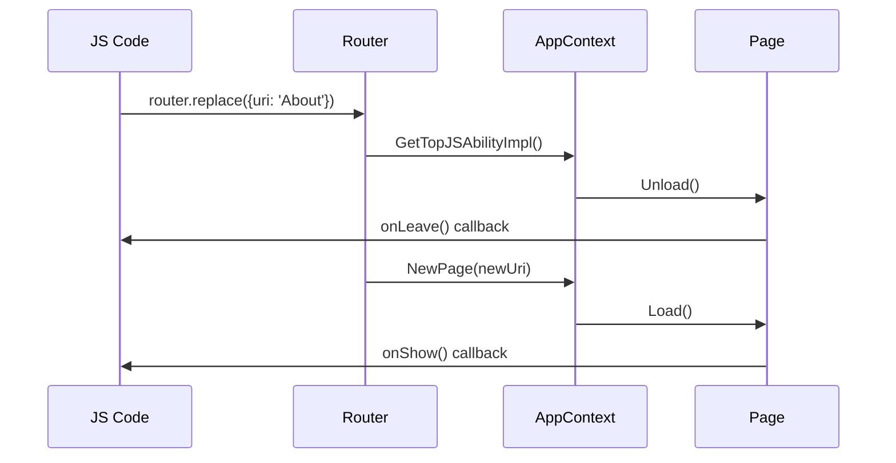
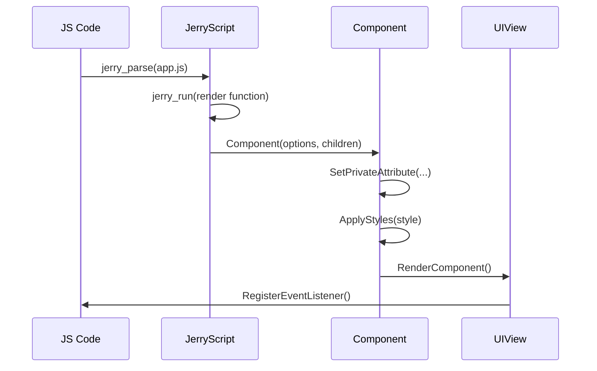
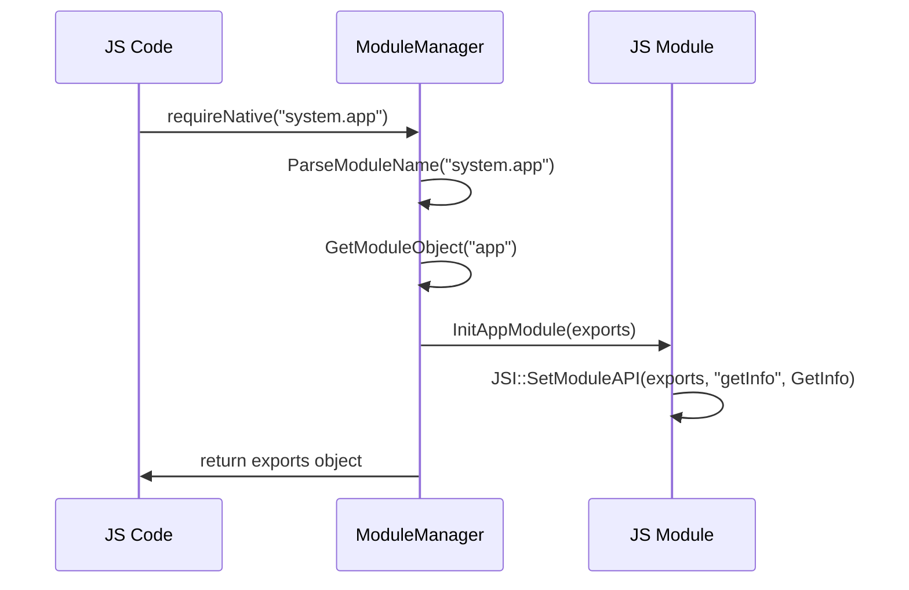

# 架构设计

## 目的

本文档详细说明 ace_engine_lite 的架构设计，包括分层架构、数据流、线程模型和关键时序。

## 适用范围

- arkui_ace_engine_lite 3.1 版本
- 所有源代码（排除 test/）

---

## 分层架构

```
┌─────────────────────────────────────────────────────────────────┐
│                    JavaScript 应用层                            │
│              (Declarative UI + Business Logic)                │
│                                                              │
│  ┌──────────────┐  ┌──────────────┐                       │
│  │   组件声明    │  │   路由调用   │                       │
│  │ <div>...</div>│  │ router.replace│                       │
│  └──────────────┘  └──────────────┘                       │
└──────────────────────────────────┬───────────────────────────────────────┘
                           │
                           ▼
┌─────────────────────────────────────────────────────────────────┐
│                   JS 模块层 (Module Layer)                    │
│                                                             │
│  ┌──────────┐  ┌──────────┐  ┌──────────┐       │
│  │system.app│  │system.   │  │ohos.feature│       │
│  │app.getInfo│  │router    │  │ability     │       │
│  └──────────┘  └──────────┘  └──────────┘       │
│                                                             │
└──────────────────────────────────┬───────────────────────────────────────┘
                           │
                           ▼
┌─────────────────────────────────────────────────────────────────┐
│                 JS 框架层 (Framework Layer)                  │
│                                                             │
│  ┌──────────────┐  ┌──────────────┐                   │
│  │   模块管理器   │  │   JSI 层     │                   │
│  │ModuleManager   │  │(JerryScript)  │                   │
│  └──────────────┘  └──────────────┘                   │
│  ┌──────────────┐  ┌──────────────┐                   │
│  │   核心模块     │  │   路由       │                   │
│  │ Components     │  │   Router      │                   │
│  │ StyleManager   │  │   Context     │                   │
│  └──────────────┘  └──────────────┘                   │
└──────────────────────────────────┬───────────────────────────────────────┘
                           │
                           ▼
┌─────────────────────────────────────────────────────────────────┐
│              JS 运行时层 (Runtime Layer)                      │
│                  JerryScript 引擎                               │
│              (解析和执行 JavaScript 代码)                        │
└──────────────────────────────────┬───────────────────────────────────────┘
                           │
                           ▼
┌─────────────────────────────────────────────────────────────────┐
│               图形层 (Graphics Layer)                         │
│                   UI Lite (2D 图形框架)                      │
└─────────────────────────────────────────────────────────────────┘
```

---

## 核心模块架构

### 1. JS Data Binding (数据绑定)

**职责**：实现 JS 对象与 C++ 对象的双向数据绑定

**关键组件**：
- **Watcher**: 监听 JS 对象属性变化并触发 UI 更新
- **Directive**: 处理指令（v-for、v-if 等）
- **Lazy Load**: 延迟加载组件

**证据**：
- Watcher 回调：`frameworks/src/core/base/js_fwk_common.h:238-269`
- 指令解析：`frameworks/src/core/directive/descriptor_utils.cpp`

### 2. JS Framework (框架层)

**职责**：提供声明式 UI 和应用运行时支持

**关键子模块**：

#### Components（组件系统）
**职责**：UI 组件的创建、渲染、事件处理

**核心类**：
```cpp
// frameworks/src/core/components/component.h
class Component {
public:
    Component(JSIValue options, JSIValue children, AppStyleManager *styleManager);
    virtual ~Component();
    
    // 属性设置
    virtual bool SetPrivateAttribute(uint16_t attrKeyId, JSIValue attrValue);
    virtual bool RegisterPrivateEventListener(uint16_t eventTypeId, JSIValue funcValue, bool isStopPropagation);
    
    // 渲染
    virtual UIView* RenderComponent(bool isRenderTree);
    virtual UIView* GetNativeView() const;
    
    // 样式
    virtual void ApplyStyles(AppStyleManager *styleManager);
};
```

**证据**：`frameworks/src/core/components/component.h`

#### Router（路由系统）
**职责**：页面路由和状态管理

**核心类**：
```cpp
// frameworks/src/core/router/js_router.h
class Router {
public:
    JSIValue Replace(JSIValue object, bool async = true);
};
```

**证据**：`frameworks/src/core/router/js_router.h:26-54`

#### StyleManager（样式管理）
**职责**：解析和应用 CSS 样式

**核心类**：
```cpp
// frameworks/src/core/stylemgr/app_style_manager.h
class AppStyleManager {
public:
    void InitStyleSheet(JSIValue jsStyleSheetObj);
    void ApplyComponentStyles(const JSIValue options, Component& curr);
    void HandleStaticStyle(const JSIValue options, Component& curr);
    void HandleDynamicStyle(const JSIValue options, Component& curr);
};
```

**证据**：`frameworks/src/core/stylemgr/app_style_manager.h:21-47`

#### Context（上下文管理）
**职责**：应用环境、JS 引擎管理、Ability 生命周期

**核心类**：
```cpp
// frameworks/src/core/context/js_app_context.h
class JsAppContext {
public:
    JSIValue Eval(char *fullPath, size_t fullPathLength, bool isAppEval) const;
    JSIValue Render(JSIValue viewModel) const;
    void TerminateAbility();
    const char* GetCurrentBundleName();
    const char* GetCurrentAbilityPath();
};
```

**证据**：`frameworks/src/core/context/js_app_context.h:35-68`

### 3. JSI (JavaScript Interface)

**职责**：JerryScript 引擎的 C++ 封装层

**关键 API**：
```cpp
// interfaces/inner_api/builtin/jsi/jsi.h
class JSI {
public:
    // 值创建
    static JSIValue CreateObject();
    static JSIValue CreateNumber(double value);
    static JSIValue CreateString(const char *value);
    static JSIValue CreateUndefined();
    
    // 属性操作
    static void SetProperty(JSIValue object, JSIValue key, JSIValue value);
    static void SetNamedProperty(JSIValue object, const char * const propName, JSIValue value);
    static JSIValue GetNamedProperty(JSIValue object, const char * const propName);
    
    // 函数调用
    static JSIValue CallJSFunction(const JSIValue func, const JSIValue context, 
                                 const JSIValue args[], uint8_t argsCount);
    
    // 类型检查
    static bool ValueIsUndefined(JSIValue value);
    static bool ValueIsFunction(JSIValue value);
    static bool ValueIsObject(JSIValue value);
    
    // 内存管理
    static void ReleaseValue(JSIValue value, ...);
};
```

**证据**：`interfaces/inner_api/builtin/jsi/jsi.h:82-325`

### 4. Module Manager（模块管理器）

**职责**：JS 模块的加载、初始化和生命周期管理

**核心流程**：
```cpp
// frameworks/module_manager/module_manager.h:53
JSIValue RequireModule(const char * const moduleName);

// frameworks/src/core/modules/presets/require_module.cpp:23
JSIValue Require(const JSIValue thisVal, const JSIValue *args, uint8_t argsNum);
```

**证据**：`frameworks/module_manager/module_manager.h:53`, `frameworks/src/core/modules/presets/require_module.cpp:23`

---

## 数据流

### 应用启动数据流

```
┌─────────────────────────────────────────────────────────┐
│ 1. Ability 启动                                      │
│    AceAbility::OnStart()                               │
│    ↓                                                   │
│ 2. 读取 manifest.json                               │
│    AppConfig::GetInfo()                                │
│    ↓                                                   │
│ 3. 初始化 JS 引擎                                    │
│    JsAppEnvironment::InitJsFramework()                   │
│    - jerry_init()                                     │
│    - LoadAceBuiltInModules()                           │
│    - LoadFramework()                                  │
│    ↓                                                   │
│ 4. 加载应用 JS 代码                                  │
│    JsAppContext::Eval(app.js)                         │
│    - jerry_parse() + jerry_run()                      │
│    ↓                                                   │
│ 5. 创建组件树                                      │
│    JSI::CallJSFunction(render(), viewModel)               │
│    - Component::RenderComponent()                       │
│    ↓                                                   │
│ 6. 应用样式                                         │
│    StyleManager::ApplyComponentStyles()                    │
│    ↓                                                   │
│ 7. 生成 UI 组件树                                  │
│    UIView::Add()                                       │
│    ↓                                                   │
│ 8. 渲染到屏幕                                      │
│    UI Lite 渲染                                     │
└─────────────────────────────────────────────────────────────────┘
```

### 数据绑定数据流

```
┌─────────────────────────────────────────────────────────┐
│  JS 对象属性变化                                      │
│    app.data.counter = 10                                │
│    ↓                                                   │
│  Watcher 回调触发                                       │
│    WatcherCallbackFunc(newVal, oldVal, element)            │
│    ↓                                                   │
│  查找对应的 UI 组件                                    │
│    FindElementById(id)                                │
│    ↓                                                   │
│  更新组件属性                                          │
│    Component::SetPrivateAttribute(attrKey, newVal)          │
│    ↓                                                   │
│  触发重新渲染                                        │
│    Component::RenderComponent()                           │
└─────────────────────────────────────────────────────────────────┘
```

**证据**：`frameworks/src/core/base/js_fwk_common.h:238-269`

---

## 线程模型

### JS 执行线程

**模型**：单线程 JS 执行（JerryScript 主线程）

**证据**：
```cpp
// frameworks/native_engine/async/js_async_work.h:62-135
// 异步任务在主线程执行
class JsAsyncWork {
public:
    static void DispatchAsyncWork(const JSIValue func, const JSIValue context,
                              const JSIValue args[], uint8_t argsCount);
};
```

### 异步任务机制

**用途**：处理耗时操作不阻塞 JS 主线程

**实现**：
```cpp
// frameworks/native_engine/async/js_async_work.cpp:39-121
// 通过消息队列分发异步任务
void JsAsyncWork::DispatchAsyncWork(...) {
    MessageQueueUtils::PutMessage(...);  // 投递到工作线程
}
```

**证据**：`frameworks/native_engine/async/js_async_work.cpp:39-121`

### 消息队列

**实现**：CMSIS-RTOS2 消息队列（用于跨线程通信）

**证据**：`frameworks/native_engine/async/message_queue_utils.cpp`

---

## 关键时序

### 路由时序



**证据**：`frameworks/src/core/router/js_page_state_machine.cpp`

### 组件渲染时序



**证据**：`frameworks/src/core/components/component.cpp`

### 模块加载时序



**证据**：`frameworks/module_manager/module_manager.cpp:30-66`

---

## 设计模式

### 1. 观察者模式 (Observer Pattern)

**应用**：Watcher 机制监听 JS 对象属性变化

**证据**：`frameworks/src/core/base/js_fwk_common.h:238-269`

### 2. 工厂模式 (Factory Pattern)

**应用**：ComponentFactory 根据组件名称创建组件实例

**证据**：`frameworks/src/core/components/component_factory.h:72`

### 3. 单例模式 (Singleton Pattern)

**应用**：ModuleManager, JsAppContext, AppStyleManager 等使用单例

**证据**：
- `frameworks/module_manager/module_manager.h:41-45`
- `frameworks/src/core/context/js_app_context.h:41-45`

### 4. 策略模式 (Strategy Pattern)

**应用**：不同平台使用不同的 platform_adapter 实现

**证据**：`frameworks/src/core/base/product_adapter.cpp`

### 5. 模板方法模式 (Template Method Pattern)

**应用**：Component 基类定义渲染模板，子类实现具体渲染逻辑

**证据**：`frameworks/src/core/components/component.h` (virtual RenderComponent())

---

## 事件系统

### 事件类型

| 事件类型 | 说明 | 触发方式 |
|---------|------|----------|
| click | 点击事件 | onclick 属性 |
| longpress | 长按事件 | onlongpress 属性 |
| touch | 触摸事件 | ontouchstart, ontouchmove, ontouchend 属性 |
| swipe | 滑动事件 | onswipe 属性 |
| change | 值变化事件 | onchange 属性 |
| statechange | 状态变化事件 | onstatechange 属性 |

**证据**：`frameworks/src/core/components/event_listener.h`

### 事件处理流程

```
用户交互 → JS 事件处理器 → Component::RegisterEventListener() 
    → ViewOnClickListener::operator() → JSI::CallJSFunction()
```

**证据**：`frameworks/src/core/components/event_listener.cpp:107-156`

---

## 内存管理

### JS 值生命周期

```cpp
// 引用计数机制
JSIValue value = JSI::CreateObject();
// ... 使用 value ...
JSI::ReleaseValue(value, VA_ARG_END_FLAG);  // 减少引用计数
```

**证据**：`interfaces/inner_api/builtin/jsi/jsi.h`

### 内存堆管理

**证据**：`frameworks/src/core/base/scope_js_value.h:31-61`

---

## 相关跳转

- [00_Overview.md](00_Overview.md) - 概览
- [01_Positioning.md](01_Positioning.md) - 定位
- [02_Directory_Structure.md](02_Directory_Structure.md) - 目录结构
- [04_JS_API.md](04_JS_API.md) - JS 模块 API
- [05_Inner_API.md](05_Inner_API.md) - 内部 API
- [06_GN_Targets.md](06_GN_Targets.md) - GN 构建目标
- [07_Build_Artifacts.md](07_Build_Artifacts.md) - 编译产物
