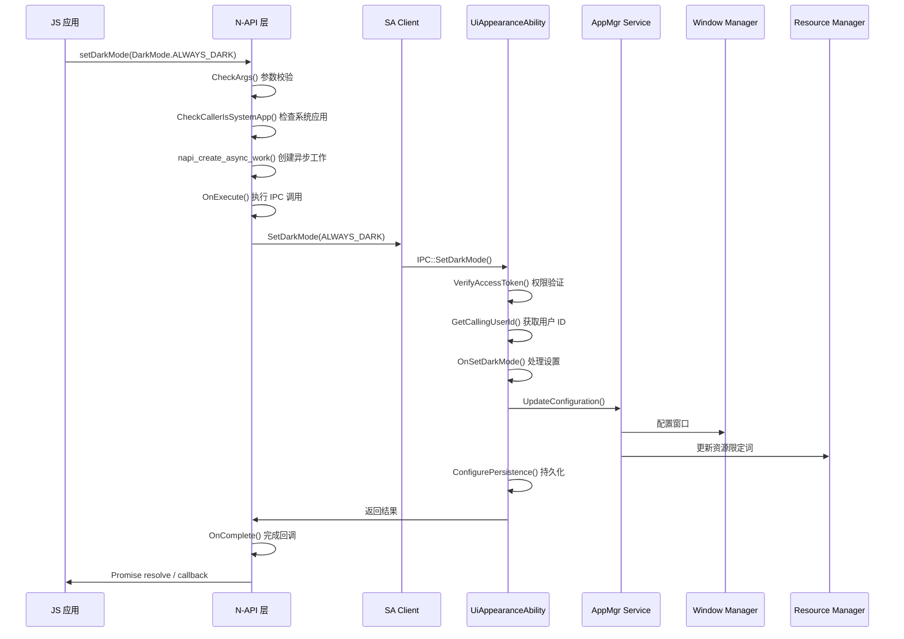
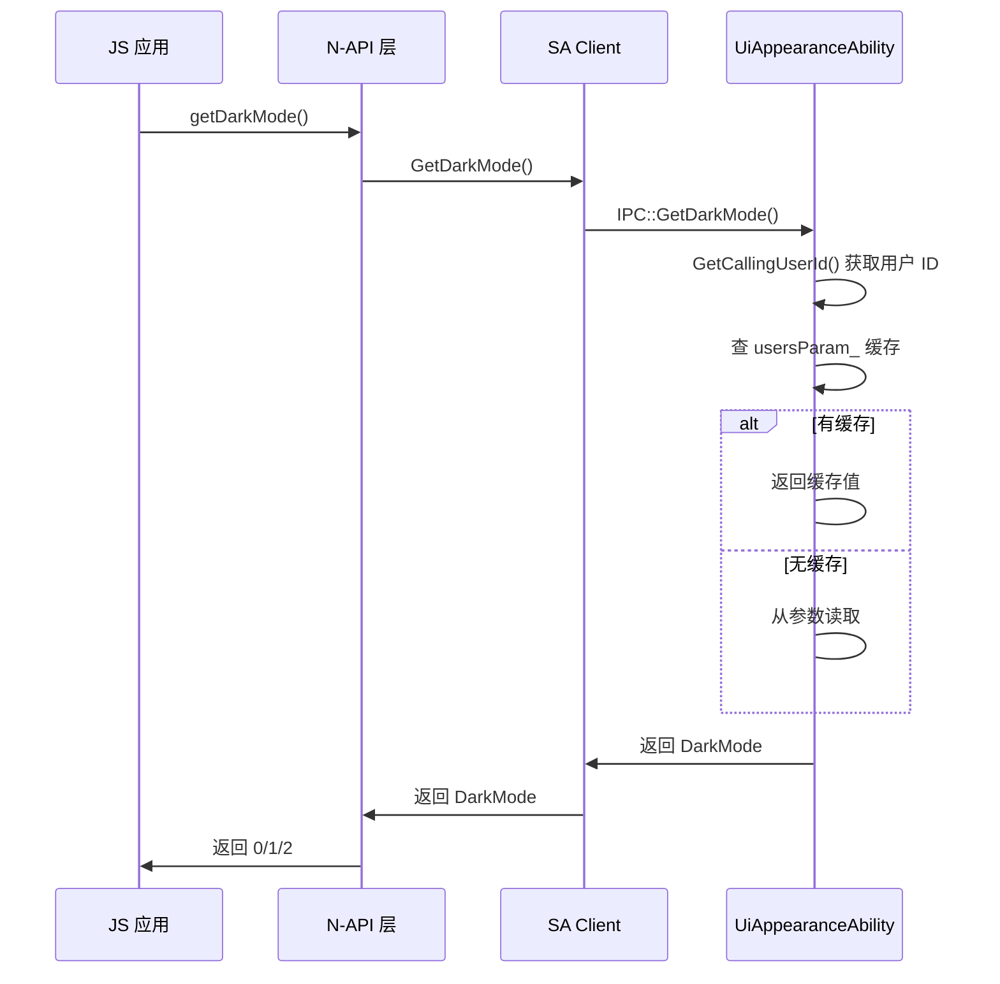

# 架构设计

> UI Appearance 子系统组件图、数据流、线程模型

## 整体架构

### 架构图

```
┌─────────────────────────────────────────────────────────────────────────┐
│                         应用层 (App)                                      │
│  ┌─────────────────────────────────────────────────────────────────┐   │
│  │                    系统应用 (System App)                          │   │
│  │  ┌─────────────────────────────┐  ┌─────────────────────────┐    │   │
│  │  │ Settings (设置应用)          │  │ 其他系统应用            │    │   │
│  │  │                             │  │                         │    │   │
│  │  │ setDarkMode()/getDarkMode() │  │ setFontScale()          │    │   │
│  │  └─────────────────────────────┘  └─────────────────────────┘    │   │
│  └─────────────────────────────────────────────────────────────────┘   │
└─────────────────────────────────────────────────────────────────────────┘
                                    ↓
┌─────────────────────────────────────────────────────────────────────────┐
│                      N-API 层 (ArkUI N-API)                             │
│  ┌─────────────────────────────────────────────────────────────────┐   │
│  │  interfaces/kits/napi/src/js_ui_appearance.cpp                  │   │
│  │                                                               │   │
│  │  exports:                                                     │   │
│  │  ├── setDarkMode()  ├── getDarkMode()                         │   │
│  │  ├── setFontScale() ├── getFontScale()                        │   │
│  │  └── setFontWeightScale() └── getFontWeightScale()           │   │
│  └─────────────────────────────────────────────────────────────────┘   │
└─────────────────────────────────────────────────────────────────────────┘
                                    ↓
┌─────────────────────────────────────────────────────────────────────────┐
│                     IPC 层 (跨进程通信)                                   │
│  ┌─────────────────────────────────────────────────────────────────┐   │
│  │  services/src/ui_appearance_ability_client.cpp                   │   │
│  │                                                               │   │
│  │  UiAppearanceAbilityClient (Proxy)                             │   │
│  │                                                               │   │
│  │  IUiAppearanceAbility (IPC Interface)                          │   │
│  └─────────────────────────────────────────────────────────────────┘   │
└─────────────────────────────────────────────────────────────────────────┘
                                    ↓
┌─────────────────────────────────────────────────────────────────────────┐
│                   System Ability 层 (SA)                                 │
│  ┌─────────────────────────────────────────────────────────────────┐   │
│  │  SA ID: 7002                                                   │   │
│  │  Process: ui_service                                           │   │
│  │  Lib: libui_appearance_service.z.so                           │   │
│  │                                                               │   │
│  │  ┌─────────────────────────────────────────────────────────┐   │   │
│  │  │              UiAppearanceAbility                        │   │   │
│  │  │  ├── 权限验证 (VerifyAccessToken)                      │   │   │
│  │  │  ├── 配置管理 (UpdateConfiguration)                    │   │   │
│  │  │  └── 公共事件订阅                                       │   │   │
│  │  └─────────────────────────────────────────────────────────┘   │   │
│  │                                                               │   │
│  │  ┌─────────────────────┐  ┌─────────────────────────────┐   │   │
│  │  │  DarkModeManager   │  │   SmartGestureManager        │   │   │
│  │  │  ├── 定时器管理     │  │   ├── 状态监听              │   │   │
│  │  │  └── 设置监听       │  │   └── 更新回调              │   │   │
│  │  └─────────────────────┘  └─────────────────────────────┘   │   │
│  └─────────────────────────────────────────────────────────────────┘   │
└─────────────────────────────────────────────────────────────────────────┘
                                    ↓
┌─────────────────────────────────────────────────────────────────────────┐
│                      系统服务层                                          │
│  ┌───────────────────┐  ┌───────────────────┐  ┌─────────────────────┐ │
│  │   AMS            │  │   WMS             │  │   Resource Manager  │ │
│  │   (配置更新)      │  │   (窗口配置)       │  │   (限定词更新)      │ │
│  └───────────────────┘  └───────────────────┘  └─────────────────────┘ │
└─────────────────────────────────────────────────────────────────────────┘
                                    ↓
┌─────────────────────────────────────────────────────────────────────────┐
│                      AceEngine (ArkUI)                                  │
│  ┌─────────────────────────────────────────────────────────────────┐   │
│  │  资源刷新、UI 重绘                                               │   │
│  └─────────────────────────────────────────────────────────────────┘   │
└─────────────────────────────────────────────────────────────────────────┘
```

## 数据流

### 设置深色模式流程

```
1. JS调用 setDarkMode(DarkMode.ALWAYS_DARK)
   ↓
2. N-API: JsUiAppearance::JSSetDarkMode()
   ├─ 参数校验 (DarkMode 类型)
   ├─ 检查系统应用 (CheckCallerIsSystemApp)
   └─ 创建异步工作 (napi_create_async_work)
   ↓
3. OnExecute: UiAppearanceAbilityClient::SetDarkMode()
   ├─ 获取 SA Proxy
   └─ IPC 调用 SetDarkMode(ALWAYS_DARK)
   ↓
4. UiAppearanceAbility::SetDarkMode()
   ├─ 权限验证 (VerifyAccessToken)
   ├─ 获取调用用户 ID
   ├─ 更新配置 (UpdateConfiguration)
   │   └─ AppMgrService::UpdateConfiguration()
   │       ├─ 通知 WMS 更新窗口配置
   │       ├─ 通知 ResourceManager 更新限定词
   │       └─ 通知 AceEngine 刷新资源
   └─ 持久化配置 (ConfigurePersistence)
   ↓
5. OnComplete: 回调 Promise/AsyncCallback
```

### 关键数据流

| 步骤 | 数据 | 说明 |
|------|------|------|
| JS → N-API | DarkMode (0/1) | 深色模式枚举值 |
| N-API → Client | DarkMode enum | 传递到 SA |
| SA → AMS | Configuration | 配置更新请求 |
| AMS → WMS | Configuration | 窗口配置 |
| AMS → Resource | Qualifier | 资源限定词 |

## 线程模型

### 线程划分

```
┌─────────────────────────────────────────────────────────────────┐
│                     主线程 (Main Thread)                         │
│                                                                  │
│  ┌─────────────────────────────────────────────────────────────┐ │
│  │ UiAppearanceAbility (SA 主线程)                           │ │
│  │  - OnStart/OnStop 生命周期                                 │ │
│  │  - OnAddSystemAbility 初始化                              │ │
│  │  - 配置更新 (UpdateConfiguration)                          │ │
│  │  - 公共事件处理 (CommonEventSubscriber)                    │ │
│  └─────────────────────────────────────────────────────────────┘ │
└─────────────────────────────────────────────────────────────────┘
                              ↓
┌─────────────────────────────────────────────────────────────────┐
│                  N-API 线程 (LibNAPI 线程池)                     │
│                                                                  │
│  ┌─────────────────────────────────────────────────────────────┐ │
│  │ napi_async_work 执行线程                                   │ │
│  │  - OnExecute: IPC 调用                                     │ │
│  │  - OnComplete: 回调完成                                    │ │
│  └─────────────────────────────────────────────────────────────┘ │
└─────────────────────────────────────────────────────────────────┘
                              ↓
┌─────────────────────────────────────────────────────────────────┐
│                    定时器线程 (Timer Thread)                     │
│                                                                  │
│  ┌─────────────────────────────────────────────────────────────┐ │
│  │ AlarmTimerManager                                          │ │
│  │  - 自动深色模式切换                                         │ │
│  │  - 日出日落时间触发                                         │ │
│  └─────────────────────────────────────────────────────────────┘ │
└─────────────────────────────────────────────────────────────────┘
```

### 线程安全

| 资源 | 保护机制 | 说明 |
|------|----------|------|
| usersParam_ | std::mutex | 用户配置映射表 |
| darkModeStates_ | std::mutex | 深色模式状态 |
| userSwitchUpdateConfigurationOnceFlag_ | std::mutex | 防止重复更新 |
| settingDataObservers_ | std::mutex | 设置观察者列表 |

## 调用链详细图

### setDarkMode 调用链 (Mermaid)



### getDarkMode 调用链 (Mermaid)



## 模块依赖

### 依赖方向

```
js_ui_appearance.cpp (N-API)
    ↓
ui_appearance_ability_client.cpp (Client Proxy)
    ↓
ui_appearance_ability.cpp (SA)
    ├── dark_mode_manager.cpp (深色模式)
    ├── smart_gesture_manager.cpp (手势)
    ├── setting_data_manager.cpp (数据)
    ├── alarm_timer_manager.cpp (定时器)
    └── parameter_wrap.cpp (参数)
```

### 外部依赖

| 模块 | 用途 |
|------|------|
| ability_runtime | AppMgr, Configuration |
| access_token | 权限验证 |
| ipc | IPC 框架 |
| samgr | SA 管理 |
| common_event_service | 公共事件 |
| os_account | 账户管理 |
| hilog | 日志 |

## 生命周期

### SA 生命周期

```
系统启动
    │
    ▼
OnStart()
├─ Publish(this)          // 注册到 SAMGR
└─ AddSystemAbilityListener(APP_MGR_SERVICE_ID)
    │
    ▼
OnAddSystemAbility(APP_MGR_SERVICE_ID)
├─ Initialize DarkModeManager
├─ Initialize SmartGestureManager
├─ SubscribeCommonEvent()
│   ├─ COMMON_EVENT_BOOT_COMPLETED
│   ├─ COMMON_EVENT_USER_SWITCHED
│   ├─ COMMON_EVENT_TIME_CHANGED
│   └─ ...
└─ DoInitProcess()
    │
    ▼
正常运行
├─ 处理 API 请求
├─ 处理配置更新
└─ 处理事件通知
    │
    ▼
OnStop()
    │
    ▼
SA 停止
```

---

*相关内容: [项目概述](01_Overview.md) | [N-API 接口](03_NAPI.md)*
