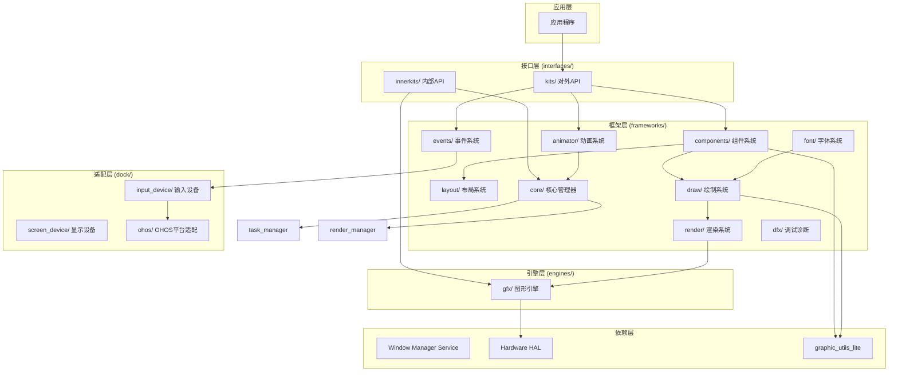
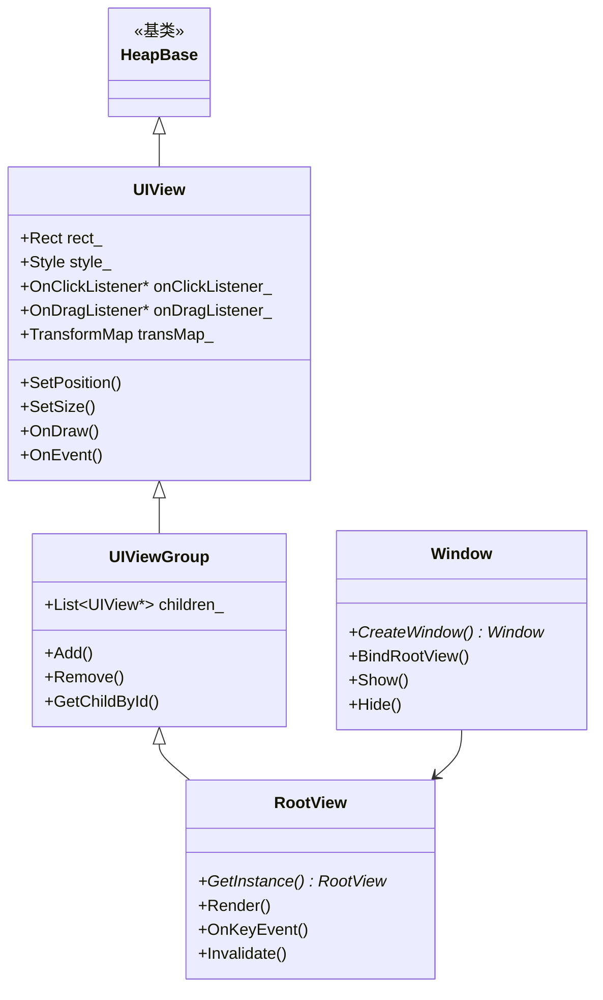
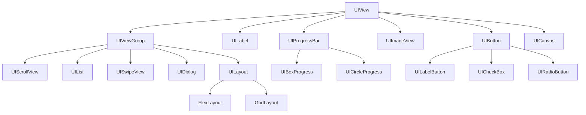
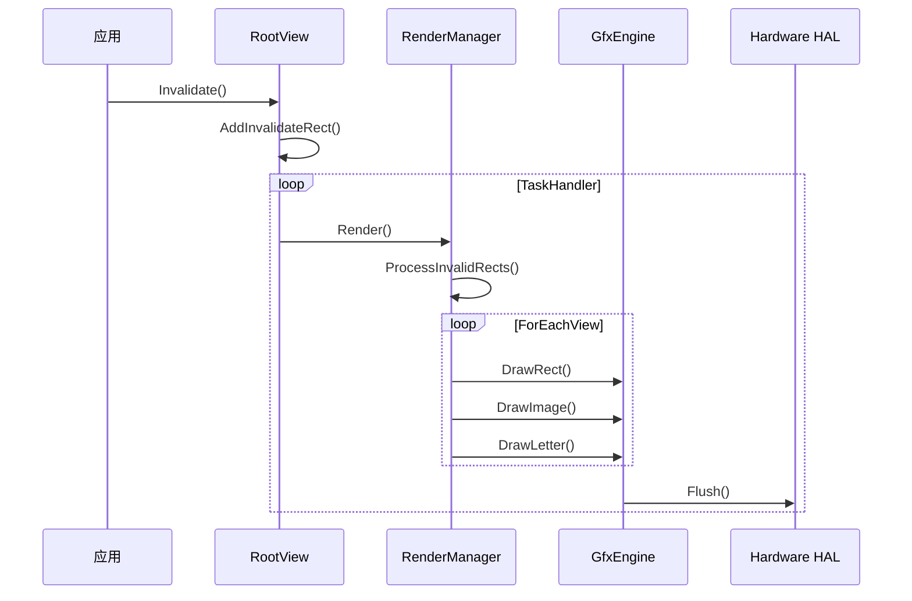
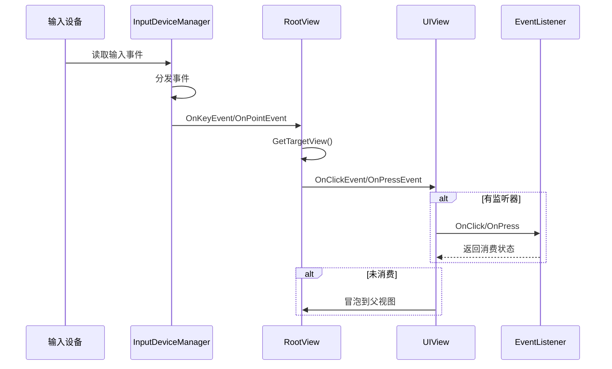
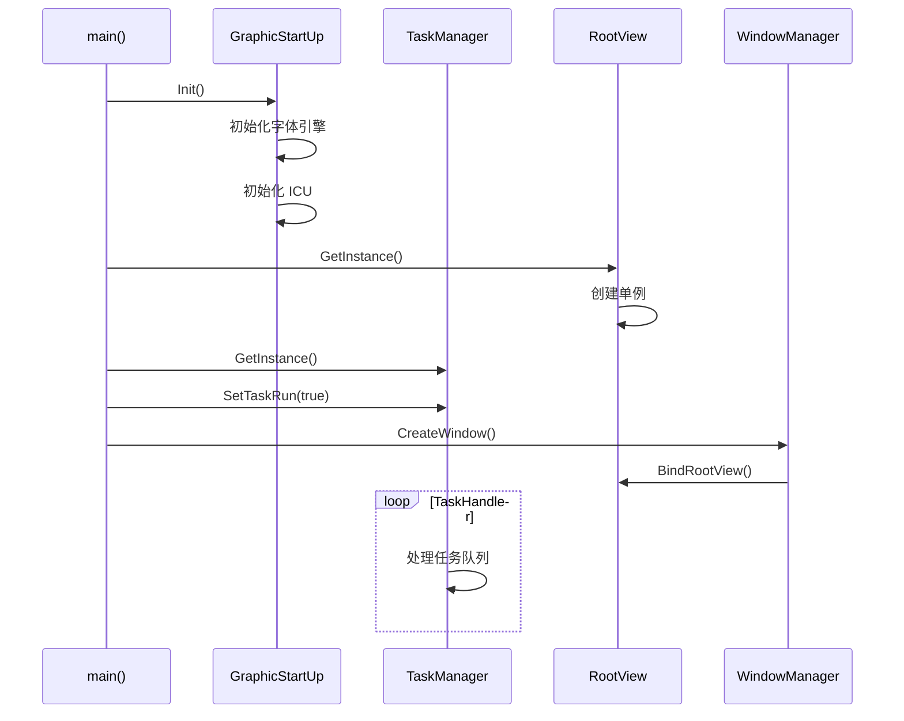
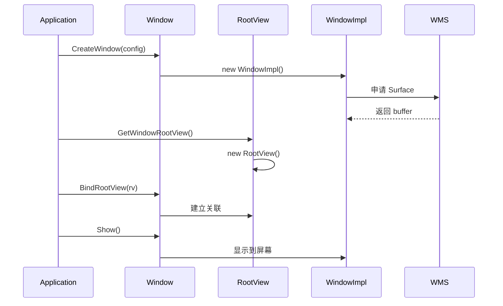
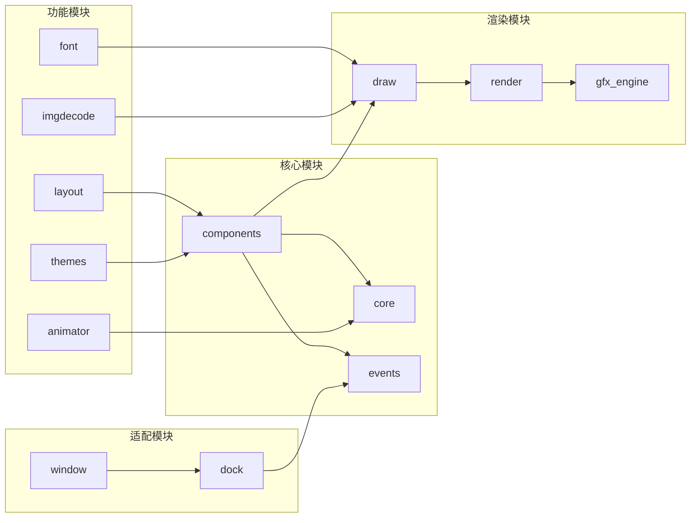
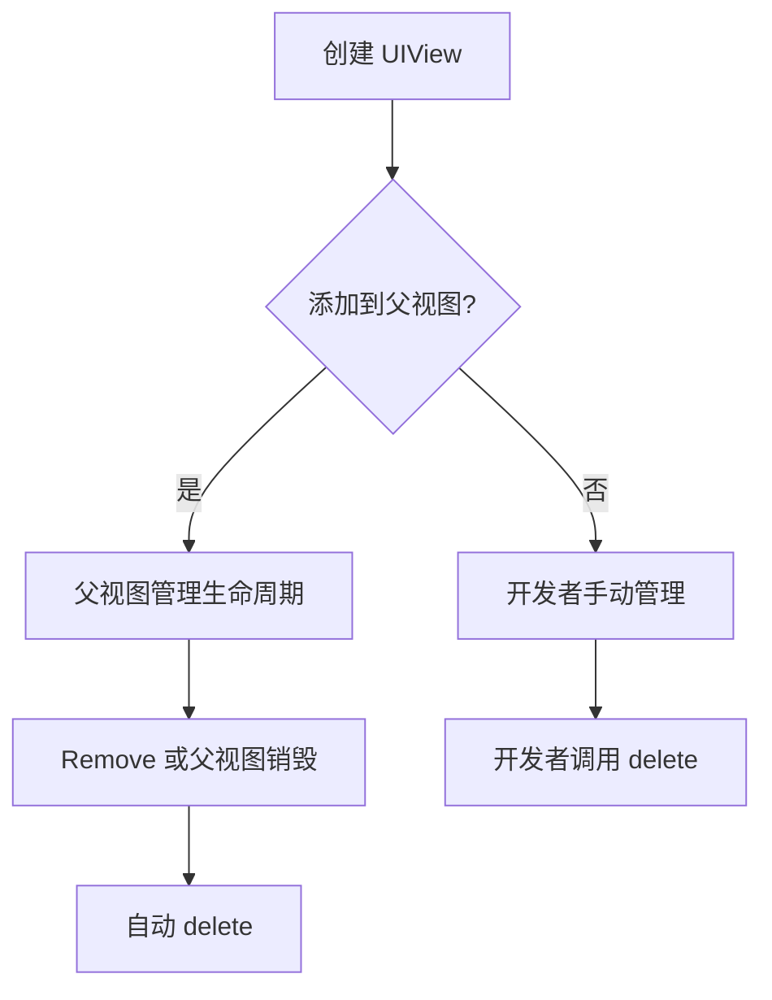

# ui_lite 架构说明

## 文档信息

- **文档用途**: 描述 ui_lite 的系统架构、组件关系、数据流和线程模型
- **适用范围**: 架构师、开发者、安全评审人员
- **相关文档**: [项目概览](01_Overview.md), [目录结构](03_Directory_Structure.md)

## 架构概览

ui_lite 采用分层架构设计，从下到上依次为：硬件抽象层、引擎层、核心层、组件层和接口层。



## 核心组件架构

### 1. 视图层次结构



**证据**:
- `UIView` 基类: [interfaces/kits/components/ui_view.h](interfaces/kits/components/ui_view.h)
- `UIViewGroup` 容器: [interfaces/kits/components/ui_view_group.h](interfaces/kits/components/ui_view_group.h)
- `RootView` 根视图: [interfaces/kits/components/root_view.h](interfaces/kits/components/root_view.h)
- `Window` 窗口: [interfaces/kits/window/window.h](interfaces/kits/window/window.h)

### 2. 组件继承体系



## 数据流

### 渲染数据流



**关键代码路径**:
1. `RootView::Invalidate()` → `AddInvalidateRect()` ([frameworks/components/root_view.cpp](frameworks/components/root_view.cpp))
2. `RenderManager::Render()` → 处理脏矩形 ([frameworks/core/render_manager.cpp](frameworks/core/render_manager.cpp))
3. `BaseGfxEngine::DrawRect/DrawImage/DrawLetter` ([interfaces/innerkits/engines/gfx/gfx_engine_manager.h](interfaces/innerkits/engines/gfx/gfx_engine_manager.h))

### 事件数据流



**关键代码路径**:
1. `InputDeviceManager` 事件分发 ([interfaces/innerkits/common/input_device_manager.h](interfaces/innerkits/common/input_device_manager.h))
2. `RootView::GetTargetView()` 命中测试 ([frameworks/components/root_view.cpp](frameworks/components/root_view.cpp))
3. `UIView::OnClickEvent/OnPressEvent` 事件处理 ([interfaces/kits/components/ui_view.h](interfaces/kits/components/ui_view.h))

## 线程模型

### 主线程架构

```
┌─────────────────────────────────────────────────────────────┐
│                        主线程 (UI Thread)                    │
├─────────────────────────────────────────────────────────────┤
│  ┌──────────────┐  ┌──────────────┐  ┌──────────────┐       │
│  │   事件循环    │  │   动画更新    │  │   渲染输出    │       │
│  │              │  │              │  │              │       │
│  │ InputDevice  │  │ Animator     │  │ RenderManager│       │
│  │   → Event    │  │   → Task     │  │   → GfxEngine│       │
│  └──────────────┘  └──────────────┘  └──────────────┘       │
│                                                             │
│  ┌──────────────────────────────────────────────────────┐  │
│  │              TaskManager::TaskHandler()               │  │
│  │  统一任务调度：输入事件 + 动画任务 + 渲染任务          │  │
│  └──────────────────────────────────────────────────────┘  │
└─────────────────────────────────────────────────────────────┘
```

### 任务调度机制

```cpp
// 证据: interfaces/innerkits/common/task_manager.h
class TaskManager : public HeapBase {
    void Add(Task* task);      // 添加任务
    void Remove(Task* task);   // 移除任务
    void TaskHandler();        // 主循环调用
    void SetTaskRun(bool enable);
};
```

**任务类型**:
1. **输入任务** - 读取输入设备状态
2. **动画任务** - 更新动画进度
3. **渲染任务** - 执行绘制操作

### 线程安全

```cpp
// 证据: frameworks/components/root_view.h:342
#if defined __linux__ || defined __LITEOS__ || defined __APPLE__
    pthread_mutex_t lock_;   // 脏矩形操作锁
#endif
```

**线程安全策略**:
- RootView 使用互斥锁保护脏矩形列表
- 组件树操作应在同一线程完成
- 图像解码可能使用后台线程（取决于平台）

## 关键时序

### 启动时序



### 窗口创建时序



## 模块依赖关系

### 依赖图



### 依赖规则

1. **上层依赖下层** - 组件层依赖核心层
2. **同层可互调** - 组件之间可互相引用
3. **禁止循环依赖** - 模块间无循环依赖
4. **接口隔离** - 通过 interfaces 暴露，frameworks 实现

## 内存管理

### 对象生命周期



### 内存分配策略

```cpp
// 证据: 继承自 HeapBase
class UIView : public HeapBase {
    // 使用统一的内存分配器
};
```

**策略**:
- 所有 UI 对象继承 `HeapBase`，支持自定义分配器
- 视图树由父视图统一管理子视图生命周期
- 字体缓存、图像缓存使用 LRU 策略

## 扩展点

### 1. 自定义组件

```cpp
// 继承 UIView 实现自定义绘制
class MyCustomView : public UIView {
protected:
    void OnDraw(BufferInfo& gfxDstBuffer, const Rect& invalidatedArea) override;
};
```

### 2. 自定义布局

```cpp
// 继承 UIViewGroup 实现自定义布局
class MyLayout : public UIViewGroup {
public:
    void LayoutChildren(bool needInvalidate = false) override;
};
```

### 3. 自定义引擎

```cpp
// 继承 BaseGfxEngine 实现硬件加速
class MyGfxEngine : public BaseGfxEngine {
public:
    void DrawRect(...) override;
    void DrawImage(...) override;
};
```

## 相关文档

- [项目概览](01_Overview.md) - 项目定位和核心能力
- [目录结构](03_Directory_Structure.md) - 代码组织
- [对外 API](04_Public_API.md) - API 详细说明
- [内部 API](05_Internal_API.md) - 模块间接口
