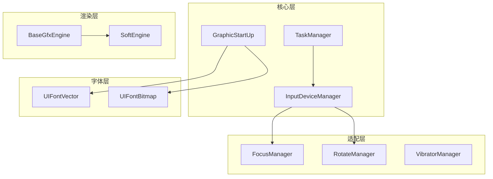

# ui_lite 内部 API

## 文档信息

- **文档用途**: 描述 ui_lite 内部模块间接口，供框架开发者参考
- **适用范围**: 框架开发者、维护人员
- **相关文档**: [对外 API](04_Public_API.md), [架构说明](02_Architecture.md)

## 内部 API 概览

内部 API 位于 `interfaces/innerkits/` 目录，供框架内部模块间调用。这些接口**不建议外部直接使用**，可能随版本变化。

## 核心管理器 (common/)

### GraphicStartUp - 图形启动

**文件**: [interfaces/innerkits/common/graphic_startup.h](interfaces/innerkits/common/graphic_startup.h)

```cpp
class GraphicStartUp : public HeapBase {
public:
    static void Init();                              // 初始化图形系统
    
    // 初始化字体引擎
    static void InitFontEngine(uintptr_t cacheMemAddr, 
                               uint32_t cacheMemLen, 
                               const char* dPath, 
                               const char* ttfName);
    
    // 初始化断行引擎
    static void InitLineBreakEngine(uintptr_t cacheMemAddr,
                                    uint32_t cacheMemLen,
                                    const char* path,
                                    const char* fileName);
};
```

**调用链**:
```
main() → GraphicStartUp::Init() → 初始化各子系统
```

### TaskManager - 任务管理器

**文件**: [interfaces/innerkits/common/task_manager.h](interfaces/innerkits/common/task_manager.h)

```cpp
class TaskManager : public HeapBase {
public:
    static TaskManager* GetInstance();               // 获取单例
    
    void Add(Task* task);                            // 添加任务
    void Remove(Task* task);                         // 移除任务
    void TaskHandler();                              // 任务处理主循环
    void SetTaskRun(bool enable);                    // 启用/禁用任务运行
    bool GetTaskRun() const;                         // 获取运行状态
    void ResetTaskHandlerMutex();                    // 重置互斥锁（慎用）
};
```

**职责**: 管理所有定时任务（动画、输入轮询、渲染）。

**线程模型**: 应在单一线程调用 `TaskHandler()`，通常为 UI 主线程。

**证据**: `interfaces/innerkits/common/task_manager.h:25`

### InputDeviceManager - 输入设备管理器

**文件**: [interfaces/innerkits/common/input_device_manager.h](interfaces/innerkits/common/input_device_manager.h)

```cpp
class InputDeviceManager : public HeapBase {
public:
    static InputDeviceManager* GetInstance();
    
    void RegisterInputDevice(InputDevice* device);   // 注册输入设备
    void UnregisterInputDevice(InputDevice* device); // 注销输入设备
    void ProcessInputEvents();                       // 处理输入事件
};
```

**职责**: 管理所有输入设备（触摸、按键、旋转）。

### InputMethodManager - 输入法管理器

**文件**: [interfaces/innerkits/common/input_method_manager.h](interfaces/innerkits/common/input_method_manager.h)

```cpp
class InputMethodManager : public HeapBase {
public:
    static InputMethodManager* GetInstance();
    
    void ShowKeyboard();                             // 显示键盘
    void HideKeyboard();                             // 隐藏键盘
    void SetInputType(uint8_t type);                 // 设置输入类型
};
```

### ImageDecodeAbility - 图像解码能力

**文件**: [interfaces/innerkits/common/image_decode_ability.h](interfaces/innerkits/common/image_decode_ability.h)

```cpp
class ImageDecodeAbility : public HeapBase {
public:
    static ImageDecodeAbility* GetInstance();
    
    bool IsSupported(ImageSrcType type);             // 是否支持某格式
    void RegisterDecoder(ImageSrcType type, 
                         ImageDecoder* decoder);     // 注册解码器
};
```

## 图形引擎 (engines/gfx/)

### BaseGfxEngine - 图形引擎基类

**文件**: [interfaces/innerkits/engines/gfx/gfx_engine_manager.h](interfaces/innerkits/engines/gfx/gfx_engine_manager.h)

```cpp
class BaseGfxEngine : public HeapBase {
public:
    // 基础绘制
    virtual void DrawArc(BufferInfo& dst, ArcInfo& arcInfo,
                         const Rect& mask, const Style& style,
                         OpacityType opacity, uint8_t cap) = 0;
    
    virtual void DrawLine(BufferInfo& dst, const Point& start,
                          const Point& end, const Rect& mask,
                          int16_t width, ColorType color, 
                          OpacityType opacity) = 0;
    
    virtual void DrawRect(BufferInfo& dst, const Rect& rect,
                          const Rect& dirtyRect, const Style& style,
                          OpacityType opacity) = 0;
    
    // 文字绘制
    virtual void DrawLetter(BufferInfo& gfxDstBuffer,
                            const uint8_t* fontMap, const Rect& fontRect,
                            const Rect& subRect, const uint8_t fontWeight,
                            const ColorType& color, const OpacityType opa) = 0;
    
    // 图像变换
    virtual void DrawTransform(BufferInfo& dst, const Rect& mask,
                               const Point& position, ColorType color,
                               OpacityType opacity, const TransformMap& transMap,
                               const TransformDataInfo& dataInfo) = 0;
    
    // 图像混合
    virtual void Blit(BufferInfo& dst, const Point& dstPos,
                      const BufferInfo& src, const Rect& subRect,
                      const BlendOption& blendOption) = 0;
    
    // 填充
    virtual void Fill(BufferInfo& dst, const Rect& fillArea,
                      const ColorType color, const OpacityType opacity) = 0;
    
    // 路径绘制
    virtual void DrawPath(BufferInfo& dst, void* param, const Paint& paint,
                          const Rect& rect, const Rect& invalidatedArea,
                          const Style& style) = 0;
    
    virtual void FillPath(BufferInfo& dst, void* param, const Paint& paint,
                          const Rect& rect, const Rect& invalidatedArea,
                          const Style& style) = 0;
    
    // 内存管理
    virtual uint8_t* AllocBuffer(uint32_t size, uint32_t usage) = 0;
    virtual void FreeBuffer(uint8_t* buffer, uint32_t usage) = 0;
    
    // 屏幕信息
    virtual uint16_t GetScreenWidth() { return screenWidth_; }
    virtual uint16_t GetScreenHeight() { return screenHeight_; }
    
    // 单例访问
    static BaseGfxEngine* GetInstance() { return baseEngine_; }
    static void InitGfxEngine(BaseGfxEngine* gfxEngine) { baseEngine_ = gfxEngine; }
};
```

**职责**: 抽象图形绘制接口，支持软件渲染和硬件加速。

**混合模式** ([interfaces/innerkits/engines/gfx/gfx_engine_manager.h:29](interfaces/innerkits/engines/gfx/gfx_engine_manager.h)):
```cpp
enum BlendMode {
    BLEND_MODE,         // 无混合
    BLEND_SRC,          // 源
    BLEND_DST,          // 目标
    BLEND_SRC_OVER,     // S + (1 - Sa) * D
    BLEND_DST_OVER,     // (1 - Da) * S + D
    BLEND_SRC_IN,       // Da * S
    BLEND_DST_IN,       // Sa * D
    BLEND_SCREEN,       // S + D - S * D
    BLEND_MULTIPLY,     // S * (1 - Da) + D * (1 - Sa) + S * D
    BLEND_ADDITIVE,     // S + D
    BLEND_SUBTRACT,     // D * (1 - S)
};
```

### SoftEngine - 软件渲染引擎

**文件**: [interfaces/innerkits/engines/gfx/soft_engine.h](interfaces/innerkits/engines/gfx/soft_engine.h)

软件渲染的默认实现，继承自 `BaseGfxEngine`。

## 平台适配 (dock/)

### FocusManager - 焦点管理器

**文件**: [interfaces/innerkits/dock/focus_manager.h](interfaces/innerkits/dock/focus_manager.h)

```cpp
class FocusManager : public HeapBase {
public:
    static FocusManager* GetInstance();
    
    // 焦点控制
    void RequestFocus(UIView* view);                 // 请求焦点
    void ClearFocus();                               // 清除焦点
    UIView* GetFocusedView() const;                  // 获取当前焦点视图
    
    // 方向导航
    void MoveFocusUp();                              // 向上移动焦点
    void MoveFocusDown();                            // 向下移动焦点
    void MoveFocusLeft();                            // 向左移动焦点
    void MoveFocusRight();                           // 向右移动焦点
    
    // 焦点策略
    void SetFocusMode(FocusMode mode);               // 设置焦点模式
};
```

**职责**: 管理焦点视图，支持方向键导航。

**证据**: `interfaces/innerkits/dock/focus_manager.h`

### RotateManager - 旋转管理器

**文件**: [interfaces/innerkits/dock/rotate_manager.h](interfaces/innerkits/dock/rotate_manager.h)

```cpp
class RotateManager : public HeapBase {
public:
    static RotateManager* GetInstance();
    
    void RegisterListener(RotateEventListener* listener);
    void UnregisterListener(RotateEventListener* listener);
    void OnRotateEvent(const RotateEvent& event);
};
```

### VibratorManager - 震动管理器

**文件**: [interfaces/innerkits/dock/vibrator_manager.h](interfaces/innerkits/dock/vibrator_manager.h)

```cpp
class VibratorManager : public HeapBase {
public:
    static VibratorManager* GetInstance();
    
    void Vibrate(uint32_t duration);                 // 震动指定时长
    void StopVibrate();                              // 停止震动
};
```

### RotateInputDevice - 旋转输入设备

**文件**: [interfaces/innerkits/dock/rotate_input_device.h](interfaces/innerkits/dock/rotate_input_device.h)

```cpp
class RotateInputDevice : public InputDevice {
public:
    void RegisterEventListener(RotateEventListener* listener);
    void UnregisterEventListener(RotateEventListener* listener);
};
```

## 字体内部 (font/)

### UIFontVector - 矢量字体

**文件**: [interfaces/innerkits/font/ui_font_vector.h](interfaces/innerkits/font/ui_font_vector.h)

```cpp
class UIFontVector : public BaseFont {
public:
    int32_t Open(const char* fontPath, uint32_t pathLen);  // 打开字体文件
    void Close();                                        // 关闭字体
    int32_t GetGlyph(uint32_t unicode, 
                     GlyphCacheInfo& glyphInfo);         // 获取字形
    int32_t GetGlyphAdvanceWidth(uint32_t unicode,
                                  int16_t& advanceWidth); // 获取字宽
};
```

### UIFontBitmap - 位图字体

**文件**: [interfaces/innerkits/font/ui_font_bitmap.h](interfaces/innerkits/font/ui_font_bitmap.h)

```cpp
class UIFontBitmap : public BaseFont {
public:
    int32_t Open(const char* fontPath, uint32_t pathLen);
    void Close();
    int32_t GetGlyph(uint32_t unicode, GlyphCacheInfo& glyphInfo);
    const uint8_t* GetBitmap(uint32_t unicode, uint8_t fontSize);
};
```

### UIFontBuilder - 字体构建器

**文件**: [interfaces/innerkits/font/ui_font_builder.h](interfaces/innerkits/font/ui_font_builder.h)

```cpp
class UIFontBuilder : public HeapBase {
public:
    static UIFontBuilder* GetInstance();
    
    // 构建字体缓存
    bool BuildFontCache(const char* ttfPath, 
                        const char* cachePath,
                        uint8_t fontSize);
    
    // 生成字形位图
    bool GenerateGlyphBitmap(uint32_t unicode,
                             uint8_t* bitmap,
                             uint16_t width,
                             uint16_t height);
};
```

## 路径操作 (path/)

### PathBase - 路径基类

**文件**: [interfaces/innerkits/path/path_base.h](interfaces/innerkits/path/path_base.h)

```cpp
class PathBase : public HeapBase {
public:
    void MoveTo(float x, float y);                   // 移动到
    void LineTo(float x, float y);                   // 直线到
    void QuadTo(float cx, float cy, float x, float y); // 二次贝塞尔曲线
    void CubicTo(float c1x, float c1y, float c2x, float c2y,
                 float x, float y);                  // 三次贝塞尔曲线
    void ArcTo(float rx, float ry, float rotation,
               bool largeArc, bool sweep,
               float x, float y);                    // 圆弧
    void Close();                                    // 闭合路径
    
    void Reset();                                    // 重置路径
    bool IsEmpty() const;                            // 是否为空
    
    Rect GetBounds() const;                          // 获取边界
};
```

## 模块依赖关系



## 接口稳定性

| 接口 | 稳定性 | 说明 |
|------|--------|------|
| `GraphicStartUp` | 稳定 | 初始化接口稳定 |
| `TaskManager` | 稳定 | 核心调度接口 |
| `BaseGfxEngine` | 较稳定 | 可能新增绘制接口 |
| `FocusManager` | 较稳定 | 焦点管理接口 |
| `UIFontVector/Bitmap` | 可能变化 | 字体内部实现 |
| `UIFontBuilder` | 不稳定 | 构建工具接口 |
| `PathBase` | 不稳定 | 路径 API 开发中 |

## 使用建议

### 框架开发者

1. **使用 `GraphicStartUp` 初始化**
2. **通过 `TaskManager` 调度任务**
3. **继承 `BaseGfxEngine` 实现硬件加速**
4. **使用 `FocusManager` 处理焦点**

### 应用开发者

**不建议直接使用内部 API**，应使用 `interfaces/kits/` 下的对外 API。

如需使用，请注意：
- 内部 API 可能随版本变化
- 需自行处理线程安全
- 无向后兼容保证

## 调用示例

### 自定义渲染引擎

```cpp
#include "engines/gfx/gfx_engine_manager.h"

class MyGfxEngine : public BaseGfxEngine {
public:
    void DrawRect(BufferInfo& dst, const Rect& rect,
                  const Rect& dirtyRect, const Style& style,
                  OpacityType opacity) override {
        // 硬件加速实现
    }
    // ... 其他绘制方法
};

// 注册引擎
MyGfxEngine* engine = new MyGfxEngine();
BaseGfxEngine::InitGfxEngine(engine);
```

### 焦点导航

```cpp
#include "dock/focus_manager.h"

// 在按键事件中处理
void OnKeyEvent(const KeyEvent& event) {
    FocusManager* fm = FocusManager::GetInstance();
    
    switch (event.GetKeyId()) {
        case KEY_UP:
            fm->MoveFocusUp();
            break;
        case KEY_DOWN:
            fm->MoveFocusDown();
            break;
        // ...
    }
}
```

## 相关文档

- [对外 API](04_Public_API.md) - 应用层接口
- [架构说明](02_Architecture.md) - 系统架构
- [目录结构](03_Directory_Structure.md) - 代码组织
