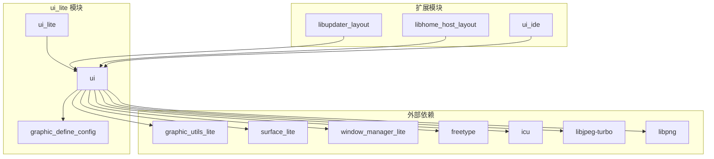

# ui_lite GN 构建目标

## 文档信息

- **文档用途**: 描述 GN 构建系统的 targets、依赖关系和配置
- **适用范围**: 构建工程师、系统集成人员
- **相关文档**: [编译产物](07_Build_Artifacts.md), [目录结构](03_Directory_Structure.md)

## 构建文件概览

| 文件 | 用途 |
|------|------|
| [BUILD.gn](BUILD.gn) | 主构建文件，定义核心 targets |
| [ui.gni](ui.gni) | 构建变量定义，可被其他模块引用 |
| [bundle.json](bundle.json) | 组件配置，定义依赖和特性 |

## 主构建文件 (BUILD.gn)

### 构建条件

```gn
# 证据: BUILD.gn:12
if (os_level != "standard") {
  # 构建 lite 版本
}
```

**说明**: 仅在非 standard 系统（mini/small）时构建 ui_lite。

### Target: ui_lite (lite_component)

```gn
# 证据: BUILD.gn:18
lite_component("ui_lite") {
  features = [ ":ui" ]
  public_deps = features
}
```

**类型**: `lite_component` - 逻辑组件，聚合功能

**职责**: 作为对外暴露的组件入口，依赖核心库 `ui`。

### Target: graphic_define_config (config)

```gn
# 证据: BUILD.gn:23
config("graphic_define_config") {
  include_dirs = [
    "interfaces/kits",
    "interfaces/innerkits",
  ]
  
  defines += [
    "GRAPHIC_ENABLE_ELLIPSE_FLAG=1",
    "GRAPHIC_ENABLE_BEZIER_ARC_FLAG=1",
    "GRAPHIC_ENABLE_LINECAP_FLAG=1",
    "GRAPHIC_ENABLE_LINEJOIN_FLAG=1",
    "GRAPHIC_ENABLE_ARC_FLAG=1",
    "GRAPHIC_ENABLE_ROUNDEDRECT_FLAG=1",
    "GRAPHIC_ENABLE_GRADIENT_FILL_FLAG=1",
    "GRAPHIC_ENABLE_SHADOW_EFFECT_FLAG=1",
    "GRAPHIC_ENABLE_DRAW_TEXT_FLAG=1",
  ]
  
  # 平台特定配置...
}
```

**类型**: `config` - 编译配置集合

**用途**: 定义公共包含路径和宏定义，通过 `public_configs` 传播给依赖者。

### Target: utils_config (copy)

```gn
# 证据: BUILD.gn:93
copy("utils_config") {
  sources = [
    "tools/qt/simulator/font/SourceHanSansSC-Regular.otf",
    "tools/qt/simulator/font/line_cj.brk",
  ]
  outputs = [ "$root_out_dir/data/{{source_file_part}}" ]
}
```

**类型**: `copy` - 文件复制

**条件**: `ui_lite_enable_graphic_font_config` 为 true 时

**输出**: 字体文件复制到输出目录

### Target: ui (lite_library)

**类型**: `lite_library` - 核心库

**输出**:
- LiteOS-M: `libui.a` (静态库)
- 其他: `libui.so` (动态库)

**证据**: `BUILD.gn:102`

#### Sources 分析

核心源文件列表（约 130+ 文件）:

```gn
sources = [
  # 动画系统 (4 文件)
  "frameworks/animator/animator.cpp",
  "frameworks/animator/animator_manager.cpp",
  "frameworks/animator/easing_equation.cpp",
  "frameworks/animator/interpolation.cpp",
  
  # 通用模块 (7 文件)
  "frameworks/common/graphic_startup.cpp",
  "frameworks/common/image.cpp",
  "frameworks/common/image_decode_ability.cpp",
  "frameworks/common/input_device_manager.cpp",
  "frameworks/common/screen.cpp",
  "frameworks/common/spannable_string.cpp",
  "frameworks/common/task.cpp",
  "frameworks/common/text.cpp",
  "frameworks/common/typed_text.cpp",
  
  # 组件系统 (40+ 文件)
  "frameworks/components/root_view.cpp",
  "frameworks/components/ui_view.cpp",
  "frameworks/components/ui_view_group.cpp",
  "frameworks/components/ui_label.cpp",
  "frameworks/components/ui_button.cpp",
  "frameworks/components/ui_image_view.cpp",
  "frameworks/components/ui_scroll_view.cpp",
  "frameworks/components/ui_list.cpp",
  "frameworks/components/ui_canvas.cpp",
  "frameworks/components/ui_dialog.cpp",
  "frameworks/components/ui_chart.cpp",
  "frameworks/components/ui_qrcode.cpp",
  # ... 其他组件
  
  # 核心管理器 (3 文件)
  "frameworks/core/input_method_manager.cpp",
  "frameworks/core/render_manager.cpp",
  "frameworks/core/task_manager.cpp",
  
  # DFX (7 文件)
  "frameworks/dfx/event_injector.cpp",
  "frameworks/dfx/key_event_injector.cpp",
  "frameworks/dfx/performance_task.cpp",
  "frameworks/dfx/point_event_injector.cpp",
  "frameworks/dfx/ui_dump_dom_tree.cpp",
  "frameworks/dfx/ui_screenshot.cpp",
  "frameworks/dfx/ui_view_bounds.cpp",
  
  # 适配层 (10+ 文件)
  "frameworks/dock/focus_manager.cpp",
  "frameworks/dock/rotate_manager.cpp",
  "frameworks/dock/input_device.cpp",
  "frameworks/dock/key_input_device.cpp",
  "frameworks/dock/ohos/ohos_input_device.cpp",
  "frameworks/dock/pointer_input_device.cpp",
  "frameworks/dock/rotate_input_device.cpp",
  "frameworks/dock/screen_device_proxy.cpp",
  "frameworks/dock/vibrator_manager.cpp",
  "frameworks/dock/virtual_input_device.cpp",
  
  # 绘制系统 (10 文件)
  "frameworks/draw/clip_utils.cpp",
  "frameworks/draw/draw_arc.cpp",
  "frameworks/draw/draw_canvas.cpp",
  "frameworks/draw/draw_curve.cpp",
  "frameworks/draw/draw_image.cpp",
  "frameworks/draw/draw_label.cpp",
  "frameworks/draw/draw_line.cpp",
  "frameworks/draw/draw_rect.cpp",
  "frameworks/draw/draw_triangle.cpp",
  "frameworks/draw/draw_utils.cpp",
  
  # 引擎 (3 文件)
  "frameworks/engines/gfx/gfx_engine_manager.cpp",
  "frameworks/engines/gfx/soft_engine.cpp",
  "frameworks/engines/gfx/hi3516/hi3516_engine.cpp",
  
  # 事件系统 (1 文件)
  "frameworks/events/event.cpp",
  
  # 字体系统 (15 文件)
  "frameworks/font/base_font.cpp",
  "frameworks/font/font_ram_allocator.cpp",
  "frameworks/font/glyphs_cache.cpp",
  "frameworks/font/glyphs_file.cpp",
  "frameworks/font/glyphs_manager.cpp",
  "frameworks/font/ui_font.cpp",
  "frameworks/font/ui_font_adaptor.cpp",
  "frameworks/font/ui_font_allocator.cpp",
  "frameworks/font/ui_font_bitmap.cpp",
  "frameworks/font/ui_font_builder.cpp",
  "frameworks/font/ui_font_cache.cpp",
  "frameworks/font/ui_font_cache_manager.cpp",
  "frameworks/font/ui_font_vector.cpp",
  "frameworks/font/ui_line_break.cpp",
  "frameworks/font/ui_multi_font_manager.cpp",
  "frameworks/font/ui_text_shaping.cpp",
  
  # 图像解码 (3 文件)
  "frameworks/imgdecode/cache_manager.cpp",
  "frameworks/imgdecode/file_img_decoder.cpp",
  "frameworks/imgdecode/image_load.cpp",
  
  # 布局系统 (3 文件)
  "frameworks/layout/flex_layout.cpp",
  "frameworks/layout/grid_layout.cpp",
  "frameworks/layout/list_layout.cpp",
  
  # 渲染系统 (3 文件)
  "frameworks/render/render_base.cpp",
  "frameworks/render/render_pixfmt_rgba_blend.cpp",
  "frameworks/render/render_scanline.cpp",
  
  # 主题系统 (2 文件)
  "frameworks/themes/theme.cpp",
  "frameworks/themes/theme_manager.cpp",
  
  # 窗口系统 (2 文件)
  "frameworks/window/window.cpp",
  "frameworks/window/window_impl.cpp",
  
  # 路径 (1 文件)
  "frameworks/path/path_base.cpp",
]
```

#### 平台特定配置

**LiteOS-M** (静态库):
```gn
# 证据: BUILD.gn:224
if (ohos_kernel_type == "liteos_m") {
  target_type = "static_library"
  include_dirs = [
    "frameworks",
    "//third_party/freetype/include",
  ]
  
  # 裁剪部分功能
  sources -= [
    "frameworks/components/ui_surface_view.cpp",      # 无 Surface
    "frameworks/dfx/ui_dump_dom_tree.cpp",            # 无 DOM 导出
    "frameworks/dfx/ui_screenshot.cpp",               # 无截图
    "frameworks/engines/gfx/hi3516/hi3516_engine.cpp", # 无硬件引擎
    "frameworks/window/window.cpp",                   # 无窗口
    "frameworks/window/window_impl.cpp",
  ]
  
  deps = [
    "//build/lite/config/component/cJSON:cjson_static",
    "//third_party/bounds_checking_function:libsec_static",
    "//third_party/freetype:freetype",
    "//third_party/icu/icu4c/source/common:icu_font",
    "//third_party/libjpeg-turbo:libjpeg",
    "//third_party/libpng:libpng",
    "//third_party/qrcodegen:qrcodegen",
  ]
}
```

**其他平台** (动态库):
```gn
# 证据: BUILD.gn:247
else {
  target_type = "shared_library"
  include_dirs = [ "frameworks" ]
  
  deps = [
    "//build/lite/config/component/cJSON:cjson_shared",
    "//foundation/graphic/graphic_utils_lite:lite_graphic_hals",
    "//foundation/graphic/surface_lite:surface_lite",
    "//foundation/window/window_manager_lite:window_manager_lite",
    "//third_party/bounds_checking_function:libsec_shared",
    "//third_party/freetype:freetype",
    "//third_party/icu/icu4c/source/common:icu_font",
    "//third_party/libjpeg-turbo:libjpeg",
    "//third_party/libpng:libpng",
    "//third_party/qrcodegen:qrcodegen",
  ]
  
  # 可选视频组件
  if (ui_lite_enable_video_component_config) {
    defines += [ "ENABLE_VIDEO_COMPONENT=1" ]
    sources += [ "frameworks/components/ui_video.cpp" ]
    deps += [ "//foundation/multimedia/media_lite/frameworks/player_lite:player_lite" ]
  }
  
  # 可选字体配置
  if (ui_lite_enable_graphic_font_config) {
    deps += [ "//foundation/arkui/ui_lite:utils_config" ]
  }
}
```

#### 公共依赖

```gn
# 证据: BUILD.gn:278
public_deps = [ "//foundation/graphic/graphic_utils_lite:utils_lite" ]
public_configs = [ ":graphic_define_config" ]
```

#### 编译选项

```gn
# 证据: BUILD.gn:281
if (board_toolchain_type != "iccarm") {
  cflags = [
    "-Wall",
    "-fno-exceptions",    # 禁用异常
  ]
  cflags_cc = cflags
}
```

## 变量定义文件 (ui.gni)

### 路径定义

```gn
# 证据: ui.gni:12
ARKUI_UI_LITE_PATH = "//foundation/arkui/ui_lite"
```

### 包含路径

```gn
# 证据: ui.gni:14
arkui_ui_lite_include_dirs = [
  "$ARKUI_UI_LITE_PATH/interfaces/kits",
  "$ARKUI_UI_LITE_PATH/interfaces/innerkits",
]
```

### 源文件列表

```gn
# 证据: ui.gni:19
arkui_ui_lite_sources = [
  # 与 BUILD.gn 中的 sources 相同
  # 供其他模块引用
]
```

### 特性开关

```gn
# 证据: ui.gni:132
declare_args() {
  ui_lite_enable_smarthomehost_config = false
}
```

## 组件配置 (bundle.json)

### 基本信息

```json
{
  "name": "@ohos/ui_lite",
  "description": "Graphic ui components",
  "version": "3.1",
  "license": "Apache License 2.0",
  "component": {
    "name": "ui_lite",
    "subsystem": "arkui",
    "adapted_system_type": ["mini", "small", "standard"],
    "rom": "900KB",
    "ram": "~90KB"
  }
}
```

**证据**: `bundle.json:1-22`

### 特性开关

```json
{
  "features": [
    "ui_lite_enable_video_component_config",
    "ui_lite_enable_graphic_font_config",
    "ui_lite_enable_smarthomehost_config"
  ]
}
```

**证据**: `bundle.json:15-19`

### 依赖组件

```json
{
  "deps": {
    "components": [
      "graphic_utils_lite",
      "surface_lite",
      "window_manager_lite",
      "media_lite",
      "libjpeg-turbo",
      "icu",
      "cJSON",
      "freetype",
      "bounds_checking_function",
      "libpng",
      "qrcodegen",
      "harfbuzz"
    ]
  }
}
```

**证据**: `bundle.json:23-37`

### 构建目标

```json
{
  "build": {
    "sub_component": [
      "//foundation/arkui/ui_lite/test/unittest:arkui_ui_lite_test",
      "//foundation/arkui/ui_lite/ext/updater:libupdater_layout",
      "//foundation/arkui/ui_lite/ext/home_host:libhome_host_layout"
    ],
    "inner_kits": [
      {
        "name": "//foundation/arkui/ui_lite/ext/updater:libupdater_layout",
        "header": {
          "header_files": [],
          "header_base": [
            "//foundation/arkui/ui_lite/frameworks",
            "//foundation/arkui/ui_lite/interfaces/kits",
            "//foundation/arkui/ui_lite/interfaces/innerkits"
          ]
        }
      },
      {
        "name": "//foundation/arkui/ui_lite/ext/ide:ui_ide"
      },
      {
        "name": "//foundation/arkui/ui_lite/ext/home_host:libhome_host_layout"
      }
    ]
  }
}
```

**证据**: `bundle.json:40-71`

## 扩展模块构建

### ext/updater/BUILD.gn

```gn
lite_library("libupdater_layout") {
  target_type = "shared_library"
  sources = [ "updater_layout.cpp" ]
  deps = [
    "//foundation/arkui/ui_lite:ui",
  ]
}
```

### ext/home_host/BUILD.gn

```gn
lite_library("libhome_host_layout") {
  target_type = "shared_library"
  sources = [ "home_host_layout.cpp" ]
  deps = [
    "//foundation/arkui/ui_lite:ui",
  ]
}
```

### ext/ide/BUILD.gn

```gn
lite_component("ui_ide") {
  features = [ ":ui_ide_static" ]
}

lite_library("ui_ide_static") {
  target_type = "static_library"
  sources = [ "ui_ide.cpp" ]
}
```

## Targets 汇总表

| Target | 类型 | 输出 | 说明 |
|--------|------|------|------|
| `ui_lite` | lite_component | - | 逻辑组件入口 |
| `ui` | lite_library | libui.a/so | 核心库 |
| `graphic_define_config` | config | - | 编译配置 |
| `utils_config` | copy | 字体文件 | 资源复制 |
| `libupdater_layout` | lite_library | libupdater_layout.so | 升级器布局 |
| `libhome_host_layout` | lite_library | libhome_host_layout.so | 智能家居布局 |
| `ui_ide` | lite_component | - | IDE 支持 |
| `ui_ide_static` | lite_library | libui_ide.a | IDE 静态库 |

## 依赖关系图



## 构建命令

```bash
# 构建核心库
hb build -T //foundation/arkui/ui_lite:ui_lite -f

# 构建单元测试
hb build -T //foundation/arkui/ui_lite/test/unittest:arkui_ui_lite_test -f

# 构建扩展模块
hb build -T //foundation/arkui/ui_lite/ext/updater:libupdater_layout -f
hb build -T //foundation/arkui/ui_lite/ext/home_host:libhome_host_layout -f
hb build -T //foundation/arkui/ui_lite/ext/ide:ui_ide -f
```

## Feature Flags

| Flag | 默认值 | 说明 | 影响 |
|------|--------|------|------|
| `ui_lite_enable_video_component_config` | false | 视频组件 | 添加 ui_video.cpp 和 media_lite 依赖 |
| `ui_lite_enable_graphic_font_config` | false | 字体配置 | 复制字体文件到输出目录 |
| `ui_lite_enable_smarthomehost_config` | false | 智能家居 | 扩展模块开关 |

## 相关文档

- [编译产物](07_Build_Artifacts.md) - 输出文件分析
- [目录结构](03_Directory_Structure.md) - 代码组织
- [配置宏](appendix/Config_Flags.md) - 详细宏定义
