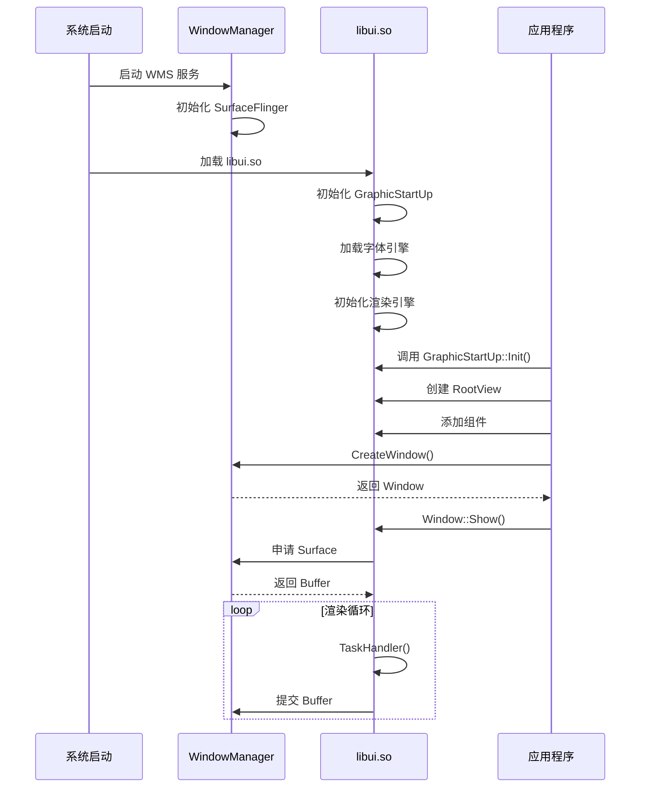

# ui_lite 编译产物

## 文档信息

- **文档用途**: 描述构建输出的文件、路径和运行时加载关系
- **适用范围**: 系统集成人员、部署工程师
- **相关文档**: [GN 构建目标](06_GN_Targets.md), [目录结构](03_Directory_Structure.md)

## 产物概览

### 库文件

| 产物 | 类型 | 路径 | 说明 |
|------|------|------|------|
| `libui.so` | 动态库 | `out/{product}/libs/` | 核心 UI 库（非 LiteOS-M） |
| `libui.a` | 静态库 | `out/{product}/libs/` | 核心 UI 库（LiteOS-M） |
| `libupdater_layout.so` | 动态库 | `out/{product}/libs/` | 升级器布局库 |
| `libhome_host_layout.so` | 动态库 | `out/{product}/libs/` | 智能家居布局库 |

### 头文件

| 路径 | 说明 |
|------|------|
| `interfaces/kits/` | 对外 API 头文件 |
| `interfaces/innerkits/` | 内部 API 头文件 |

### 资源文件

| 产物 | 路径 | 说明 |
|------|------|------|
| `SourceHanSansSC-Regular.otf` | `out/{product}/data/` | 思源黑体字体 |
| `line_cj.brk` | `out/{product}/data/` | 中文断行规则 |

## 产物详细分析

### 核心库 (libui.so / libui.a)

#### 符号导出

**动态库导出符号**:
```
# 查看导出符号
nm -D libui.so | grep " T "

# 主要导出类
OHOS::UIView
OHOS::UIViewGroup
OHOS::RootView
OHOS::Window
OHOS::Animator
OHOS::TaskManager
OHOS::GraphicStartUp
OHOS::UIFont
OHOS::Theme
OHOS::ThemeManager
...
```

**证据**: 通过 `public_deps` 和 `public_configs` 控制导出。

#### 依赖关系

**动态库依赖** (readelf -d libui.so):
```
NEEDED               libgraphic_utils_lite.so
NEEDED               libsurface_lite.so
NEEDED               libwindow_manager_lite.so
NEEDED               libfreetype.so
NEEDED               libicuuc.so
NEEDED               libjpeg.so
NEEDED               libpng.so
NEEDED               libcjson.so
NEEDED               libsec_shared.so
NEEDED               libqrcodegen.so
```

**加载顺序**:
```
libui.so
├── libgraphic_utils_lite.so
├── libsurface_lite.so
│   └── libgraphic_utils_lite.so
├── libwindow_manager_lite.so
│   ├── libsurface_lite.so
│   └── libgraphic_utils_lite.so
├── libfreetype.so
├── libicuuc.so
├── libjpeg.so
├── libpng.so
├── libcjson.so
├── libsec_shared.so
└── libqrcodegen.so
```

### 静态库 (libui.a)

**适用平台**: LiteOS-M

**使用方式**:
```cmake
# 链接静态库
target_link_libraries(my_app
    ${OUT_DIR}/libs/libui.a
    ${OUT_DIR}/libs/libfreetype.a
    ${OUT_DIR}/libs/libicuuc.a
    # ... 其他依赖
)
```

**裁剪内容**:
- 无窗口支持（Window 类）
- 无 Surface 支持（UISurfaceView）
- 无硬件引擎（hi3516_engine）
- 无截图功能（ui_screenshot）
- 无 DOM 导出（ui_dump_dom_tree）

### 扩展库

#### libupdater_layout.so

**用途**: 系统升级界面布局

**导出符号**:
```cpp
// 创建升级界面
UIView* CreateUpdaterLayout();
void DestroyUpdaterLayout(UIView* layout);
```

**依赖**:
```
libupdater_layout.so
└── libui.so
```

#### libhome_host_layout.so

**用途**: 智能家居主机界面布局

**导出符号**:
```cpp
// 创建主机界面
UIView* CreateHomeHostLayout();
void DestroyHomeHostLayout(UIView* layout);
```

**依赖**:
```
libhome_host_layout.so
└── libui.so
```

## 运行时加载关系

### 系统启动流程



### 库加载顺序

```
1. 系统库
   ├── libc.so
   ├── libm.so
   └── libdl.so

2. 基础图形库
   ├── libgraphic_utils_lite.so
   └── libsec_shared.so (安全函数)

3. 第三方库
   ├── libfreetype.so
   ├── libicuuc.so
   ├── libjpeg.so
   ├── libpng.so
   ├── libcjson.so
   └── libqrcodegen.so

4. 系统服务库
   ├── libsurface_lite.so
   └── libwindow_manager_lite.so

5. UI 框架库
   └── libui.so

6. 应用/扩展库
   ├── libupdater_layout.so (可选)
   └── libhome_host_layout.so (可选)
```

## 安装路径

### 标准系统 (Linux/LiteOS-A)

```
/system/
├── lib/
│   ├── libui.so                    # UI 核心库
│   ├── libupdater_layout.so        # 升级器布局
│   └── libhome_host_layout.so      # 智能家居布局
├── data/
│   ├── SourceHanSansSC-Regular.otf # 字体文件
│   └── line_cj.brk                 # 断行规则
└── include/
    └── ui/
        ├── components/             # 组件头文件
        ├── animator/               # 动画头文件
        ├── events/                 # 事件头文件
        └── ...
```

### 轻量系统 (LiteOS-M)

```
/out/{product}/
├── libui.a                         # 静态库（链接到应用）
├── libfreetype.a                   # 字体库
├── libicuuc.a                      # ICU 库
└── data/
    └── fonts/                      # 字体文件
```

## 资源文件

### 字体资源

**SourceHanSansSC-Regular.otf**:
- **来源**: `tools/qt/simulator/font/`
- **输出**: `out/{product}/data/`
- **用途**: 默认中文字体
- **大小**: ~8MB

**line_cj.brk**:
- **来源**: `tools/qt/simulator/font/`
- **输出**: `out/{product}/data/`
- **用途**: ICU 中文断行规则
- **大小**: ~1KB

### 运行时字体加载

```cpp
// 代码路径: frameworks/font/ui_font.cpp
UIFont::GetInstance()->SetFontPath("/system/data/");
UIFont::GetInstance()->RegisterFontInfo("SourceHanSansSC-Regular.otf");
```

## 调试产物

### 符号文件

```
out/{product}/
├── libui.so
├── libui.so.sym          # 符号文件（调试）
└── libui.so.map          # 链接映射
```

### 测试产物

```
out/{product}/
├── tests/
│   └── arkui_ui_lite_test  # 单元测试可执行文件
└── testdata/
    └── images/             # 测试图片资源
```

## 产物验证

### 检查库依赖

```bash
# Linux/LiteOS-A
readelf -d out/{product}/libs/libui.so | grep NEEDED

# 检查未定义符号
readelf -s out/{product}/libs/libui.so | grep UND

# LiteOS-M
arm-none-eabi-nm out/{product}/libs/libui.a | grep " T " | head -20
```

### 验证导出符号

```bash
# 检查 UIView 类是否导出
nm -D out/{product}/libs/libui.so | grep UIView

# 预期输出:
# 0000000000123456 T _ZN4OHOS6UIViewC1Ev
# 0000000000123457 T _ZN4OHOS6UIViewD1Ev
# ...
```

### 运行时检查

```bash
# 查看加载的库
cat /proc/{pid}/maps | grep ui

# 查看符号解析
readelf --dyn-syms out/{product}/libs/libui.so | head -30
```

## 常见问题

### 1. 库加载失败

**现象**: `error while loading shared libraries: libui.so`

**原因**: 库路径未配置

**解决**:
```bash
# 设置库路径
export LD_LIBRARY_PATH=/system/lib:$LD_LIBRARY_PATH

# 或添加到系统配置
echo "/system/lib" > /etc/ld.so.conf.d/ui.conf
ldconfig
```

### 2. 字体加载失败

**现象**: 中文显示为方块

**原因**: 字体文件未找到

**解决**:
```cpp
// 检查字体路径
UIFont::GetInstance()->SetFontPath("/system/data/");

// 验证文件存在
if (access("/system/data/SourceHanSansSC-Regular.otf", F_OK) != 0) {
    // 字体文件缺失
}
```

### 3. 静态库链接错误

**现象**: `undefined reference to 'OHOS::UIView::UIView()'`

**原因**: 链接顺序错误或缺少依赖

**解决**:
```cmake
# 正确的链接顺序
target_link_libraries(my_app
    libui.a
    libfreetype.a
    libicuuc.a
    libjpeg.a
    libpng.a
    libcjson.a
    libsec_static.a
)
```

## 产物大小分析

### libui.so 大小构成

```
libui.so (~500KB)
├── 组件系统 (~150KB)
│   ├── ui_view.cpp
│   ├── ui_view_group.cpp
│   └── 40+ 组件
├── 字体系统 (~100KB)
│   ├── ui_font.cpp
│   ├── ui_font_vector.cpp
│   └── ui_line_break.cpp
├── 绘制系统 (~80KB)
│   ├── draw_*.cpp
│   └── render_*.cpp
├── 图像解码 (~60KB)
│   ├── file_img_decoder.cpp
│   └── cache_manager.cpp
├── 动画系统 (~40KB)
│   ├── animator.cpp
│   └── easing_equation.cpp
├── 布局系统 (~30KB)
│   ├── flex_layout.cpp
│   └── grid_layout.cpp
└── 其他 (~40KB)
```

### 优化建议

1. **裁剪功能**: 通过 Feature Flags 禁用不需要的功能
2. **静态链接**: LiteOS-M 使用静态库减少运行时开销
3. **字体裁剪**: 使用子集化字体减少字体文件大小

## 相关文档

- [GN 构建目标](06_GN_Targets.md) - 构建配置
- [目录结构](03_Directory_Structure.md) - 代码组织
- [架构说明](02_Architecture.md) - 系统架构
