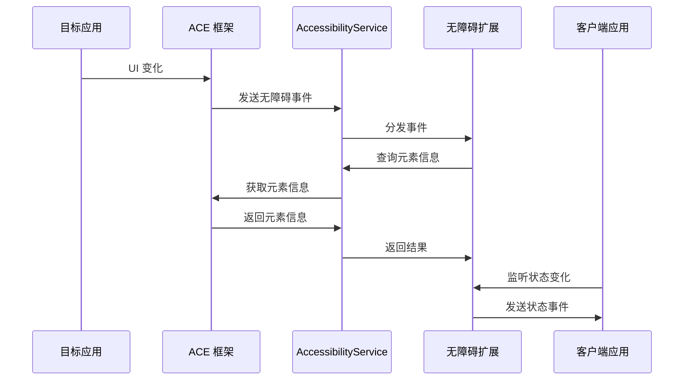
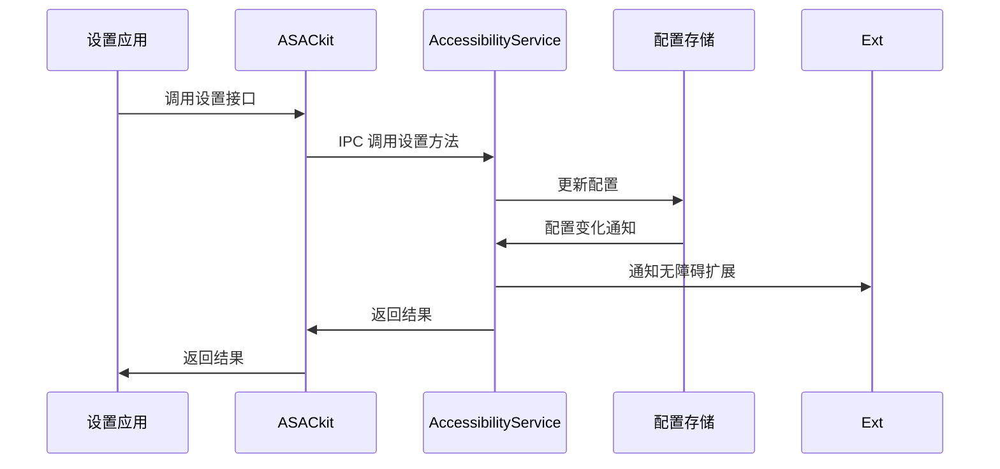

# 架构设计

## 目的

本文档详细说明 Accessibility 子系统的架构设计，包括组件图、数据流、线程模型和关键设计决策。

## 适用范围

- 需要深入理解架构的架构师
- 进行系统设计的开发者
- 需要了解组件交互的开发者

## 关键结论

### 架构分层

Accessibility 子系统采用**五层架构**：

```
┌────────────────────────────────────────────────────┐
│         Application Layer                        │
│  (AccessibilityExtensionAbility / General Apps)   │
└───────────────────┬────────────────────────────┘
                    │
┌───────────────────▼────────────────────────────┐
│      Application Framework Layer                 │
│  (AAkit / ASACkit / ACkit)                  │
└───────────────────┬────────────────────────────┘
                    │
┌───────────────────▼────────────────────────────┐
│        System Service Layer                      │
│    (AccessibilityService SA 801)             │
└───────────────────┬────────────────────────────┘
                    │
┌───────────────────▼────────────────────────────┐
│         Interfaces Layer                         │
│   (Innerkits / Kits: N-API/ANI/CJ)           │
└───────────────────────────────────────────────────┘
```

### 核心组件

| 层级 | 组件 | 职责 |
|-------|------|------|
| 应用层 | AccessibilityExtensionAbility | 无障碍扩展应用 |
| 框架层 | AAkit | 无障碍辅助能力 SDK |
| 框架层 | ASACkit | 无障碍能力客户端 SDK |
| 框架层 | ACkit | 无障碍配置 SDK |
| 服务层 | AccessibilityService | 无障碍系统服务 (SA 801) |
| 接口层 | Innerkits | C/C++ 内部 API |
| 接口层 | Kits | 对外 TS/JS/ANI/CJ API |

### 数据流向

```
应用层
    ↓ (无障碍事件)
ACE 集成层
    ↓ (IPC 调用)
AccessibilityService
    ↓ (事件分发)
无障碍扩展应用
    ↓ (操作执行)
目标应用
```

### 线程模型

- **主线程**: AccessibilityService 主服务线程
- **事件处理线程**: 独立事件分发和回调线程
- **输入拦截线程**: 触摸/键盘输入拦截
- **手势识别线程**: 手势识别处理

---

## 详细内容

### 架构分层说明

#### 应用层 (Application Layer)

**组件**:
- **AccessibilityExtensionAbility**: 无障碍扩展应用
- **普通应用**: 作为无障碍目标应用
- **设置应用**: 配置无障碍开关

**职责**:
- 使用 AccessibilityExtensionAbility 开发无障碍服务
- 普通应用通过 ACE 集成成为无障碍目标
- 设置应用配置无障碍功能开关

**证据**: `interfaces/kits/napi/accessibility_extension/`

#### 应用框架层 (Application Framework Layer)

##### AAkit (AccessibleAbility Kit)

**职责**: 为无障碍扩展应用提供运行时环境

**主要接口**:
- `AccessibleAbilityClient` - 客户端接口
- `AccessibilityUiTestAbility` - UI 测试能力
- `AccessibleAbilityListener` - 回调接口

**证据**: `interfaces/innerkits/aafwk/include/accessible_ability_client.h`

##### ASACkit (AccessibilitySystemAbilityClient Kit)

**职责**: 为普通应用提供使用无障碍辅助服务的能力

**主要接口**:
- `AccessibilitySystemAbilityClient` - 系统能力客户端
- `AccessibilityElementOperator` - 元素操作接口
- `AccessibilityStateEvent` - 状态事件

**证据**: `interfaces/innerkits/asacfwk/include/accessibility_system_ability_client.h`

##### ACkit (AccessibilityConfiguration Kit)

**职责**: 提供无障碍配置设置能力

**主要接口**:
- `AccessibilityConfig` - 配置接口
- `AccessibilityConfigObserver` - 配置观察者

**证据**: `interfaces/innerkits/acfwk/include/accessibility_config.h`

#### 系统服务层 (System Service Layer)

##### AccessibilityService

**SA ID**: 801
**进程名**: accessibility
**主类**: `AccessibleAbilityManagerService`

**主要功能模块**:

| 模块 | 职责 |
|-------|------|
| 连接管理 | 管理无障碍扩展连接 |
| 窗口管理 | 管理无障碍窗口和窗口信息 |
| 手势/触摸 | 触摸探索、手势识别、手势注入 |
| 放大镜 | 全屏放大、窗口放大、放大镜菜单 |
| 鼠标/键盘 | 鼠标键、自动点击、按键事件过滤 |
| 设置/配置 | 配置读取、设置、状态观察 |
| 快捷方式 | 短键功能 |
| 事件处理 | 事件分发、回调处理 |
| 显示管理 | 显示器管理、屏幕触摸 |

**证据**: `services/aams/include/accessible_ability_manager_service.h`

##### AAMS_EXT

**职责**: 扩展服务（放大镜窗口、菜单等）

**主要组件**:
- `MagnificationWindow` - 放大镜窗口
- `MagnificationMenu` - 放大镜菜单

**证据**: `services/aams_ext/include/magnification_window.h`

#### 接口层 (Interfaces Layer)

##### Innerkits

**职责**: C/C++ 内部 API，供框架层和服务层使用

| Kit | 产物 | 依赖 |
|-----|------|------|
| AAkit | libaccessibleability.so | accessibility_interface, accessibility_common |
| ACkit | libaccessibilityconfig.so | accessibility_interface, accessibility_common |
| ASACkit | libaccessibilityclient.so | accessibility_interface, accessibility_common |
| Common | libaccessibility_common.so | - |
| Interface | libaccessibility_interface.so | accessibility_common |

**证据**: `bundle.json:100-160`

##### Kits

**职责**: 对外 TS/JS/ANI/CJ 接口

| 接口类型 | 产物 | 说明 |
|---------|------|------|
| N-API | libaccessibility_napi.so, 等 7 个模块 | C++ N-API 实现 |
| ANI | libaccessibility_ani.so + .abc 文件 | ArkTS Native Interface |
| CJ | libcj_accessibility_ffi.so | Cangjie FFI |

**证据**: `interfaces/kits/*/BUILD.gn`

### 数据流

#### 无障碍事件流向



**证据**: `services/aams/src/accessibility_event_transmission.cpp`

#### 配置设置流向



**证据**: `services/aams/src/accessibility_settings.cpp`

### 线程模型

#### AccessibilityService 线程

| 线程类型 | 职责 |
|---------|------|
| 主线程 (Main Thread) | 服务初始化、IPC 调用处理 |
| 事件线程 (Event Thread) | 事件分发、回调处理 |
| 输入拦截线程 (Input Interceptor Thread) | 触摸/键盘输入拦截 |
| 手势识别线程 (Gesture Recognition Thread) | 多指手势识别 |
| 回调线程 (Callback Thread) | 异步回调执行 |

**证据**: `services/aams/include/eventhandler.h`

### 关键设计决策

#### 为什么使用 IPC

**原因**:
- AccessibilityService 作为 System Ability 独立运行
- 需要跨进程通信（应用进程到服务进程）
- 需要权限隔离和沙箱

**实现**: 使用 OpenHarmony IPC 机制（Binder）

**证据**: `common/interface/include/` 下的 Proxy/Stub 类

#### 为什么使用分层架构

**原因**:
- 清晰的职责分离
- 便于测试和维护
- 支持多种语言接口（TS/N-API/ANI/CJ）
- 独立演进各层

**证据**: 目录结构清晰分层

#### 为什么有多个 Kits

**原因**:
- 不同应用场景需求不同：
  - 无障碍扩展需要 AAkit
  - 普通应用需要 ASACkit
  - 系统应用需要 ACkit
- 避免不必要的依赖

**证据**: `interfaces/innerkits/` 下三个独立 Kit

---

## 相关链接

- [项目概览](00_Overview.md)
- [目录结构](02_Directory_Structure.md)
- [内部 API](05_Inner_API.md)
- [附录：调用链图](appendix/Callgraphs.md)

---

最后更新: 2026-02-06
