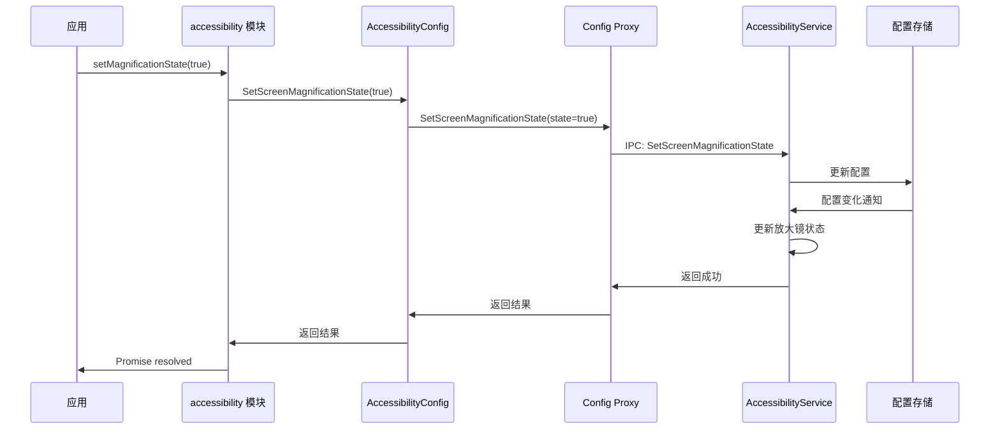
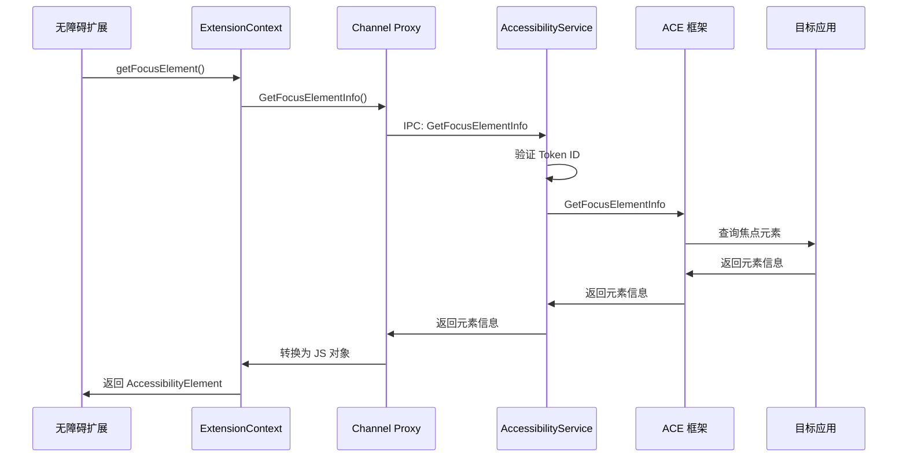
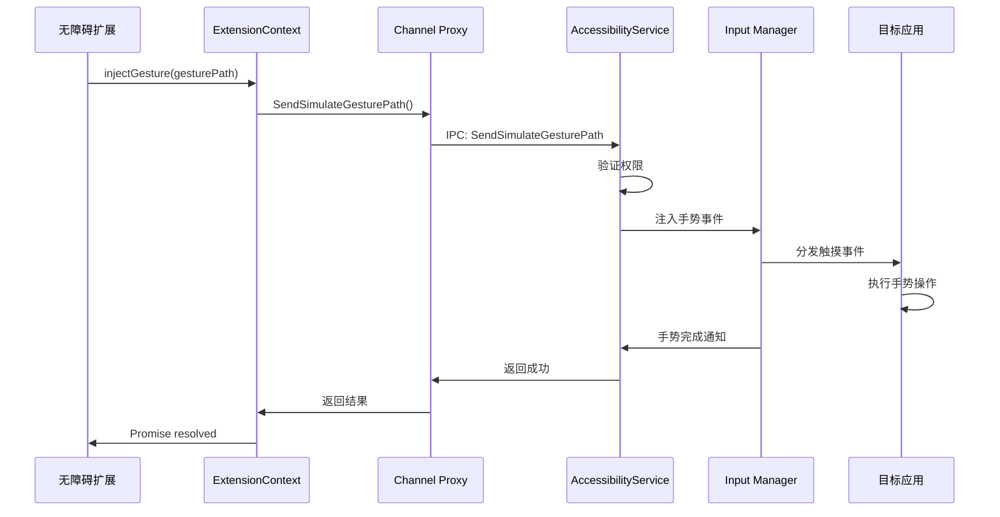
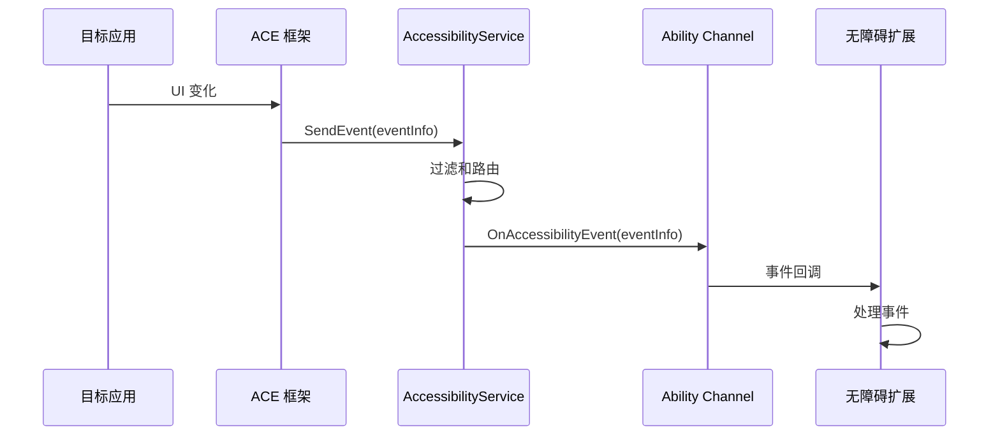

# 调用链图（附录）

## 目的

本文档提供 Accessibility 子系统关键 API 的调用链示例，帮助理解从 JS API 到核心逻辑的完整流程。

## 适用范围

- 需要理解调用流程的开发者
- 调试问题的开发者
- 架构师

## 关键结论

### 主要调用链类型

1. **配置调用链** - 设置/获取无障碍配置
2. **元素查询调用链** - 查询无障碍元素信息
3. **手势注入调用链** - 注入手势操作
4. **事件分发调用链** - 无障碍事件分发

---

## 详细内容

### 1. 配置调用链

#### 场景：应用设置屏幕放大镜状态

**证据**:
- N-API: `interfaces/kits/napi/src/native_module.cpp:2790` (SetMagnificationState)
- ASACkit: `frameworks/acfwk/src/accessibility_config.cpp`
- Proxy: `common/interface/src/accessible_ability_manager_config_observer_proxy.cpp`
- Service: `services/aams/src/accessible_ability_manager_service.cpp:2740`

### 2. 元素查询调用链

#### 场景：无障碍扩展查询焦点元素

**证据**:
- N-API: `interfaces/kits/napi/accessibility_extension_context/napi_accessibility_extension_context.cpp`
- Proxy: `common/interface/src/accessibility_element_operator_proxy.cpp`
- Service: `services/aams/src/accessibility_element_operator_stub.cpp`

### 3. 手势注入调用链

#### 场景：无障碍扩展注入手势

**证据**:
- N-API: `interfaces/kits/napi/accessibility_extension_context/napi_accessibility_extension_context.cpp`
- Proxy: `common/interface/src/accessibility_element_operator_proxy.cpp`
- Service: `services/aams/src/accessibility_touchEvent_injector.cpp`

### 4. 事件分发调用链

#### 场景：目标应用发送无障碍事件

**证据**:
- ACE: 集成层（假设）
- Service: `services/aams/src/accessibility_event_transmission.cpp`
- Channel: `common/interface/src/accessible_ability_channel_stub.cpp`

---

## 相关链接

- [项目概览](00_Overview.md)
- [架构说明](03_Architecture.md)
- [N-API 接口](04_N-API.md)
- [内部 API](05_Inner_API.md)

---

最后更新: 2026-02-06
