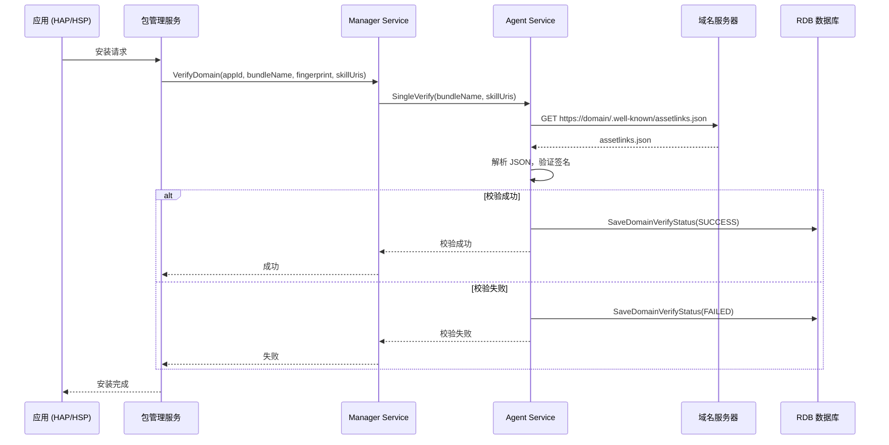
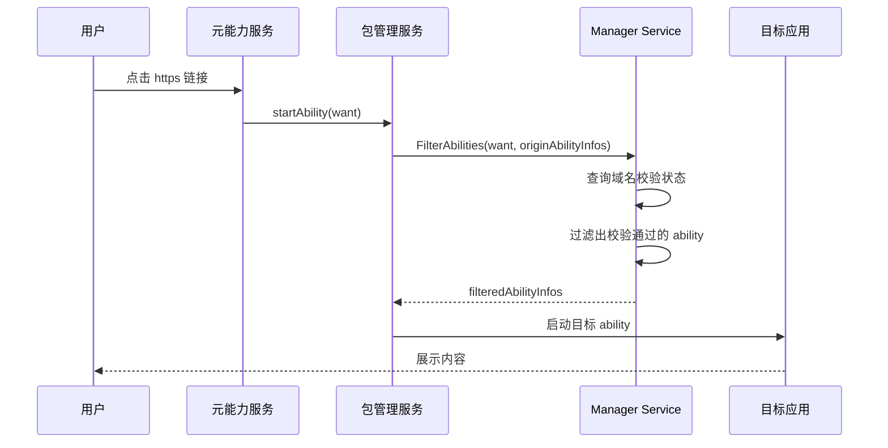

# 架构说明

## 1. 整体架构图

```
┌─────────────────────────────────────────────────────────────────┐
│                     应用域名校验部件架构                          │
├─────────────────────────────────────────────────────────────────┤
│                                                                  │
│  ┌─────────────┐      ┌─────────────┐      ┌─────────────┐    │
│  │   应用层     │      │   包管理     │      │  元能力管理   │    │
│  │  (HAP/HSP)  │      │  Framework  │      │  (Ability)  │    │
│  └──────┬──────┘      └──────┬──────┘      └──────┬──────┘    │
│         │                    │                    │           │
│         │  1.安装/更新       │  2.隐式跳转        │           │
│         │  3.卸载           │                    │           │
│         └──────────────────►│                    │           │
│                            │                    │           │
│  ┌─────────────┐           │                    │           │
│  │   Manager   │◄──────────┤                    │           │
│  │  Service    │  4.校验/查询│                    │           │
│  │  (SA 6200)  │           │                    │           │
│  └──────┬──────┘           │                    │           │
│         │                  │                    │           │
│         │  5.发起校验      │                    │           │
│         └─────────────────►│                    │           │
│                            │                    │           │
│  ┌─────────────┐           │                    │           │
│  │   Agent     │◄──────────┤                    │           │
│  │  Service    │  6.执行校验│                    │           │
│  │  (SA 6201)  │           │                    │           │
│  └──────┬──────┘           │                    │           │
│         │                  │                    │           │
│         │  7.HTTP 请求     │                    │           │
│         │  8.解析 JSON     │                    │           │
│         └────────┬─────────┘                    │           │
│                  │                              │           │
│                  ▼                              │           │
│         ┌─────────────┐                         │           │
│         │  域名服务器  │  assetlinks.json       │           │
│         │  (外部)      │◄───────────────────────┘           │
│         └─────────────┘                                    │
│                                                                  │
├─────────────────────────────────────────────────────────────────┤
│                        内部模块                                  │
│  ┌──────────────────────────────────────────────────────────┐  │
│  │  ┌─────────┐  ┌─────────┐  ┌─────────┐  ┌─────────┐     │  │
│  │  │ Verifier │  │Extension│  │  RDB    │  │ Common  │     │  │
│  │  │ 校验器   │  │ 扩展框架 │  │ 数据库  │  │ 公共模块│     │  │
│  │  └─────────┘  └─────────┘  └─────────┘  └─────────┘     │  │
│  └──────────────────────────────────────────────────────────┘  │
│                                                                  │
└─────────────────────────────────────────────────────────────────┘
```

## 2. 组件职责

| 组件 | 职责 | 关键类 |
|-----|------|-------|
| **Manager Service** | 域名前管理、状态存储、查询接口、ability 过滤 | `AppDomainVerifyMgrService` |
| **Agent Service** | HTTP 请求执行、域名校验逻辑、结果返回 | `AppDomainVerifyAgentService` |
| **Verifier** | JSON 解析、签名验证、校验任务调度 | `DomainVerifier`, `VerifyTask` |
| **Extension** | 扩展框架、ExtensionAbility 实现 | `AppDomainVerifyExtensionMgr` |
| **RDB** | 持久化存储、校验状态管理 | `AppDomainVerifyRdbDataManager` |
| **Common** | HTTP 会话、权限管理、工具类 | `PermissionManager`, `AppDomainVerifyTaskMgr` |

## 3. 数据流

### 3.1 应用安装校验流程



### 3.2 隐式跳转过滤流程



## 4. 线程模型

### 4.1 线程划分

| 线程/任务 | 职责 | 调度方式 |
|---------|------|---------|
| **Main Thread** | SA 生命周期管理 | System Ability Framework |
| **Binder Thread** | IPC 请求处理 | Binder Driver |
| **FFRT Tasks** | HTTP 请求、校验任务 | FFRT (Fast Future Runtime) |
| **Timer Tasks** | 周期刷新 | 定时器 |

### 4.2 并发模型

```
┌─────────────────────────────────────────┐
│           Manager Service               │
├─────────────────────────────────────────┤
│  ┌───────────────────────────────────┐ │
│  │         Binder Thread Pool        │ │
│  │   IPC 请求 → 分发到工作线程        │ │
│  └───────────────────────────────────┘ │
│              │                           │
│              ▼                           │
│  ┌───────────────────────────────────┐ │
│  │         FFRT Task Queue           │ │
│  │   - 查询操作 (只读)                │ │
│  │   - 过滤逻辑                      │ │
│  └───────────────────────────────────┘ │
│              │                           │
│              ▼                           │
│  ┌───────────────────────────────────┐ │
│  │            RDB (同步)              │ │
│  │   - 状态读取                      │ │
│  │   - 结果缓存                      │ │
│  └───────────────────────────────────┘ │
└─────────────────────────────────────────┘

┌─────────────────────────────────────────┐
│            Agent Service                │
├─────────────────────────────────────────┤
│  ┌───────────────────────────────────┐ │
│  │         Binder Thread Pool        │ │
│  │   IPC 请求 → 分发到工作线程        │ │
│  └───────────────────────────────────┘ │
│              │                           │
│              ▼                           │
│  ┌───────────────────────────────────┐ │
│  │         FFRT Task Queue           │ │
│  │   - HTTP 请求 (异步)               │ │
│  │   - JSON 解析                     │ │
│  │   - 签名验证                      │ │
│  └───────────────────────────────────┘ │
│              │                           │
│              ▼                           │
│  ┌───────────────────────────────────┐ │
│  │         NetStack HTTP             │ │
│  │   - 域名解析                      │ │
│  │   - TLS 连接                     │ │
│  │   - 数据传输                     │ │
│  └───────────────────────────────────┘ │
└─────────────────────────────────────────┘
```

## 5. IPC 通信

### 5.1 IPC 架构

```
┌─────────────────────────────────────────────────────────────┐
│                        IPC Layer                           │
├─────────────────────────────────────────────────────────────┤
│                                                              │
│   ┌─────────────┐          ┌─────────────┐                 │
│   │   Proxy     │          │    Stub     │                 │
│   │  (客户端)    │ ───────► │  (服务端)    │                 │
│   └─────────────┘          └─────────────┘                 │
│         │                        │                         │
│         │  MessageParcel          │  OnRemoteRequest       │
│         │  (序列化)               │  (反序列化+分发)        │
│         ▼                        ▼                         │
│   ┌─────────────────────────────────────────────────────┐  │
│   │                   Binder Driver                     │  │
│   └─────────────────────────────────────────────────────┘  │
│                                                              │
└─────────────────────────────────────────────────────────────┘
```

### 5.2 IPC 接口定义

| 接口 | 描述符 | 方法数 |
|-----|-------|-------|
| `IAppDomainVerifyMgrService` | `ohos.appDomainVerify.IAppDomainVerifyMgrService` | 15+ |
| `IAppDomainVerifyAgentService` | `ohos.appDomainVerify.IAppDomainVerifyAgentService` | 3 |

## 6. 状态管理

### 6.1 内存状态

- **L1 Cache**: 内存中的校验状态缓存（按需加载）
- **L2 Cache**: RDB 持久化的校验结果

### 6.2 持久化

```
RDB 表结构:
├── app_verify_status        # 应用校验状态
├── domain_verify_result     # 域名校验结果
├── bundle_domain_mapping   # 包名-域名映射
└── deferred_link           # 延迟链接
```

## 7. 扩展点

| 扩展点 | 说明 | 可替换性 |
|-------|------|---------|
| **HTTP 实现** | 当前使用 netstack，可替换为其他 HTTP 库 | ⚠️ 不推荐 |
| **数据库** | 当前使用 relational_store，可替换 | ⚠️ 不推荐 |
| **JSON 解析** | 当前使用 cJSON，可替换 | ✅ 可以 |
| **签名验证** | 当前使用 openssl | ✅ 可以 |

## 8. 相关文档

| 文档 | 链接 |
|-----|------|
| Inner API 详细说明 | [02_Inner_API.md](./02_Inner_API.md) |
| GN 构建配置 | [04_GN_Build.md](./04_GN_Build.md) |
| 安全风险评估 | [06_Security.md](./06_Security.md) |
| 关键调用链 | [appendix/Callgraphs.md](./appendix/Callgraphs.md) |
