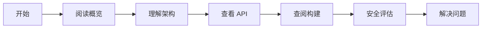

# 应用域名校验部件 (App Domain Verify) Wiki

> 本 Wiki 为 OpenHarmony `app_domain_verify` 部件的工程文档，旨在帮助开发者快速理解项目架构、使用方法与安全风险。

## 文档覆盖范围

### 已覆盖内容

| 章节 | 内容 | 状态 |
|-----|------|------|
| [概览](00_Overview.md) | 项目定位、核心能力、运行环境 | ✅ |
| [架构说明](01_Architecture.md) | 组件图、数据流、线程模型、关键时序 | ✅ |
| [Inner API](02_Inner_API.md) | 内部模块接口、依赖方向、稳定性 | ✅ |
| [N-API](03_N_API.md) | JS API 面、导出符号、参数校验 | ✅ |
| [GN 构建](04_GN_Build.md) | targets 列表、依赖关系、编译产物 | ✅ |
| [编译产物](05_Outputs.md) | .so/.abc/配置文件、安装路径 | ✅ |
| [安全风险评审](06_Security.md) | 攻击面、信任边界、风险点与修复建议 | ✅ |
| [常见问题](07_FAQ.md) | 构建/运行/调试问题与定位路径 | ✅ |
| [附录 - 调用链](appendix/Callgraphs.md) | 关键入口→核心逻辑调用链 | ✅ |
| [附录 - 配置项](appendix/Config_Flags.md) | 关键宏与 feature flags | ✅ |

### 未覆盖内容

- 测试代码相关细节（按规范不纳入文档）
- 详细的错误码映射表（需要更多代码分析）

## 更新方式

本 Wiki 由代码分析自动生成。当代码发生变更时：

1. 重新运行代码扫描脚本
2. 更新对应的 `wiki/*.md` 文件
3. 更新 `SUMMARY.md` 导航
4. 验证文档链接完整性

**生成时间**: 2026-02-06

## 相关链接

- OpenHarmony 官方文档: https://www.openharmony.cn/
- 包管理子系统: https://gitee.com/openharmony/bundle_manager_subsystem
- 本地代码: `/Volumes/lexar/code/d/work/oh/foundation/bundlemanager/app_domain_verify/`

## 快速导航

## 贡献指南

如发现文档错误或遗漏，请：

1. 在 `wiki/_work/NOTES.md` 中记录问题
2. 更新对应的 `.md` 文件
3. 提交 Pull Request
