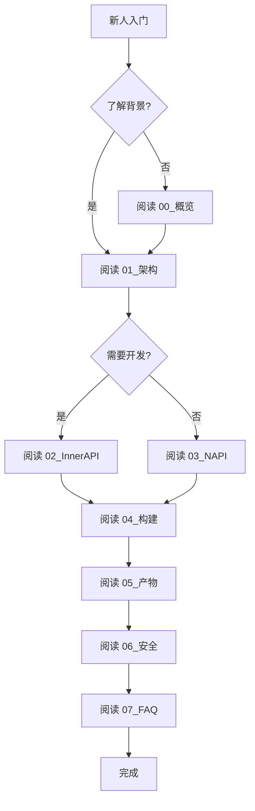

# 文档导航

> 新人阅读顺序建议：按顺序阅读可快速建立完整认知

## 核心文档（必读）

| 顺序 | 文档 | 描述 | 预计时间 |
|-----|------|------|---------|
| 1 | [README](README.md) | 文档说明与更新方式 | 2 min |
| 2 | [概览](00_Overview.md) | 项目定位、核心能力、技术栈 | 5 min |
| 3 | [架构说明](01_Architecture.md) | 组件图、数据流、线程模型 | 10 min |
| 4 | [Inner API](02_Inner_API.md) | 内部模块接口与依赖 | 10 min |
| 5 | [N-API](03_N_API.md) | JS API 完整参考 | 10 min |
| 6 | [GN 构建](04_GN_Build.md) | 编译配置与依赖关系 | 5 min |
| 7 | [编译产物](05_Outputs.md) | 产物清单与安装路径 | 5 min |
| 8 | [安全风险评审](06_Security.md) | 攻击面分析与风险点 | 10 min |
| 9 | [常见问题](07_FAQ.md) | 构建/运行/调试常见问题 | 5 min |

## 附录（按需查阅）

| 文档 | 描述 |
|-----|------|
| [调用链](appendix/Callgraphs.md) | 关键入口→核心逻辑调用链 |
| [配置项](appendix/Config_Flags.md) | 关键宏与 feature flags |

## 代码证据索引

所有关键结论均可追溯到以下代码位置：

| 类别 | 证据位置 |
|-----|---------|
| Manager Service | `services/include/manager/core/i_app_domain_verify_mgr_service.h` |
| Agent Service | `interfaces/inner_api/client/include/sa_interface/i_app_domain_verify_agent_service.h` |
| 权限校验 | `frameworks/common/include/permission/permission_manager.h` |
| N-API 实现 | `interfaces/kits/js/jsi/src/native_module.cpp` |
| GN 构建 | `BUILD.gn` |
| SA 配置 | `profile/6200.json`, `profile/6201.json` |

## 新人阅读路线图

## 版本历史

| 版本 | 日期 | 更新内容 |
|-----|------|---------|
| 1.0 | 2026-02-06 | 初始版本，完整文档覆盖 |
