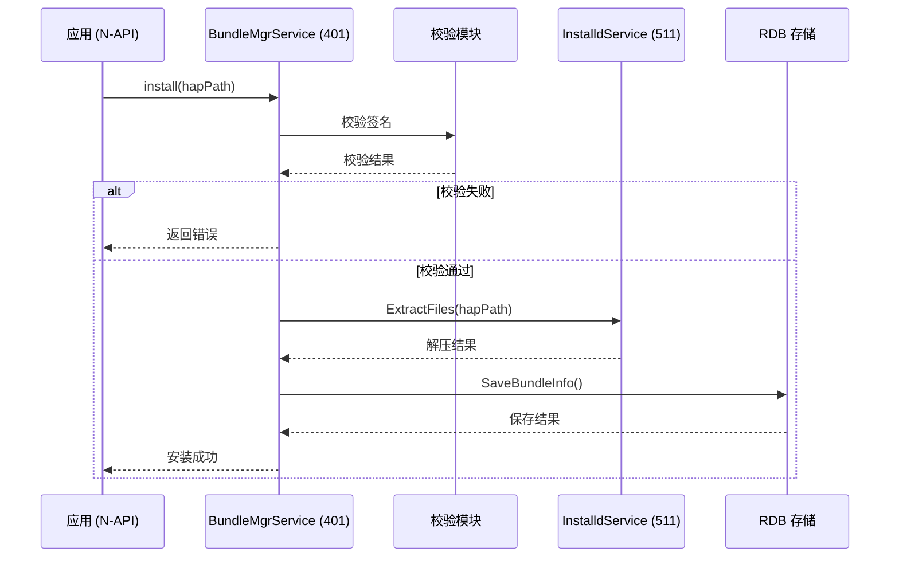
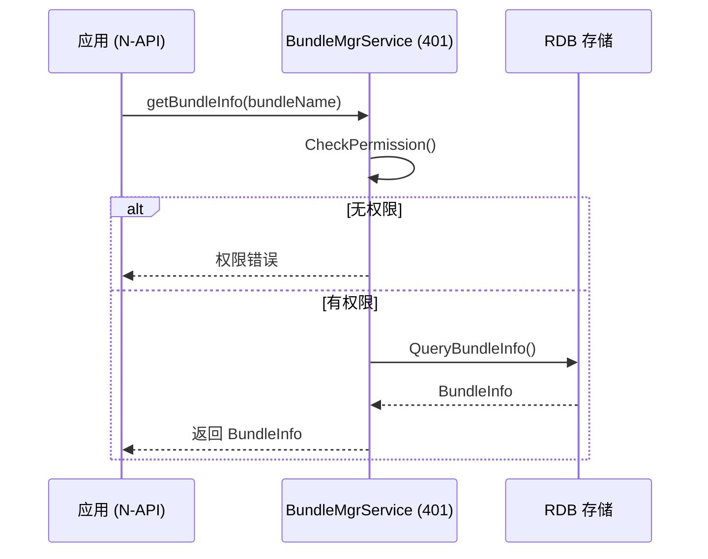

# 架构说明

## 整体架构图

```
┌─────────────────────────────────────────────────────────────────────────────┐
│                          用户空间                                              │
├─────────────────────────────────────────────────────────────────────────────┤
│  ┌─────────────────────────────────────────────────────────────────────┐    │
│  │                        应用进程                                        │    │
│  │  ┌──────────────────┐  ┌──────────────────┐  ┌──────────────────┐  │    │
│  │  │   JS 应用         │  │   Native 应用     │  │   ArkTS 应用      │  │    │
│  │  │  (N-API 调用)      │  │   (NDK 调用)      │  │   (ANI 调用)       │  │    │
│  │  └────────┬─────────┘  └────────┬─────────┘  └────────┬─────────┘  │    │
│  └───────────┼───────────────────────┼───────────────────────┼──────────┘    │
│              │                       │                       │                  │
│              ▼                       ▼                       ▼                  │
│  ┌─────────────────────────────────────────────────────────────────────┐    │
│  │                    接口层 (interfaces/kits/)                          │    │
│  │  ┌──────────────────┐  ┌──────────────────┐  ┌──────────────────┐  │    │
│  │  │  bundle.bundleManager │  │ bundle.ndk       │  │ bundle.ani       │  │    │
│  │  │     (N-API)          │  │   (NDK)          │  │   (ANI)          │  │    │
│  │  └────────┬─────────┘  └────────┬─────────┘  └────────┬─────────┘  │    │
│  └───────────┼───────────────────────┼───────────────────────┼──────────┘    │
│              │                       │                       │                  │
│              └───────────────────────┼───────────────────────┘                  │
│                                      │                                          │
└──────────────────────────────────────┼──────────────────────────────────────────┘
                                       │
                                       ▼ IPC (Binder)
┌─────────────────────────────────────────────────────────────────────────────┐
│  ┌─────────────────────────────────────────────────────────────────────┐    │
│  │                     Foundation 进程                                  │    │
│  │  ┌───────────────────────────────────────────────────────────────┐  │    │
│  │  │              BundleMgrService (SA 401)                         │  │    │
│  │  │  ┌───────────────┐ ┌───────────────┐ ┌─────────────────────┐ │  │    │
│  │  │  │  安装模块       │ │  数据模块      │ │      查询模块        │ │  │    │
│  │  │  │  Installer    │ │  DataMgr      │ │     Query           │ │  │    │
│  │  │  └───────┬───────┘ └───────┬───────┘ └──────────┬──────────┘ │  │    │
│  │  │          │                 │                    │             │  │    │
│  │  │          └────────┬────────┴────────┬───────────┘             │  │    │
│  │  │                   │                 │                          │  │    │
│  │  │  ┌────────────────┴─────────────────┴──────────────────┐      │  │    │
│  │  │  │            BundleMgrHostImpl                        │      │  │    │
│  │  │  │            (IBundleMgr IPC 接口实现)                  │      │  │    │
│  │  │  └─────────────────────────────────────────────────────┘      │  │    │
│  │  └───────────────────────────────────────────────────────────────┘  │    │
│  └─────────────────────────────────────────────────────────────────────┘    │
│                                      │                                     │
└──────────────────────────────────────┼─────────────────────────────────────┘
                                       │
                                       ▼ IPC (Binder)
┌─────────────────────────────────────────────────────────────────────────────┐
│  ┌─────────────────────────────────────────────────────────────────────┐    │
│  │                    Installs 进程 (特权)                               │    │
│  │  ┌───────────────────────────────────────────────────────────────┐  │    │
│  │  │              InstalldService (SA 511)                         │  │    │
│  │  │     (特权进程：文件/目录操作，需要 root 权限)                   │  │    │
│  │  │  ┌───────────────┐ ┌───────────────┐ ┌─────────────────────┐ │  │    │
│  │  │  │  目录操作      │ │  文件操作       │ │   沙箱 UID/GID      │ │  │    │
│  │  │  │  MkDir/RmDir  │ │  Create/Delete │ │   操作              │ │  │    │
│  │  │  └───────────────┘ └───────────────┘ └─────────────────────┘ │  │    │
│  │  └───────────────────────────────────────────────────────────────┘  │    │
│  └─────────────────────────────────────────────────────────────────────┘    │
└─────────────────────────────────────────────────────────────────────────────┘
```

**证据来源**: `sa_profile/401.json`, `sa_profile/511.json`, `services/bundlemgr/src/`

---

## 进程模型

### BundleMgrService (SA 401)

| 属性 | 值 |
|------|-----|
| 进程 | foundation |
| SA ID | 401 |
| 库 | libbms.z.so |
| run-on-create | true |
| bootphase | CoreStartPhase |
| 依赖 SA | 3503 |

**主要职责**:
- 包信息查询 (BundleInfo, AbilityInfo)
- 安装/更新/卸载编排
- 权限管理
- 与 InstalldService IPC 通信

**代码位置**: `services/bundlemgr/src/bundle_mgr_service.cpp`

### InstalldService (SA 511)

| 属性 | 值 |
|------|-----|
| 进程 | installs (特权) |
| SA ID | 511 |
| 库 | libinstalls.z.so |
| run-on-create | false |
| bootphase | CoreStartPhase |
| 空闲卸载 | 180 秒 |

**主要职责**:
- 特权文件/目录操作
- 沙箱 UID/GID 设置
- 数据目录创建/删除

**代码位置**: `services/bundlemgr/src/installd/`

---

## 数据流

### 安装流程

```
1. 调用方 (N-API)
   ↓
2. BundleMgrHostImpl::Install()
   ↓
3. BundleInstaller::Install()
   ├─ 参数校验
   ├─ 签名校验 (verify/)
   ├─ 权限检查
   └─ 安装前准备
        ↓
4. InstalldClient (IPC to SA 511)
   ├─ MkDir() - 创建目录
   ├─ ExtractFiles() - 解压 HAP
   └─ SetDirOwner() - 设置权限
        ↓
5. BundleDataMgr::AddBundleInfo()
   └─ RDB 持久化
        ↓
6. 返回结果
```

**证据来源**: `services/bundlemgr/src/bundle_installer.cpp`, `services/bundlemgr/src/installd/installd_client.cpp`

### 查询流程

```
1. 调用方 (N-API)
   ↓
2. BundleMgrHostImpl::GetBundleInfo()
   ├─ 权限校验
   └─ BundleDataMgr::GetBundleInfo()
        ↓
3. RDB 查询
   └─ 返回 InnerBundleInfo
        ↓
4. 转换为对外数据结构
   ↓
5. 返回结果
```

**证据来源**: `services/bundlemgr/src/bundle_mgr_host_impl.cpp`

---

## 线程模型

### 主线程

- SA 启动/注册
- 关键配置加载
- 事件处理

### 工作线程池

- 安装/卸载操作
- HAP 解析
- 签名验证

### IPC 通信线程

- Binder 线程池处理 IPC 请求
- InstalldClient 异步调用

**证据来源**: `services/bundlemgr/src/` 各模块实现

---

## 关键时序图

### 包安装时序



### 包查询时序



---

## 模块依赖关系

```
bundle_mgr_service.cpp (主入口)
    │
    ├── bundle_data_mgr.cpp (数据管理)
    │   └── rdb/ (持久化)
    │
    ├── bundle_installer.cpp (安装)
    │   ├── bundle_install_checker.cpp (校验)
    │   │   └── verify/ (签名)
    │   └── installd_client.cpp (IPC 客户端)
    │       └── installd_service.cpp (IPC 服务端, SA 511)
    │
    ├── bundle_permission_mgr.cpp (权限)
    │   └── access_token/ (权限系统)
    │
    └── bundle_mgr_host_impl.cpp (IPC 接口)
        └── ipc/ (IPC 参数)
```

**证据来源**: `services/bundlemgr/src/` 各模块 `#include` 和 `deps`

---

## 信任边界

### 边界 1: 应用 → BundleMgrService (IPC)

- 输入验证：参数非空、长度、格式检查
- 权限检查：调用方身份验证

### 边界 2: BundleMgrService → InstalldService (IPC)

- 内部 IPC，信任链内
- 仅 BundleMgrService 可调用

### 边界 3: InstalldService → 文件系统

- **特权操作**，仅 InstalldService 可执行
- 路径规范化，防止路径遍历

---

## 延伸阅读

- [目录结构](01_Directory_Structure.md)
- [N-API 参考](03_N-API_Reference.md)
- [安全风险评审](07_Security_Review.md)
