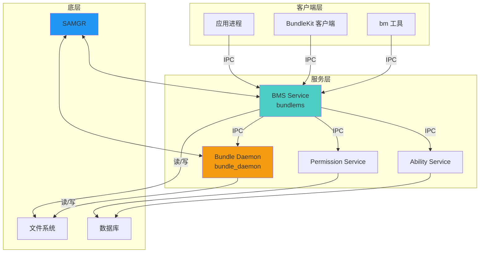
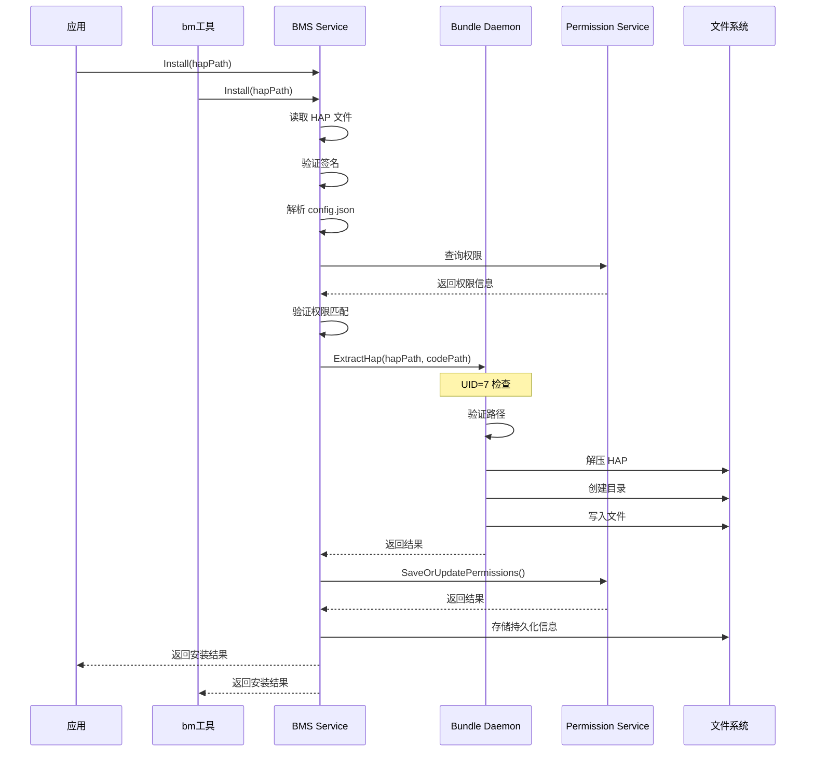
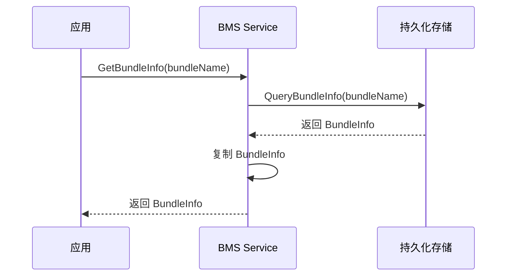
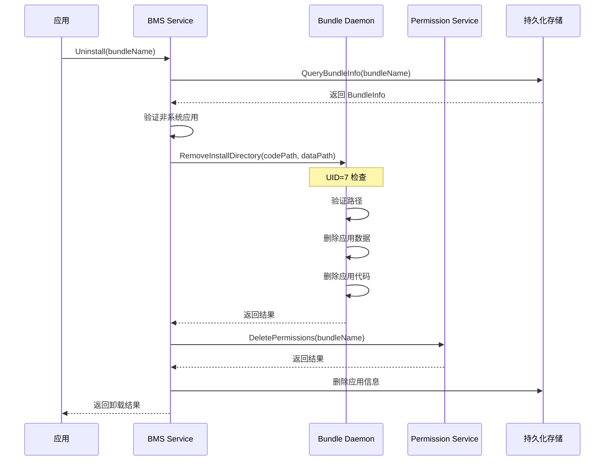
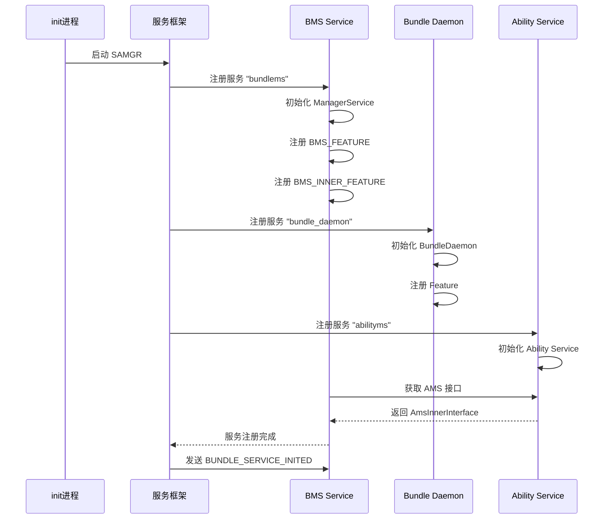
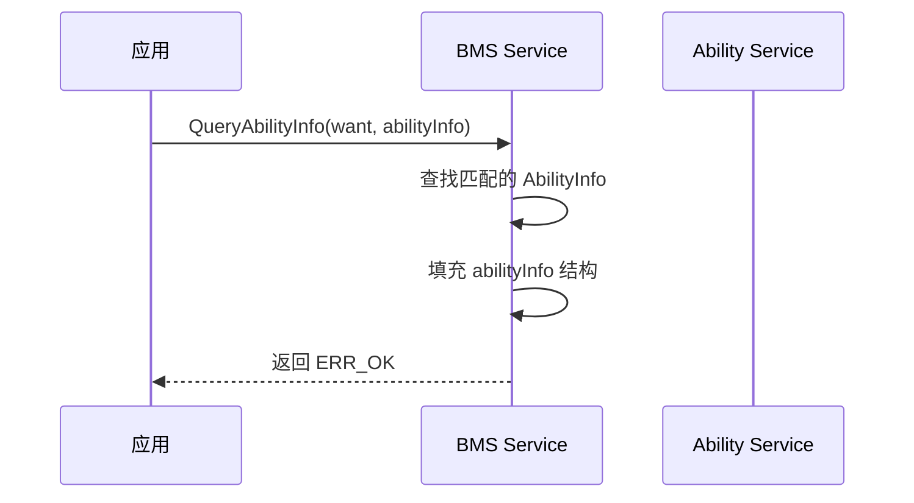
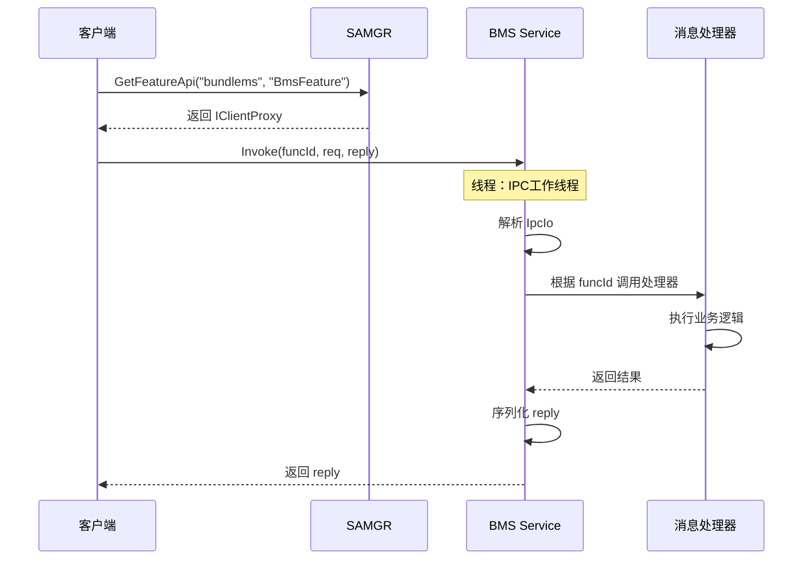

# 架构与数据流 - Bundle Framework Lite

## 目录

- [组件图](#组件图)
- [数据流](#数据流)
- [线程模型](#线程模型)
- [关键时序](#关键时序)

---

## 组件图



**组件说明**:

| 组件 | 类型 | 运行进程 | 职责 |
|------|------|----------|------|
| **应用进程** | 应用 | 用户应用 | 使用 BundleKit API |
| **BundleKit** | 客户端库 | 应用进程 | 提供 C/C++ 和 JS API |
| **bm 工具** | 命令行工具 | 独立进程 | 命令行管理应用 |
| **BMS Service** | 系统服务 | foundation | 核心包管理服务 |
| **Bundle Daemon** | 系统服务 | 独立进程 | 高权限文件操作 |
| **Permission Service** | 系统服务 | foundation | 权限管理 |
| **Ability Service** | 系统服务 | foundation | Ability 管理 |
| **SAMGR** | 服务框架 | foundation | 服务注册和 IPC 路由 |

---

## 数据流

### 安装流程数据流



**关键步骤**：

1. **输入验证**: HAP 路径、签名、权限
2. **HAP 解析**: 提取 config.json、manifest 等元数据
3. **权限匹配**: 验证应用请求的权限在 Provision 范围内
4. **文件提取**: 通过 Bundle Daemon 提取文件到安装目录
5. **持久化**: 存储应用信息到持久化存储
6. **通知**: 通过回调通知安装结果

---

### 查询流程数据流



---

### 卸载流程数据流



---

## 线程模型

### BMS Service 线程模型

```
foundation 进程
├── 主线程（事件循环）
│   ├── SAMGR 消息处理
│   ├── 服务初始化
│   └── 定时任务
│
└── 工作线程池（可选）
    ├── 安装任务
    ├── 卸载任务
    └── 查询任务
```

**证据**: `services/bundlemgr_lite/src/bundle_manager_service.cpp`

### Bundle Daemon 线程模型

```
bundle_daemon 进程
└── 主线程
    ├── SAMGR 消息处理
    ├── IPC 消息分发
    └── 同步文件操作
```

**证据**: `services/bundlemgr_lite/bundle_daemon/src/bundle_daemon.cpp`

### 线程同步机制

| 组件 | 同步机制 | 说明 |
|------|----------|------|
| **BMS** | Mutex/条件变量 | BundleMap 线程安全访问 |
| **Bundle Daemon** | SAMGR IPC | IPC 保证消息顺序处理 |
| **BundleKit** | Semaphore | 异步安装/卸载回调同步 |

---

## 关键时序

### 系统启动时序



**证据**: `services/bundlemgr_lite/src/bundle_ms_host.cpp`

---

### 安装应用时序（详细）

```mermaid
sequenceDiagram
    participant App as 应用
    participant BMS as BMS Service
    participant Parser as BundleParser
    participant Signer as HapSignVerify
    participant BD as Bundle Daemon
    
    App->>BMS: Install(hapPath, installParam, callback)
    BMS->>Parser: Parse(hapPath)
    
    Parser->>Parser: 读取 HAP 头部
    Parser->>Parser: 解析 config.json
    Parser->>Signer: VerifySignature(hapPath)
    Signer-->>Parser: 返回 SignatureInfo
    
    Parser->>BMS: 返回 BundleInfo
    BMS->>BMS: CheckProvisionInfoIsValid()
    BMS->>BMS: 匹配 bundleName
    BMS->>BMS: 匹配权限列表
    
    alt 权限匹配失败
        BMS-->>App: 返回 ERR_APPEXECFWK_INSTALL_FAILED_INVALID_PROVISIONINFO
    else 权限匹配成功
        BMS->>BD: ExtractHap(hapPath, codePath)
        BD->>BD: realpath(hapPath)
        BD->>BD: 验证代码路径
        BD->>BD: 解压 HAP 到代码目录
        BD->>BD: 解压资源到资源目录
        BD-->>BMS: 返回结果
        
        alt 提取失败
            BMS->>BD: RemoveInstallDirectory(codePath, dataPath)
            BMS-->>App: 返回错误
        else 提取成功
            BMS->>BMS: StorePermissions(bundleName, permissions)
            BMS->>BMS: 持久化 BundleInfo
            BMS->>BMS: 发送 BUNDLE_INSTALLED 事件
            BMS->>App: callback(ERR_OK, "Install success")
    end
```

---

### 查询 Ability 信息时序



---

### IPC 消息处理时序



**证据**: `services/bundlemgr_lite/src/bundle_ms_feature.cpp:357-378`

---

## 信任边界

### 数据流安全边界

| 边界 | 信任侧 | 非信任侧 | 验证机制 |
|------|---------|----------|----------|
| **HAP 文件 → BMS** | BMS | 用户 | 签名验证、格式验证 |
| **BundleKit → BMS** | BMS | 应用 | UID 检查、权限检查 |
| **BMS → Bundle Daemon** | Bundle Daemon | BMS | UID=7 检查、路径白名单 |
| **bm 工具 → BMS** | BMS | 用户 | 路径规范化、输入验证 |
| **BMS → Permission Service** | Permission Service | BMS | IPC 鉴权 |

### 关键检查点

1. **HAP 入口检查**:
   - 路径验证（`realpath()`）
   - 签名验证（`APPVERI_AppVerify()`）
   - 格式验证（Regex、JSON 解析）

2. **IPC 入口检查**:
   - UID 检查（`GetCallingUid()`）
   - 权限检查（`CheckSelfPermission()`）
   - 参数长度检查（`IpcIo` 大小限制）

3. **文件操作检查**:
   - UID=7 检查（Bundle Daemon）
   - 路径白名单（`IsValidPath()`）
   - 符号链接解析（`realpath()`）

---

## 相关文档

- [目录结构与代码地图](02_CodeMap.md) - 组件文件位置
- [对外接口文档](04_Interface.md) - IPC 接口定义
- [攻击面分析](05_AttackSurface.md) - 信任边界详情

---

**最后更新**: 2026-02-07
