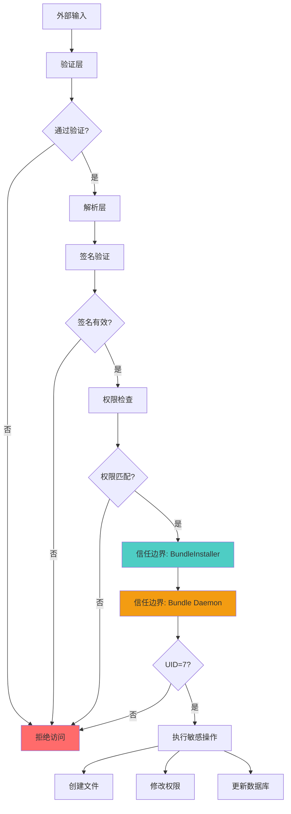

# 攻击面分析 - Bundle Framework Lite

## 目录

- [外部输入清单](#外部输入清单)
- [敏感操作清单](#敏感操作清单)
- [信任边界图](#信任边界图)

---

## 外部输入清单

### 1. HAP 文件输入

**入口点**: `Install()` API / `bm install` 命令

**输入来源**:
- 📁 本地文件系统路径（通过 `Install(hapPath, ...)` 传入）
- 📁 命令行参数（通过 `bm install -p <path>` 传入）

**验证机制**:
```cpp
// 路径规范化
realpath(optarg, realPath);  // services/bundlemgr_lite/tools/src/command_parser.cpp

// 签名验证
APPVERI_AppVerify(hapFilepath.c_str(), &verifyResult);  // hap_sign_verify.cpp:29
```

**风险点**:
- 🔍 路径遍历（使用 `../` 绕过）
- 🔍 符号链接攻击（链接到任意文件）
- 🔍 Zip Slip（HAP 内包含恶意路径）
- 🔍 签名伪造（通过调试模式绕过）

---

### 2. IPC 消息输入

**入口点**: BMS Feature、BMS Inner Feature、Bundle Daemon Feature

**输入来源**:
- 📡 BundleKit 客户端通过 SAMGR 发送的 IPC 请求
- 📡 bm 工具通过 SAMGR 发送的 IPC 请求
- 📡 其他子系统通过 IPC 调用的内部 API

**消息类型**:

| Feature | 消息示例 | 命令 ID |
|---------|----------|----------|
| BMS_FEATURE | `QUERY_ABILITY_INFO` | 0 |
| BMS_INNER_FEATURE | `INSTALL` | 12 |
| BMS_INNER_FEATURE | `UNINSTALL` | 13 |
| BDS_SERVICE | `EXTRACT_HAP` | 0 |
| BDS_SERVICE | `REMOVE_INSTALL_DIRECTORY` | 7 |

**证据**: `interfaces/inner_api/bundlemgr_lite/bundle_inner_interface.h`

**验证机制**:
```cpp
// Bundle Daemon 权限检查
if (!CheckPermission()) {  // bundle_daemon.cpp:108
    return;  // 仅接受 UID=7 (BMS) 的请求
}
```

**风险点**:
- 🔍 IPC 消息伪造（伪造其他进程的调用）
- 🔍 消息重放攻击
- 🔍 权限绕过（伪装 UID）
- 🔍 消息参数注入（污染 IpcIo 缓冲区）

---

### 3. Bundle Name 输入

**入口点**: `Uninstall(bundleName, ...)`, `GetBundleInfo(bundleName, ...)`

**输入来源**:
- 📝 客户端 API 参数
- 📝 IPC 消息参数

**验证机制**:
```cpp
// Bundle Name 格式验证
bool BundleParser::CheckBundleNameIsValid(const char *bundleName) {
    std::string pattern { "([a-zA-Z0-9_]+\\.)+[a-zA-Z0-9_]+" };
    std::regex re(pattern);
    return std::regex_match(bundleName, re);  // bundle_parser.cpp:101
}
```

**风险点**:
- 🔍 格式绕过（通过特殊字符）
- 🔍 注入攻击（构造恶意 bundleName）
- 🔍 拒绝服务攻击（构造无效 bundleName 导致解析失败）

---

### 4. 配置文件输入（config.json）

**入口点**: HAP 包内的配置文件

**输入来源**:
- 📄 HAP 包内的 `config.json` 或 `module.json`

**验证机制**:
```cpp
// JSON 字段长度检查
#define CHECK_LENGTH(ptr, max) \
    if ((ptr) != nullptr && strlen(ptr) > (max)) { \
        return ERR_APPEXECFWK_INSTALL_FAILED_PARSE_INVALID_LENGTH; \
    }

// JSON 必填字段检查
#define CHECK_NULL(ptr) \
    if ((ptr) == nullptr) { \
        return ERR_APPEXECFWK_INSTALL_FAILED_PARSE_MISSING_FIELD; \
    }
```

**风险点**:
- 🔍 JSON 注入（恶意构造的配置）
- 🔍 字段溢出（超长字符串导致缓冲区溢出）
- 🔍 类型混淆（传递不兼容的数据类型）

---

### 5. JavaScript API 输入

**入口点**: `capability.has(sysCapName)`

**输入来源**:
- 🌐 JS 应用传入的系统能力名称

**验证机制**:
```cpp
// JSI 参数转换
char *str = JSI::ValueToString(args[0]);  // capability_module.cpp

// 调用内部 C API
bool hasCap = HasSystemCapability(str);
```

**风险点**:
- 🔍 参数类型混淆（传入非字符串类型）
- 🔍 字符串长度溢出（超长 syscapName）
- 🔍 信息泄露（查询未授权的系统能力）

---

## 敏感操作清单

### 1. 文件系统操作

| 操作 | 实现位置 | 权限要求 | 风险 |
|------|----------|----------|------|
| **创建安装目录** | `BundleDaemonHandler::ExtractHap()` | root | 路径遍历 → 任意目录创建 |
| **写入应用文件** | `BundleDaemonHandler::StoreContentToFile()` | root | 路径注入 → 任意文件写入 |
| **删除应用数据** | `BundleDaemonHandler::RemoveInstallDirectory()` | root | 路径遍历 → 任意目录删除 |
| **移动文件** | `BundleDaemonHandler::MoveFile()` | root | 路径遍历 → 任意文件移动 |

**证据**: `services/bundlemgr_lite/bundle_daemon/src/bundle_daemon_handler.cpp`

**安全机制**:
```cpp
// 路径验证
if (!IsValidPath(rootDir, targetPath)) {  // bundle_file_utils.cpp:176
    return EC_INVALID;  // 拒绝包含 ".." 的路径
}

// 路径前缀检查
if (!IsValideCodePath(codePath)) {
    return EC_INVALID;  // 仅允许特定前缀的路径
}
```

---

### 2. 签名验证操作

| 操作 | 实现位置 | 风险 |
|------|----------|------|
| **HAP 签名验证** | `HapSignVerify::VerifySignature()` | 签名伪造 → 安装恶意应用 |
| **Provision 信息验证** | `CheckProvisionInfoIsValid()` | Provision 伪造 → 绕过权限限制 |
| **权限匹配** | `MatchPermissions()` | 权限提升 → 获得未授权权限 |

**证据**: `services/bundlemgr_lite/src/hap_sign_verify.cpp`

**安全机制**:
```cpp
// Release 构建强制签名验证
#ifndef OHOS_DEBUG
    errorCode = HapSignVerify::VerifySignature(path, signatureInfo);  // 始终验证
#else
    if (ManagerService::GetInstance().IsSignMode()) {
        errorCode = HapSignVerify::VerifySignature(path, signatureInfo);
    }
#endif
```

---

### 3. 权限管理操作

| 操作 | 实现位置 | 风险 |
|------|----------|------|
| **权限存储** | `SaveOrUpdatePermissions()` | 权限注入 → 获得未授权权限 |
| **权限删除** | `DeletePermissions()` | 权限绕过 → 保留危险权限 |
| **权限查询** | `GetPermission()` | 信息泄露 → 暴露应用权限 |

**证据**: `services/bundlemgr_lite/src/bundle_installer.cpp:264-343`

**安全机制**:
```cpp
// Provision 权限匹配
if (!MatchPermissions(signatureInfo.restrictedPermissions, 
                      permissions.permissionTrans, 
                      permissions.permNum)) {
    return ERR_APPEXECFWK_INSTALL_FAILED_INVALID_PROVISIONINFO;
    // 应用的权限必须在 Provision 的受限权限列表内
}
```

---

### 4. 系统调用操作

| 操作 | 实现位置 | 风险 |
|------|----------|------|
| **进程启动** | 调用 Ability Service | 进程注入 → 启动恶意应用 |
| **IPC 调用** | 调用其他子系统服务 | 提权攻击 → 利用其他服务漏洞 |

---

### 5. 内存分配操作

| 操作 | 实现位置 | 风险 |
|------|----------|------|
| **动态内存分配** | `malloc/new` | 溢出 → 堆破坏 |
| **缓冲区操作** | `memcpy/strcpy` | 边界未检查 → 栈/堆溢出 |

**缓解机制**:
- 使用 `bounds_checking_function` 库进行边界检查
- 使用安全的字符串操作函数

**证据**: `bundle.json:39`

---

## 信任边界图



**信任边界说明**:

| 边界 | 说明 | 保护机制 |
|------|------|----------|
| **验证层** | 输入验证和格式检查 | 正则表达式、长度限制 |
| **解析层** | JSON/HAP 解析 | 安全解析器、异常捕获 |
| **BundleInstaller** | BundleManager Service 内部逻辑 | UID 检查、权限匹配 |
| **Bundle Daemon** | 高权限文件操作进程 | UID=7 检查、路径白名单 |

---

## 攻击路径示例

### 路径遍历攻击路径

```
1. 攻击者构造 HAP 包，包含恶意 config.json
   ↓
2. 通过 Install(hapPath) 提交，hapPath = "/sdcard/evil.hap"
   ↓
3. HapSignVerify 验证签名（调试模式可能绕过）
   ↓
4. BundleParser 解析 config.json，提取 "bundleName" = "../../../etc/passwd"
   ↓
5. BundleInstaller 调用 BundleDaemon 创建目录
   ↓
6. BundleDaemonHandler::ExtractHap() 验证路径
   ↓
7. 如果 CheckRealPath() 未使用 realpath()，成功遍历
   ↓
8. 写入文件到 /etc/passwd，造成系统破坏
```

**关键漏洞点**: `services/bundlemgr_lite/src/gt_bundle_extractor.cpp:301`
```cpp
if (strstr(*bundleName, "../") != nullptr) {
    return ERR_APPEXECFWK_INSTALL_FAILED_PARSE_INVALID_BUNDLENAME;
}
// 只检查 "../"，可被 "..\" 等绕过
```

---

## 相关文档

- [安全风险评估](06_SecurityReview.md) - 详细漏洞分析和利用点
- [架构与数据流](03_Architecture.md) - 理解信任边界
- [内部实现细节](08_Internals.md) - 深入理解敏感操作实现

---

**最后更新**: 2026-02-07
