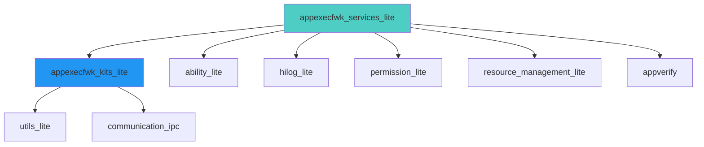
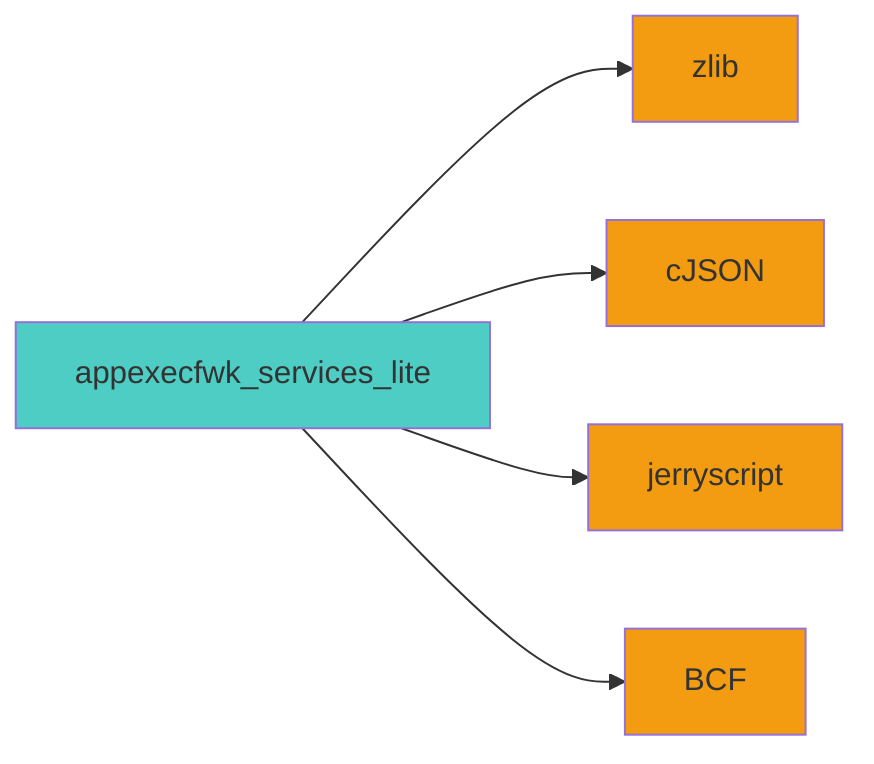

# 构建与产物 - Bundle Framework Lite

## 目录

- [GN 目标清单](#gn-目标清单)
- [编译产物](#编译产物)
- [Feature 开关](#feature-开关)

---

## GN 目标清单

### 核心组件目标

| Target 名称 | 类型 | 路径 | 产物 |
|----------|------|------|------|
| `appexecfwk_services_lite` | 组件 | `services/bundlemgr_lite/BUILD.gn:101` | BMS 服务、Bundle Daemon、bm 工具 |
| `appexecfwk_kits_lite` | 组件 | `frameworks/bundle_lite/BUILD.gn:26` | BundleKit 客户端库 |

**证据**: `bundle.json:46-49`

---

### BMS 服务目标

#### LiteOS-A 配置（共享库）

| Target | 类型 | 产物 | 说明 |
|--------|------|------|------|
| `bundlems` | shared_library | `libappexecfwk_services_lite.so` | BMS 服务库 |

**BUILD.gn 片段**:
```gni
shared_library("bundlems") {
  configs -= [ "//build/lite/config:language_cpp" ]
  configs += [ ":bundle_config" ]
  
  sources = [
    "src/bundle_daemon_client.cpp",
    "src/bundle_extractor.cpp",
    "src/bundle_installer.cpp",
    # ... 其他源文件
  ]
  
  public_deps = [
    "${appexecfwk_lite_path}/frameworks/bundle_lite:bundle",
    "${appverify_lite_path}:verify",
    "${hilog_lite_path}/frameworks/featured:hilog_shared",
    # ... 其他依赖
  ]
}
```

**证据**: `services/bundlemgr_lite/BUILD.gn:105-167`

#### LiteOS-M 配置（静态库）

| Target | 类型 | 产物 | 说明 |
|--------|------|------|------|
| `bundlems` | static_library | `libappexecfwk_services_lite.a` | BMS 服务库（静态链接）|

**区别**:
- 使用 `static_library` 而非 `shared_library`
- 定义 `JERRY_FOR_IAR_CONFIG`
- 不链接 IPC 库（LiteOS-M 不需要 IPC）

**证据**: `services/bundlemgr_lite/BUILD.gn:23-100`

---

### BundleKit 客户端目标

| Target | 类型 | 产物 | 说明 |
|--------|------|------|------|
| `bundle` | shared_library/static_library | `libappexecfwk_kits_lite.so` / `.a` | BundleKit 客户端库 |

**BUILD.gn 片段**:
```gni
lite_library("bundle") {
  if (ohos_kernel_type == "liteos_m") {
    target_type = "static_library"
  } else {
    target_type = "shared_library"
  }
  
  sources = [
    "src/bundle_manager.cpp",
    "src/bundle_info.cpp",
    # ... 其他源文件
  ]
  
  deps = [
    "${aafwk_lite_path}/frameworks/want_lite:want",
    "${hilog_lite_path}/frameworks/featured:hilog_shared",
    # ... 其他依赖
  ]
}
```

**证据**: `frameworks/bundle_lite/BUILD.gn:30-132`

---

### bm 工具目标

| Target | 类型 | 产物 | 说明 |
|--------|------|------|------|
| `bm` | executable | `bm` | 命令行工具 |

**BUILD.gn 片段**:
```gni
executable("bm") {
  sources = [
    "src/command_parser.cpp",
    "src/main.cpp",
  ]
  
  deps = [
    "${appexecfwk_lite_path}/frameworks/bundle_lite:bundle",
    "${communication_path}/ipc/interfaces/innerkits/c/ipc:ipc_single",
    # ... 其他依赖
  ]
  
  output_dir = "$root_out_dir/dev_tools"
}
```

**证据**: `services/bundlemgr_lite/tools/BUILD.gn:22-71`

---

### Bundle Daemon 目标

| Target | 类型 | 产物 | 说明 |
|--------|------|------|------|
| `bundle_daemon` | executable | `bundle_daemon` | 独立高权限进程 |

**BUILD.gn 片段**: `services/bundlemgr_lite/bundle_daemon/BUILD.gn`

---

### JS API 目标

| Target | 类型 | 产物 | 说明 |
|--------|------|------|------|
| `capability_api` | shared_library | `libcapability_api.so` | JSI 模块库（设备）|
| `capability_api_simulator` | static_library | `libcapability_api.a` | JSI 模块库（模拟器）|

**BUILD.gn 片段**: `interfaces/kits/bundle_lite/js/builtin/BUILD.gn`

---

## 编译产物

### 输出目录结构

```
out/<board>/
├── dev_tools/
│   └── bin/
│       └── bm                    # bm 命令行工具
├── libs/
│   ├── libappexecfwk_kits_lite.so   # BundleKit 客户端库
│   ├── libappexecfwk_services_lite.so  # BMS 服务库（LiteOS-A）
│   └── libcapability_api.so          # JSI 模块库
└── ...
```

### 安装路径

| 产物 | 安装路径 | 说明 |
|------|----------|------|
| `bm` | `/bin/bm` | 命令行工具 |
| `libappexecfwk_kits_lite.so` | `/usr/lib/libappexecfwk_kits_lite.so` | BundleKit 库 |
| `libappexecfwk_services_lite.so` | `/system/lib/libappexecfwk_services_lite.so` | BMS 服务库 |
| `libcapability_api.so` | `/system/lib/libcapability_api.so` | JSI 模块库 |
| `bundle_daemon` | `/system/bin/bundle_daemon` | Bundle Daemon 进程 |

---

## Feature 开关

### 全局 Feature 开关

**定义位置**: `bundle_framework_lite.gni:26-31`

```gni
declare_args() {
  bundle_framework_lite_enable_ohos_bundle_manager_service = false
  bundle_framework_lite_enable_ohos_bundle_manager_service_permission = false
  bundle_framework_lite_enable_ohos_bundle_manager_service_parse_metadata = false
}
```

**证据**: `bundle_framework_lite.gni`

---

### Feature 开关说明

| Feature | 默认值 | 启用时影响 |
|---------|----------|-------------|
| `bundle_framework_lite_enable_ohos_bundle_manager_service` | `false` | 启用 BMS 服务 |
| `bundle_framework_lite_enable_ohos_bundle_manager_service_permission` | `false` | 启用权限管理功能 |
| `bundle_framework_lite_enable_ohos_bundle_manager_service_parse_metadata` | `false` | 启用元数据解析功能 |

---

### 编译宏定义

#### LiteOS-A 配置

| 宏定义 | 条件 | 说明 |
|--------|------|------|
| `OHOS_APPEXECFWK_BMS_BUNDLEMANAGER` | 始终定义 | 标识 BMS 包管理器 |

#### LiteOS-M 配置

| 宏定义 | 条件 | 说明 |
|--------|------|------|
| `JERRY_FOR_IAR_CONFIG` | 始终定义 | JerryScript 引擎配置 |
| `_MINI_BMS_` | `bundle_framework_lite_enable_ohos_bundle_manager_service=true` | 启用 BMS 功能 |
| `_MINI_BMS_PERMISSION_` | `bundle_framework_lite_enable_ohos_bundle_manager_service_permission=true` | 启用权限管理 |
| `_MINI_BMS_PARSE_METADATA_` | `bundle_framework_lite_enable_ohos_bundle_manager_service_parse_metadata=true` | 启用元数据解析 |

**证据**: `services/bundlemgr_lite/BUILD.gn:36-51`

---

## 依赖关系

### 内部组件依赖



**证据**: `bundle.json:28-36`

### 第三方库依赖



**说明**:
- **zlib**: HAP 压缩/解压缩
- **cJSON**: JSON 配置解析
- **jerryscript**: JavaScript 引擎（LiteOS-M）
- **BCF** (bounds_checking_function): 边界检查

**证据**: `bundle.json:38-42`

---

## 构建命令

### 标准构建

```bash
# 设置产品
hb set --product-name hispark_taurus

# 编译 bundle_framework_lite
hb build -f //foundation/bundlemanager/bundle_framework_lite:appexecfwk_services_lite
hb build -f //foundation/bundlemanager/bundle_framework_lite:appexecfwk_kits_lite
hb build -f //foundation/bundlemanager/bundle_framework_lite/services/bundlemgr_lite/tools:bm
```

### 启用 Feature 构建

```bash
# 启用 BMS 服务和权限管理
hb build -f //foundation/bundlemanager/bundle_framework_lite:appexecfwk_services_lite \
  --bundle_framework_lite_enable_ohos_bundle_manager_service=true \
  --bundle_framework_lite_enable_ohos_bundle_manager_service_permission=true
```

### LiteOS-M 构建

```bash
# 设置内核类型
export KERNEL_TYPE=liteos_m

# 编译（静态库）
hb build -f //foundation/bundlemanager/bundle_framework_lite:appexecfwk_services_lite
```

---

## 清理构建产物

```bash
# 清理输出目录
hb clean -f //foundation/bundlemanager/bundle_framework_lite

# 或者直接删除
rm -rf out/<board>/
```

---

## 相关文档

- [项目概览](01_Overview.md) - 运行环境与依赖
- [目录结构与代码地图](02_CodeMap.md) - 源文件位置
- [内部实现细节](08_Internals.md) - 核心类和资源生命周期

---

**最后更新**: 2026-02-07
