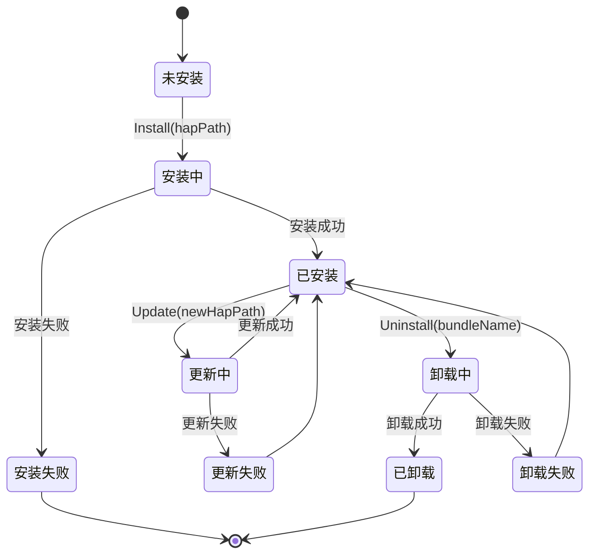

# 内部实现细节 - Bundle Framework Lite

## 目录

- [核心类/结构体职责](#核心类结构体职责)
- [内部 API 契约](#内部-api-契约)
- [资源生命周期](#资源生命周期)

---

## 核心类/结构体职责

### 服务层核心类

#### ManagerService

**文件**: `services/bundlemgr_lite/src/bundle_manager_service.h`

**职责**:
- BMS 服务的核心单例类
- 管理应用的生命周期（安装/卸载/更新）
- 处理服务内部消息（`BUNDLE_INSTALLED`、`BUNDLE_UNINSTALLED` 等）
- 维护 Bundle 信息映射（`BundleMap`）
- 与其他服务交互（AMS、Permission Service）

**关键方法**:
```cpp
class ManagerService {
public:
    static ManagerService& GetInstance();  // 单例获取
    
    // 服务管理
    void OnInitialize();
    void OnStop();
    
    // 应用管理
    uint8_t Install(const char *hapPath, const InstallParam &installParam);
    uint8_t Uninstall(const char *bundleName);
    BundleInfo* QueryBundleInfo(const char *bundleName);
    
    // 消息处理
    void ServiceMsgProcess(Request *request);
    
private:
    BundleMap bundleMap_;  // Bundle 信息映射
};
```

**证据**: `services/bundlemgr_lite/src/bundle_manager_service.cpp`

---

#### BundleInstaller

**文件**: `services/bundlemgr_lite/include/bundle_installer.h`

**职责**:
- 执行应用安装和卸载的具体逻辑
- 调用签名验证、权限匹配
- 协调 Bundle Daemon 执行文件操作
- 持久化应用信息

**关键方法**:
```cpp
class BundleInstaller {
public:
    BundleInstaller(const std::string &codeDirPath, const std::string &dataDirPath);
    ~BundleInstaller();
    
    // 安装/卸载
    uint8_t Install(const std::string &hapPath, const SignatureInfo &signatureInfo);
    uint8_t Uninstall(const char *bundleName);
    
    // 验证
    uint8_t CheckProvisionInfoIsValid(const SignatureInfo &signatureInfo,
                                      const Permissions &permissions,
                                      const char *bundleName);
    uint8_t StorePermissions(const char *bundleName, PermissionTrans *permissions,
                         int32_t permNum, bool isUpdate);
    
private:
    std::string codeDirPath_;  // 代码目录路径
    std::string dataDirPath_;  // 数据目录路径
};
```

**证据**: `services/bundlemgr_lite/src/bundle_installer.cpp`

---

#### BundleParser

**文件**: `services/bundlemgr_lite/include/bundle_parser.h`

**职责**:
- 解析 HAP 包结构
- 提取 config.json 和 module.json
- 验证 Bundle Name 格式
- 解析 AbilityInfo、ModuleInfo

**关键方法**:
```cpp
class BundleParser {
public:
    static uint8_t Parse(const std::string &hapPath, BundleInfo &bundleInfo);
    static bool CheckBundleNameIsValid(const char *bundleName);
    
private:
    static uint8_t ParseModuleInfo(const cJSON *moduleJson, ModuleInfo &moduleInfo);
    static uint8_t ParseAbilityInfo(const cJSON *abilityJson, AbilityInfo &abilityInfo);
};
```

**证据**: `services/bundlemgr_lite/src/bundle_parser.cpp`

---

#### BundleExtractor

**文件**: `services/bundlemgr_lite/include/bundle_extractor.h`

**职责**:
- 解压 HAP 文件到安装目录
- 提取资源文件到资源目录
- 验证文件完整性

**关键方法**:
```cpp
class BundleExtractor {
public:
    BundleExtractor();
    ~BundleExtractor();
    
    uint8_t Extract(const std::string &hapPath, 
                   const std::string &codePath,
                   const std::string &dataPath);
    
private:
    uint8_t ExtractFile(const std::string &srcPath, const std::string &destPath);
};
```

**证据**: `services/bundlemgr_lite/src/bundle_extractor.cpp`

---

#### BundleMap

**文件**: `services/bundlemgr_lite/include/bundle_map.h`

**职责**:
- 维护应用信息的映射表
- 提供线程安全的查询接口
- 管理应用信息的增删改查

**数据结构**:
```cpp
class BundleMap {
public:
    static BundleMap& GetInstance();
    
    // 查询
    BundleInfo* QueryBundleInfo(const char *bundleName);
    BundleInfo* QueryBundleInfoByUid(int32_t uid);
    
    // 修改
    uint8_t AddBundleInfo(const BundleInfo &bundleInfo);
    uint8_t UpdateBundleInfo(const BundleInfo &bundleInfo);
    uint8_t RemoveBundleInfo(const char *bundleName);
    
private:
    std::unordered_map<std::string, BundleInfo> bundleInfoMap_;
    Mutex lock_;  // 线程安全锁
};
```

**证据**: `services/bundlemgr_lite/src/bundle_map.cpp`

---

### BundleDaemon 核心类

#### BundleDaemon

**文件**: `services/bundlemgr_lite/bundle_daemon/src/bundle_daemon.cpp`

**职责**:
- 独立高权限进程，执行文件操作
- 验证调用者 UID（必须为 BMS_UID=7）
- 处理来自 BMS 的文件操作请求

**关键方法**:
```cpp
class BundleDaemon {
public:
    static BundleDaemon& GetInstance();
    void Initialize();
    void Stop();
    
    // IPC 处理
    int32_t Invoke(IServerProxy *iProxy, int32_t funcId, 
                void *origin, IpcIo *req, IpcIo *reply);
    
private:
    bool CheckPermission();  // UID=7 检查
};
```

**证据**: `services/bundlemgr_lite/bundle_daemon/src/bundle_daemon.cpp:108-111`

---

#### BundleDaemonHandler

**文件**: `services/bundlemgr_lite/bundle_daemon/src/bundle_daemon_handler.cpp`

**职责**:
- 实现具体的文件操作逻辑
- 路径验证和规范化
- 文件创建、删除、移动操作

**关键方法**:
```cpp
class BundleDaemonHandler {
public:
    // 文件操作
    static int32_t ExtractHap(const char *hapPath, const char *codePath);
    static int32_t RemoveInstallDirectory(const char *codePath, const char *dataPath);
    static int32_t StoreContentToFile(const char *filePath, const char *content, uint32_t len);
    static int32_t CreateDataDirectory(const char *dataPath);
    static int32_t MoveFile(const char *srcPath, const char *destPath);
};
```

**证据**: `services/bundlemgr_lite/bundle_daemon/src/bundle_daemon_handler.cpp`

---

### 框架层核心类

#### BundleManager (C API 包装）

**文件**: `frameworks/bundle_lite/src/bundle_manager.cpp`

**职责**:
- 为 C API 提供实现
- 通过 IPC 调用 BMS 服务
- 处理回调通知

**关键方法**:
```cpp
// C API 实现
bool Install(const char *hapPath, const InstallParam *installParam, 
           InstallerCallback installerCallback) {
    // 1. 获取 BMS IPC 代理
    IUnknown *iUnknown = SAMGR_GetInstance()->GetFeatureApi(BMS_SERVICE, BMS_INNER_FEATURE);
    
    // 2. 准备请求
    IpcIo req;
    IpcIo reply;
    // ... 填充 req
    
    // 3. 调用 IPC
    clientProxy->Invoke(INSTALL, &req, &reply, installerCallback);
    
    return true;
}
```

**证据**: `frameworks/bundle_lite/src/bundle_manager.cpp`

---

#### BundleInfoUtils

**文件**: `frameworks/bundle_lite/include/bundle_info_utils.h`

**职责**:
- 提供 BundleInfo 的工具函数
- JSON 序列化/反序列化
- BundleInfo 的创建和销毁

**关键方法**:
```cpp
class BundleInfoUtils {
public:
    // 创建/销毁
    static BundleInfo* CreateBundleInfo();
    static void FreeBundleInfo(BundleInfo *bundleInfo);
    
    // JSON 转换
    static cJSON* ToJson(const BundleInfo &bundleInfo);
    static uint8_t FromJson(const cJSON *json, BundleInfo &bundleInfo);
};
```

**证据**: `frameworks/bundle_lite/src/bundle_info_utils.cpp`

---

## 内部 API 契约

### BMS Service 内部消息

**消息定义**: `services/bundlemgr_lite/include/bundle_message_id.h`

**契约**: 内部消息用于服务内部通知

| 消息 | 发送者 | 接收者 | 说明 |
|------|----------|----------|------|
| `BUNDLE_SERVICE_INITED` | BMS | 所有监听者 | 服务初始化完成 |
| `BUNDLE_INSTALLED` | BMS | AMS | 应用安装完成 |
| `BUNDLE_UPDATED` | BMS | AMS | 应用更新完成 |
| `BUNDLE_UNINSTALLED` | BMS | AMS | 应用卸载完成 |
| `BUNDLE_LIST_CHANGED` | BMS | 所有监听者 | 应用列表变更 |

**证据**: `services/bundlemgr_lite/include/bundle_message_id.h`

---

### BMS 与 Bundle Daemon IPC 契约

**服务名**: `bundle_daemon`
**UID 要求**: 调用者 UID 必须为 7（BMS_UID）

**契约**: 仅接受来自 BMS 的请求

**验证代码**:
```cpp
bool BundleDaemon::CheckPermission() {
    uid_t callerUid = GetCallingUid();
    if (callerUid != BMS_UID) {
        HILOG_ERROR(HILOG_MODULE_APP, "Permission denied: caller UID %d != %d", 
                   callerUid, BMS_UID);
        return false;
    }
    return true;
}
```

**证据**: `services/bundlemgr_lite/bundle_daemon/src/bundle_daemon.cpp:108-111`

---

## 资源生命周期

### BundleInfo 生命周期



**关键状态**:
- **未安装**: Bundle 不在系统中
- **安装中**: HAP 正在解析、验证、提取
- **已安装**: Bundle 正常可用
- **更新中**: 新版本正在安装
- **卸载中**: 正在删除 Bundle 数据
- **已卸载**: Bundle 已从系统移除

---

### 内存资源生命周期

#### BundleInfo 内存管理

**所有者**: `BundleMap`

**生命周期**:
```
1. Install() → 分配 BundleInfo (BundleInfoUtils::CreateBundleInfo)
              ↓
2. 持久化到 BundleMap (BundleMap::AddBundleInfo)
              ↓
3. 应用运行时 → QueryBundleInfo() 返回指针
              ↓
4. Uninstall() → 从 BundleMap 移除 (BundleMap::RemoveBundleInfo)
              ↓
5. 释放内存 (BundleInfoUtils::FreeBundleInfo)
```

**注意事项**:
- BundleInfo 指针由 `BundleMap` 管理，外部调用者不应释放
- 多线程访问通过 Mutex 保护

**证据**: `services/bundlemgr_lite/src/bundle_map.cpp`

---

#### AbilityInfo 内存管理

**所有者**: `BundleInfo`

**生命周期**:
```
1. BundleInfo 创建时 → 分配 AbilityInfo 数组
              ↓
2. GetBundleInfo() → 返回 AbilityInfo 指针（只读）
              ↓
3. BundleInfo 销毁时 → 释放 AbilityInfo 数组
```

**注意事项**:
- AbilityInfo 数组是 BundleInfo 的一部分，不单独管理
- 外部调用者不应修改 AbilityInfo

---

### 文件资源生命周期

#### 应用目录结构

```
/app/
├── etc/
│   └── bundle_info.json  # 持久化的应用信息
├── data/
│   └── com.example.app/  # 应用数据目录
│       ├── databases/
│       ├── cache/
│       └── files/
└── run/
    └── com.example.app/  # 应用代码目录
        ├── app.hap
        ├── resources/
        └── libs/
```

**创建时机**:
- 代码目录：`ExtractHap()` 时创建
- 数据目录：`Install()` 时创建
- 配置文件：`Install()` 成功后写入

**删除时机**:
- 代码目录：`RemoveInstallDirectory()` 时删除
- 数据目录：`RemoveInstallDirectory()` 时删除（或保留）
- 配置文件：`Uninstall()` 成功后删除

**证据**: `services/bundlemgr_lite/src/bundle_installer.cpp`

---

### UID 分配生命周期

**UID 范围**:
- 系统应用：`BASE_SYS_UID` (0) 起
- 系统第三方应用：`BASE_SYS_VEN_UID` (100) 起
- 第三方应用：`BASE_APP_UID` (200) 起

**分配流程**:
```
1. Install() → 根据应用类型确定 UID 范围
              ↓
2. 查询最小可用 UID
              ↓
3. 分配 UID 并持久化到配置文件
              ↓
4. Uninstall() → 回收 UID
```

**证据**: `services/bundlemgr_lite/src/bundle_installer.cpp:93-104`

---

### IPC 连接生命周期

#### 客户端连接生命周期

```
1. 首次 API 调用 → GetFeatureApi(BMS_SERVICE, BMS_FEATURE)
                     ↓
2. SAMGR 返回 IClientProxy
                     ↓
3. 后续 API 调用 → 使用缓存的 IClientProxy
                     ↓
4. 服务重启 → IPC 连接断开
                     ↓
5. 下次 API 调用 → 重新获取 IClientProxy
```

**注意事项**:
- IClientProxy 应缓存，避免重复调用 `GetFeatureApi()`
- 需要处理服务重启场景（重新连接）

---

## 关键常量

### 安装路径常量

| 常量 | 值 | 说明 |
|--------|------|------|
| `INSTALL_PATH` | `/app/run/` | 应用安装路径（内部）|
| `EXTEANAL_INSTALL_PATH` | `/sdcard/` | 应用安装路径（外部）|
| `DATA_PATH` | `/app/data/` | 应用数据路径（内部）|
| `EXTEANAL_DATA_PATH` | `/sdcard/data/` | 应用数据路径（外部）|
| `SYSTEM_BUNDLE_PATH` | `/system/internal/` | 系统应用路径 |
| `THIRD_SYSTEM_BUNDLE_PATH` | `/system/external/` | 系统第三方应用路径 |

**证据**: `services/bundlemgr_lite/include/adapter.h`

### 应用类型标志

| 标志 | 值 | 说明 |
|------|------|------|
| `SYSTEM_APP_FLAG` | 0 | 系统应用 |
| `THIRD_SYSTEM_APP_FLAG` | 1 | 系统第三方应用 |
| `THIRD_APP_FLAG` | 2 | 第三方应用 |

**证据**: `services/bundlemgr_lite/src/bundle_installer.cpp:93-104`

---

## 相关文档

- [目录结构与代码地图](02_CodeMap.md) - 类和文件位置
- [架构与数据流](03_Architecture.md) - 组件协作
- [安全风险评估](06_SecurityReview.md) - 资源管理漏洞

---

**最后更新**: 2026-02-07
