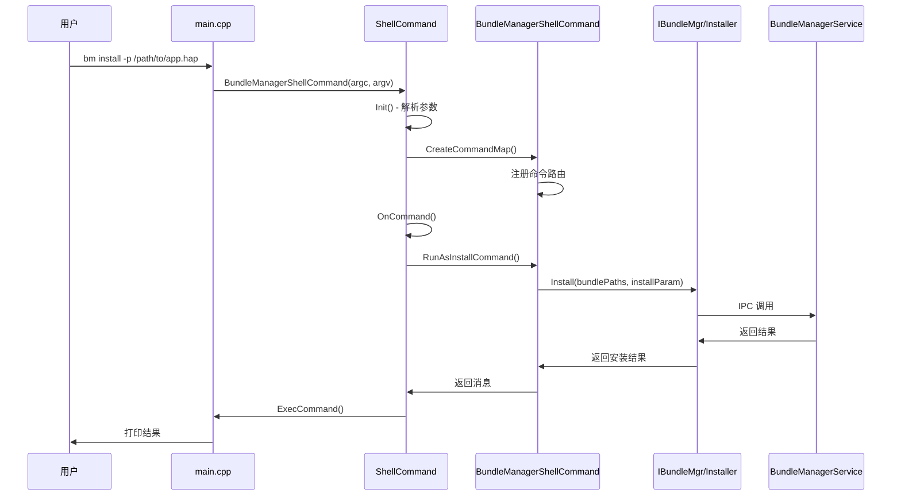
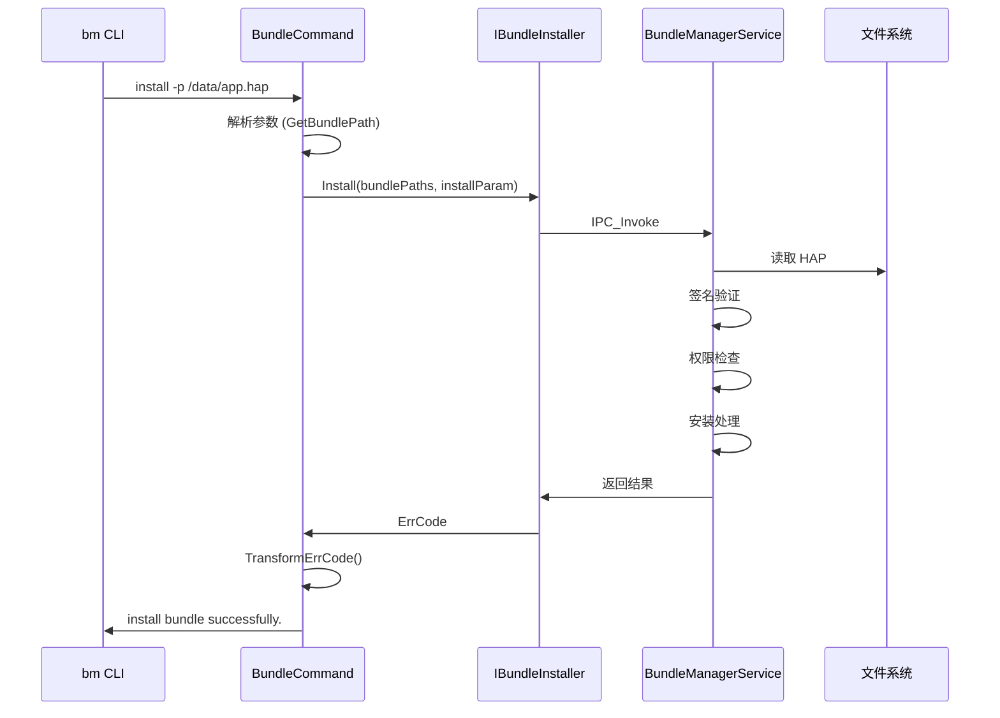
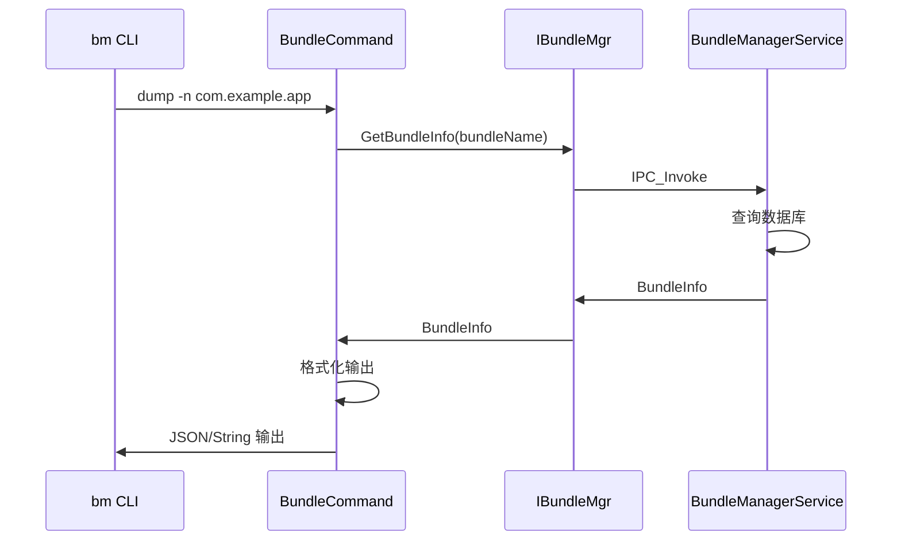

# 架构设计 (Architecture)

> bundle_tool 系统架构、组件图、数据流与线程模型

## 整体架构

### 架构分层

```
┌─────────────────────────────────────────────────────────────────┐
│                        用户层                                    │
│            hdc shell → bm <command> <options>                   │
└─────────────────────────────────────────────────────────────────┘
                              ↓
┌─────────────────────────────────────────────────────────────────┐
│                      命令解析层                                  │
│  ┌─────────────────────────────────────────────────────────┐   │
│  │                  ShellCommand                            │   │
│  │  - 参数解析 (argc/argv)                                  │   │
│  │  - 命令路由 (commandMap_)                                │   │
│  │  - 错误处理 (messageMap_)                               │   │
│  └─────────────────────────────────────────────────────────┘   │
└─────────────────────────────────────────────────────────────────┘
                              ↓
┌─────────────────────────────────────────────────────────────────┐
│                      业务逻辑层                                  │
│  ┌────────────────┐  ┌────────────────┐  ┌────────────────┐  │
│  │ BundleCommand  │  │ QuickFixCommand│  │  TestCommand   │  │
│  │  - install    │  │  - query       │  │  - test       │  │
│  │  - uninstall  │  │  - apply       │  │               │  │
│  │  - dump       │  │  - remove      │  │               │  │
│  └────────────────┘  └────────────────┘  └────────────────┘  │
└─────────────────────────────────────────────────────────────────┘
                              ↓
┌─────────────────────────────────────────────────────────────────┐
│                      IPC 通信层                                  │
│  ┌─────────────────────────────────────────────────────────┐   │
│  │              Bundle Framework (IPC Skeleton)             │   │
│  │  - IBundleMgr                                            │   │
│  │  - IBundleInstaller                                      │   │
│  │  - IBundleToolCallback                                   │   │
│  └─────────────────────────────────────────────────────────┘   │
└─────────────────────────────────────────────────────────────────┘
                              ↓
┌─────────────────────────────────────────────────────────────────┐
│                      服务层 (BundleManagerService)              │
└─────────────────────────────────────────────────────────────────┘
```

---

## 核心组件

### 1. ShellCommand 基类

**职责**: 命令行解析与路由

**位置**: `include/shell_command.h`

**关键方法**:

| 方法 | 功能 |
|------|------|
| `ShellCommand(int argc, char *argv[], std::string name)` | 构造函数 |
| `OnCommand()` | 执行命令 |
| `ExecCommand()` | 获取执行结果 |
| `CreateCommandMap()` | 虚方法，注册命令 |
| `CreateMessageMap()` | 虚方法，注册错误码映射 |

**成员变量**:

| 变量 | 类型 | 功能 |
|------|------|------|
| `commandMap_` | `map<string, function<int()>>` | 命令路由表 |
| `messageMap_` | `map<int32_t, string>` | 错误码映射 |
| `argList_` | `vector<string>` | 解析后的参数 |

**证据来源**: `shell_command.h:34-63`

### 2. BundleManagerShellCommand

**职责**: Bundle 管理命令实现

**位置**: `include/bundle_command.h:265`

**继承关系**:
```
ShellCommand
    └── BundleManagerShellCommand
```

**命令注册** (`CreateCommandMap()`):

| 命令 | 处理函数 |
|------|----------|
| help | `RunAsHelpCommand()` |
| install | `RunAsInstallCommand()` |
| uninstall | `RunAsUninstallCommand()` |
| dump | `RunAsDumpCommand()` |
| clean | `RunAsCleanCommand()` |
| enable | `RunAsEnableCommand()` |
| disable | `RunAsDisableCommand()` |
| get | `RunAsGetCommand()` |
| quickfix | `RunAsQuickFixCommand()` |
| compile | `RunAsCompileCommand()` |
| copy-ap | `RunAsCopyApCommand()` |
| dump-overlay | `RunAsDumpOverlay()` |
| dump-target-overlay | `RunAsDumpTargetOverlay()` |
| dump-shared | `RunAsDumpSharedCommand()` |
| dump-dependencies | `RunAsDumpSharedDependenciesCommand()` |
| install-plugin | `RunAsInstallPluginCommand()` |
| uninstall-plugin | `RunAsUninstallPluginCommand()` |

**IPC 代理**:

| 代理 | 类型 | 功能 |
|------|------|------|
| `bundleMgrProxy_` | `sptr<IBundleMgr>` | Bundle 管理 IPC 代理 |
| `bundleInstallerProxy_` | `sptr<IBundleInstaller>` | Bundle 安装 IPC 代理 |

**证据来源**: `bundle_command.h:265-347`

### 3. QuickFixCommand

**职责**: 快速修复命令处理

**位置**: `include/quick_fix_command.h`

**功能**: 支持 HQF 补丁的查询、安装、卸载

**证据来源**: `quick_fix_command.cpp` (5.9KB)

### 4. 回调机制

**IBundleToolCallback**:

| 实现类 | 文件 |
|--------|------|
| `BundleToolCallbackStub` | `bundle_tool_callback_stub.cpp` |
| `StatusReceiverImpl` | `status_receiver_impl.cpp` |

**证据来源**: `include/bundle_tool_callback/` 目录

---

## 数据流

### 命令执行流程



### 错误码映射

bundle_tool 定义了错误码映射机制：

```
bundle_command.h:346: static std::map<int32_t, int32_t> errCodeMap_
```

**证据来源**: `bundle_command.h:340` - `TransformErrCode()` 方法

---

## 线程模型

### 线程特性

| 特性 | 说明 |
|------|------|
| 主线程 | 命令行解析与执行（同步） |
| IPC 调用 | 跨进程调用 BundleManagerService |
| 回调线程 | 由 IPC 框架管理 |

### 并发安全

- **IPC 调用**: 同步调用，阻塞等待结果
- **回调处理**: 通过 `IBundleToolCallback` 异步接收
- **状态接收**: `StatusReceiverImpl` 接收安装进度

**证据来源**:
- `status_receiver_impl.cpp`
- `bundle_tool_callback_stub.cpp`

---

## 模块依赖

### 内部依赖

```
main.cpp
    └── BundleManagerShellCommand
            ├── ShellCommand (基类)
            ├── IBundleMgr (IPC 接口)
            ├── IBundleInstaller (IPC 接口)
            └── QuickFixCommand (可选)

bundle_command.cpp (128KB)
    └── 所有命令实现
```

### 外部依赖

| 依赖 | 用途 |
|------|------|
| ability_base | Want 结构 |
| ability_runtime | AppManager, QuickFixManager |
| bundle_framework | Bundle 管理核心 |
| ipc | IPC 通信 |
| samgr | 系统服务管理 |
| os_account | 用户账号 |
| hilog | 日志 |
| common_event_service | 公共事件 |

**证据来源**: `frameworks/BUILD.gn:60-74`

---

## 关键时序

### 安装命令时序



### 查询命令时序



---

## 稳定性标注

### 稳定接口

| 接口 | 稳定性 | 说明 |
|------|--------|------|
| ShellCommand 基类 | 稳定 | 基础框架 |
| 命令路由 | 稳定 | 固定命令集 |
| IPC 接口 | 稳定 | IBundlerMgr/Installer |

### 条件编译

| 宏 | 功能 | 稳定性 |
|---|------|--------|
| `ACCOUNT_ENABLE` | 用户账号 | 可选 |
| `BUNDLE_FRAMEWORK_OVERLAY_INSTALLATION` | Overlay | 可选 |
| `BUNDLE_FRAMEWORK_QUICK_FIX` | 快速修复 | 可选 |
| `DISTRIBUTED_BUNDLE_FRAMEWORK` | 分布式 | 可选 |

**证据来源**: `frameworks/BUILD.gn:83-90`

---

## 相关文档

- [00_Overview.md](./00_Overview.md) - 项目概览
- [02_Command_Reference.md](./02_Command_Reference.md) - 命令详解
- [03_Inner_API.md](./03_Inner_API.md) - 内部 API
- [04_Build.md](./04_Build.md) - 构建系统
