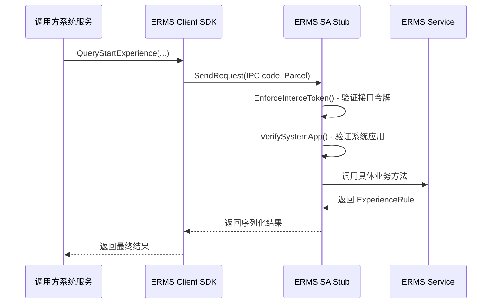
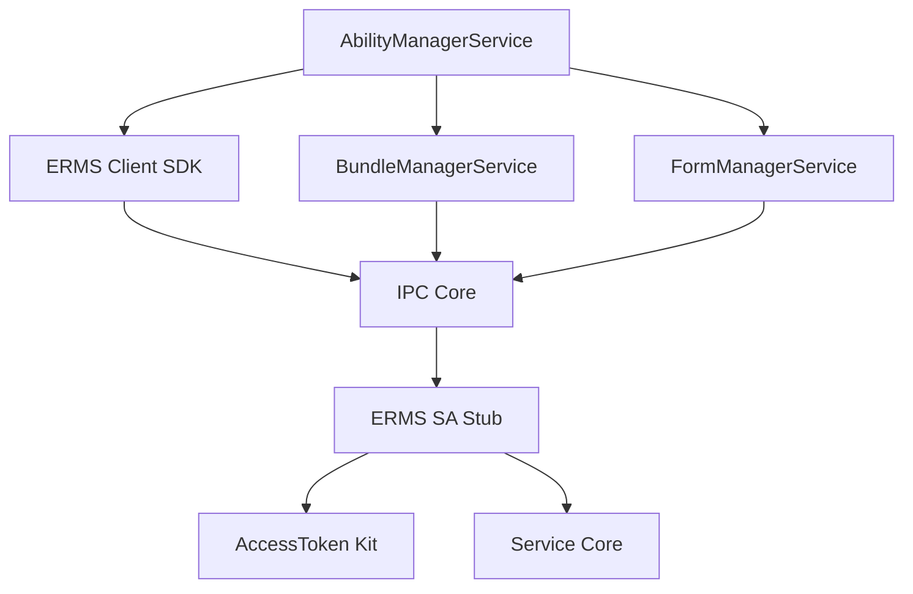

# 02_Architecture - 架构设计

## 整体架构

```
┌─────────────────────────────────────────────────────────────────┐
│                        应用层 (App)                              │
└─────────────────────────────────────────────────────────────────┘
                              │
                              ▼
┌─────────────────────────────────────────────────────────────────┐
│                     系统服务层 (System Services)                  │
├───────────────────┬───────────────────┬─────────────────────────┤
│ AbilityManagerService │ BundleManagerService │ FormManagerService │
│   (元能力管理)      │    (包管理)          │   (卡片管理)           │
└────────┬──────────┴──────────┬────────┴───────────┬────────────┘
         │                      │                     │
         └──────────────────────┼─────────────────────┘
                                │ Inner API 调用
                                ▼
┌─────────────────────────────────────────────────────────────────┐
│              EcologicalRuleManagerService (SA 6105)              │
│                   生态规则管控服务                                │
├─────────────────────────────────────────────────────────────────┤
│  ┌─────────────────┐    ┌─────────────────────────────────┐   │
│  │   Client SDK    │    │         SA Stub                 │   │
│  │ (接口代理层)     │◄──►│    (IPC 请求处理)               │   │
│  └─────────────────┘    └─────────────────────────────────┘   │
│                                │                                │
│                                ▼                                │
│  ┌─────────────────────────────────────────────────────────┐   │
│  │              EcologicalRuleMgrService                   │   │
│  │              (核心业务逻辑 - 当前为 Stub)               │   │
│  └─────────────────────────────────────────────────────────┘   │
└─────────────────────────────────────────────────────────────────┘
```

## 模块职责

| 模块 | 职责 | 位置 |
|------|------|------|
| **Client SDK** | 封装 IPC 调用，提供同步接口给调用方 | `interfaces/innerkits/src/` |
| **SA Stub** | IPC 请求分发、参数校验、权限验证 | `services/manager/src/` |
| **Service Core** | 核心业务规则处理（当前返回 SUCCESS） | `services/manager/src/` |

## IPC 通信机制

### 调用流程



### IPC Code 定义

| Code | 枚举值 | 对应接口 |
|------|--------|----------|
| QUERY_FREE_INSTALL_EXPERIENCE_CMD | 0 | QueryFreeInstallExperience |
| QUERY_START_EXPERIENCE_CMD | 1 | QueryStartExperience |
| EVALUATE_RESOLVE_INFO_CMD | 2 | EvaluateResolveInfos |
| IS_SUPPORT_PUBLISH_FORM_CMD | 3 | IsSupportPublishForm |

**参考文件**: `interfaces/innerkits/include/ecological_rule_mgr_service_interface.h:43-48`

## 数据类型

### 体验规则 (ExperienceRule)

```cpp
struct ExperienceRule {
    bool isAllow = true;           // 是否允许
    int32_t resultCode = -1;        // 返回码
    sptr<Want> replaceWant = nullptr; // 替代 Want（允许时跳转）
};
```

### 调用方信息 (CallerInfo)

```cpp
struct CallerInfo {
    std::string packageName;        // 包名
    int32_t uid;                    // 用户 ID
    int32_t pid;                    // 进程 ID
    int32_t callerAppType;          // 调用方应用类型
    int32_t targetAppType;          // 目标应用类型
    // ... 其他字段
};
```

## 线程模型

| 线程 | 说明 |
|------|------|
| **IPC 线程** | 处理来自 Client 的 IPC 请求（IPC Skeleton 线程） |
| **主线程** | SA OnStart/OnStop 线程 |
| **业务线程** | 当前实现无独立业务线程，业务直接在 IPC 线程执行 |

## 依赖方向



## 相关文档

- API 接口: [03_Inner_API.md](03_Inner_API.md)
- 构建配置: [04_GN_Build.md](04_GN_Build.md)
- 安全评审: [05_Security_Review.md](05_Security_Review.md)
