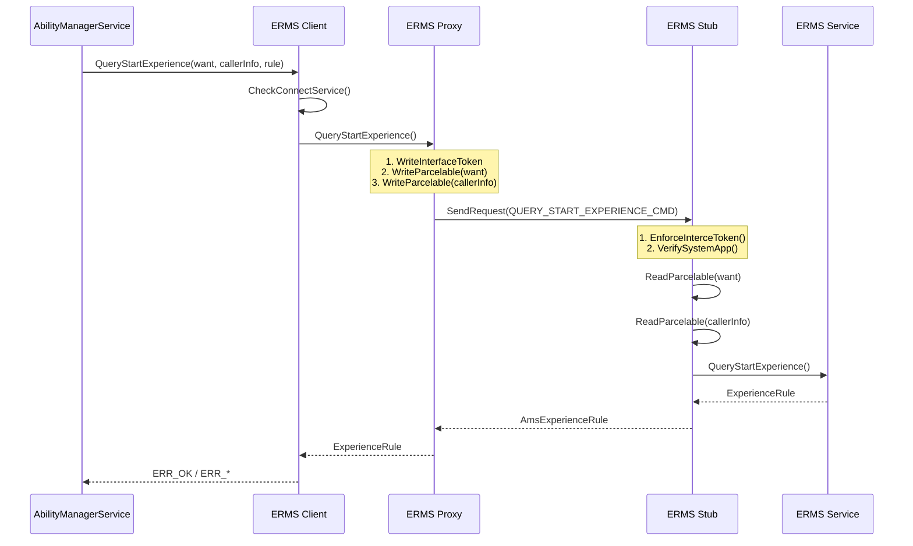
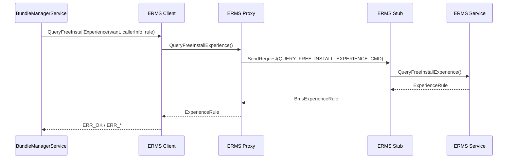
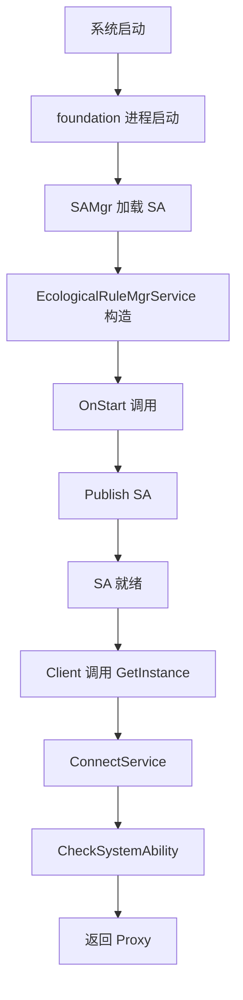
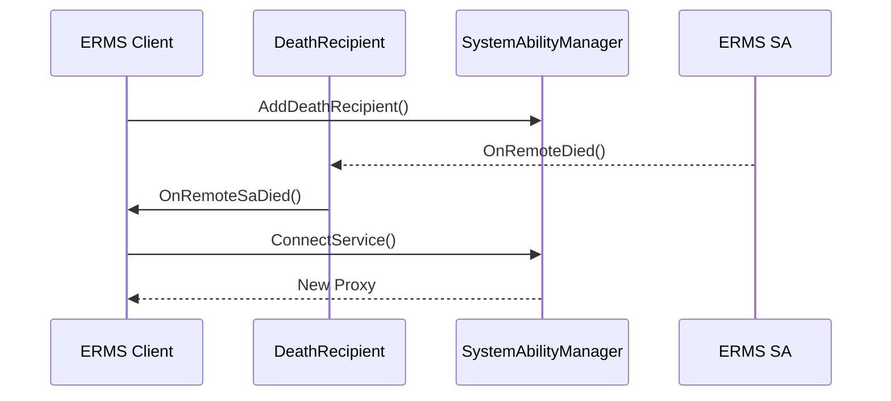
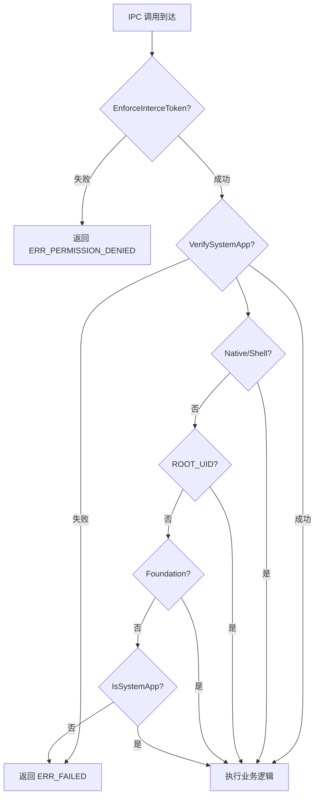

# appendix/Callgraphs.md - 关键调用链

## 概述

本文档描述 ecological_rule_manager 模块的关键调用链，包括从调用方到 SA 的完整路径。

## 调用链 1: QueryStartExperience

### 调用方 → Client SDK → SA

### 代码入口

| 步骤 | 文件 | 函数 |
|------|------|------|
| 1 | `ecological_rule_mgr_service_client.cpp` | `QueryStartExperience()` (第 135 行) |
| 2 | `ecological_rule_mgr_service_proxy.cpp` | `QueryStartExperience()` (第 107 行) |
| 3 | `ecological_rule_mgr_service_stub.cpp` | `OnQueryStartExperienceResult()` (第 159 行) |
| 4 | `ecologic_rule_mgr_service.cpp` | `QueryStartExperience()` (第 73 行) |

## 调用链 2: QueryFreeInstallExperience

### 调用方 → Client SDK → SA

### 代码入口

| 步骤 | 文件 | 函数 |
|------|------|------|
| 1 | `ecological_rule_mgr_service_client.cpp` | `QueryFreeInstallExperience()` (第 100 行) |
| 2 | `ecological_rule_mgr_service_proxy.cpp` | `QueryFreeInstallExperience()` (第 30 行) |
| 3 | `ecological_rule_mgr_service_stub.cpp` | `OnQueryFreeInstallExperienceResult()` (第 67 行) |
| 4 | `ecologic_rule_mgr_service.cpp` | `QueryFreeInstallExperience()` (第 57 行) |

## 调用链 3: SA 启动流程

### SystemAbilityFramework 加载

### 关键代码

| 步骤 | 文件 | 函数/宏 |
|------|------|----------|
| SA 注册 | `ecologic_rule_mgr_service.cpp` | `REGISTER_SYSTEM_ABILITY_BY_ID(EcologicalRuleMgrService, 6105, true)` |
| OnStart | `ecologic_rule_mgr_service.cpp` | `OnStart()` (第 92 行) |
| GetInstance | `ecologic_rule_mgr_service.cpp` | `GetInstance()` (第 46 行) |
| Publish | `ecologic_rule_mgr_service.cpp` | `Publish()` (第 100 行) |

## 调用链 4: SA 死亡重连

### 关键代码

| 步骤 | 文件 | 函数 |
|------|------|------|
| 添加 DeathRecipient | `ecological_rule_mgr_service_client.cpp` | `ConnectService()` (第 77 行) |
| 死亡回调 | `ecological_rule_mgr_service_client.cpp` | `OnRemoteSaDied()` (第 95 行) |
| 重连逻辑 | `ecological_rule_mgr_service_client.cpp` | `ConnectService()` (第 65 行) |

## 调用链 5: 权限校验流程

## 附录：IPC Code 映射

| Code | 枚举值 | 接口 | Stub Handler |
|------|--------|------|--------------|
| 0 | QUERY_FREE_INSTALL_EXPERIENCE_CMD | QueryFreeInstallExperience | OnQueryFreeInstallExperienceResult |
| 1 | QUERY_START_EXPERIENCE_CMD | QueryStartExperience | OnQueryStartExperienceResult |
| 2 | EVALUATE_RESOLVE_INFO_CMD | EvaluateResolveInfos | OnEvaluateResolveInfosResult |
| 3 | IS_SUPPORT_PUBLISH_FORM_CMD | IsSupportPublishForm | OnIsSupportPublishFormResult |

**参考文件**: `interfaces/innerkits/include/ecological_rule_mgr_service_interface.h:43-48`
