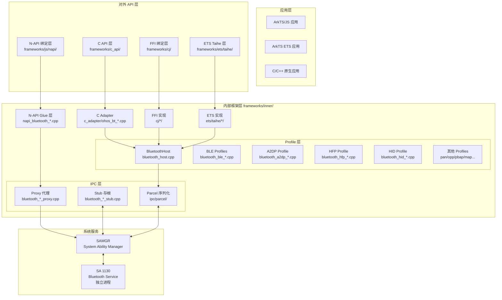
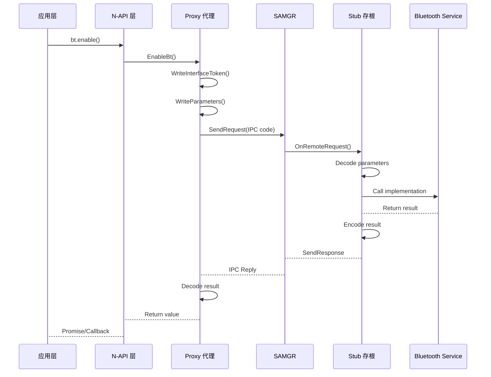
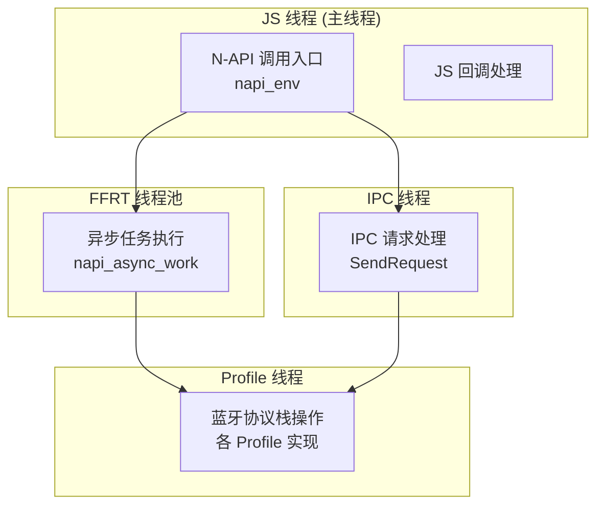
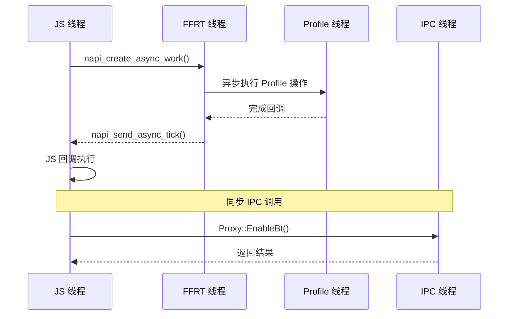
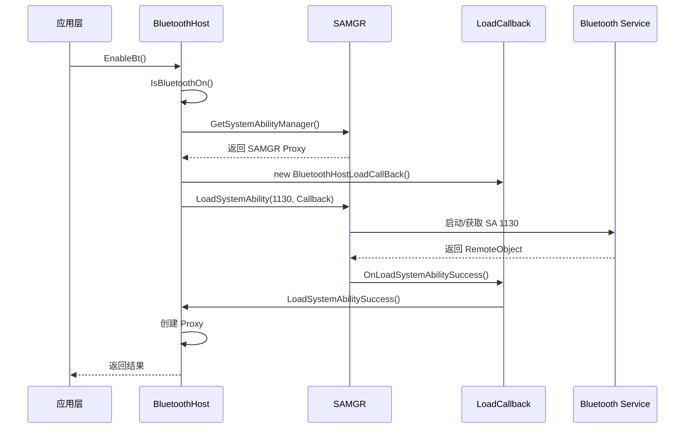
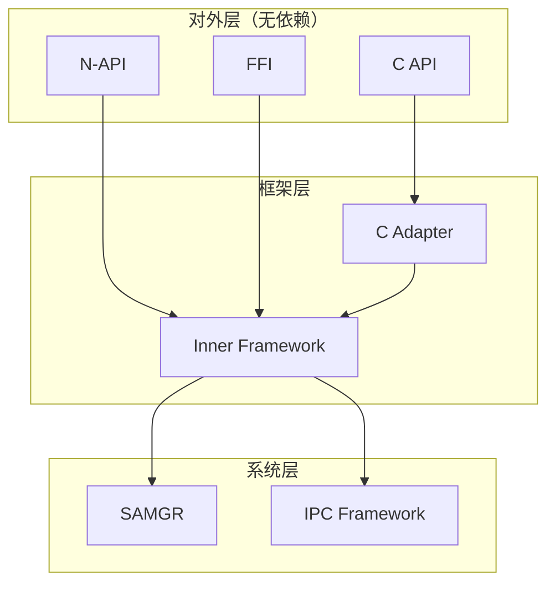
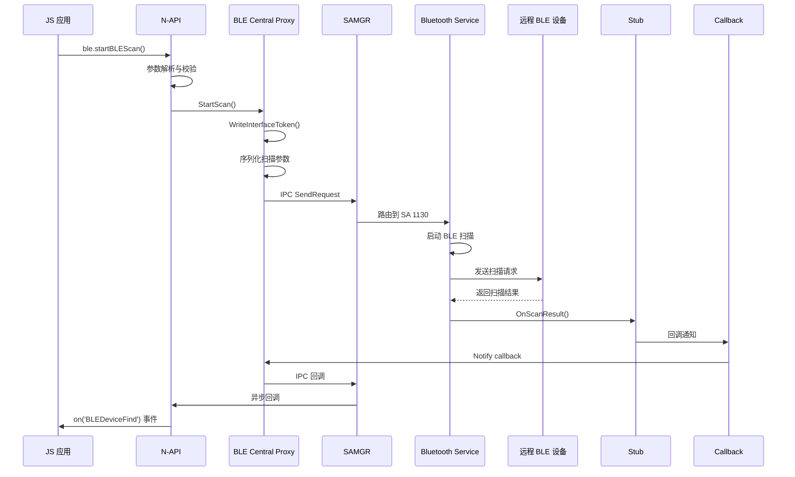
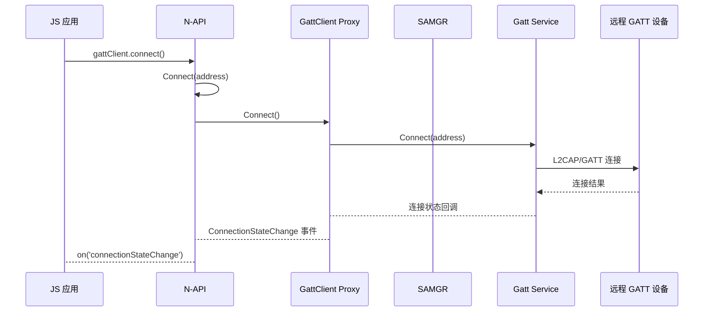

# 架构设计

> **目的**: 深入理解 Bluetooth 模块的组件划分、数据流、线程模型与 IPC 架构  
> **适用范围**: 架构设计、模块贡献、性能优化、问题排查

## 整体架构图



## 组件职责

| 组件 | 职责 | 关键文件 |
|------|------|----------|
| **N-API 绑定层** | 将 C++ API 暴露给 ArkTS/JS | `native_module.cpp`, `napi_bluetooth_*.cpp` |
| **C Adapter** | 为 C API 提供适配 | `c_adapter/ohos_bt_*.cpp` |
| **FFI 绑定** | 为 ArkTS 提供 FFI 桥接 | `cj/*/` |
| **ETS Taihe** | 提供声明式 API | `ets/taihe/*/` |
| **Profile 实现** | 各蓝牙协议的逻辑实现 | `src/bluetooth_*.cpp` |
| **IPC Proxy** | 客户端 IPC 代理 | `ipc/src/bluetooth_*_proxy.cpp` |
| **IPC Stub** | 服务端 IPC 存根 | `ipc/src/bluetooth_*_stub.cpp` |
| **Parcel 序列化** | IPC 数据编解码 | `ipc/parcel/*.h/.cpp` |

## IPC 架构详解

### System Ability ID 1130

蓝牙系统能力的唯一标识符，用于与蓝牙服务进程通信。

**证据**: `bluetooth_service_ipc_interface_code.h:22`
```cpp
/* SAID: 1130 */
```

### 代理/存根模式

Bluetooth 模块使用标准的 OpenHarmony IPC 代理-存根模式：



### 关键 IPC 文件

| 类型 | 文件路径 | 职责 |
|------|----------|------|
| **Host 接口** | `ipc/interface/i_bluetooth_host.h` | 蓝牙主机核心接口定义 |
| **Host Proxy** | `ipc/src/bluetooth_host_proxy.cpp` | 客户端代理实现（89,418 行） |
| **Host Stub** | `ipc/src/bluetooth_host_stub.cpp` | 服务端存根实现 |
| **GATT Client** | `ipc/interface/i_bluetooth_gatt_client.h` | GATT 客户端接口 |
| **GATT Client Proxy** | `ipc/src/bluetooth_gatt_client_proxy.cpp` | GATT 客户端代理（17,754 行） |
| **GATT Server Proxy** | `ipc/src/bluetooth_gatt_server_proxy.cpp` | GATT 服务端代理 |
| **Observer Stub** | `ipc/src/bluetooth_*_observer_stub.cpp` | 回调存根实现 |

**接口代码枚举**:
- 主接口: `bluetooth_service_ipc_interface_code.h`
- Profile 接口: `bluetooth_service_profile_interface_code.h`

### IPC 调用示例

以 `EnableBt()` 为例：

**1. N-API 入口** (`native_module.cpp:63`):
```cpp
BluetoothHostInit(env, exports);
```

**2. Host API 定义** (`bluetooth_host.h`):
```cpp
int EnableBt();
```

**3. Proxy 调用** (`bluetooth_host_proxy.cpp:73-86`):
```cpp
int32_t BluetoothHostProxy::EnableBt()
{
    MessageOption option;
    MessageParcel data;
    MessageParcel reply;
    if (!data.WriteInterfaceToken(BluetoothHostProxy::GetDescriptor())) {
        HILOGE("BluetoothHostProxy::EnableBt WriteInterfaceToken error");
    }
    int32_t error = InnerTransact(BluetoothHostInterfaceCode::BT_ENABLE, option, data, reply);
    // ...
}
```

**4. 接口代码枚举** (`bluetooth_service_ipc_interface_code.h`):
```cpp
enum BluetoothHostInterfaceCode {
    BT_ENABLE = 0,
    BT_DISABLE,
    // ...
};
```

## 线程模型

### 线程划分



### 线程职责

| 线程类型 | 职责 | 关键实现 |
|----------|------|----------|
| **JS 主线程** | N-API 调用入口、JS 回调派发 | Node.js 事件循环 |
| **FFRT 线程** | 异步任务执行（`napi_create_async_work`） | `napi_async_work.h` |
| **IPC 线程** | 跨进程通信请求处理 | SAMGR 管理 |
| **Profile 线程** | 蓝牙协议栈操作 | 各 Profile 独立线程 |

### 线程通信模式



## SA 生命周期管理

### SA 加载流程



### 关键代码位置

| 操作 | 文件:行号 |
|------|-----------|
| 加载 SA | `bluetooth_host.cpp:596` (`LoadBluetoothHostService()`) |
| SA 成功回调 | `bluetooth_host_load_callback.cpp:32` |
| SA 失败回调 | `bluetooth_host_load_callback.cpp:38` |
| SAMGR 获取 | `bluetooth_host.cpp:599` |
| SA 状态检查 | `bluetooth_host.cpp:1353` |

### Profile 管理

```mermaid
graph LR
    subgraph "ProfileManager"
        PM["BluetoothProfileManager<br/>bluetooth_profile_manager.cpp"]
    end
    
    subgraph "Host Service"
        HOST["IBluetoothHost<br/>SA 1130"]
    end
    
    subgraph "Profile Proxies"
        A2DP["IBluetoothA2dpSrc<br/>profileRemoteMap_"]
        HFP["IBluetoothHfpHf"]
        GATT["IBluetoothGattClient"]
    end

    PM --> HOST
    PM --> A2DP
    PM --> HFP
    PM --> GATT
    
    Note over PM: 维护 profileRemoteMap_<br/>缓存各 Profile Proxy
```

## 模块依赖关系

### 依赖方向图



### 关键依赖

| 依赖项 | 用途 | bundle.json 配置 |
|--------|------|-------------------|
| `ipc` | IPC 框架 | `bundle.json:71` |
| `samgr` | System Ability Manager | `bundle.json:74` |
| `napi` | N-API 运行时 | `bundle.json:73` |
| `ability_runtime` | 能力运行时 | `bundle.json:58` |
| `ffrt` | 异步任务 | `bundle.json:64` |
| `hilog` | 日志 | `bundle.json:66` |
| `hisysevent` | 事件上报 | `bundle.json:67` |

## 数据流示例

### BLE 扫描完整流程



### GATT 连接完整流程



## 稳定性标注

### 接口稳定性分类

| 层级 | 目录 | 稳定性 | 说明 |
|------|------|--------|------|
| **L1** | `interfaces/c_api/` | **稳定** | 对外 C API，可被第三方调用 |
| **L2** | `interfaces/inner_api/` | **不稳定** | 内部系统 API，仅供系统应用 |
| **L3** | `frameworks/inner/` | **不稳定** | 框架内部实现 |
| **L4** | `frameworks/js/napi/` | **稳定** | N-API 为对外接口 |
| **L5** | `frameworks/ets/taihe/` | **实验性** | 新兴框架，API 可能变化 |

### 不稳定接口警告

```cpp
// inner_api 头文件示例
/**
 * @brief 内部 API，不稳定
 * @warning 此接口仅供系统应用使用，可能在任意版本中变更
 */
class BluetoothHost {
    // ...
};
```

---

**下一步**: [API 参考](03_API_Reference.md) → 查看各模块 API 详情
