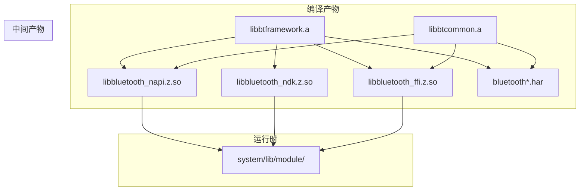

# 构建系统

> **目的**: 梳理 Bluetooth 模块的 GN 构建配置、Targets 列表与编译产物  
> **适用范围**: 编译配置修改、依赖管理、产物定位

## 构建系统概述

Bluetooth 模块使用 **GN (Generate Ninja)** 作为构建系统。

### 构建环境

| 环境 | 要求 |
|------|------|
| 构建工具 | GN + Ninja |
| Python | 3.x |
| 编译链 | LLVM/Clang, GCC |

### 根配置文件

| 文件 | 用途 |
|------|------|
| `bluetooth.gni` | GN 变量声明与条件配置 |
| `bundle.json` | 模块元数据与组件配置 |

**证据**: `bluetooth.gni:14-22`
```gn
declare_args() {
  bluetooth_service_resourceschedule = true
  bluetooth_kia_enable = false

  if (defined(global_parts_info) &&
      !defined(global_parts_info.resourceschedule_resource_schedule_service)) {
    bluetooth_service_resourceschedule = false
  }
}
```

## GN Targets 清单

### 按类型分类

#### Framework Targets

| Target | 类型 | 产物 | 职责 |
|---------|------|------|------|
| `bluetooth_napi` | `shared_library` | `libbluetooth_napi.z.so` | N-API 绑定层 |
| `bluetooth_ndk` | `shared_library` | `libbluetooth_ndk.z.so` | C 原生 API |
| `bluetooth_ffi` | `shared_library` | `libbluetooth_ffi.z.so` | FFI 接口 |
| `btframework` | `static_library` | `libbtframework.a` | 内部框架核心 |
| `btcommon` | `static_library` | `libbtcommon.a` | IPC 公共组件 |

#### ETS Taihe Targets

| Target | 产物 | 职责 |
|--------|------|------|
| `bluetoothA2dp_taihe` | `.har` | A2DP ETS 组件 |
| `bluetoothAccess_taihe` | `.har` | 访问控制 ETS 组件 |
| `bluetoothBaseProfile_taihe` | `.har` | Base Profile ETS 组件 |
| `bluetoothBle_taihe` | `.har` | BLE ETS 组件 |
| `bluetoothConnection_taihe` | `.har` | 连接管理 ETS 组件 |
| `bluetoothConstant_taihe` | `.har` | 常量 ETS 组件 |
| `bluetoothHfp_taihe` | `.har` | HFP ETS 组件 |
| `bluetoothHid_taihe` | `.har` | HID ETS 组件 |

### bundle.json 中的 Targets

**证据**: `bundle.json:82-98`
```json
"build": {
  "group_type": {
    "base_group": [],
    "fwk_group": [
      "//foundation/communication/bluetooth/frameworks/inner:btframework",
      "//foundation/communication/bluetooth/frameworks/inner:btcommon",
      "//foundation/communication/bluetooth/frameworks/js/napi:bluetooth_napi",
      "//foundation/communication/bluetooth/frameworks/c_api:bluetooth_ndk",
      "//foundation/communication/bluetooth/frameworks/cj:bluetooth_ffi",
      "//foundation/communication/bluetooth/frameworks/ets/taihe/bluetooth_a2dp:bluetoothA2dp_taihe",
      "//foundation/communication/bluetooth/frameworks/ets/taihe/bluetooth_access:bluetoothAccess_taihe",
      "//foundation/communication/bluetooth/frameworks/ets/taihe/bluetooth_baseProfile:bluetoothBaseProfile_taihe",
      "//foundation/communication/bluetooth/frameworks/ets/taihe/bluetooth_ble:bluetoothBle_taihe",
      "//foundation/communication/bluetooth/frameworks/ets/taihe/bluetooth_connection:bluetoothConnection_taihe",
      "//foundation/communication/bluetooth/frameworks/ets/taihe/bluetooth_constant:bluetoothConstant_taihe",
      "//foundation/communication/bluetooth/frameworks/ets/taihe/bluetooth_hfp:bluetoothHfp_taihe",
      "//foundation/communication/bluetooth/frameworks/ets/taihe/bluetooth_hid:bluetoothHid_taihe"
    ],
    "service_group": []
  }
}
```

## Inner Framework Targets 详解

### btframework

**BUILD.gn 位置**: `frameworks/inner/BUILD.gn`

**源代码列表**:
```gn
FwkSrc = [
  "src/bluetooth_a2dp_snk.cpp",
  "src/bluetooth_a2dp_src.cpp",
  "src/bluetooth_avrcp_ct.cpp",
  "src/bluetooth_avrcp_tg.cpp",
  "src/bluetooth_ble_advertiser.cpp",
  "src/bluetooth_ble_central_manager.cpp",
  "src/bluetooth_gatt_characteristic.cpp",
  "src/bluetooth_gatt_client.cpp",
  "src/bluetooth_gatt_descriptor.cpp",
  "src/bluetooth_gatt_manager.cpp",
  "src/bluetooth_gatt_server.cpp",
  "src/bluetooth_gatt_service.cpp",
  "src/bluetooth_hfp_ag.cpp",
  "src/bluetooth_hfp_hf.cpp",
  "src/bluetooth_hid_host.cpp",
  "src/bluetooth_hid_device.cpp",
  "src/bluetooth_host.cpp",
  "src/bluetooth_opp.cpp",
  "src/bluetooth_pan.cpp",
  "src/bluetooth_profile_manager.cpp",
  "src/bluetooth_pbap_pse.cpp",
  "src/bluetooth_proxy_manager.cpp",
  "src/bluetooth_remote_device.cpp",
  "src/bluetooth_socket.cpp",
  "src/bluetooth_audio_manager.cpp",
  "src/bluetooth_switch_module.cpp",
]
```

**依赖**:
```gn
deps = [
  "//base/hiviewdfx/hilog/interfaces/native:hilog",
  "//foundation/ability/ability_runtime/interfaces/inner_kits:ability_runtime_inner",
  "//foundation/ability/ability_runtime/interfaces/inner_kits:native_data_ability_helper",
  "//foundation/security/permission/interfaces/inner_kits:permission",
  "//interfaces/inner_kits/ability_connect_helper:ability_connect_helper",
  "//third_party/bounds_checking_function:secapi",
]
```

### btcommon

**BUILD.gn 位置**: `frameworks/inner/ipc/BUILD.gn`

**源代码列表**:
```gn
BT_IPCSRC_DIR = "ipc/src"
FwkIpcSrc = [
  "$BT_IPCSRC_DIR/bluetooth_a2dp_sink_observer_stub.cpp",
  "$BT_IPCSRC_DIR/bluetooth_a2dp_sink_proxy.cpp",
  "$BT_IPCSRC_DIR/bluetooth_a2dp_src_observer_stub.cpp",
  "$BT_IPCSRC_DIR/bluetooth_a2dp_src_proxy.cpp",
  "$BT_IPCSRC_DIR/bluetooth_avrcp_ct_observer_stub.cpp",
  "$BT_IPCSRC_DIR/bluetooth_avrcp_ct_proxy.cpp",
  "$BT_IPCSRC_DIR/bluetooth_avrcp_tg_observer_stub.cpp",
  "$BT_IPCSRC_DIR/bluetooth_avrcp_tg_proxy.cpp",
  "$BT_IPCSRC_DIR/bluetooth_ble_advertise_callback_stub.cpp",
  "$BT_IPCSRC_DIR/bluetooth_ble_advertiser_proxy.cpp",
  "$BT_IPCSRC_DIR/bluetooth_ble_central_manager_callback_stub.cpp",
  "$BT_IPCSRC_DIR/bluetooth_ble_central_manager_proxy.cpp",
  "$BT_IPCSRC_DIR/bluetooth_ble_peripheral_observer_stub.cpp",
  "$BT_IPCSRC_DIR/bluetooth_gatt_client_callback_stub.cpp",
  "$BT_IPCSRC_DIR/bluetooth_gatt_client_proxy.cpp",
  "$BT_IPCSRC_DIR/bluetooth_gatt_server_callback_stub.cpp",
  "$BT_IPCSRC_DIR/bluetooth_gatt_server_proxy.cpp",
  "$BT_IPCSRC_DIR/bluetooth_hfp_ag_observer_stub.cpp",
  "$BT_IPCSRC_DIR/bluetooth_hfp_ag_proxy.cpp",
  "$BT_IPCSRC_DIR/bluetooth_hfp_hf_observer_stub.cpp",
  "$BT_IPCSRC_DIR/bluetooth_hfp_hf_proxy.cpp",
  "$BT_IPCSRC_DIR/bluetooth_hid_host_observer_stub.cpp",
  "$BT_IPCSRC_DIR/bluetooth_hid_host_proxy.cpp",
  "$BT_IPCSRC_DIR/bluetooth_hid_device_observer_stub.cpp",
  "$BT_IPCSRC_DIR/bluetooth_hid_device_proxy.cpp",
  "$BT_IPCSRC_DIR/bluetooth_host_observer_stub.cpp",
  "$BT_IPCSRC_DIR/bluetooth_host_proxy.cpp",
  "$BT_IPCSRC_DIR/bluetooth_opp_observer_stub.cpp",
  "$BT_IPCSRC_DIR/bluetooth_opp_proxy.cpp",
  "$BT_IPCSRC_DIR/bluetooth_pan_observer_stub.cpp",
  "$BT_IPCSRC_DIR/bluetooth_pan_proxy.cpp",
  "$BT_IPCSRC_DIR/bluetooth_remote_device_outer_stub.cpp",
  "$BT_IPCSRC_DIR/bluetooth_remote_device_observer_stub.cpp",
  "$BT_IPCSRC_DIR/bluetooth_socket_observer_stub.cpp",
  "$BT_IPCSRC_DIR/bluetooth_socket_proxy.cpp",
]
```

## 编译产物

### 产物清单

| 产物类型 | 文件名 | 来源 Target | 安装路径 |
|----------|--------|-------------|----------|
| `.so` | `libbluetooth_napi.z.so` | `bluetooth_napi` | `/system/lib/module/` |
| `.so` | `libbluetooth_ndk.z.so` | `bluetooth_ndk` | `/system/lib/` |
| `.so` | `libbluetooth_ffi.z.so` | `bluetooth_ffi` | `/system/lib/module/` |
| `.a` | `libbtframework.a` | `btframework` | 中间产物 |
| `.a` | `libbtcommon.a` | `btcommon` | 中间产物 |
| `.har` | `bluetooth*.har` | `bluetooth*_taihe` | SDK 组件库 |

### 产物依赖关系



## Feature Flags

### GN 可配置项

| 配置项 | 类型 | 默认值 | 说明 |
|--------|------|--------|------|
| `bluetooth_service_resourceschedule` | `bool` | `true` | 是否启用资源调度服务 |
| `bluetooth_kia_enable` | `bool` | `false` | 是否启用 KIA 功能 |

**证据**: `bluetooth.gni:14-22`

### 条件编译

```cpp
#ifdef ENABLE_NAPI_BLUETOOTH_MANAGER
    .nm_modname = "bluetoothManager",
#else
    .nm_modname = "bluetooth",
#endif
```

## 依赖组件

### bundle.json 配置

**证据**: `bundle.json:56-78`
```json
"deps": {
  "components": [
    "ability_base",
    "ability_runtime",
    "bundle_framework",
    "c_utils",
    "cJSON",
    "common_event_service",
    "eventhandler",
    "ffrt",
    "hicollie",
    "hilog",
    "hisysevent",
    "hiappevent",
    "hitrace",
    "init",
    "ipc",
    "libuv",
    "napi",
    "samgr",
    "resource_schedule_service",
    "security_guard",
    "runtime_core"
  ],
  "third_party": []
}
```

### 关键依赖说明

| 依赖 | 用途 |
|------|------|
| `ipc` | IPC 框架通信 |
| `samgr` | System Ability Manager |
| `napi` | Node.js API 运行时 |
| `ability_runtime` | 能力运行时 |
| `ffrt` | 异步任务执行 |
| `hilog` | 日志系统 |
| `permission` | 权限管理 |

## Inner Kits 头文件

### btframework 头文件

**头文件基目录**: `//foundation/communication/bluetooth/interfaces/inner_api/include`

| 头文件 | 职责 |
|--------|------|
| `bluetooth_host.h` | 蓝牙主机管理 |
| `bluetooth_gatt_client.h` | GATT 客户端 |
| `bluetooth_gatt_server.h` | GATT 服务端 |
| `bluetooth_ble_central_manager.h` | BLE 中心管理 |
| `bluetooth_ble_advertiser.h` | BLE 广播器 |
| `bluetooth_a2dp_src.h` | A2DP 源端 |
| `bluetooth_a2dp_sink.h` | A2DP 接收端 |
| `bluetooth_hfp_hf.h` | HFP 免提单元 |
| `bluetooth_hfp_ag.h` | HFP 音频网关 |
| `bluetooth_hid_host.h` | HID 主机 |
| `bluetooth_hid_device.h` | HID 设备 |
| `bluetooth_avrcp_ct.h` | AVRCP 控制器 |
| `bluetooth_avrcp_tg.h` | AVRCP 目标 |
| `bluetooth_pan.h` | PAN 网络 |
| `bluetooth_opp.h` | OPP 推送 |
| `bluetooth_pbap_pse.h` | PBAP 电话簿 |
| `bluetooth_map_mse.h` | MAP 消息 |
| `bluetooth_socket.h` | SPP Socket |

### btcommon 头文件

**头文件基目录**: `//foundation/communication/bluetooth/frameworks/inner/ipc`

| 类别 | 头文件 |
|------|--------|
| 公共类型 | `common/bt_def.h`, `common/bt_uuid.h` |
| 接口代码 | `interface/bluetooth_service_ipc_interface_code.h` |
| Parcel | `parcel/bluetooth_*.h` |

---

**下一步**: [安全评审](05_Security_Review.md) → 了解安全风险与防护措施
