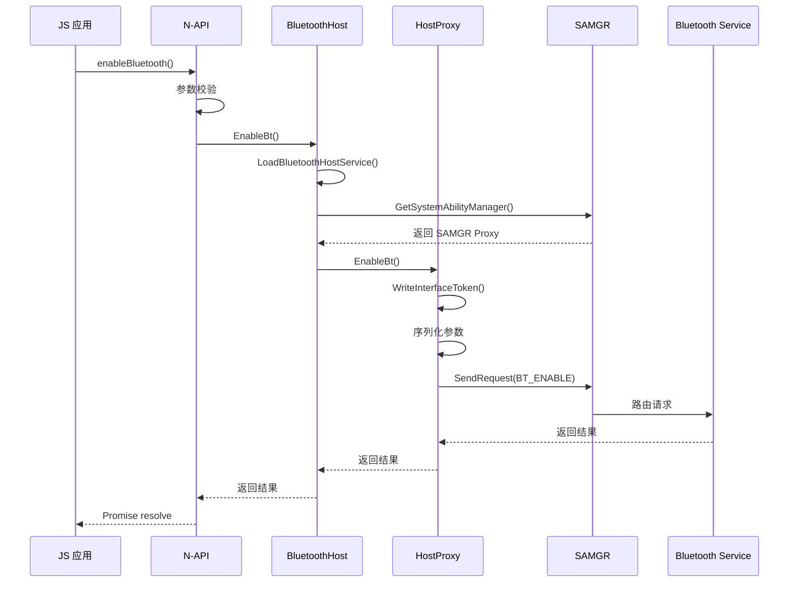
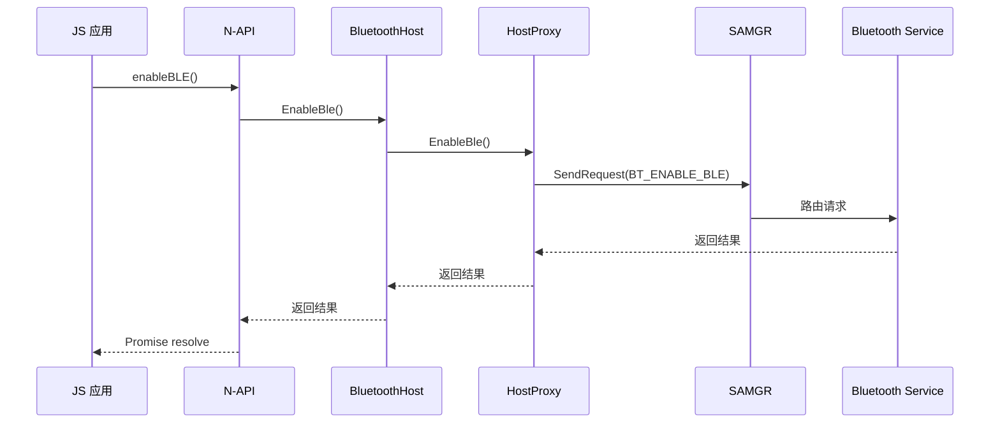
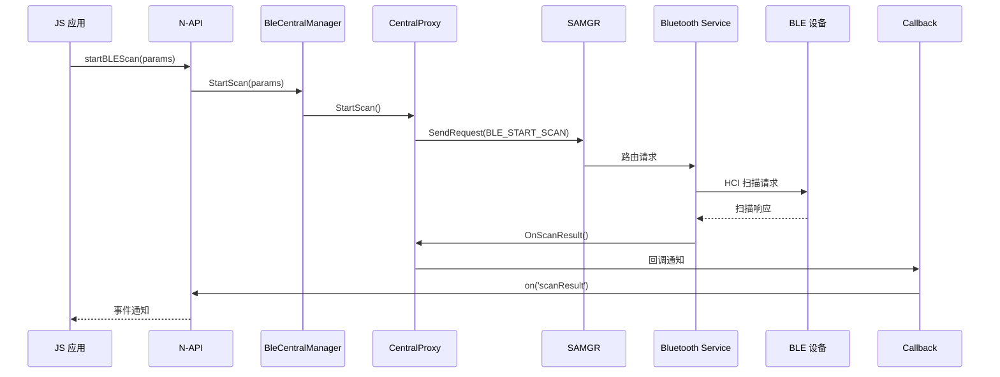
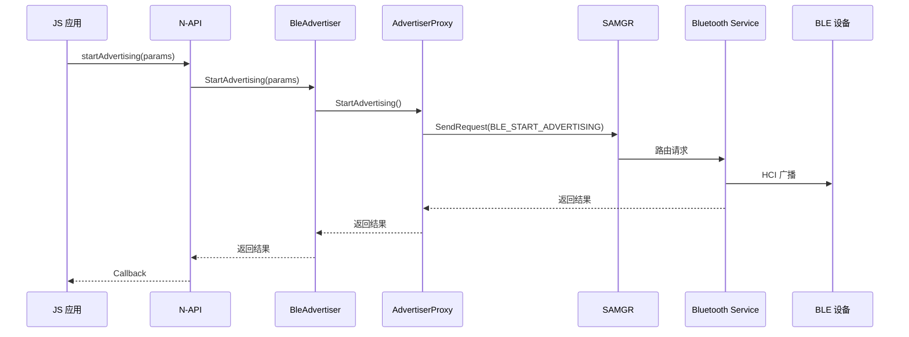
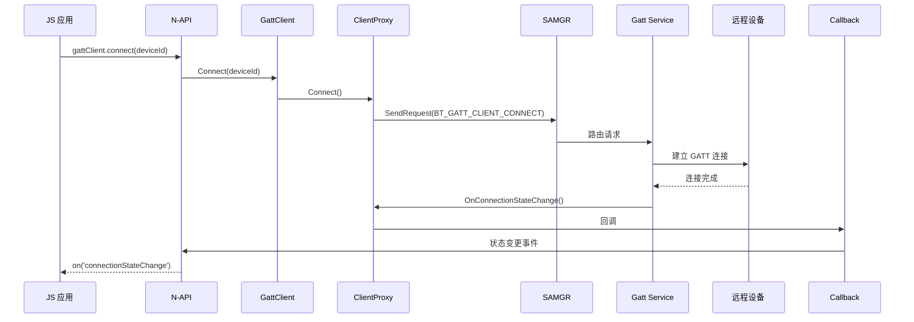
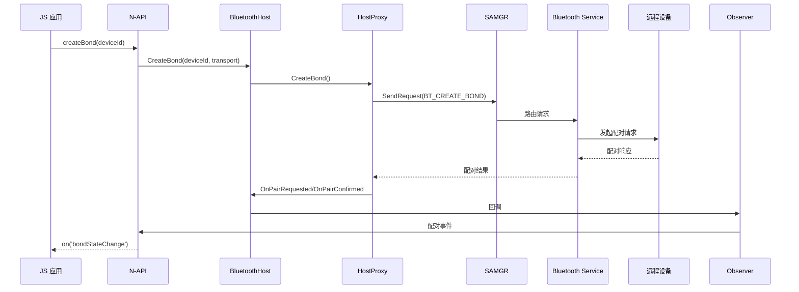
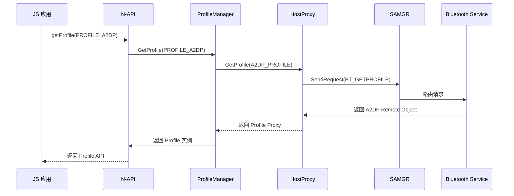
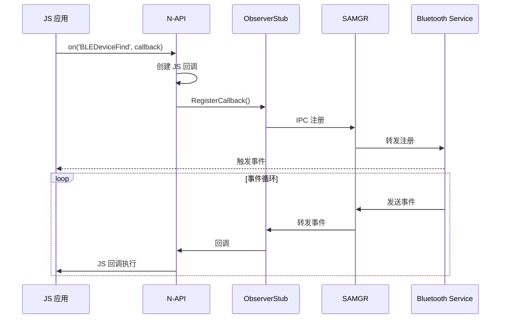

# 关键调用链

> **目的**: 梳理 Bluetooth 模块的关键调用路径，便于问题定位与代码理解  
> **适用范围**: 调试、架构学习、代码审查

## 目录

- [蓝牙开关流程](#蓝牙开关流程)
- [BLE 扫描流程](#ble-扫描流程)
- [BLE 广播流程](#ble-广播流程)
- [GATT 连接流程](#gatt-连接流程)
- [配对流程](#配对流程)

---

## 蓝牙开关流程

### 开启经典蓝牙



**关键代码路径**:
```
App
  ↓
native_module.cpp:75 (BluetoothHostInit)
  ↓
bluetooth_host.h (BluetoothHost::EnableBt)
  ↓
bluetooth_host.cpp:720
  ↓
bluetooth_host_proxy.cpp:73 (BluetoothHostProxy::EnableBt)
  ↓
samgr (IPC)
  ↓
Bluetooth Service (SA 1130)
```

### 开启 BLE



**关键代码路径**:
```
App
  ↓
native_module.cpp:75
  ↓
bluetooth_host.h (BluetoothHost::EnableBle)
  ↓
bluetooth_host.cpp:883
  ↓
bluetooth_host_proxy.cpp:276 (BluetoothHostProxy::EnableBle)
  ↓
samgr (IPC)
  ↓
Bluetooth Service
```

---

## BLE 扫描流程



**关键代码路径**:
```
App
  ↓
native_module_ble.cpp (DefineBLEJSObject)
  ↓
napi_bluetooth_ble.cpp
  ↓
bluetooth_ble_central_manager.h (BleCentralManager::StartScan)
  ↓
bluetooth_ble_central_manager.cpp
  ↓
bluetooth_ble_central_manager_proxy.cpp (BleCentralManagerProxy::StartScan)
  ↓
bluetooth_service_ipc_interface_code.h (BLE_START_SCAN = 65)
  ↓
samgr (IPC)
  ↓
Bluetooth Service
```

---

## BLE 广播流程



**关键代码路径**:
```
App
  ↓
native_module_ble.cpp
  ↓
napi_bluetooth_ble.cpp (DefineBLEJSObject)
  ↓
bluetooth_ble_advertiser.h (BleAdvertiser::StartAdvertising)
  ↓
bluetooth_ble_advertiser.cpp
  ↓
bluetooth_ble_advertiser_proxy.cpp
  ↓
bluetooth_service_ipc_interface_code.h (BLE_START_ADVERTISING = 40)
  ↓
samgr (IPC)
  ↓
Bluetooth Service
```

---

## GATT 连接流程



**关键代码路径**:
```
App
  ↓
native_module_ble.cpp (NapiGattClient::DefineGattClientJSClass)
  ↓
napi_bluetooth_gatt_client.cpp
  ↓
bluetooth_gatt_client.h (GattClient::Connect)
  ↓
bluetooth_gatt_client.cpp
  ↓
bluetooth_gatt_client_proxy.cpp
  ↓
bluetooth_service_ipc_interface_code.h (BT_GATT_CLIENT_CONNECT = 0)
  ↓
samgr (IPC)
  ↓
Bluetooth Service (GATT Profile)
```

---

## 配对流程



**关键代码路径**:
```
App
  ↓
native_module.cpp
  ↓
bluetooth_host.h (BluetoothHost::CreateBond)
  ↓
bluetooth_host.cpp
  ↓
bluetooth_host_proxy.cpp
  ↓
bluetooth_service_ipc_interface_code.h (BT_CREATE_BOND = ...)
  ↓
samgr (IPC)
  ↓
Bluetooth Service
```

---

## Profile 获取流程



**关键代码路径**:
```
App
  ↓
native_module.cpp
  ↓
bluetooth_profile_manager.h (BluetoothProfileManager::GetProfileRemote)
  ↓
bluetooth_profile_manager.cpp
  ↓
bluetooth_host_proxy.cpp:136 (BluetoothHostProxy::GetProfile)
  ↓
samgr (IPC)
  ↓
Bluetooth Service
```

---

## 回调注册流程



---

[返回 SUMMARY](../SUMMARY.md)
