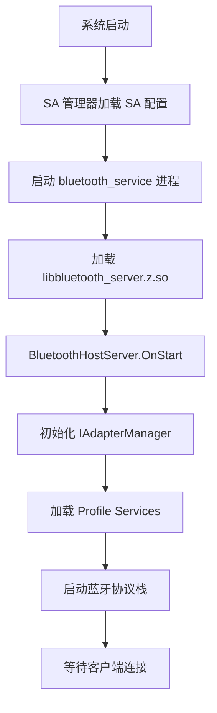
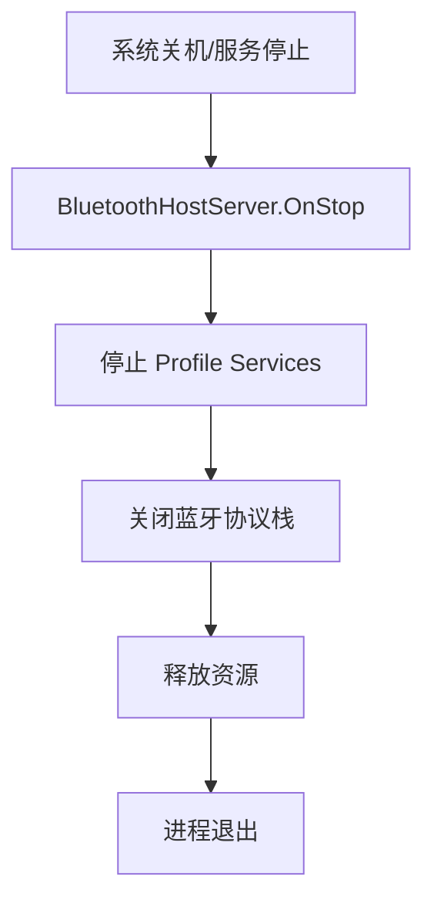

# 项目概览

## 文档信息

- **目的**: 介绍 OpenHarmony Bluetooth Service 组件的整体定位、核心能力和边界
- **适用范围**: 新人入门、架构师理解系统边界、开发者熟悉项目范围
- **关键结论**:
  1. 本组件是蓝牙系统的 C++ 服务层，不包含 N-API JS 绑定
  2. 提供完整的 Classic 和 BLE 蓝牙功能支持
  3. 基于 OpenHarmony System Ability（SA）框架
- **相关文档**: [01_Directory_Structure](01_Directory_Structure.md), [02_Architecture](02_Architecture.md)

---

## 组件定位

### 项目基本信息

| 属性 | 值 | 证据 |
|------|------|------|
| **组件名称** | `@ohos/bluetooth_service` | `bundle.json:2` |
| **子系统** | communication | `bundle.json:39` |
| **版本** | 3.2.0 | `bundle.json:3` |
| **许可** | Apache License 2.0 | `bundle.json:6` |
| **ROM 占用** | 4.5MB | `bundle.json:55` |
| **RAM 占用** | 7.5MB | `bundle.json:56` |

### 在 OpenHarmony 中的位置

```
应用层 (JS/ArkTS)
    ↓ N-API 绑定 (在 bluetooth 仓库)
框架层 (C++ Framework)
    ↓ IPC 调用
服务层 (本仓库)
    ├── System Ability (SA)
    ├── IPC Server
    ├── Profile Services
    └── Protocol Stack
    ↓ HDI 接口
驱动层
    └── Bluetooth HAL
    ↓ 硬件接口
蓝牙硬件
```

**边界说明**:
- **包含**: C++ 服务层实现、SA 服务、Profile 管理、蓝牙协议栈
- **不包含**:
  - N-API JS 绑定（位于 `foundation/communication/bluetooth`）
  - 蓝牙驱动实现（位于 `drivers_peripheral_bluetooth`）
  - HAL 实现（硬件厂商提供）

---

## 核心能力

### 支持的传输模式

| 传输类型 | 说明 | 接口 |
|---------|------|------|
| **Classic Bluetooth** | 经典蓝牙（BR/EDR） | `IAdapterClassic` |
| **BLE** | 低功耗蓝牙 | `IAdapterBle` |

### 支持的 Profile

#### Classic Bluetooth Profiles

| Profile | Feature Flag | 默认启用 | 说明 |
|---------|---------------|----------|------|
| **A2DP Source** | `bluetooth_service_a2dp_source_feature` | ✅ | 音频源端（手机播放音乐） |
| **A2DP Sink** | `bluetooth_service_a2dp_sink_feature` | ❌ | 音频接收端（音箱/耳机） |
| **AVRCP CT** | `bluetooth_service_avrcp_ct_feature` | ✅ | 远程控制（控制器） |
| **AVRCP TG** | `bluetooth_service_avrcp_tg_feature` | ✅ | 远程控制（目标设备） |
| **HFP AG** | `bluetooth_service_hfp_ag_feature` | 条件 | 免提音频网关（车载端） |
| **HFP HF** | `bluetooth_service_hfp_hf_feature` | ❌ | 免提设备（手机端） |
| **HID Host** | `bluetooth_service_hid_host_feature` | ✅ | HID 设备支持（键盘/鼠标） |
| **PAN** | `bluetooth_service_pan_feature` | ❌ | 个人区域网络（网络共享） |

**证据**: `bluetooth.gni:14-32`, `bundle.json:41-50`

#### BLE Profiles

| Profile | 说明 |
|---------|------|
| **GATT Server** | GATT 服务器（外设模式） |
| **GATT Client** | GATT 客户端（中心设备模式） |
| **BLE Advertiser** | BLE 广播 |
| **BLE Central Manager** | BLE 扫描与中心管理 |

#### 其他功能

- **Socket 支持**: Classic/BLE Socket（RFCOMM/L2CAP）
- **OBEX 协议**: 文件传输（OPP/PBAP）
- **配对对话框**: UI 交互支持
- **电源管理**: 功率模式控制、Sniff 模式

---

## 运行环境

### 系统依赖

根据 `bundle.json:60-93`，组件依赖以下系统组件：

| 依赖组件 | 用途 |
|---------|------|
| `ability_base` | 能力基础框架 |
| `ability_runtime` | 能力运行时 |
| `audio_framework` | 音频框架（A2DP） |
| `av_session` | 音频会话（AVRCP AVSession 集成） |
| `hilog` | 日志系统 |
| `hisysevent` | 系统事件 |
| `hitrace` | 性能追踪 |
| `ipc` | 进程间通信 |
| `samgr` | System Ability 管理器 |
| `access_token` | 权限令牌 |
| `bluetooth` | 蓝牙框架（依赖方向：本服务 → 框架） |
| `drivers_interface_bluetooth` | HDI 接口定义 |
| `eventhandler` | 事件处理 |
| `common_event_service` | 公共事件服务 |
| `bundle_framework` | 包管理框架 |
| `jsoncpp` | JSON 解析 |
| `openssl` | 加密库 |
| `libxml2` | XML 解析 |

### Platform 支持

根据 `bundle.json:52-54`，支持：
- ✅ **Standard System** (标准系统)

### 内存要求

| 资源类型 | 占用 | 说明 |
|---------|------|------|
| **ROM** | 4.5MB | 静态代码段大小 |
| **RAM** | 7.5MB | 运行时内存占用（估算） |

---

## 关键概念

### System Ability (SA)

- **SA ID**: 1130
- **进程名**: `bluetooth_service`
- **库文件**: `libbluetooth_server.z.so`
- **启动方式**: `run-on-create: true`

**证据**:
- SA ID: `sa_profile/1130.json:5`
- 进程名: `sa_profile/1130.json:2`
- 库文件: `sa_profile/1130.json:6`
- SA 类: `services/bluetooth/server/include/bluetooth_host_server.h:33`

### Feature Flags

组件支持通过编译时 Feature Flags 动态启用/禁用 Profile：

| Flag | 说明 | 默认值 |
|------|------|--------|
| `bluetooth_service_avrcp_avsession` | AVRCP 与 AVSession 集成 | `true` |
| `bluetooth_service_a2dp_sink_feature` | A2DP Sink 支持 | `false` |
| `bluetooth_service_a2dp_source_feature` | A2DP Source 支持 | `true` |
| `bluetooth_service_avrcp_ct_feature` | AVRCP CT 支持 | `true` |
| `bluetooth_service_avrcp_tg_feature` | AVRCP TG 支持 | `true` |
| `bluetooth_service_hfp_ag_feature` | HFP AG 支持（需 telephony） | 条件 |
| `bluetooth_service_hfp_hf_feature` | HFP HF 支持 | `false` |
| `bluetooth_service_hid_host_feature` | HID Host 支持 | `true` |
| `bluetooth_service_pan_feature` | PAN 支持 | `false` |

**证据**: `bluetooth.gni:14-32`

详细说明: [08_Config_Flags.md](08_Config_Flags.md)

### HiSysEvent 事件

组件向 HiSysEvent 上报以下事件用于统计和调试：

| 事件 | 参数 | 说明 |
|------|------|------|
| `BR_SWITCH_STATE` | PID, UID, STATE | Classic 蓝牙开关状态 |
| `BLE_SWITCH_STATE` | PID, UID, STATE | BLE 开关状态 |
| `DISCOVERY_STATE` | PID, UID, STATE | 设备发现状态 |
| `A2DP_CONNECTED_STATE` | STATE | A2DP 连接状态 |
| `HFP_CONNECTED_STATE` | STATE | HFP 连接状态 |
| `GATT_SERVER_CONN_STATE` | PID, UID, STATE | GATT Server 连接状态 |
| `GATT_CLIENT_CONN_STATE` | PID, UID, STATE | GATT Client 连接状态 |
| `BLE_SCAN_START` | PID, UID, TYPE | BLE 扫描开始 |
| `BLE_SCAN_STOP` | PID, UID | BLE 扫描停止 |
| `BLE_SCAN_DUTY_CYCLE` | WINDOW, INTERVAL, TYPE | BLE 扫描占空比 |
| `GATT_CONNECT_STATE` | ADDRESS, STATE, ROLE | GATT 连接状态 |
| `GATT_APP_REGISTER` | ACTION, SIDE, ADDRESS, PID, UID, APPID | GATT 应用注册 |

**证据**: `hisysevent.yaml:14-84`

---

## 组件生命周期

### 启动流程



### 停止流程



---

## 性能指标

### 已知性能特征（基于代码分析）

- **启动时间**: 无明确指标，依赖 Profile 数量和硬件初始化
- **内存占用**: 7.5MB（估算，不含应用层）
- **CPU 占用**: 无明确指标，依赖当前操作（扫描/连接/音频传输）

### 性能优化点

- **Sniff 模式**: 低功耗模式支持
- **扫描占空比**: BLE 扫描可配置占空比（`BLE_SCAN_DUTY_CYCLE` 事件）
- **连接优先级**: 支持设置连接优先级

---

## 与其他组件的交互

### 依赖方向

```
bluetooth_service (本仓库)
    ↓ 依赖
bluetooth 框架
    ↓ 依赖
HDI 接口
    ↓ 调用
蓝牙驱动
```

### 数据流

1. **应用 → 蓝牙服务**: 通过 IPC（SA ID: 1130）
2. **蓝牙服务 → 协议栈**: 内部调用
3. **协议栈 → 硬件**: HDI 接口调用

---

## 总结

OpenHarmony Bluetooth Service 是蓝牙系统的核心服务层，提供完整的 Classic 和 BLE 蓝牙功能支持。组件基于 System Ability 框架，通过 Feature Flags 灵活配置不同 Profile 的启用状态。

**关键要点**:
- ✅ C++ 服务层，不包含 N-API JS 绑定
- ✅ 支持多种 Classic 和 BLE Profile
- ✅ 基于 OpenHarmony SA 框架
- ✅ 通过 Feature Flags 灵活配置
- ✅ 提供 HiSysEvent 事件统计

**相关文档**:
- 架构详解: [02_Architecture](02_Architecture.md)
- 模块结构: [01_Directory_Structure](01_Directory_Structure.md)
- 内部接口: [03_Internal_API](03_Internal_API.md)
- 构建系统: [04_GN_Targets](04_GN_Targets.md)
