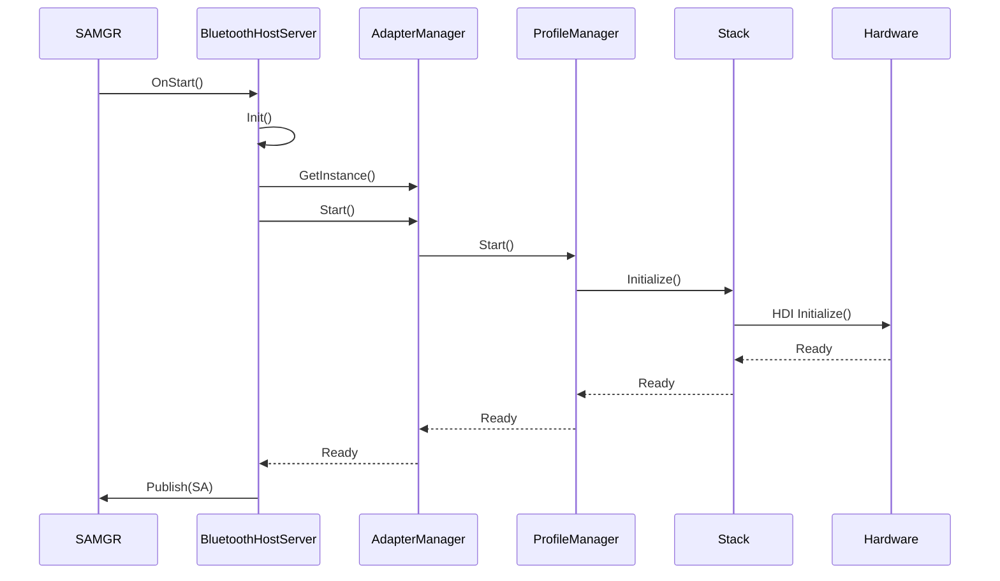
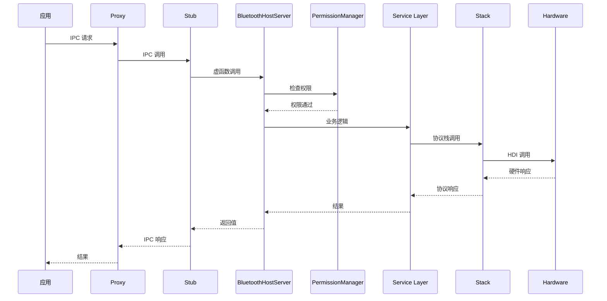
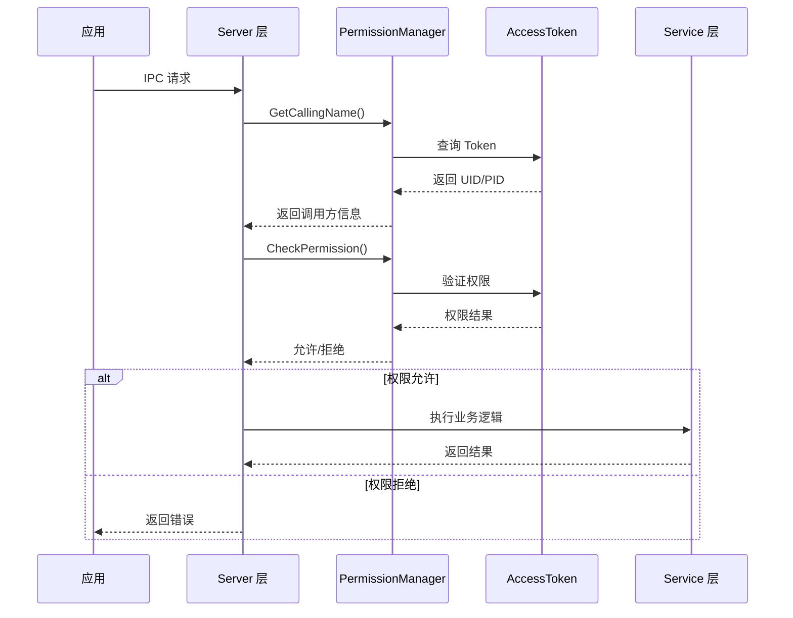
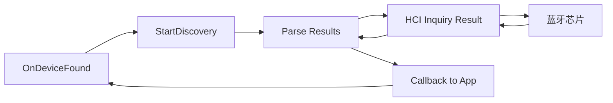
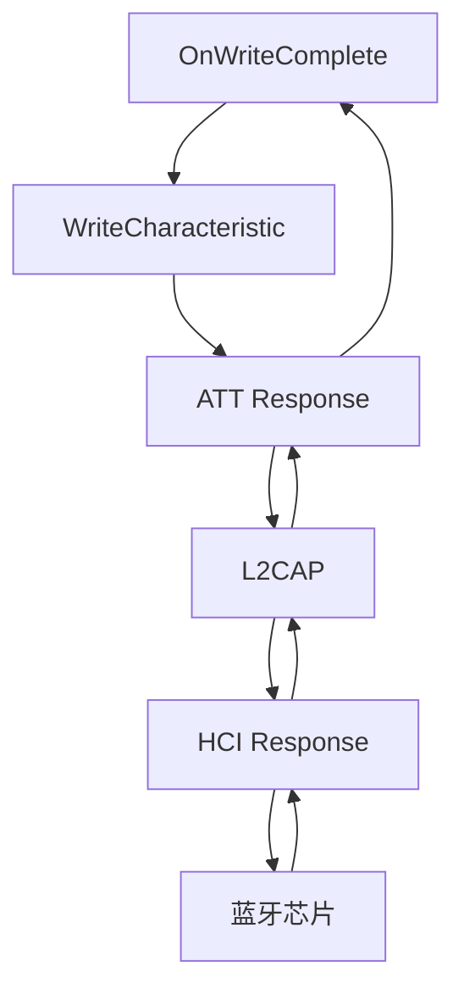
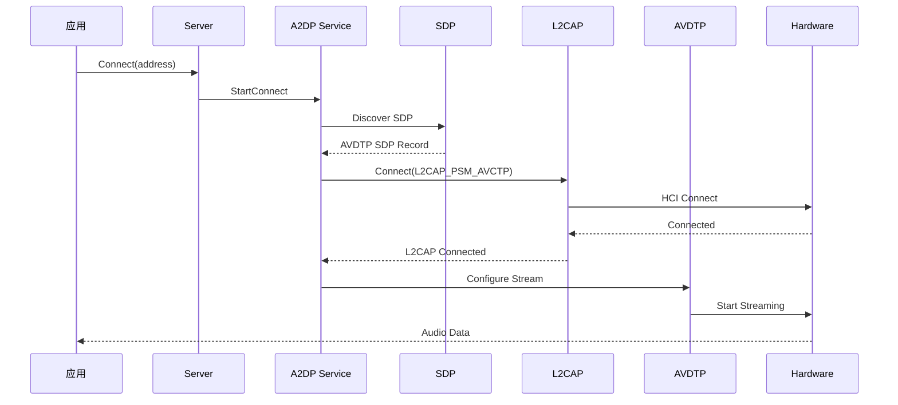
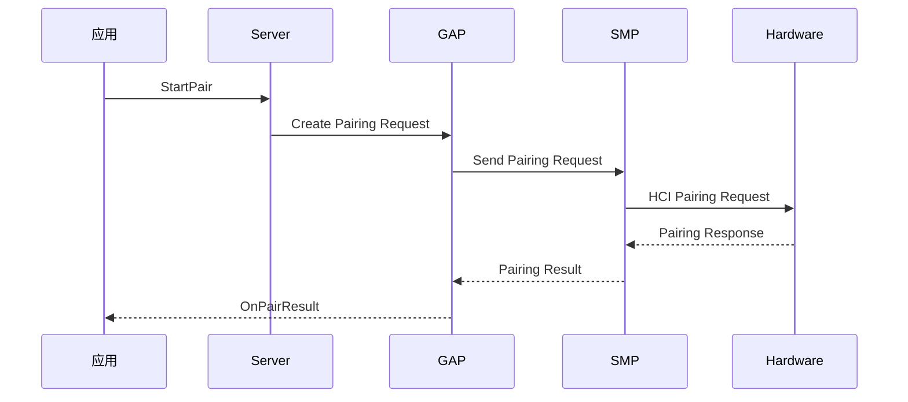

# 架构说明

## 文档信息

- **目的**: 介绍蓝牙服务的架构设计、组件交互、线程模型和关键时序
- **适用范围**: 架构师理解系统设计、开发者深入理解数据流
- **关键结论**:
  1. 采用四层架构：Server → Service → Stack → Hardware
  2. 基于 OpenHarmony System Ability（SA）框架
  3. 通过 IPC 接收客户端请求
  4. 使用状态机管理生命周期
- **相关文档**: [00_Overview](00_Overview.md), [01_Directory_Structure](01_Directory_Structure.md), [03_Internal_API](03_Internal_API.md)

---

## 分层架构

### 整体架构图

```mermaid
graph TB
    subgraph 应用层
        APP1[应用 1]
        APP2[应用 2]
        APP3[系统应用]
    end

    subgraph N-API 层 (bluetooth 仓库)
        NAPI[N-API 绑定]
    end

    subgraph IPC 层
        PROXY[Proxy]
        STUB[Stub]
    end

    subgraph Server 层
        SA[BluetoothHostServer<br/>SA ID: 1130]
        PMS[Profile Server<br/>GATT/A2DP/HFP...]
    end

    subgraph Service 层
        AM[AdapterManager]
        CL[BLE Adapter]
        CC[Classic Adapter]
        PM[Profile Manager]
    end

    subgraph Stack 层
        HCI[HCI]
        L2CAP[L2CAP]
        SMP[SMP]
        GAP[GAP]
        SDP[SDP]
    end

    subgraph Hardware 层
        HDI[HDI 接口]
        HAL[蓝牙 HAL]
    end

    subgraph 硬件
        BT[蓝牙芯片]
    end

    APP1 & APP2 & APP3 --> NAPI
    NAPI --> PROXY
    PROXY <--> STUB
    STUB --> SA
    SA --> PMS
    PMS --> AM
    AM --> CL
    AM --> CC
    AM --> PM
    CL & CC & PM --> HCI
    HCI --> L2CAP
    L2CAP --> SMP & GAP & SDP
    HCI --> HDI
    HDI --> HAL
    HAL --> BT
```

### 层次说明

| 层次 | 职责 | 关键组件 |
|------|------|----------|
| **应用层** | 用户应用 | ArkTS/JS 应用 |
| **N-API 层** | JS ↔ C++ 桥接 | N-API 模块（外部仓库） |
| **IPC 层** | 跨进程通信 | Proxy/Stub |
| **Server 层** | SA 服务、请求路由、权限检查 | BluetoothHostServer、Profile Server |
| **Service 层** | 业务逻辑、状态管理 | AdapterManager、Profile Service |
| **Stack 层** | 蓝牙协议实现 | HCI、L2CAP、GAP、SMP |
| **Hardware 层** | 硬件接口 | HDI、HAL |
| **硬件** | 蓝牙控制器 | 蓝牙芯片 |

**证据**:
- SA 定义: `sa_profile/1130.json`
- Server 层: `services/bluetooth/server/`
- Service 层: `services/bluetooth/service/`
- Stack 层: `services/bluetooth/stack/`
- Hardware 层: `services/bluetooth/hardware/`

---

## 组件交互

### 启动流程



### 客户端请求流程



---

## Server 层架构

### BluetoothHostServer (SA 主类)

**职责**:
- 实现 SystemAbility 接口
- 实现 BluetoothHostStub
- 管理服务生命周期
- 路由 IPC 请求到对应的 Profile Server

**关键方法**:

| 方法 | 说明 | 证据 |
|------|------|------|
| `OnStart()` | SA 启动回调 | `bluetooth_host_server.h:42` |
| `OnStop()` | SA 停止回调 | `bluetooth_host_server.h:43` |
| `EnableBt()` | 启用蓝牙 | `bluetooth_host_server.h:47` |
| `DisableBt()` | 禁用蓝牙 | `bluetooth_host_server.h:48` |
| `GetProfile()` | 获取 Profile 接口 | `bluetooth_host_server.h:55` |
| `StartBtDiscovery()` | 开始设备发现 | `bluetooth_host_server.h:82` |
| `GetPairedDevices()` | 获取已配对设备 | `bluetooth_host_server.h:86` |
| `StartPair()` | 开始配对 | `bluetooth_host_server.h:103` |

**证据**: `services/bluetooth/server/include/bluetooth_host_server.h:33-177`

### Profile Server 架构

每个 Profile 有独立的 Server 类：

```cpp
// 示例：GATT Server
class BluetoothGattServerServer : public BluetoothGattServerStub {
public:
    int RegisterService(const GattService &service) override;
    int AddCharacteristic(const GattCharacteristic &characteristic) override;
    // ... 其他接口
private:
    std::shared_ptr<IGattServerProfile> profile_;  // 调用 Service 层
};
```

**设计模式**:
- Stub → Server → Service
- Server 处理 IPC 和权限
- Service 处理业务逻辑

---

## Service 层架构

### AdapterManager (适配器管理器)

**职责**:
- 管理 Classic 和 BLE 适配器
- 注册/注销状态观察者
- 启动/停止服务

**接口定义**: `services/bluetooth/service/include/interface_adapter_manager.h:103-308`

**关键方法**:

| 方法 | 说明 |
|------|------|
| `Enable()` | 启用 Classic/BLE |
| `Disable()` | 禁用 Classic/BLE |
| `GetState()` | 获取状态 |
| `RegisterStateObserver()` | 注册状态观察者 |
| `GetClassicAdapterInterface()` | 获取 Classic 适配器 |
| `GetBleAdapterInterface()` | 获取 BLE 适配器 |

### Profile Service 管理

**架构**: 每个 Profile 独立实现

| Profile | Service 类 | 职责 |
|---------|----------|------|
| GATT Server | `GattServerProfile` | GATT 服务器逻辑 |
| GATT Client | `GattClientProfile` | GATT 客户端逻辑 |
| A2DP Source | `A2dpSourceService` | A2DP 音频流 |
| HFP AG | `HfpAgService` | 免提网关 |
| HID Host | `HidHostService` | HID 设备管理 |

**证据**: `services/bluetooth/service/src/{profile_name}/*`

---

## Stack 层架构

### 协议栈组件

| 协议 | 职责 | 文件位置 |
|------|------|----------|
| **HCI** | Host Controller Interface | `stack/src/hci/` |
| **L2CAP** | 逻辑链路控制和适配 | `stack/src/l2cap/` |
| **SMP** | Security Manager Protocol | `stack/src/smp/` |
| **GAP** | Generic Access Profile | `stack/src/gap/` |
| **SDP** | Service Discovery Protocol | `stack/src/sdp/` |
| **ATT** | Attribute Protocol | `stack/src/att/` |
| **AVDTP** | Audio/Video Distribution Transport | `stack/src/avdtp/` |

### 协议栈依赖关系

```
应用层 (Profiles)
    ↓
GAP / SDP / AVDTP
    ↓
L2CAP
    ↓
HCI
    ↓
硬件
```

---

## Hardware 层架构

### HDI 接口

**职责**: 封装蓝牙 HAL，提供统一接口

**关键接口**:

| 接口 | 说明 |
|------|------|
| `IBluetoothHost` | 主机接口 |
| `IHciCallback` | HCI 回调 |
| `IBluetoothVendor` | 厂商扩展接口 |

**证据**: `services/bluetooth/hardware/include/bluetooth_hdi.h`

---

## 权限检查流程



**关键类**:
- `PermissionManager`: `services/bluetooth/service/src/permission/permission_manager.h:25`
- `AuthCenter`: `services/bluetooth/service/src/permission/auth_center.h`

---

## 线程模型

### 事件循环

**推断**: 基于 OpenHarmony EventHandler 框架

**证据**:
- `services/bluetooth/service/src/util/dispatcher.cpp` - 事件分发器
- `services/bluetooth/server/BUILD.gn:112` - 依赖 `eventhandler:libeventhandler`

### 线程划分

| 线程类型 | 职责 | 推断 |
|-----------|------|------|
| **主线程** | SA 启动/停止、系统回调 | System Ability 主线程 |
| **IPC 线程** | 处理 IPC 请求 | Binder 线程池 |
| **协议栈线程** | HCI 事件处理、L2CAP 数据 | 协议栈内部线程 |
| **Profile 线程** | Profile 特定逻辑（A2DP 音频） | 可能有独立线程 |

---

## 状态机

### 适配器状态机

**状态**: `BTStateID` (定义在 `bluetooth_types.h`）

| 状态 | 说明 |
|------|------|
| `STATE_OFF` | 蓝牙关闭 |
| `STATE_TURNING_ON` | 正在开启 |
| `STATE_ON` | 蓝牙已开启 |
| `STATE_TURNING_OFF` | 正在关闭 |

**实现**: `services/bluetooth/service/src/common/adapter_state_machine.cpp`

### 电源状态机

**实现**: `services/bluetooth/service/src/common/power_state_machine.cpp`

**状态**:
- Active
- Sniff (Level Low/Mid/High)

### Profile 状态机

每个 Profile 独立状态机：
- A2DP: `services/bluetooth/service/src/gavdp/a2dp_state_machine.cpp`
- HFP: `services/bluetooth/service/src/hfp_ag/hfp_ag_statemachine.cpp`
- AVRCP: `services/bluetooth/service/src/avrcp_ct/avrcp_ct_state_machine.cpp`

---

## 数据流

### 设备发现流程



### GATT 数据传输流程



---

## 关键时序

### A2DP 连接时序



### BLE 配对流程



---

## 跨层调用示例

### EnableBt 流程

**代码路径追踪**:

1. `BluetoothHostServer::EnableBt()` (`server/src/bluetooth_host_server.cpp`)
2. → `IAdapterManager::Enable()` (`service/src/common/adapter_manager.cpp`)
3. → `IAdapterClassic::Enable()` (`service/src/classic/classic_adapter.cpp`)
4. → `Gap::Enable()` (`stack/src/gap/`)
5. → `Hci::SendEnableCommand()` (`stack/src/hci/`)
6. → `HDI::Enable()` (`hardware/src/bluetooth_hdi.cpp`)

---

## 总结

bluetooth_service 采用清晰的四层架构：

1. **Server 层**: SA 服务、IPC 接口、权限检查
2. **Service 层**: 业务逻辑、状态管理、Profile 协调
3. **Stack 层**: 蓝牙协议实现
4. **Hardware 层**: HDI 接口封装

**设计优势**:
- ✅ 清晰的层次边界
- ✅ 便于维护和扩展
- ✅ 灵活的 Feature flags 配置
- ✅ 完善的权限控制

**相关文档**:
- 目录结构: [01_Directory_Structure](01_Directory_Structure.md)
- 内部接口: [03_Internal_API](03_Internal_API.md)
- 构建系统: [04_GN_Targets](04_GN_Targets.md)
