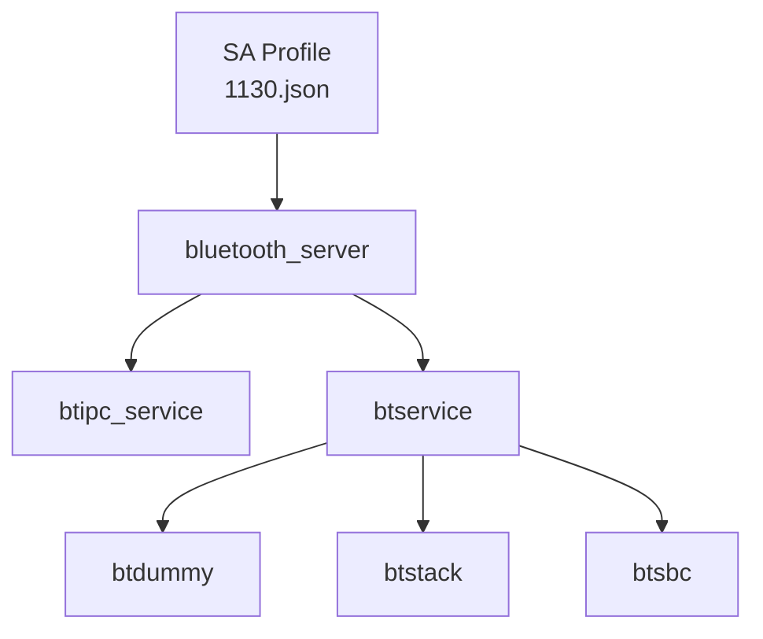

# GN 构建系统

## 文档信息

- **目的**: 介绍 GN 构建系统、Targets、Feature flags 和依赖关系
- **适用范围**: 开发者了解构建配置、架构师评估模块依赖
- **关键结论**:
  1. 使用 Feature flags 动态配置 Profile
  2. 主要产物: bluetooth_server、btservice、btstack
  3. 依赖外部组件: bluetooth 框架、access_token、hilog 等
- **相关文档**: [00_Overview](00_Overview.md), [05_Build_Artifacts](05_Build_Artifacts.md), [08_Config_Flags](08_Config_Flags.md)

---

## GN 文件清单

### 非 test/ 目录 BUILD.gn 文件

| 路径 | 说明 |
|------|------|
| `services/bluetooth/BUILD.gn` | LiteOS 组件入口 |
| `services/bluetooth/stack/BUILD.gn` | 协议栈构建 |
| `services/bluetooth/service/BUILD.gn` | 业务服务层构建 |
| `services/bluetooth/server/BUILD.gn` | IPC Server 构建主入口 |
| `services/bluetooth/ipc/BUILD.gn` | IPC Skeleton/Proxy 构建 |
| `services/bluetooth/hardware/BUILD.gn` | HDI 层构建（推断） |
| `sa_profile/BUILD.gn` | SA Profile 构建 |

### 配置文件

| 文件 | 说明 |
|------|------|
| `bluetooth.gni` | Feature flags 定义 |
| `services/bluetooth/service/BUILD.gn` | 包含 Feature flags 使用 |

---

## 主要 Targets

### 1. bluetooth_server

**文件**: `services/bluetooth/server/BUILD.gn`

**类型**: `ohos_shared_library`

**输出**: `libbluetooth_server.z.so`

**源文件**:

| 文件 | 说明 |
|------|------|
| `src/bluetooth_host_server.cpp` | SA 主类 |
| `src/bluetooth_utils_server.cpp` | 工具函数 |
| `src/bluetooth_host_dumper.cpp` | Dump 实现 |
| `src/bluetooth_ble_filter_matcher.cpp` | BLE 广播过滤器 |
| `src/bluetooth_hitrace.cpp` | 性能追踪 |

**条件编译** (基于 Feature flags):

| Feature Flag | 添加文件 | 宏定义 |
|-------------|----------|--------|
| `bluetooth_service_a2dp_sink_feature` | `src/bluetooth_a2dp_sink_server.cpp` | `BLUETOOTH_A2DP_SINK_FEATURE` |
| `bluetooth_service_a2dp_source_feature` | `src/bluetooth_a2dp_source_server.cpp` | `BLUETOOTH_A2DP_SRC_FEATURE` |
| `bluetooth_service_avrcp_ct_feature` | `src/bluetooth_avrcp_ct_server.cpp` | `BLUETOOTH_AVRCP_CT_FEATURE` |
| `bluetooth_service_avrcp_tg_feature` | `src/bluetooth_avrcp_tg_server.cpp` | `BLUETOOTH_AVRCP_TG_FEATURE` |
| `bluetooth_service_hfp_ag_feature` | `src/bluetooth_hfp_ag_server.cpp` | `BLUETOOTH_HFP_AG_FEATURE` |
| `bluetooth_service_hfp_hf_feature` | `src/bluetooth_hfp_hf_server.cpp` | `BLUETOOTH_HFP_HF_FEATURE` |
| `bluetooth_service_hid_host_feature` | `src/bluetooth_hid_host_server.cpp` | `BLUETOOTH_HID_HOST_FEATURE` |
| `bluetooth_service_pan_feature` | `src/bluetooth_pan_server.cpp` | `BLUETOOTH_PAN_FEATURE` |

**依赖**:

```gn
deps = [
  "$BT_ROOT/etc/init:etc",
  "$SUBSYSTEM_DIR/bluetooth_service/services/bluetooth/ipc:btipc_service",
  "$SUBSYSTEM_DIR/bluetooth_service/services/bluetooth/service:btservice",
]
```

**外部依赖**:

| 依赖 | 说明 |
|------|------|
| `ability_base:base` | 能力基础框架 |
| `access_token:libaccesstoken_sdk` | 权限令牌 |
| `bluetooth:btframework` | 蓝牙框架 |
| `bluetooth:btcommon` | 蓝牙公共库 |
| `hilog:libhilog` | 日志系统 |
| `hisysevent:libhisysevent` | 系统事件 |
| `hitrace:hitrace_meter` | 性能追踪 |
| `ipc:ipc_core` | IPC 核心 |
| `safwk:system_ability_fwk` | SA 框架 |
| `samgr:samgr_proxy` | SA 管理器代理 |
| `eventhandler:libeventhandler` | 事件处理器 |

**证据**: `services/bluetooth/server/BUILD.gn:21-123`

---

### 2. btipc_service

**文件**: `services/bluetooth/ipc/BUILD.gn`

**类型**: `ohos_static_library`

**输出**: `libbtipc_service.a`

**源文件**:

| 类别 | 文件 |
|------|------|
| **Host** | `bluetooth_host_stub.cpp`, `bluetooth_host_observer_proxy.cpp` |
| **GATT** | `bluetooth_gatt_server_stub.cpp`, `bluetooth_gatt_server_callback_proxy.cpp` |
| **BLE** | `bluetooth_ble_advertiser_stub.cpp`, `bluetooth_ble_central_manager_stub.cpp` |
| **Socket** | `bluetooth_socket_stub.cpp`, `bluetooth_socket_observer_proxy.cpp` |
| **A2DP Source** | `bluetooth_a2dp_src_stub.cpp`, `bluetooth_a2dp_src_observer_proxy.cpp` |
| **A2DP Sink** | `bluetooth_a2dp_sink_stub.cpp`, `bluetooth_a2dp_sink_observer_proxy.cpp` |
| **AVRCP** | `bluetooth_avrcp_ct_stub.cpp`, `bluetooth_avrcp_tg_stub.cpp` |
| **HFP** | `bluetooth_hfp_ag_stub.cpp`, `bluetooth_hfp_hf_stub.cpp` |
| **HID** | `bluetooth_hid_host_stub.cpp` |
| **PAN** | `bluetooth_pan_stub.cpp` |

**条件编译**: 与 bluetooth_server 相同的 Feature flags

**外部依赖**:

| 依赖 | 说明 |
|------|------|
| `access_token:libaccesstoken_sdk` | 权限令牌 |
| `bluetooth:btframework` | 蓝牙框架 |
| `hilog:libhilog` | 日志系统 |
| `ipc:ipc_core` | IPC 核心 |

**证据**: `services/bluetooth/ipc/BUILD.gn:24-122`

---

### 3. btservice

**文件**: `services/bluetooth/service/BUILD.gn`

**类型**: `ohos_shared_library`

**输出**: `libbtservice.z.so` (推断)

**源文件分组**:

| 分组 | 文件数量 | 说明 |
|------|----------|------|
| ServiceCommonSrc | 14 | 公共组件（状态机、配置管理） |
| ServiceUtilSrc | 8 | 工具类（定时器、事件分发） |
| ServiceBleSrc | 7 | BLE 实现 |
| ServiceClassicSrc | 7 | Classic 实现 |
| ServiceGattSrc | 13 | GATT Profile |
| ServiceGavdpSrc | 22 | A2DP 音频传输 |
| ServiceObexSrc | 10 | OBEX 协议 |
| ServiceSockSrc | 8 | Socket 支持 |
| ServiceTransportSrc | 3 | 传输层 |
| ServicePermissionSrc | 5 | 权限检查 |
| ServiceDialogSrc | 4 | 配对对话框 |

**Profile 特定源** (基于 Feature flags):

| Feature Flag | 源文件 |
|-------------|----------|
| `bluetooth_service_a2dp_sink_feature` | `src/a2dp_snk/a2dp_snk_service.cpp` |
| `bluetooth_service_a2dp_source_feature` | `src/a2dp_src/a2dp_src_service.cpp` |
| `bluetooth_service_avrcp_ct_feature` | `src/avrcp_ct/*.cpp` (12 文件) |
| `bluetooth_service_avrcp_tg_feature` | `src/avrcp_tg/*.cpp` (12 文件) |
| `bluetooth_service_hfp_ag_feature` | `src/hfp_ag/*.cpp` (18 文件) |
| `bluetooth_service_hfp_hf_feature` | `src/hfp_hf/*.cpp` (16 文件) |
| `bluetooth_service_hid_host_feature` | `src/hid_host/*.cpp` (6 文件) |
| `bluetooth_service_pan_feature` | `src/pan/*.cpp` (5 文件) |

**依赖**:

```gn
deps = [
  "$PART_DIR/external:btdummy",
  "$PART_DIR/stack:btstack",
]
```

**外部依赖**: 大量依赖（见 `services/bluetooth/service/BUILD.gn:348-370`）

**证据**: `services/bluetooth/service/BUILD.gn:25-421`

---

### 4. btsbc

**文件**: `services/bluetooth/service/BUILD.gn:394`

**类型**: `ohos_shared_library`

**输出**: `libbtsbc.z.so`

**源文件**:

| 文件 | 说明 |
|------|------|
| `src/sbc_decoder.cpp` | SBC 解码器 |
| `src/sbc_encoder.cpp` | SBC 编码器 |
| `src/sbc_frame.cpp` | SBC 帧处理 |

**用途**: A2DP 音频编解码

**证据**: `services/bluetooth/service/BUILD.gn:394-421`

---

### 5. btstack

**文件**: `services/bluetooth/stack/BUILD.gn`

**类型**: `ohos_shared_library` (推断)

**输出**: `libbtstack.z.so` (推断)

**源文件**: 协议栈实现

| 协议 | 源文件位置 |
|------|----------|
| HCI | `src/hci/` |
| L2CAP | `src/l2cap/` |
| SMP | `src/smp/` |
| GAP | `src/gap/` |
| SDP | `src/sdp/` |
| ATT | `src/att/` |
| AVCTP | `src/avctp/` |
| AVDTP | `src/avdtp/` |
| Btm | `src/btm/` |

**证据**: `services/bluetooth/stack/src/` 目录结构

---

### 6. btdummy

**文件**: `services/bluetooth/external/BUILD.gn` (推断)

**类型**: 推断

**输出**: 桩库

**用途**: 提供空实现，用于无完整依赖时编译

---

### 7. SA Profile

**文件**: `sa_profile/BUILD.gn`

**类型**: `ohos_sa_profile`

**输出**: `1130.json` (安装到系统)

**源文件**: `1130.json`

**内容**:

```json
{
    "process": "bluetooth_service",
    "systemability": [
        {
            "name": 1130,
            "libpath": "libbluetooth_server.z.so",
            "run-on-create": true,
            "distributed": false,
            "dump_level": 1,
            "min_hdi_proxy_version": ["libbluetooth_hci_proxy_1.0.z.so"]
        }
    ]
}
```

**证据**: `sa_profile/1130.json:1-13`

---

## Feature Flags

### 定义位置

`bluetooth.gni:14-32`

### 完整列表

见 [08_Config_Flags.md](08_Config_Flags.md)

---

## 依赖关系图

### Target 依赖



### 外部依赖

| 依赖组件 | 用途 | 使用位置 |
|---------|------|----------|
| `access_token` | 权限检查 | server, ipc, service |
| `bluetooth` | 蓝牙框架 | server, ipc, service |
| `hilog` | 日志 | 所有 target |
| `hisysevent` | 系统事件 | server, service |
| `hitrace` | 性能追踪 | server |
| `ipc` | IPC 通信 | server, ipc |
| `samgr` | SA 管理 | server |
| `safwk` | SA 框架 | server |
| `eventhandler` | 事件处理 | service |
| `audio_framework` | 音频框架 | service (A2DP) |
| `av_session` | 音频会话 | service (AVRCP) |
| `openssl` | 加密库 | service |
| `jsoncpp` | JSON 解析 | service |
| `libxml2` | XML 解析 | service (OBEX) |

---

## 编译配置

### 编译标志

**C++ 编译选项**: `services/bluetooth/service/BUILD.gn:183-208`

```gn
cflags_cc = [
  "-fPIC",
  "-fexceptions",
  "-Wno-pessimizing-move",
  "-Wno-unused-parameter",
  "-Wunused-variable",
  "-Wreorder",
  "-Wmissing-braces",
  "-Wimplicit-fallthrough",
  "-Wunused-private-field",
  "-Wlogical-op-parentheses",
  "-Wmissing-field-initializers",
  "-Wparentheses-equality",
  "-Wparentheses",
  "-Wdelete-non-abstract-non-virtual-dtor",
  "-Wignored-qualifiers",
  "-Wdelete-abstract-non-virtual-dtor",
  "-Wuninitialized",
  "-Woverloaded-virtual",
  "-Wdangling-else",
  "-Wno-non-c-typedef-for-linkage",
  "-Wno-unused-but-set-variable",
  "-Wno-array-parameter",
]
```

**Stack Protector**: `stack_protector_ret = true`

**证据**: `services/bluetooth/server/BUILD.gn:26`, `services/bluetooth/service/BUILD.gn:215`

---

## 条件编译示例

### A2DP Source

```gn
if (bluetooth_service_a2dp_source_feature) {
  defines += [ "BLUETOOTH_A2DP_SRC_FEATURE" ]
  sources += [ "src/bluetooth_a2dp_source_server.cpp" ]
}
```

**证据**:
- `services/bluetooth/server/BUILD.gn:58-62`
- `services/bluetooth/service/BUILD.gn:239-241`

---

## 安装配置

### Bundle.json build 配置

**文件**: `bundle.json:97-118`

**service_group targets**:

```json
"service_group": [
  "//foundation/communication/bluetooth_service/sa_profile:communication_bluetooth_service_sa_profile",
  "//foundation/communication/bluetooth_service/services/bluetooth/server:bluetooth_server",
  "//foundation/communication/bluetooth_service/services/bluetooth/service:btsbc"
]
```

**test targets**:

```json
"test": [
  "//foundation/communication/bluetooth_service/test/unittest/spp:unittest",
  "//foundation/communication/bluetooth_service/test/unittest/host:unittest",
  // ...
]
```

---

## 总结

GN 构建系统特点：

1. **Feature Flags 控制**: Profile 动态启用/禁用
2. **分层构建**: server → ipc → service → stack → hardware
3. **共享库输出**: 主要产物为 .so 文件
4. **大量外部依赖**: 依赖多个系统组件
5. **条件编译**: 根据配置选择性编译代码

**主要 Targets**:
- `bluetooth_server` - SA 主入口
- `btservice` - 业务服务层
- `btipc_service` - IPC 代码
- `btstack` - 协议栈
- `btsbc` - SBC 音频编解码

**相关文档**:
- 编译产物: [05_Build_Artifacts](05_Build_Artifacts.md)
- Feature flags: [08_Config_Flags](08_Config_Flags.md)
- 目录结构: [01_Directory_Structure](01_Directory_Structure.md)
