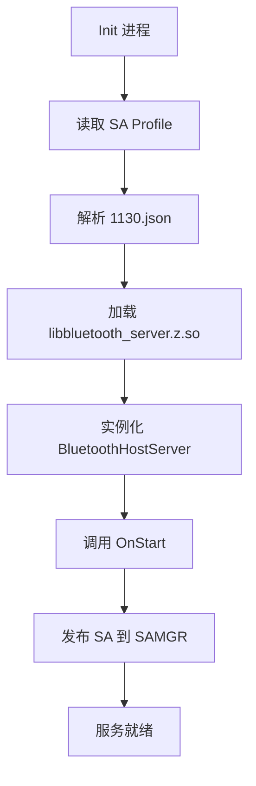
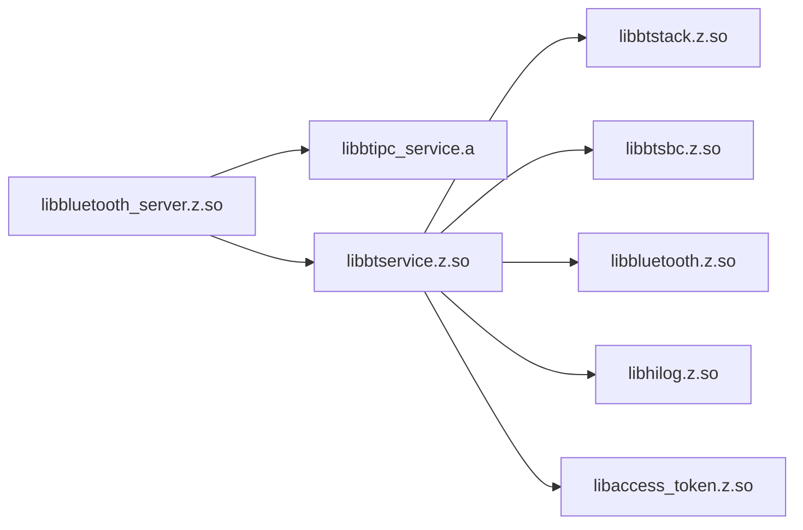
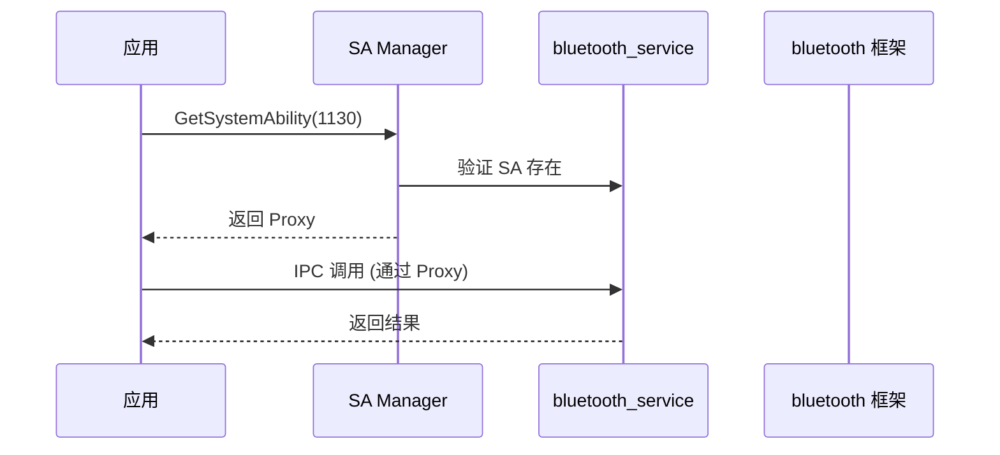

# 编译产物

## 文档信息

- **目的**: 介绍编译产物、安装路径和运行时加载关系
- **适用范围**: 开发者了解输出文件、构建工程师配置安装
- **关键结论**:
  1. 主要产物: libbluetooth_server.z.so
  2. SA ID: 1130
  3. 依赖 bluetooth 框架的 N-API 层
- **相关文档**: [00_Overview](00_Overview.md), [04_GN_Targets](04_GN_Targets.md)

---

## 编译产物清单

### 主要共享库

| 库名称 | Target | 文件名 | 安装路径 | 说明 |
|---------|---------|----------|----------|------|
| **bluetooth_server** | bluetooth_server | `libbluetooth_server.z.so` | `/system/lib64/` | SA 主入口 |
| **btservice** | btservice | `libbtservice.z.so` (推断) | `/system/lib64/` | 业务服务层 |
| **btstack** | btstack | `libbtstack.z.so` (推断) | `/system/lib64/` | 蓝牙协议栈 |
| **btsbc** | btsbc | `libbtsbc.z.so` | `/system/lib64/` | SBC 音频编解码 |

**证据**:
- `sa_profile/1130.json:6` - SA 库路径
- `services/bluetooth/server/BUILD.gn:21` - ohos_shared_library
- `services/bluetooth/service/BUILD.gn:210` - ohos_shared_library

### 静态库

| 库名称 | Target | 文件名 | 说明 |
|---------|---------|----------|------|
| **btipc_service** | btipc_service | `libbtipc_service.a` | IPC Skeleton/Proxy（静态链接） |

**证据**: `services/bluetooth/ipc/BUILD.gn:24`

### 其他产物

| 产物 | Target | 路径 | 说明 |
|------|---------|------|------|
| **SA Profile** | communication_bluetooth_service_sa_profile | `/system/profile/1130.json` | System Ability 配置 |
| **启动配置** | etc | `/system/etc/init/bluetooth_service.cfg` | 进程启动配置 |

**证据**:
- `sa_profile/BUILD.gn:16` - ohos_sa_profile
- `services/bluetooth/server/BUILD.gn:102` - etc 依赖

---

## 运行时加载关系

### 启动流程



### 依赖加载



---

## 安装路径

### 标准路径 (推断)

| 产物类型 | 路径 |
|---------|------|
| 共享库 (.so) | `/system/lib64/` 或 `/usr/lib64/` |
| 静态库 (.a) | 编译时链接，不安装 |
| SA Profile | `/system/profile/` |
| 启动配置 | `/system/etc/init/` |
| 配置文件 | `/system/etc/bluetooth/` (推断) |

### LiteOS 路径 (可能)

| 产物类型 | 路径 |
|---------|------|
| 共享库 | `/usr/lib/` |
| 配置文件 | `/etc/bluetooth/` |

---

## 运行时行为

### 进程信息

**进程名**: `bluetooth_service`

**证据**: `sa_profile/1130.json:2`

### SA 信息

| 属性 | 值 |
|------|------|
| **SA ID** | 1130 |
| **进程** | bluetooth_service |
| **库文件** | libbluetooth_server.z.so |
| **启动方式** | run-on-create (自动启动) |
| **分布式** | false (本地服务) |
| **Dump 级别** | 1 |
| **最小 HDI 版本** | libbluetooth_hci_proxy_1.0.z.so |

**证据**: `sa_profile/1130.json:4-11`

### 加载顺序

1. **Init 进程** 读取 SA Profile
2. **启动进程** `bluetooth_service`
3. **加载库** `libbluetooth_server.z.so`
4. **调用 OnStart** 初始化服务
5. **发布 SA** 到 SAMGR
6. **等待客户端** 连接

---

## 动态依赖

### 系统库依赖

| 库 | 来源 | 说明 |
|------|------|------|
| `libhilog.z.so` | hilog 组件 | 日志系统 |
| `libhisysevent.z.so` | hisysevent 组件 | 系统事件 |
| `libipc_core.z.so` | ipc 组件 | IPC 通信 |
| `libsamgr.z.so` | samgr 组件 | SA 管理 |
| `libsystem_ability_fwk.z.so` | safwk 组件 | SA 框架 |
| `libhitrace_meter.z.so` | hitrace 组件 | 性能追踪 |
| `libaccesstoken_sdk.z.so` | access_token 组件 | 权限令牌 |
| `libbtframework.z.so` | bluetooth 框架 | 蓝牙框架接口 |
| `libeventhandler.z.so` | eventhandler 组件 | 事件处理 |
| `libcrypto_shared.z.so` | openssl 组件 | 加密库 |
| `libjsoncpp.so` | jsoncpp 组件 | JSON 解析 |
| `libxml2.so` | libxml2 组件 | XML 解析 |

**证据**: `bundle.json:60-93`, `services/bluetooth/server/BUILD.gn:106-119`

---

## 内存占用

### 编译时配置

| 资源类型 | 大小 | 证据 |
|---------|------|------|
| **ROM** | 4.5MB | `bundle.json:55` |
| **RAM** | 7.5MB | `bundle.json:56` |

### 运行时内存分布 (推算)

| 组件 | 推算内存 |
|------|----------|
| Server 层 | ~1MB |
| Service 层 | ~2MB |
| Stack 层 | ~2MB |
| Protocol 缓存 | ~1MB |
| 连接数据 | ~1.5MB |
| **总计** | ~7.5MB |

---

## Feature Flags 影响

### 编译产物变化

| Feature Flag | 启用时添加 | 禁用时 |
|-------------|------------|--------|
| `bluetooth_service_a2dp_source_feature` | A2DP Source Server, A2DP 协议实现 | 不编译相关代码 |
| `bluetooth_service_hfp_ag_feature` | HFP AG Server, HFP 协议实现 | 不编译相关代码 |
| `bluetooth_service_pan_feature` | PAN Server, PAN 协议实现 | 不编译相关代码 |

### 库大小变化

**推算**:
- **全部启用**: ~7.5MB RAM (估计)
- **最小配置**: ~3MB RAM (估计)

---

## 验证方法

### 查看已安装产物

```bash
# 查看共享库
ls -l /system/lib64/libbluetooth*.*

# 查看 SA Profile
cat /system/profile/1130.json

# 查看进程
ps -A | grep bluetooth_service

# 查看 SA 状态
bm dump -a 1130
```

### Dump 信息

**Dump 级别**: 1 (基础 dump)

**支持的 Dump 命令**:

- `dump bluetooth_service` - 完整 dump
- `dump bluetooth_service -a` - Adapter 信息
- `dump bluetooth_service -p {profile}` - Profile 特定信息

**证据**: `services/bluetooth/server/src/bluetooth_host_dumper.cpp`

---

## 与客户端交互

### 客户端连接流程



### IPC 通信

**机制**: OpenHarmony Binder/IPC

**接口**:
- Proxy 客户端: 在 `bluetooth 框架` 中
- Stub 服务端: 在 `bluetooth_service` 中

---

## 总结

编译产物特点：

1. **SA 为主**: libbluetooth_server.z.so 是核心
2. **SA ID**: 1130
3. **进程名**: bluetooth_service
4. **自动启动**: run-on-create
5. **依赖库**: 大量系统组件依赖

**安装路径**:
- 共享库: `/system/lib64/`
- SA 配置: `/system/profile/`

**相关文档**:
- GN Targets: [04_GN_Targets](04_GN_Targets.md)
- 目录结构: [01_Directory_Structure](01_Directory_Structure.md)
- 架构说明: [02_Architecture](02_Architecture.md)
