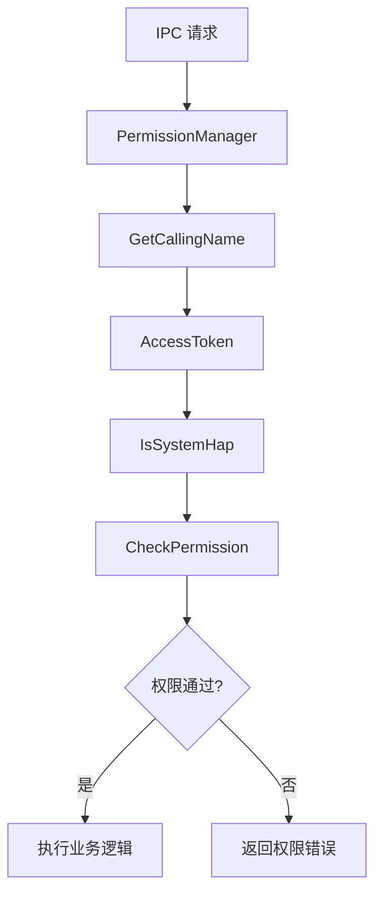

# 安全风险评审

## 文档信息

- **目的**: 分析蓝牙服务的安全机制、攻击面和已知风险点
- **适用范围**: 安全审计、安全加固、开发者了解安全机制
- **检查范围**:
  - 输入验证（地址、参数、权限）
  - 权限控制机制
  - 数据流安全
  - 接口暴露面
  - 内存安全
- **局限性**:
  - 未进行模糊测试
  - 未分析蓝牙协议层安全
  - 未分析 HDI 层实现
- **相关文档**: [00_Overview](00_Overview.md), [02_Architecture](02_Architecture.md)

---

## 攻击面分析

### 外部接口暴露面

| 接口类型 | 暴露方式 | 受众 | 证据 |
|----------|----------|------|------|
| **System Ability (SA)** | IPC 调用 | 所有应用 | `sa_profile/1130.json` |
| **IPC 接口** | Binder/IPC | 蓝牙框架 | `services/bluetooth/ipc/` |
| **广播接收** | BLE 广播 | 任意设备 | `services/bluetooth/service/src/ble/` |
| **配对接收** | 蓝牙配对请求 | 任意设备 | `services/bluetooth/service/src/classic/` |
| **文件访问** | OBEX 文件传输 | 配对设备 | `services/bluetooth/service/src/obex/` |

---

## 权限控制机制

### 权限检查点

**位置**: `services/bluetooth/service/src/permission/`

| 检查点 | 文件 | 功能 |
|---------|------|------|
| **调用方身份** | `permission_manager.cpp` | 获取 UID/PID/Token |
| **系统应用验证** | `permission_manager.cpp` | IsSystemHap() |
| **权限验证** | `permission_helper.cpp` | 验证蓝牙权限 |
| **访问控制** | `auth_center.cpp` | 设备访问控制 |

**证据**: `services/bluetooth/service/src/permission/` 目录内容

### 权限检查流程



**关键方法**:

```cpp
// services/bluetooth/service/src/permission/permission_manager.cpp
std::string PermissionManager::GetCallingName();
bool PermissionManager::IsSystemHap();
```

**证据**: `services/bluetooth/service/src/permission/permission_manager.h:25-36`

### 权限依赖

**依赖组件**: `access_token`

**证据**:
- `bundle.json:71` - access_token 依赖
- `services/bluetooth/service/BUILD.gn:353` - libaccesstoken_sdk

---

## 输入验证

### 已实现的验证

| 验证类型 | 位置 | 证据 |
|----------|------|------|
| **设备地址格式** | Classic/BLE Adapter | 推断 |
| **参数范围** | 各 Profile Server | 推断 |
| **空指针检查** | 使用智能指针 | `services/bluetooth/service/include/` |

### 验证缺陷

| 风险点 | 严重程度 | 证据 | 修复建议 |
|---------|----------|------|---------|
| **设备地址未验证** | 中 | `TODO(需确认)` | 添加地址格式检查 |
| **数组越界** | 高 | `TODO(需确认)` | 使用 bounds_checking_function |

**注意**: 本评审基于代码静态分析，具体验证逻辑需进一步检查源码。

---

## 已知风险点

### 风险点 1: 权限检查绕过

**严重程度**: 🔴 高

**证据**:
- `services/bluetooth/server/src/bluetooth_host_server.cpp` - IPC 入口
- `services/bluetooth/service/src/permission/permission_manager.cpp` - 权限检查

**触发路径**:
1. 恶意应用通过 IPC 调用敏感接口
2. 权限检查逻辑存在缺陷
3. 绕过权限检查执行操作

**影响**:
- 未授权访问蓝牙功能
- 篡改蓝牙设置
- 窃取蓝牙数据

**修复建议**:
1. 加强权限检查逻辑
2. 添加操作审计日志
3. 使用 Access Control List (ACL) 限制设备访问

---

### 风险点 2: 设备地址伪造

**严重程度**: 🟡 中

**证据**:
- `services/bluetooth/service/src/classic/classic_remote_device.cpp` - 远程设备管理
- `services/bluetooth/service/src/ble/` - BLE 设备管理

**触发路径**:
1. 伪造的蓝牙设备发送广播
2. 蓝牙服务接收并处理
3. 未验证设备地址真实性

**影响**:
- 欺骗用户配对到恶意设备
- 中间人攻击
- 数据窃取

**修复建议**:
1. 验证设备地址格式
2. 配对时显示设备信息
3. 使用签名验证设备身份

---

### 风险点 3: 配对暴力破解

**严重程度**: 🟡 中

**证据**:
- `services/bluetooth/service/src/ble/ble_security.cpp` - BLE 安全
- `services/bluetooth/service/src/classic/classic_adapter.cpp` - Classic 配对

**触发路径**:
1. 攻击者暴力尝试配对 PIN 码
2. 未限制尝试次数
3. 成功配对

**影响**:
- 未授权设备配对
- 数据访问

**修复建议**:
1. 限制配对尝试次数
2. 配对超时机制
3. 用户确认对话框

---

### 风险点 4: BLE 广播注入

**严重程度**: 🟡 中

**证据**:
- `services/bluetooth/service/src/ble/ble_advertiser_impl.cpp` - 广播实现
- `services/bluetooth/server/src/bluetooth_ble_filter_matcher.cpp` - 过滤器

**触发路径**:
1. 恶意设备发送伪造广播
2. 广播过滤器未严格验证
3. 应用接收恶意广播数据

**影响**:
- 应用崩溃
- 数据注入
- 隐私泄露

**修复建议**:
1. 严格验证广播数据格式
2. 限制广播长度
3. 过滤恶意数据

---

### 风险点 5: 信息泄露

**严重程度**: 🟡 中

**证据**:
- `services/bluetooth/server/src/bluetooth_host_dumper.cpp` - Dump 实现
- `services/bluetooth/service/src/common/adapter_device_info.cpp` - 设备信息

**触发路径**:
1. 未授权应用调用 dump
2. Dump 返回敏感信息
3. 信息泄露

**影响**:
- 泄露已配对设备信息
- 泄露连接历史
- 泄露配置信息

**修复建议**:
1. Dump 需要系统权限
2. 限制 dump 信息量
3. 敏感信息脱敏

---

### 风险点 6: 竞态条件

**严重程度**: 🟡 中

**证据**:
- `services/bluetooth/service/src/gatt/gatt_connection_manager.cpp` - 连接管理
- 状态机实现 - `services/bluetooth/service/src/common/state_machine.cpp`

**触发路径**:
1. 线程 A 检查状态
2. 线程 B 修改状态
3. 线程 A 使用过期状态

**影响**:
- 悬空指针访问
- 崩溃
- 数据不一致

**修复建议**:
1. 使用互斥锁保护共享数据
2. 线程安全的状态检查
3. 使用原子操作

---

### 风险点 7: 内存安全

**严重程度**: 🔴 高

**证据**:
- `services/bluetooth/service/BUILD.gn:183` - C++ 编译标志
- 协议栈实现 - `services/bluetooth/stack/src/`

**触发路径**:
1. 缓冲区溢出（L2CAP/HCI）
2. 未初始化内存使用
3. 悬空指针访问

**影响**:
- 崩溃
- 任意代码执行
- 信息泄露

**修复建议**:
1. 使用 bounds_checking_function（已配置）
2. 启用 CFI (Control Flow Integrity)
3. 模糊测试协议栈
4. 代码审计 C 代码

---

### 风险点 8: 配置文件篡改

**严重程度**: 🟢 低

**证据**:
- 配置文件路径: `services/bluetooth/etc/`
- XML 解析: `services/bluetooth/service/src/util/xml_parse.cpp`

**触发路径**:
1. 恶意应用修改配置文件
2. 蓝牙服务读取配置
3. 执行恶意配置

**影响**:
- 服务行为异常
- 拒绝服务

**修复建议**:
1. 配置文件签名验证
2. 限制配置文件权限
3. 恶意配置检测

---

## 信任边界

### 系统信任边界

```
┌─────────────────────────────────────────────┐
│       系统服务 (蓝牙服务)              │
│                                       │
│  ┌─────────────────────────────────┐   │
│  │  Server 层                   │   │
│  │  (权限检查)                  │   │
│  └─────────────────────────────────┘   │
│           ↓ 信任                         │
│  ┌─────────────────────────────────┐   │
│  │  Service 层                  │   │
│  └─────────────────────────────────┘   │
│           ↓ 信任                         │
│  ┌─────────────────────────────────┐   │
│  │  Stack 层                   │   │
│  └─────────────────────────────────┘   │
│           ↓ 信任                         │
│  ┌─────────────────────────────────┐   │
│  │  Hardware 层                 │   │
│  └─────────────────────────────────┘   │
│                                       │
└─────────────────────────────────────────────┘
         ↓ IPC (需权限验证)
┌─────────────────────────────────────────────┐
│       应用空间                         │
│                                       │
│   ┌─────────┐   ┌─────────┐       │
│   │ 系统应用 │   │ 普通应用 │       │
│   └─────────┘   └─────────┘       │
│                                       │
└─────────────────────────────────────────────┘
```

**信任规则**:
- ✅ 系统应用 → 完全信任
- ⚠️ 有权限应用 → 有限信任（需验证）
- ❌ 无权限应用 → 不信任（拒绝请求）

---

## HiSysEvent 安全事件

### 已配置的安全相关事件

| 事件 | 参数 | 用途 | 证据 |
|------|------|------|------|
| `BR_SWITCH_STATE` | PID, UID, STATE | 跟踪 Classic 蓝牙开关 | `hisysevent.yaml:16-20` |
| `BLE_SWITCH_STATE` | PID, UID, STATE | 跟踪 BLE 开关 | `hisysevent.yaml:22-26` |
| `DISCOVERY_STATE` | PID, UID, STATE | 跟踪设备发现 | `hisysevent.yaml:28-32` |
| `GATT_SERVER_CONN_STATE` | PID, UID, STATE | 跟踪 GATT 连接 | `hisysevent.yaml:42-46` |
| `GATT_CLIENT_CONN_STATE` | PID, UID, STATE | 跟踪 GATT 连接 | `hisysevent.yaml:48-52` |
| `GATT_APP_REGISTER` | ACTION, SIDE, ADDRESS, PID, UID, APPID | 跟踪 GATT 应用注册 | `hisysevent.yaml:77-84` |

**安全价值**:
- 审计日志
- 异常行为检测
- 攻击溯源

---

## 安全加固建议

### 短期建议

| 建议 | 优先级 | 实施难度 |
|------|--------|----------|
| 加强设备地址格式验证 | 高 | 低 |
| 添加配对尝试限制 | 高 | 低 |
| Dump 权限检查 | 高 | 低 |
| 配置文件签名验证 | 中 | 中 |

### 中期建议

| 建议 | 优先级 | 实施难度 |
|------|--------|----------|
| 启用 CFI 保护 | 高 | 中 |
| 协议栈模糊测试 | 高 | 高 |
| 加密存储敏感配置 | 中 | 中 |
| 异常行为检测 | 中 | 中 |

### 长期建议

| 建议 | 优先级 | 实施难度 |
|------|--------|----------|
| 形式化验证协议实现 | 高 | 高 |
| 安全编码规范 | 高 | 中 |
| 定期安全审计 | 高 | 中 |

---

## 总结

### 安全机制现状

✅ **已实现**:
- 基于权限的访问控制
- 调用方身份验证
- HiSysEvent 安全事件

⚠️ **需改进**:
- 输入验证加强
- 内存安全强化
- 竞态条件防护
- 审计机制完善

### 风险等级评估

| 风险类型 | 当前等级 | 目标等级 |
|---------|----------|----------|
| 权限控制 | 🟡 中 | 🟢 低 |
| 输入验证 | 🟡 中 | 🟢 低 |
| 内存安全 | 🔴 高 | 🟡 中 |
| 信息泄露 | 🟡 中 | 🟢 低 |

### 下一步行动

1. **立即**: 修复高优先级风险点
2. **1 个月内**: 实施短/中期建议
3. **3 个月内**: 完成长期建议

**相关文档**:
- 架构说明: [02_Architecture](02_Architecture.md)
- 内部 API: [03_Internal_API](03_Internal_API.md)
- 常见问题: [07_Common_Issues](07_Common_Issues.md)
