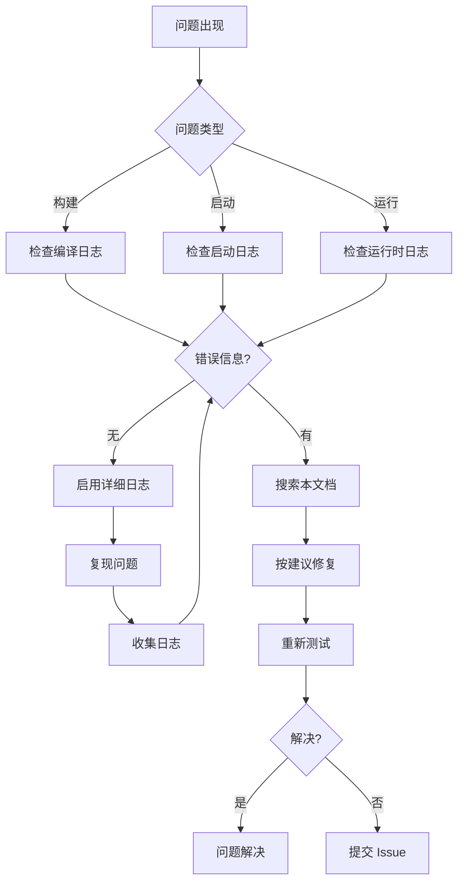

# 常见问题

## 文档信息

- **目的**: 收集和解决构建、运行时、调试中的常见问题
- **适用范围**: 开发者排查问题、测试工程师定位错误
- **关键结论**:
  1. 大部分问题可通过日志定位
  2. Feature flags 配置错误常见
  3. 权限问题是运行时常见错误
- **相关文档**: [00_Overview](00_Overview.md), [04_GN_Targets](04_GN_Targets.md), [06_Security_Review](06_Security_Review.md)

---

## 构建问题

### 编译错误

#### 问题 1: Feature Flag 未定义

**症状**:
```
error: use of undeclared identifier 'BLUETOOTH_A2DP_SRC_FEATURE'
```

**原因**: Feature flags 未启用

**解决方案**:
1. 检查 `bluetooth.gni` 配置
2. 确认需要的 Feature flags 设置为 `true`
3. 重新配置和编译

```gn
# bluetooth.gni
bluetooth_service_a2dp_source_feature = true
```

**证据**: `bluetooth.gni:14-32`

---

#### 问题 2: 缺少依赖

**症状**:
```
error: 'access_token/AccessToken.h' file not found
```

**原因**: 外部依赖未安装或路径错误

**解决方案**:
1. 检查 `bundle.json` 中依赖是否完整
2. 确认依赖组件已编译
3. 检查 `external_deps` 路径正确

**证据**: `services/bluetooth/server/BUILD.gn:106-119`

---

### 链接错误

#### 问题 3: 未定义引用

**症状**:
```
undefined reference to 'BluetoothHostServer::OnStart()'
```

**原因**: 源文件未添加到 BUILD.gn

**解决方案**:
1. 检查 `sources` 列表
2. 确认所有 .cpp 文件已包含
3. 重新编译

**证据**: `services/bluetooth/server/BUILD.gn:37-48`

---

#### 问题 4: 循环依赖

**症状**:
```
error: cyclic dependency detected
```

**原因**: Target 之间存在循环依赖

**解决方案**:
1. 检查 `deps` 列表
2. 确认依赖方向正确（上层依赖下层）
3. 使用公共头文件解耦

**依赖方向**:
```
server → service → stack → hardware
```

---

## 运行时问题

### 服务启动失败

#### 问题 5: SA 启动失败

**症状**:
```
bm dump -a 1130
Service not found
```

**原因**: SA Profile 未正确安装或库加载失败

**定位步骤**:

1. **检查 SA 配置**:
```bash
cat /system/profile/1130.json
```

2. **检查库文件存在**:
```bash
ls -l /system/lib64/libbluetooth_server.z.so
```

3. **检查进程状态**:
```bash
ps -A | grep bluetooth_service
```

4. **查看启动日志**:
```bash
hilog -T bluetooth_service | grep -i error
```

**解决方案**:
1. 确认 SA Profile 安装正确
2. 检查库文件路径和权限
3. 验证依赖库完整

**证据**: `sa_profile/1130.json`

---

#### 问题 6: OnStart 返回错误

**症状**:
```
BluetoothHostServer::OnStart failed: -1
```

**原因**: 初始化失败

**定位步骤**:

1. **查看详细日志**:
```bash
hilog -T bluetooth_service -v
```

2. **检查 AdapterManager 初始化**:
```
查找: "AdapterManager::Start failed"
```

3. **检查硬件初始化**:
```
查找: "HDI Initialize failed"
```

**常见原因**:
- HDI 层不可用
- 硬件未就绪
- 配置文件错误

**证据**: `services/bluetooth/server/src/bluetooth_host_server.cpp`

---

### Profile 连接失败

#### 问题 7: A2DP 连接失败

**症状**:
```
A2DP connect failed: -1
```

**原因**: A2DP Profile 配置问题或硬件不支持

**定位步骤**:

1. **检查 Feature flag**:
```bash
# 查看编译时配置
grep BLUETOOTH_A2DP_SRC_FEATURE build.log
```

2. **查看 A2DP 日志**:
```bash
hilog -T bluetooth_service | grep -i a2dp
```

3. **检查 SDP 记录**:
```
查找: "AVDTP SDP not found"
```

**解决方案**:
1. 确认 A2DP Feature flag 启用
2. 检查设备支持 A2DP
3. 验证 SDP 服务发现

**证据**:
- `services/bluetooth/service/src/gavdp/a2dp_profile.cpp`
- `bluetooth.gni:16`

---

#### 问题 8: GATT 连接超时

**症状**:
```
GATT connect timeout
```

**原因**: 连接参数错误或设备不可达

**定位步骤**:

1. **查看 GATT 日志**:
```bash
hilog -T bluetooth_service | grep -i gatt
```

2. **检查连接参数**:
```
查找: "Connect with MTU:"
```

3. **检查 L2CAP 连接**:
```
查找: "L2CAP connect failed"
```

**解决方案**:
1. 调整连接超时时间
2. 检查设备广播状态
3. 验证 MTU 大小

**证据**: `services/bluetooth/service/src/gatt/gatt_connection_manager.cpp`

---

### 权限错误

#### 问题 9: Permission Denied

**症状**:
```
ERROR: Check permission failed
```

**原因**: 应用无蓝牙权限

**定位步骤**:

1. **查看权限日志**:
```bash
hilog -T bluetooth_service | grep -i permission
```

2. **检查调用方信息**:
```
查找: "GetCallingName: {package_name}"
```

3. **验证应用权限**:
```bash
# 检查应用 manifest
cat /data/app/{package}/manifest.json | grep permission
```

**解决方案**:
1. 确认应用有蓝牙权限
2. 使用系统应用测试
3. 检查 access_token 配置

**证据**:
- `services/bluetooth/service/src/permission/permission_helper.cpp`
- [06_Security_Review.md](06_Security_Review.md#权限控制机制)

---

## 调试技巧

### 日志开关

#### 启用详细日志

```bash
# 启用蓝牙服务详细日志
hdc shell hilog -b D -T bluetooth_service
```

#### 过滤日志

```bash
# 只看错误
hilog -T bluetooth_service -t ERROR

# 只看 GATT 相关
hilog -T bluetooth_service | grep -i gatt
```

**证据**: `services/bluetooth/common/bluetooth_log.h`

---

### Dump 信息

#### 查看完整 dump

```bash
bm dump -a bluetooth_service
```

#### 查看特定模块

```bash
# Adapter 信息
bm dump -a bluetooth_service -adapter

# A2DP 信息
bm dump -a bluetooth_service -a2dp

# GATT 信息
bm dump -a bluetooth_service -gatt
```

**证据**: `services/bluetooth/server/src/bluetooth_host_dumper.cpp`

---

### 性能追踪

#### 启用 Hitrace

```bash
# 开始追踪
hitrace start bluetooth_service

# 执行操作...

# 停止并查看
hitrace stop --output bluetooth_service_trace
```

**证据**:
- `services/bluetooth/server/src/bluetooth_hitrace.cpp`
- `bundle.json:68` - hitrace 依赖

---

### HiSysEvent 查询

#### 查看蓝牙相关事件

```bash
# 查看所有蓝牙服务事件
hilog -T BT_SERVICE

# 查看开关状态
hilog -T BT_SERVICE | grep STATE

# 查看连接状态
hilog -T BT_SERVICE | grep CONNECTED
```

**证据**: `hisysevent.yaml`

---

## 性能问题

### 问题 10: 扫描耗电快

**症状**: BLE 扫描导致电池快速消耗

**原因**: 扫描参数不优化

**解决方案**:

1. **使用占空比扫描**:
```cpp
// 设置扫描窗口和间隔
BleScanSettings settings;
settings.interval = 5000;  // 5秒
settings.window = 100;     // 100ms
// 占空比 = 100/5000 = 2%
```

2. **关闭不必要的扫描**

3. **使用 batch 扫描**

**证据**: `hisysevent.yaml:65-69` - BLE_SCAN_DUTY_CYCLE

---

### 问题 11: 连接延迟高

**症状**: 蓝牙连接建立时间长

**原因**: 连接参数配置不当

**解决方案**:

1. **优化连接间隔**:
```cpp
// 调整连接参数
Gap::SetConnectionParameters(interval, latency, timeout);
```

2. **使用白名单连接**
3. **减少发现时间**

---

## 兼容性问题

### 问题 12: 特定设备无法连接

**症状**: 某些设备连接失败，其他设备正常

**原因**: 设备协议不兼容

**定位步骤**:

1. **查看 HCI 日志**:
```bash
hilog -T bluetooth_service | grep -i hci
```

2. **检查 L2CAP 参数**:
```
查找: "L2CAP configuration failed"
```

3. **检查 SDP 记录**:
```
查找: "SDP attribute not found"
```

**解决方案**:
1. 收集设备信息（型号、协议版本）
2. 调整兼容性参数
3. 更新协议栈（如可用）

---

## 问题排查流程

### 通用排查步骤



---

## 问题收集

### 提交新问题

如遇到未记录的问题，请提供以下信息：

1. **环境信息**:
   - OpenHarmony 版本
   - 设备型号
   - 蓝牙服务版本

2. **问题描述**:
   - 症状
   - 复现步骤
   - 预期行为 vs 实际行为

3. **日志信息**:
   - 相关 hilog 输出
   - Dump 信息
   - HiSysEvent 记录

4. **尝试过的解决方案**:
   - 已尝试的修复
   - 结果

---

## 总结

**常见问题分类**:
- 构建问题: Feature flags 配置、依赖缺失
- 运行时问题: SA 启动失败、连接失败
- 权限问题: 权限检查失败
- 性能问题: 扫描耗电、连接延迟
- 兼容性问题: 特定设备问题

**关键调试工具**:
- `hilog` - 日志查看
- `bm dump` - 服务 dump
- `hitrace` - 性能追踪
- HiSysEvent - 事件查询

**相关文档**:
- 构建系统: [04_GN_Targets](04_GN_Targets.md)
- 架构说明: [02_Architecture](02_Architecture.md)
- 安全评审: [06_Security_Review](06_Security_Review.md)
