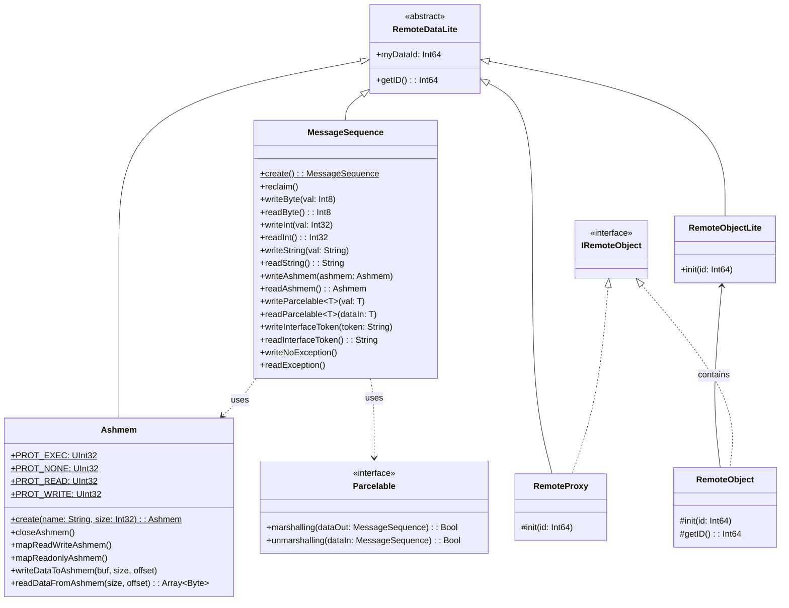
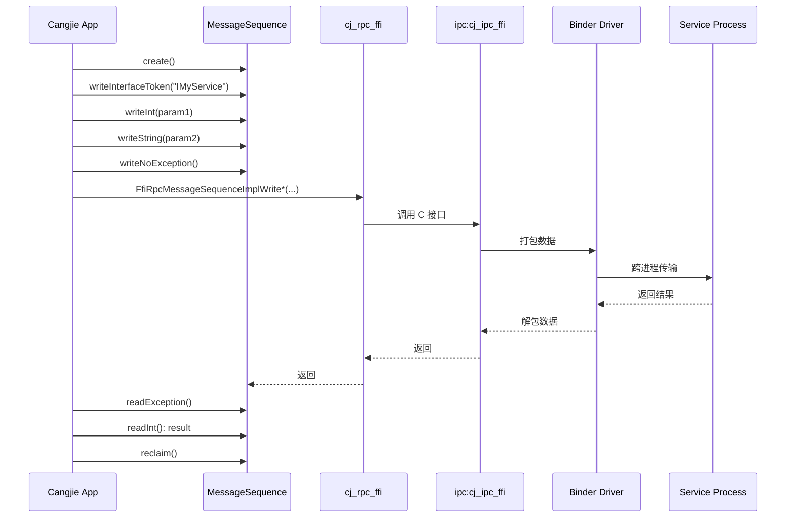
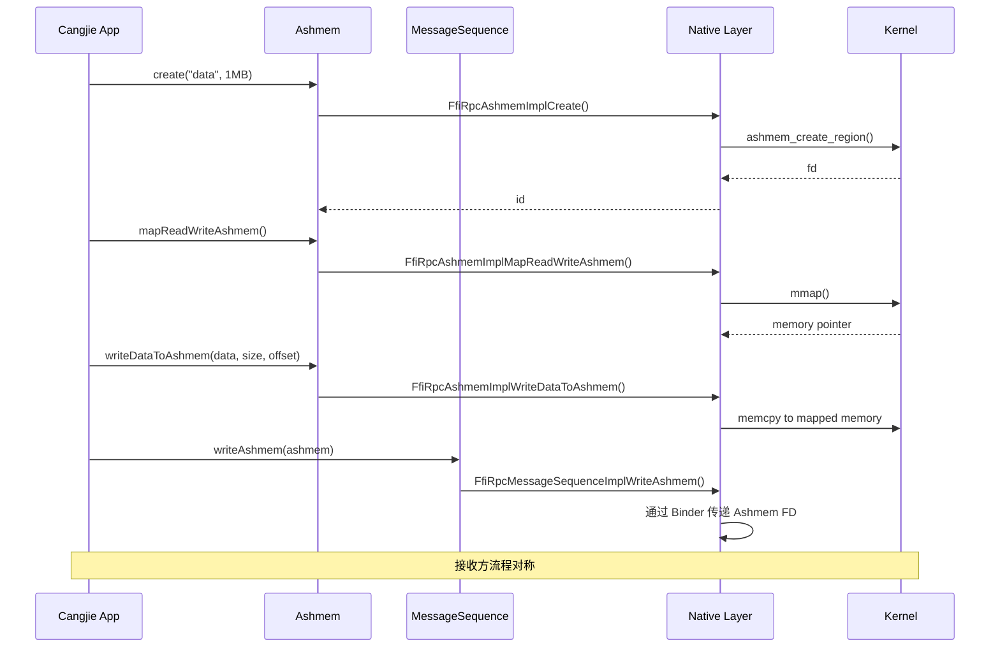

# 架构说明

## 目的

本文档描述 `communication_cangjie_wrapper` 的系统架构、组件关系、数据流和关键时序。

## 适用范围

- 架构师
- 核心开发者
- 代码审查人员

## 系统架构图

### 分层架构

```
┌─────────────────────────────────────────────────────────────────────────┐
│                         Application Layer                                │
│                    Cangjie 应用代码（业务层）                             │
└─────────────────────────────────┬───────────────────────────────────────┘
                                  │
┌─────────────────────────────────▼───────────────────────────────────────┐
│                        Interface Layer (API)                           │
│  ┌─────────────────────────────────────────────────────────────────┐  │
│  │  kit.IPCKit (kit/IPCKit/index.cj)                               │  │
│  │  - 统一导出 ohos.rpc.*                                          │  │
│  │  - 开发者入口                                                   │  │
│  └─────────────────────────────────────────────────────────────────┘  │
│  ┌─────────────────────────────────────────────────────────────────┐  │
│  │  ohos.rpc (ohos/rpc/*.cj)                                       │  │
│  │  - MessageSequence: RPC 数据序列化                              │  │
│  │  - Ashmem: 匿名共享内存                                         │  │
│  │  - Parcelable: 可序列化接口                                     │  │
│  │  - RemoteObject/Proxy: 远程对象                                 │  │
│  └─────────────────────────────────────────────────────────────────┘  │
└─────────────────────────────────┬───────────────────────────────────────┘
                                  │ FFI 调用
┌─────────────────────────────────▼───────────────────────────────────────┐
│                     Framework Layer (FFI Bridge)                       │
│                    ohos/rpc/cj_rpc_ffi.cj                              │
│  - 声明所有外部 C 函数接口                                              │
│  - 类型映射：Cangjie ↔ C                                               │
└─────────────────────────────────┬───────────────────────────────────────┘
                                  │
┌─────────────────────────────────▼───────────────────────────────────────┐
│                     Native Layer (C/C++)                               │
│                    ipc:cj_ipc_ffi (外部组件)                            │
│  - IPC/RPC 核心实现                                                     │
│  - Binder / SoftBus 驱动封装                                            │
└─────────────────────────────────┬───────────────────────────────────────┘
                                  │
┌─────────────────────────────────▼───────────────────────────────────────┐
│                        Kernel Layer                                      │
│  ┌─────────────────┐  ┌─────────────────┐                              │
│  │  Binder Driver  │  │ SoftBus Driver  │                              │
│  │  (设备内 IPC)    │  │ (跨设备 RPC)    │                              │
│  └─────────────────┘  └─────────────────┘                              │
└─────────────────────────────────────────────────────────────────────────┘
```

## 组件关系图

### 核心类关系



## 数据流图

### IPC 调用流程



### Ashmem 大数据传输流程



## 关键时序

### MessageSequence 生命周期

```
┌─────────────┐     ┌─────────────┐     ┌─────────────┐     ┌─────────────┐
│   create    │ --> │   write*    │ --> │   read*     │ --> │   reclaim   │
└─────────────┘     └─────────────┘     └─────────────┘     └─────────────┘
      │                   │                   │                   │
      ▼                   ▼                   ▼                   ▼
FfiRpcMessageSequence   writeByte()        readByte()      releaseFFIData()
ImplCreate()            writeInt()         readInt()       (internal)
                        writeString()      readString()
                        ...                ...
```

### 异常处理时序

```
服务端:
  1. 处理请求
  2. writeNoException()  <-- 标记无异常
  3. write*(result)       <-- 写入结果

客户端:
  1. readException()      <-- 检查异常（有异常则抛出）
  2. read*(result)        <-- 读取结果
```

## 模块依赖关系

### 内部模块依赖

```
kit.IPCKit
    └── ohos.rpc (cj_deps)

ohos.rpc 内部文件依赖:
    message_sequence.cj ──> cj_rpc_ffi.cj
                         ──> cj_rpc_utils.cj
                         ──> request_result.cj
    
    ashmem.cj ────────────> cj_rpc_ffi.cj
                         ──> cj_rpc_utils.cj
    
    remote_object.cj ─────> cj_rpc_ffi.cj
    remote_proxy.cj ──────> cj_rpc_ffi.cj
    iremote_object.cj ────> remote_object.cj
                         ──> remote_proxy.cj
    
    parcelable.cj ────────> (无内部依赖，纯接口)
    
    cj_rpc_utils.cj ──────> (基础定义，被多处依赖)
    
    request_result.cj ────> (基础类型定义)
```

### 外部依赖

```
ohos.rpc 目标:
    cj_external_deps:
        - cangjie_ark_interop:ohos.ffi          ← FFI 基础
        - cangjie_ark_interop:ohos.labels       ← APILevel 注解
        - cangjie_ark_interop:ohos.business_exception  ← 异常
        - hiviewdfx_cangjie_wrapper:ohos.hilog  ← 日志
    
    external_deps:
        - ipc:cj_ipc_ffi                        ← 底层 IPC 实现
```

## 线程模型

### 当前实现特点

基于代码分析，本组件为**同步调用模型**:

1. **调用方式**: 所有 API 均为同步调用
2. **线程安全**: 依赖底层 `ipc:cj_ipc_ffi` 保证
3. **回调机制**: 当前版本不支持 OneWay（异步）调用

### 调用路径线程分析

```
┌──────────────────────────────────────────────────────────────┐
│  Cangjie 调用线程                                             │
│  ┌──────────────────────────────────────────────────────┐   │
│  │  MessageSequence.write*()                            │   │
│  │  -> FFI 调用 (C 接口)                                 │   │
│  │  -> 阻塞等待 Native 层返回                            │   │
│  │  <- 返回结果                                         │   │
│  └──────────────────────────────────────────────────────┘   │
└──────────────────────────────────────────────────────────────┘
                              │
                              ▼
┌──────────────────────────────────────────────────────────────┐
│  Native 层 (ipc:cj_ipc_ffi)                                  │
│  - Binder 调用可能涉及内核线程切换                            │
│  - 最终在同一线程返回结果                                     │
└──────────────────────────────────────────────────────────────┘
```

## 关键设计决策

### 1. FFI 桥接设计

**决策**: 所有底层调用通过 `cj_rpc_ffi.cj` 集中声明

**理由**:
- 统一维护外部接口
- 类型映射集中管理
- 便于 Mock 替换

### 2. RemoteDataLite 基类

**决策**: 使用 `RemoteDataLite` 封装 FFI 对象 ID

**理由**:
- 统一资源生命周期管理
- 自动释放（通过 `~init()` 析构）
- 类型安全

### 3. 错误处理策略

**决策**: 使用 `BusinessException` 统一抛出

**理由**:
- 与 OpenHarmony 异常体系一致
- 错误码标准化（190xxxx 系列）
- 支持错误信息映射

## 架构限制

### 已知限制
1. **无异步支持**: 不支持 OneWay 调用
2. **无远程对象传递**: 不能传递 RemoteObject 作为参数
3. **平台限制**: Windows/Mac 仅为 Mock 实现

### 扩展点
1. **Parcelable**: 可自定义序列化对象
2. **Future**: 预留了 Promise/Callback 扩展可能（当前未实现）

## 参考文档

- [目录结构](02_Directory_Structure.md) - 代码文件组织
- [内部 API](04_Internal_API.md) - 模块详细接口
- [GN Targets](05_GN_Targets.md) - 构建目标说明
