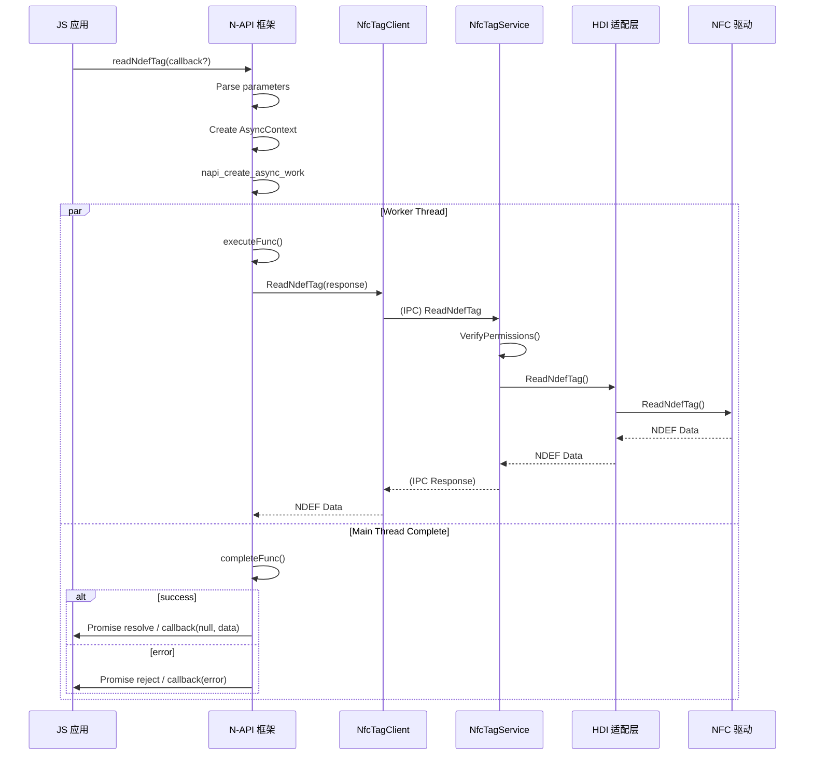
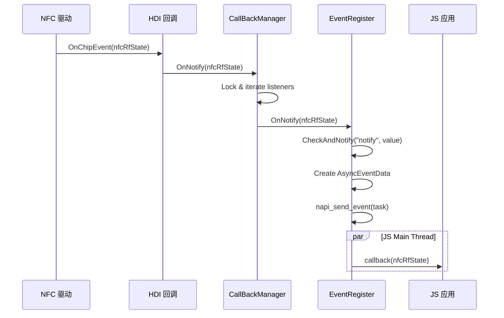

# Connected NFC Tag - 架构说明

## 1. 整体架构

### 1.1 组件架构图

```
┌─────────────────────────────────────────────────────────────────────────────┐
│                         Connected NFC Tag 架构                                │
├─────────────────────────────────────────────────────────────────────────────┤
│                                                                              │
│  ┌─────────────────────────────────────────────────────────────────────┐    │
│  │                        应用层 (Application)                          │    │
│  │   connectedTag API (JS)                                             │    │
│  └─────────────────────────────────────────────────────────────────────┘    │
│                                    ↓                                        │
│  ┌─────────────────────────────────────────────────────────────────────┐    │
│  │                     N-API 框架层 (frameworks/js/napi)                 │    │
│  │   ┌─────────────┐ ┌─────────────┐ ┌─────────────────────────────┐  │    │
│  │   │nfc_napi_    │ │nfc_napi_    │ │nfc_napi_event.cpp            │  │    │
│  │   │adapter.cpp  │ │entry.cpp    │ │- EventRegister               │  │    │
│  │   │- 读写API    │ │- 模块注册   │ │- On/Off 事件监听            │  │    │
│  │   │- 异步处理   │ │- 枚举定义   │ │- 回调分发                   │  │    │
│  │   └─────────────┘ └─────────────┘ └─────────────────────────────┘  │    │
│  └─────────────────────────────────────────────────────────────────────┘    │
│                                    ↓ IPC                                      │
│  ┌─────────────────────────────────────────────────────────────────────┐    │
│  │                     服务层 (services)                                 │    │
│  │   ┌─────────────────────────────────────────────────────────────┐   │    │
│  │   │                  NfcTagService (SA ID: 1148)               │   │    │
│  │   │   - 权限验证 (VerifyPermissionsBeforeEntry)               │   │    │
│  │   │   - 回调管理器 (NfcTagCallBackManager)                     │   │    │
│  │   │   - IPC 命令分发 (NfcTagStub)                             │   │    │
│  │   └─────────────────────────────────────────────────────────────┘   │    │
│  │                                    ↓                                  │    │
│  │   ┌─────────────────────────────────────────────────────────────┐   │    │
│  │   │                  HDI 适配层 (services/src/hdi)              │   │    │
│  │   │   - NfcTagHdiAdapter (薄封装)                              │   │    │
│  │   │   - NfcTagHdiImpl (HDI 生命周期管理)                       │   │    │
│  │   │   - NfcTagDriverStatusListener (驱动状态监听)               │   │    │
│  │   └─────────────────────────────────────────────────────────────┘   │    │
│  └─────────────────────────────────────────────────────────────────────┘    │
│                                    ↓ HDI                                      │
│  ┌─────────────────────────────────────────────────────────────────────┐    │
│  │                     硬件抽象层 (HDI Driver)                          │    │
│  │   libconnected_nfc_tag_proxy_1.1.z.so                             │    │
│  │   - IConnectedNfcTag 接口实现                                      │    │
│  │   - NFC 芯片通信                                                  │    │
│  └─────────────────────────────────────────────────────────────────────┘    │
│                                                                              │
└─────────────────────────────────────────────────────────────────────────────┘
```

### 1.2 数据流向

```
┌─────────────────────────────────────────────────────────────────────────────┐
│                              数据流向图                                       │
├─────────────────────────────────────────────────────────────────────────────┤
│                                                                              │
│  【读操作数据流】                                                             │
│                                                                              │
│    JS API (readNdefTag)                                                     │
│         ↓                                                                    │
│    nfc_napi_adapter.cpp (ReadNdefTag)                                       │
│         ↓                                                                    │
│    NfcTagClient::GetInstance().ReadNdefTag()                                │
│         ↓ (IPC)                                                              │
│    NfcTagService::ReadNdefTag()                                             │
│         ↓                                                                    │
│    hdiAdapter_.ReadNdefTag()                                                │
│         ↓                                                                    │
│    NfcTagHdiImpl::ReadNdefTag()                                             │
│         ↓ (HDI)                                                              │
│    IConnectedNfcTag::ReadNdefTag()                                           │
│         ↓                                                                    │
│    ┌─────────────────────────────────────────────────────────────────┐     │
│    │                         NFC 芯片                                 │     │
│    └─────────────────────────────────────────────────────────────────┘     │
│                                                                              │
│  【事件通知数据流】 (反向)                                                    │
│                                                                              │
│    ┌─────────────────────────────────────────────────────────────────┐     │
│    │                         NFC 芯片                                 │     │
│    └─────────────────────────────────────────────────────────────────┘     │
│         ↓ (硬件中断/事件)                                                    │
│    NfcTagHdiCallBack::OnChipEvent()                                        │
│         ↓                                                                    │
│    upperCallBack_->OnNotify()                                               │
│         ↓                                                                    │
│    NfcTagCallBackManager::OnNotify()                                        │
│         ↓ (广播)                                                             │
│    各客户端回调 (INfcTagCallback)                                            │
│         ↓                                                                    │
│    nfc_napi_event.cpp (EventNotify)                                        │
│         ↓                                                                    │
│    napi_send_event() → JS callback                                          │
│                                                                              │
└─────────────────────────────────────────────────────────────────────────────┘
```

---

## 2. 线程模型

### 2.1 线程划分

```
┌─────────────────────────────────────────────────────────────────────────────┐
│                            线程模型                                          │
├─────────────────────────────────────────────────────────────────────────────┤
│                                                                              │
│  【JS 线程 (主线程)】                                                         │
│  ┌─────────────────────────────────────────────────────────────────────┐    │
│  │  - N-API 函数入口 (Init, ReadNdefTag, WriteNdefTag, On, Off)      │    │
│  │  - 参数解析和验证                                                   │    │
│  │  - AsyncWork 创建和 Promise/Callback 处理                          │    │
│  │  - napi_send_event 事件分发                                        │    │
│  │  - napi_handle_scope 管理                                          │    │
│  └─────────────────────────────────────────────────────────────────────┘    │
│                                    ↓                                        │
│  【Worker 线程】 (napi_async_work::executeFunc)                              │
│  ┌─────────────────────────────────────────────────────────────────────┐    │
│  │  - 实际的 NDEF 读写操作                                             │    │
│  │  - 调用 NfcTagClient 方法                                          │    │
│  │  - 注意：此函数在独立线程执行                                       │    │
│  │  代码位置: nfc_napi_adapter.cpp:77-81                               │    │
│  │  ```cpp                                                              │    │
│  │  asyncContext->executeFunc_ = [&](void* data) -> void {            │    │
│  │      ReadAsyncContext *context = static_cast<ReadAsyncContext *>(data);│    │
│  │      context->errorCode_ = DelayedRefSingleton<NfcTagClient>::       │    │
│  │          GetInstance().ReadNdefTag(context->respNdefData_);          │    │
│  │  };                                                                  │    │
│  │  ```                                                                  │    │
│  └─────────────────────────────────────────────────────────────────────┘    │
│                                    ↓                                        │
│  【Service 线程 (IPC 线程池)】                                                │
│  ┌─────────────────────────────────────────────────────────────────────┐    │
│  │  - NfcTagStub::OnRemoteRequest() IPC 命令处理                      │    │
│  │  - VerifyPermissionsBeforeEntry() 权限验证                         │    │
│  │  - HDI 适配层调用                                                  │    │
│  │  - 回调管理 (NfcTagCallBackManager)                                │    │
│  └─────────────────────────────────────────────────────────────────────┘    │
│                                                                              │
│  【线程安全机制】                                                             │
│  ┌─────────────────────────────────────────────────────────────────────┐    │
│  │  - 事件注册表: std::shared_mutex g_regInfoMutex                    │    │
│  │    文件: nfc_napi_event.cpp:38                                     │    │
│  │  - 回调映射: std::mutex listenerMapLock_                           │    │
│  │    文件: services/src/nfc_tag_service.cpp:53                      │    │
│  │  - 客户端代理: std::mutex proxyLock_                               │    │
│  │    文件: interfaces/inner_api/src/nfc_tag_client.cpp:36            │    │
│  │  - 回调存根: std::mutex callbackLock_                              │    │
│  │    文件: interfaces/inner_api/src/nfc_tag_client.cpp:36            │    │
│  └─────────────────────────────────────────────────────────────────────┘    │
│                                                                              │
└─────────────────────────────────────────────────────────────────────────────┘
```

### 2.2 关键时序图

#### 读 NDEF 操作时序



#### 事件通知时序



---

## 3. 模块职责

### 3.1 模块清单

| 模块 | 路径 | 职责 | 稳定性 |
|------|------|------|--------|
| **N-API 框架** | `frameworks/js/napi/` | JS → Native 桥接 | Stable |
| **服务层** | `services/` | IPC 命令分发、权限验证 | Stable |
| **HDI 适配层** | `services/src/hdi/` | 硬件驱动抽象 | Stable |
| **内部 API** | `interfaces/inner_api/` | 客户端 SDK | System API |
| **SA 配置** | `sa_profile/` | SA 注册配置 | Stable |

### 3.2 模块依赖关系

```
┌─────────────────────────────────────────────────────────────────────────────┐
│                            模块依赖图                                         │
├─────────────────────────────────────────────────────────────────────────────┤
│                                                                              │
│  ┌──────────────────┐                                                        │
│  │   N-API 框架     │◄────────────────────────────────────────────────────┐  │
│  │ frameworks/js/   │                                                      │  │
│  │ napi/            │                                                      │  │
│  └────────┬─────────┘                                                      │  │
│           │                                                                │  │
│           │ deps                                                           │  │
│           ▼                                                                │  │
│  ┌──────────────────┐      IPC       ┌──────────────────┐                  │  │
│  │   内部 API       │◄──────────────│     服务层        │                  │  │
│  │ interfaces/      │               │   services/      │                  │  │
│  │ inner_api/      │               │                   │                  │  │
│  └──────────────────┘               └─────────┬─────────┘                  │  │
│                                               │                             │  │
│                                               │ deps                        │  │
│                                               ▼                             │  │
│                                    ┌──────────────────┐                     │  │
│                                    │   HDI 适配层     │                     │  │
│                                    │ services/src/hdi │                     │  │
│                                    └────────┬─────────┘                     │  │
│                                             │                               │  │
│                                             │ external_deps                  │  │
│                                             ▼                               │  │
│                                    ┌──────────────────┐                      │  │
│                                    │   HDI 驱动接口   │                      │  │
│                                    │ drivers_interface│                      │  │
│                                    │ /connected_nfc_  │                      │  │
│                                    │ tag/             │                      │  │
│                                    └──────────────────┘                      │  │
│                                                                              │
└─────────────────────────────────────────────────────────────────────────────┘
```

---

## 4. 关键类说明

### 4.1 N-API 层

| 类名 | 文件 | 职责 |
|------|------|------|
| `nfcConnectedTagModule` | nfc_napi_entry.cpp:81 | N-API 模块定义 |
| `InitJs()` | nfc_napi_entry.cpp:59 | JS API 注册入口 |
| `Init/Uninit/ReadNdefTag...` | nfc_napi_adapter.cpp | 各 API 实现 |
| `ReadAsyncContext` | nfc_napi_adapter.h | 读操作异步上下文 |
| `WriteAsyncContext` | nfc_napi_adapter.h | 写操作异步上下文 |
| `EventRegister` | nfc_napi_event.cpp | 事件注册管理器 |
| `DoAsyncWork()` | nfc_napi_utils.cpp | 异步工作调度 |

### 4.2 服务层

| 类名 | 文件 | 职责 |
|------|------|------|
| `NfcTagService` | nfc_tag_service.cpp | 主服务类 |
| `NfcTagStub` | nfc_tag_stub.cpp | IPC 命令分发 |
| `NfcTagCallBackManager` | nfc_tag_service.cpp | 回调注册管理 |
| `NfcTagHdiAdapter` | hdi/src/nfc_tag_hdi_adapter.cpp | HDI 薄封装 |
| `NfcTagHdiImpl` | hdi/src/nfc_tag_hdi_impl.cpp | HDI 生命周期 |

### 4.3 内部 API 层

| 类名 | 文件 | 职责 |
|------|------|------|
| `NfcTagClient` | nfc_tag_client.cpp | 客户端单例 |
| `NfcTagProxy` | nfc_tag_proxy.cpp | IPC 代理 |
| `NfcTagCallbackStub` | nfc_tag_callback_stub.cpp | 回调存根 |
| `INfcTagService` | infc_tag_service.h | 服务接口定义 |
| `INfcTagCallback` | infc_tag_callback.h | 回调接口定义 |

---

## 5. IPC 协议

### 5.1 命令码定义

```cpp
// 文件: interfaces/inner_api/include/infc_tag_service.h:36-45

enum {
    NFC_TAG_CMD_INIT = 0,                    // 初始化
    NFC_TAG_CMD_UNINIT,                      // 反初始化
    NFC_TAG_CMD_READ_NDEF_TAG,               // 读 NDEF 字符串
    NFC_TAG_CMD_WRITE_NDEF_TAG,              // 写 NDEF 字符串
    NFC_TAG_CMD_READ_NDEF_DATA,              // 读 NDEF 二进制
    NFC_TAG_CMD_WRITE_NDEF_DATA,             // 写 NDEF 二进制
    NFC_TAG_CMD_REGISTER_CALLBACK,           // 注册回调
    NFC_TAG_CMD_UNREGISTER_CALLBACK,         // 注销回调
};
```

### 5.2 接口描述符

| 接口 | 描述符 | 文件 |
|------|--------|------|
| 服务接口 | `u"ohos.nfc.IConnectedNfcTagService"` | infc_tag_service.h:47 |
| 回调接口 | `u"ohos.nfc.INfcTagCallback"` | infc_tag_callback.h |

---

## 6. 生命周期

### 6.1 服务生命周期

```
┌─────────────────────────────────────────────────────────────────────────────┐
│                          服务生命周期                                          │
├─────────────────────────────────────────────────────────────────────────────┤
│                                                                              │
│  system_start                                                               │
│      ↓                                                                      │
│  sa_main 加载                                                                │
│      ↓                                                                      │
│  NfcTagService::OnStart()                                                   │
│      ↓                                                                      │
│  hdiAdapter_.InitDriver()  [drivers_interface_connected_nfc_tag]           │
│      ↓                                                                      │
│  ServiceInit() → Publish(this)                                              │
│      ↓                                                                      │
│  STATE_RUNNING                                                               │
│                                                                              │
│  ┌─────────────────────────────────────────────────────────────────────┐   │
│  │                         运行时状态                                    │   │
│  │   - 等待客户端连接 (samgr_proxy)                                      │   │
│  │   - 处理 IPC 请求                                                    │   │
│  │   - 监听硬件事件                                                      │   │
│  │   - 管理回调列表                                                      │   │
│  └─────────────────────────────────────────────────────────────────────┘   │
│                                                                              │
│      ↓ (system_stop / 错误)                                                 │
│  NfcTagService::OnStop()                                                    │
│      ↓                                                                      │
│  hdiAdapter_.Uninit()                                                       │
│      ↓                                                                      │
│  STATE_NOT_START                                                            │
│                                                                              │
└─────────────────────────────────────────────────────────────────────────────┘
```

### 6.2 客户端生命周期

```
┌─────────────────────────────────────────────────────────────────────────────┐
│                        客户端生命周期                                          │
├─────────────────────────────────────────────────────────────────────────────┤
│                                                                              │
│  require('@ohos.connectedTag')  [加载 N-API 模块]                            │
│      ↓                                                                      │
│  connectedTag.init()  [初始化连接]                                           │
│      ↓                                                                      │
│  connectedTag.readNdefTag() / writeNdefTag()  [读写操作]                    │
│      ↓                                                                      │
│  connectedTag.on('notify', callback)  [事件监听]                             │
│                                                                              │
│  ┌─────────────────────────────────────────────────────────────────────┐   │
│  │                         活跃状态                                      │   │
│  │   - 接收 NFC RF 状态变化事件                                          │   │
│  │   - 执行读写操作                                                      │   │
│  └─────────────────────────────────────────────────────────────────────┘   │
│                                                                              │
│      ↓                                                                      │
│  connectedTag.off('notify')  [注销事件]                                      │
│      ↓                                                                      │
│  connectedTag.uninit()  [释放连接]                                          │
│                                                                              │
└─────────────────────────────────────────────────────────────────────────────┘
```

---

## 7. 相关文档

| 文档 | 链接 |
|------|------|
| 项目概览 | [00_Overview.md](./00_Overview.md) |
| N-API 接口 | [02_NAPI.md](./02_NAPI.md) |
| 内部 API | [03_InnerAPI.md](./03_InnerAPI.md) |
| 构建说明 | [04_Build.md](./04_Build.md) |
| 安全评估 | [05_Security.md](./05_Security.md) |
