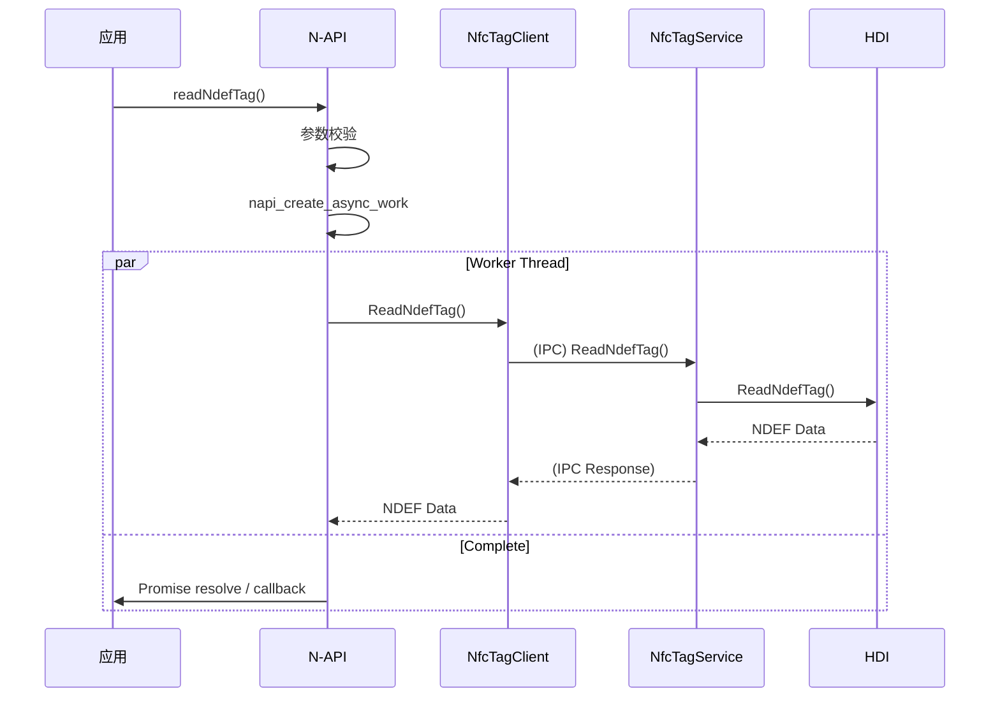
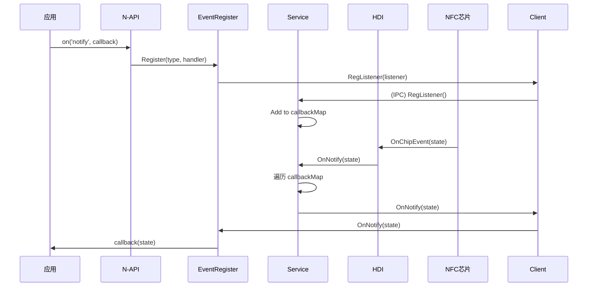

# 附录：关键调用链

## 1. 读 NDEF 调用链

```
┌─────────────────────────────────────────────────────────────────────────────┐
│                        读 NDEF 调用链                                       │
├─────────────────────────────────────────────────────────────────────────────┤
│                                                                              │
│  应用层 (JavaScript)                                                         │
│  ┌─────────────────────────────────────────────────────────────────────┐   │
│  │ import connectedTag from '@ohos.connectedTag';                     │   │
│  │ connectedTag.readNdefTag((err, data) => { });                      │   │
│  └─────────────────────────────────────────────────────────────────────┘   │
│                                    ↓                                        │
│  N-API 框架 (frameworks/js/napi/nfc_napi_adapter.cpp)                      │
│  ┌─────────────────────────────────────────────────────────────────────┐   │
│  │ ReadNdefTag(env, info)                                              │   │
│  │   ├─ napi_get_cb_info()        // 参数解析                         │   │
│  │   ├─ ReadAsyncContext::executeFunc_                               │   │
│  │   │   └─ NfcTagClient::GetInstance().ReadNdefTag()               │   │
│  │   └─ napi_create_async_work() // 异步工作队列                      │   │
│  └─────────────────────────────────────────────────────────────────────┘   │
│                                    ↓                                        │
│  客户端 (interfaces/inner_api/nfc_tag_client.cpp)                          │
│  ┌─────────────────────────────────────────────────────────────────────┐   │
│  │ NfcTagClient::ReadNdefTag(response)                                │   │
│  │   ├─ GetService()               // 获取 IPC 代理                    │   │
│  │   └─ serviceProxy_->ReadNdefTag(response)  // IPC 调用            │   │
│  └─────────────────────────────────────────────────────────────────────┘   │
│                                    ↓ (IPC)                                  │
│  服务端存根 (services/src/nfc_tag_stub.cpp)                                │
│  ┌─────────────────────────────────────────────────────────────────────┐   │
│  │ NfcTagStub::OnRemoteRequest(NFC_TAG_CMD_READ_NDEF_TAG, ...)        │   │
│  │   └─ OnReadNdefTag(data, reply)                                    │   │
│  │       └─ NfcTagService::ReadNdefTag(response)                      │   │
│  └─────────────────────────────────────────────────────────────────────┘   │
│                                    ↓                                        │
│  服务核心 (services/src/nfc_tag_service.cpp)                                │
│  ┌─────────────────────────────────────────────────────────────────────┐   │
│  │ NfcTagService::ReadNdefTag(response)                                │   │
│  │   ├─ VerifyPermissionsBeforeEntry()  // 权限检查                   │   │
│  │   └─ hdiAdapter_.ReadNdefTag(response)                            │   │
│  └─────────────────────────────────────────────────────────────────────┘   │
│                                    ↓                                        │
│  HDI 适配层 (services/src/hdi/nfc_tag_hdi_adapter.cpp)                     │
│  ┌─────────────────────────────────────────────────────────────────────┐   │
│  │ NfcTagHdiAdapter::ReadNdefTag(response)                           │   │
│  │   └─ NfcTagHdiImpl::GetInstance().ReadNdefTag(response)           │   │
│  └─────────────────────────────────────────────────────────────────────┘   │
│                                    ↓                                        │
│  HDI 实现 (services/src/hdi/nfc_tag_hdi_impl.cpp)                          │
│  ┌─────────────────────────────────────────────────────────────────────┐   │
│  │ NfcTagHdiImpl::ReadNdefTag(response)                              │   │
│  │   ├─ GetProxy()                  // 获取 HDI 代理                   │   │
│  │   └─ proxy_->ReadNdefTag(response)  // HDI 调用                   │   │
│  └─────────────────────────────────────────────────────────────────────┘   │
│                                    ↓ (HDI)                                  │
│  驱动接口 (drivers_interface_connected_nfc_tag)                            │
│  ┌─────────────────────────────────────────────────────────────────────┐   │
│  │ IConnectedNfcTag::ReadNdefTag(response)                            │   │
│  └─────────────────────────────────────────────────────────────────────┘   │
│                                    ↓                                        │
│  硬件层                                                                      │
│  ┌─────────────────────────────────────────────────────────────────────┐   │
│  │                        NFC 芯片                                       │   │
│  └─────────────────────────────────────────────────────────────────────┘   │
│                                                                              │
└─────────────────────────────────────────────────────────────────────────────┘
```

---

## 2. 写 NDEF 调用链

```
与读 NDEF 类似，区别在于：
- NFC_TAG_CMD_WRITE_NDEF_TAG
- 参数: data (string)
```

---

## 3. 事件通知调用链

```
┌─────────────────────────────────────────────────────────────────────────────┐
│                        事件通知调用链 (反向)                                  │
├─────────────────────────────────────────────────────────────────────────────┤
│                                                                              │
│  硬件层                                                                      │
│  ┌─────────────────────────────────────────────────────────────────────┐   │
│  │                        NFC 芯片                                       │   │
│  └─────────────────────────────────────────────────────────────────────┘   │
│                                    ↓                                        │
│  HDI 回调 (services/src/hdi/nfc_tag_hdi_impl.cpp)                          │
│  ┌─────────────────────────────────────────────────────────────────────┐   │
│  │ NfcTagHdiCallBack::OnChipEvent(nfcRfState)                         │   │
│  │   └─ upperCallBack_->OnNotify(nfcRfState)                          │   │
│  └─────────────────────────────────────────────────────────────────────┘   │
│                                    ↓                                        │
│  服务回调管理 (services/src/nfc_tag_service.cpp)                            │
│  ┌─────────────────────────────────────────────────────────────────────┐   │
│  │ NfcTagCallBackManager::OnNotify(nfcRfState)                        │   │
│  │   └─ 对所有注册的 listener 调用 OnNotify()                          │   │
│  └─────────────────────────────────────────────────────────────────────┘   │
│                                    ↓                                        │
│  客户端回调 (interfaces/inner_api/nfc_tag_callback_stub.cpp)                │
│  ┌─────────────────────────────────────────────────────────────────────┐   │
│  │ NfcTagCallbackStub::OnNotify(nfcRfState)                           │   │
│  │   └─ NfcListenerEvent::OnNotify(nfcRfState)                       │   │
│  └─────────────────────────────────────────────────────────────────────┘   │
│                                    ↓                                        │
│  N-API 事件层 (frameworks/js/napi/nfc_napi_event.cpp)                       │
│  ┌─────────────────────────────────────────────────────────────────────┐   │
│  │ NfcListenerEvent::OnNotify(nfcRfState)                             │   │
│  │   └─ CheckAndNotify("notify", value)                               │   │
│  │       └─ EventNotify(asyncEvent)                                   │   │
│  │           └─ napi_send_event() // 高优先级异步事件                 │   │
│  └─────────────────────────────────────────────────────────────────────┘   │
│                                    ↓                                        │
│  JS 线程 (JavaScript)                                                       │
│  ┌─────────────────────────────────────────────────────────────────────┐   │
│  │ connectedTag.on('notify', (err, type) => { });                      │   │
│  │   └─ 回调函数被调用                                                  │   │
│  └─────────────────────────────────────────────────────────────────────┘   │
│                                                                              │
└─────────────────────────────────────────────────────────────────────────────┘
```

---

## 4. 模块初始化调用链

```
┌─────────────────────────────────────────────────────────────────────────────┐
│                        模块初始化调用链                                       │
├─────────────────────────────────────────────────────────────────────────────┤
│                                                                              │
│  系统启动                                                                      │
│      ↓                                                                      │
│  sa_main 加载 libnfc_tag_service.z.so                                        │
│      ↓                                                                      │
│  NfcTagService::OnStart()                                                   │
│      ↓                                                                      │
│  hdiAdapter_.InitDriver()  // 初始化 HDI 驱动                               │
│      ↓                                                                      │
│  ServiceInit() → Publish(this)  // 注册到 SAMgr                              │
│      ↓                                                                      │
│  STATE_RUNNING                                                              │
│                                                                              │
└─────────────────────────────────────────────────────────────────────────────┘
```

---

## 5. API 调用序列图

### 5.1 正常读写流程



### 5.2 事件监听流程



---

## 6. 文件位置索引

| 组件 | 文件路径 |
|------|----------|
| N-API 入口 | `frameworks/js/napi/nfc_napi_entry.cpp` |
| N-API 适配 | `frameworks/js/napi/nfc_napi_adapter.cpp` |
| N-API 事件 | `frameworks/js/napi/nfc_napi_event.cpp` |
| N-API 工具 | `frameworks/js/napi/nfc_napi_utils.cpp` |
| 客户端单例 | `interfaces/inner_api/src/nfc_tag_client.cpp` |
| IPC 代理 | `interfaces/inner_api/src/nfc_tag_proxy.cpp` |
| 服务主类 | `services/src/nfc_tag_service.cpp` |
| IPC 存根 | `services/src/nfc_tag_stub.cpp` |
| HDI 适配 | `services/src/hdi/nfc_tag_hdi_adapter.cpp` |
| HDI 实现 | `services/src/hdi/nfc_tag_hdi_impl.cpp` |
