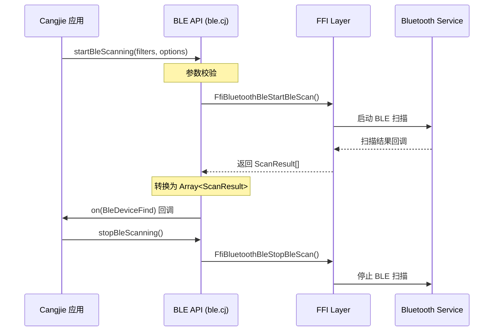
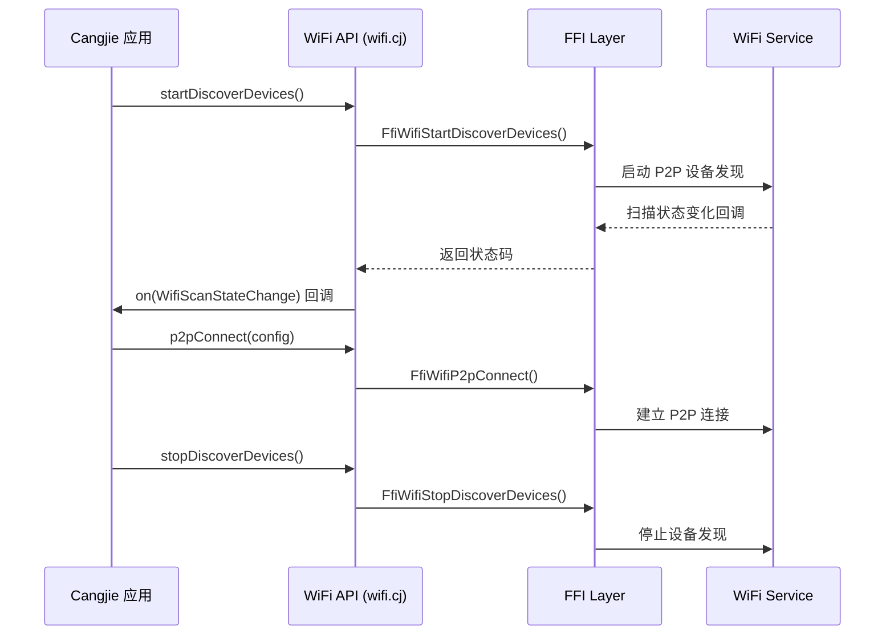

# 架构说明

> connectivity_cangjie_wrapper 组件图、数据流、线程模型与关键时序

## 系统架构图

```
┌─────────────────────────────────────────────────────────────────────────────┐
│                          connectivity_cangjie_wrapper                        │
├─────────────────────────────────────────────────────────────────────────────┤
│                                                                             │
│  ┌─────────────────────────────────────────────────────────────────────┐   │
│  │                          Interface Layer (Kit)                       │   │
│  │                                                                       │   │
│  │      kit/ConnectivityKit/index.cj (统一出口)                          │   │
│  │              ↓                                                        │   │
│  │      public import ohos.bluetooth.*                                   │   │
│  │      public import ohos.wifi_manager.*                                │   │
│  └─────────────────────────────────────────────────────────────────────┘   │
│                                      ↓                                       │
│  ┌─────────────────────────────────────────────────────────────────────┐   │
│  │                        Framework Layer (Cangjie)                      │   │
│  │                                                                       │   │
│  │   ┌──────────────┐  ┌──────────────┐  ┌──────────────┐              │   │
│  │   │   BLE API    │  │   A2DP API   │  │   HFP API    │              │   │
│  │   │  ble.cj      │  │  a2dp.cj     │  │  hfp.cj      │              │   │
│  │   └──────────────┘  └──────────────┘  └──────────────┘              │   │
│  │                                                                       │   │
│  │   ┌──────────────┐  ┌──────────────┐  ┌──────────────┐              │   │
│  │   │ Connection   │  │  WiFi P2P    │  │  Constants   │              │   │
│  │   │ connection   │  │  wifi.cj     │  │  constant    │              │   │
│  │   └──────────────┘  └──────────────┘  └──────────────┘              │   │
│  │                                                                       │   │
│  │   ┌──────────────────────────────────────────────────────────────┐   │   │
│  │   │                 Callback & Error Handling                     │   │   │
│  │   │  callback_controller.cj, error_message.cj, error_code.cj     │   │   │
│  │   └──────────────────────────────────────────────────────────────┘   │   │
│  └─────────────────────────────────────────────────────────────────────┘   │
│                                      ↓                                       │
│  ┌─────────────────────────────────────────────────────────────────────┐   │
│  │                      FFI / Native Interface                          │   │
│  │                                                                       │   │
│  │       FfiBluetoothBle*()  │  FfiBluetoothA2dp*()  │  FfiWifi*()     │   │
│  │            ↓                     ↓                     ↓              │   │
│  │   ┌──────────────────────────────────────────────────────────────┐   │   │
│  │   │                   external_deps                               │   │   │
│  │   │  bluetooth:cj_bluetooth_ble_ffi  │  wifi:cj_wifi_ffi         │   │   │
│  │   └──────────────────────────────────────────────────────────────┘   │   │
│  └─────────────────────────────────────────────────────────────────────┘   │
│                                      ↓                                       │
│  ┌─────────────────────────────────────────────────────────────────────┐   │
│  │                       Underlying Components                          │   │
│  │                                                                       │   │
│  │   ┌────────────────────────┐  ┌────────────────────────────────┐    │   │
│  │   │   communication_       │  │   communication_               │    │   │
│  │   │   bluetooth            │  │   wifi                         │    │   │
│  │   │   (原生蓝牙实现)        │  │   (原生 WiFi 实现)             │    │   │
│  │   └────────────────────────┘  └────────────────────────────────┘    │   │
│  │                                                                       │   │
│  └─────────────────────────────────────────────────────────────────────┘   │
│                                                                             │
└─────────────────────────────────────────────────────────────────────────────┘
```

## 数据流分析

### BLE 扫描数据流

```
┌──────────┐     ┌───────────────┐     ┌──────────────┐     ┌──────────────┐
│  应用层   │     │  BLE API      │     │   FFI        │     │  蓝牙服务    │
│ (Cangjie) │ ─→  │  ble.cj       │ ─→  │  FfiBluetooth │ ─→ │ (Native)    │
│          │     │               │     │  Ble*()       │     │              │
└──────────┘     └───────────────┘     └──────────────┘     └──────────────┘
      ↑                                    │                      │
      │                                    ↓                      ↓
  on(BleDeviceFind)              Callback1Argument<          接收扫描结果
  回调注册                        Array<ScanResult>>          回调触发
```

### WLAN P2P 连接数据流

```
┌──────────┐     ┌───────────────┐     ┌──────────────┐     ┌──────────────┐
│  应用层   │     │  WiFi API     │     │   FFI        │     │  WiFi 服务   │
│ (Cangjie) │ ─→  │  wifi.cj      │ ─→  │  FfiWifi*()  │ ─→ │ (Native)    │
│          │     │               │     │               │     │              │
└──────────┘     └───────────────┘     └──────────────┘     └──────────────┘
      ↑                                    │                      │
      │                                    ↓                      ↓
  on(WifiScanStateChange)         Callback1Argument<Int32>    状态变化通知
  回调注册                                                          │
      ↑                                    │                      │
      │                                    ↓                      ↓
  off()                           移除回调监听                    取消监听
```

## 线程模型

### 线程划分

| 线程类型 | 说明 | API 示例 |
|----------|------|----------|
| **主线程** | 调用者线程，用于同步操作 | `createGattServer()`, `isWifiActive()` |
| **工作线程** | 后台异步执行，避免阻塞 | `startAdvertising()`, `startBleScanning()` |
| **Native 回调线程** | 底层回调触发的线程 | BLE 扫描结果回调 |

### workerthread 标注

部分 API 在 `@!APILevel` 注解中标注 `workerthread: true`，表示会在工作线程执行：

```cj
@!APILevel[
    since: "22",
    permission: "ohos.permission.ACCESS_BLUETOOTH",
    syscap: "SystemCapability.Communication.Bluetooth.Core",
    throwexception: true,
    workerthread: true  // 标记为工作线程执行
]
public func startAdvertising(...): Unit { ... }
```

### 回调机制

```
┌─────────────────────────────────────────────────────────────────┐
│                        回调注册与触发流程                         │
├─────────────────────────────────────────────────────────────────┤
│                                                                 │
│  1. 注册回调                                                     │
│     ┌──────────────┐                                            │
│     │  on(event,   │  内部调用 FfiWifiWifiOn()                   │
│     │   callback)  │────────→ 注册到 Native 层                   │
│     └──────────────┘                                            │
│           ↓                                                     │
│     存储到 CALLBACK_MAP                                         │
│                                                                 │
│  2. 事件触发                                                     │
│     ┌──────────────┐                                            │
│     │ Native 回调  │  触发 Callback1Param wrapper                │
│     │   ────────→  │────────→ 从 CALLBACK_MAP 获取回调列表        │
│     └──────────────┘              ↓                             │
│                           遍历调用所有注册回调                    │
│                                                                 │
│  3. 取消回调                                                     │
│     ┌──────────────┐                                            │
│     │  off(event,  │  从 CALLBACK_MAP 移除指定回调               │
│     │   callback)  │  或清除所有回调                             │
│     └──────────────┘                                            │
│                                                                 │
└─────────────────────────────────────────────────────────────────┘
```

## 关键时序图

### BLE 扫描时序



### WLAN P2P 连接时序



## 错误处理流程

```
┌─────────────────────────────────────────────────────────────────┐
│                        错误处理流程                               │
├─────────────────────────────────────────────────────────────────┤
│                                                                 │
│  Cangjie API                                                    │
│       ↓                                                         │
│  调用 FFI 函数 (返回 errorCode)                                  │
│       ↓                                                         │
│  checkRet(errorCode)                                            │
│       ↓                                                         │
│  ┌─────────────────────────────────────────────────────────┐   │
│  │  errorCode == 0                                         │   │
│  │  ├─ Yes → 正常返回                                       │   │
│  │  └─ No  → 抛出 BusinessException                         │   │
│  │           (错误码 + 错误消息)                             │   │
│  └─────────────────────────────────────────────────────────┘   │
│                                                                 │
│  错误码映射：                                                    │
│  - 201: Permission denied                                       │
│  - 801: Capability not supported                                │
│  - 2900001: Service stopped                                     │
│  - 2900003: Bluetooth disabled                                  │
│  - ...                                                         │
│                                                                 │
└─────────────────────────────────────────────────────────────────┘
```

## 依赖关系图

```
kit.ConnectivityKit
├── ohos.bluetooth.ble
│   ├── ohos.bluetooth (基础依赖)
│   │   └── error_message.cj, callback_controller.cj
│   └── ohos.bluetooth.constant
├── ohos.bluetooth.a2dp
│   ├── ohos.bluetooth
│   ├── ohos.bluetooth.constant
│   └── ohos.bluetooth.base_profile
├── ohos.bluetooth.hfp
│   ├── ohos.bluetooth
│   ├── ohos.bluetooth.constant
│   └── ohos.bluetooth.base_profile
├── ohos.bluetooth.connection
│   └── ohos.bluetooth
├── ohos.bluetooth.base_profile
│   └── ohos.bluetooth.constant
└── ohos.wifi_manager
    └── (独立模块)
```

## 相关文档

| 文档 | 说明 |
|------|------|
| [项目概览](./01_Project_Overview.md) | 项目定位与核心能力 |
| [目录结构](./02_Directory_Structure.md) | 模块划分与文件布局 |
| [N-API 参考](./04_N-API_Reference.md) | API 详细说明 |
| [内部 API](./05_Inner_API.md) | 模块接口与依赖方向 |
| [安全评审](./07_Security_Review.md) | 安全使用指南 |
